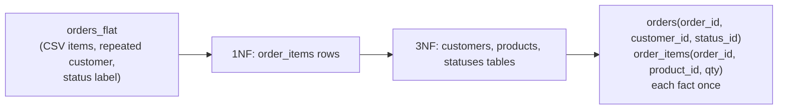

{/* status: authored */}

export const schema = `-- an UNNORMALIZED orders table — the "before"
CREATE TABLE orders_flat (
  order_id     int,
  customer_id  int,
  customer_name text,
  customer_city text,
  product_ids  text,          -- '10,13' — repeating group as CSV (violates 1NF)
  product_names text,         -- 'Lamp,Mug'
  status_code  int,           -- 1
  status_label text           -- 'paid'  (depends on status_code, not the key)
);
INSERT INTO orders_flat VALUES
  (100, 1, 'Ana', 'Berlin', '10,13', 'Lamp,Mug', 1, 'paid'),
  (101, 1, 'Ana', 'Berlin', '14',    'Headphones', 2, 'pending'),
  (102, 2, 'Ben', 'Lagos',  '13',    'Mug',        1, 'paid');`;

# Normalization: 1NF → BCNF (and when to stop)

## First principles

Normalization is one idea applied repeatedly: **every fact lives in exactly one
place.** When it doesn't, you get **anomalies**:

- **Update anomaly** — Ana moves city; you must update every `orders_flat` row
  for her, and miss one.
- **Insertion anomaly** — you can't record a new customer until they place an
  order (no row to put them in).
- **Deletion anomaly** — deleting Ben's only order also erases that Ben exists.

The normal forms are a checklist for removing them:

| Form | Rule | The fix |
|---|---|---|
| **1NF** | atomic columns; no repeating groups; a key | split `product_ids` CSV into `order_items` rows |
| **2NF** | (given 1NF) no non-key column depends on *part* of a composite key | if PK is `(order_id, product_id)`, a `customer_name` that depends only on `order_id` moves out |
| **3NF** | no non-key column depends on *another non-key* column | `status_label` depends on `status_code`, not the key → a `statuses` table |
| **BCNF** | every determinant is a candidate key | rare corner cases of 3NF with overlapping candidate keys |

In practice **3NF is the target** for an OLTP (backend) schema. 2NF and BCNF
violations are usually already gone once you're in 3NF with sensible keys.

**When to stop / denormalize on purpose:** a *read* that's too slow because it
joins six tables every request — cache a computed column, keep a
[materialized view](/foundations/views-and-materialized-views), or store a
denormalized copy **that the database maintains** (a
[generated column](/foundations/generated-columns-domains-and-types), a trigger).
Never denormalize by hoping application code keeps two copies in sync — that's
the update anomaly you just removed.

## The mechanism

## Hand-trace on dummy data

Decompose `orders_flat` — the `product_ids` CSV and the repeated `customer_city`
are the tells:

<QueryTrace
  caption="split the repeating group into rows (1NF), then lift transitively-dependent columns into their own tables (3NF)"
  steps={[
    {
      title: "1 · orders_flat — CSV items, repeated customer, status label",
      op: "product_ids",
      table: {
        name: "orders_flat",
        columns: ["order_id", "customer_name", "customer_city", "product_ids", "status_label"],
        rows: [
          [100,"Ana","Berlin","10,13","paid"],
          [101,"Ana","Berlin","14","pending"],
          [102,"Ben","Lagos","13","paid"],
        ],
      },
    },
    {
      title: "2 · 1NF: one row per (order, product) in order_items",
      op: "product_id",
      table: {
        name: "order_items",
        columns: ["order_id", "product_id"],
        rows: [[100,10],[100,13],[101,14],[102,13]],
      },
      rows: { add: [0, 1, 2, 3] },
    },
    {
      title: "3 · 3NF: customer_city depends on customer, not order → customers table",
      op: "customer_id",
      table: {
        name: "customers",
        columns: ["customer_id", "name", "city"],
        rows: [[1,"Ana","Berlin"],[2,"Ben","Lagos"]],
      },
    },
    {
      title: "4 · 3NF: status_label depends on status_code → statuses table — result",
      table: {
        name: "result: orders + customers + products + statuses + order_items",
        result: true,
        columns: ["table", "one fact per row"],
        rows: [
          ["orders", "(order_id, customer_id, status_id)"],
          ["order_items", "(order_id, product_id, qty)"],
          ["customers", "(customer_id, name, city)"],
          ["statuses", "(status_id, label)"],
        ],
      },
    },
  ]}
/>

## Run it

<SqlRunner title="decompose orders_flat into 3NF" setup={schema}>
{`CREATE TABLE customers AS
  SELECT DISTINCT customer_id, customer_name AS name, customer_city AS city FROM orders_flat;
CREATE TABLE statuses AS
  SELECT DISTINCT status_code AS status_id, status_label AS label FROM orders_flat;
CREATE TABLE orders AS
  SELECT DISTINCT order_id, customer_id, status_code AS status_id FROM orders_flat;
CREATE TABLE order_items AS
  SELECT o.order_id, unnest(string_to_array(o.product_ids, ','))::int AS product_id
  FROM orders_flat o;

SELECT * FROM order_items ORDER BY order_id, product_id;`}
</SqlRunner>

<SqlRunner title="the anomaly the flat table has, and the normalized one doesn't" setup={schema}>
{`-- FLAT: Ana moves to Munich — must hit every one of her rows
UPDATE orders_flat SET customer_city = 'Munich' WHERE customer_id = 1;
SELECT DISTINCT customer_id, customer_city FROM orders_flat;   -- ok IF you got them all

-- Now imagine you'd missed order 101: the table would say Ana lives in two cities.
-- NORMALIZED: one row in customers. Impossible to disagree with itself.`}
</SqlRunner>

<SqlRunner title="reconstruct the flat view with a join (no data duplication)" setup={schema}>
{`CREATE TABLE customers AS SELECT DISTINCT customer_id, customer_city AS city FROM orders_flat;
CREATE TABLE statuses  AS SELECT DISTINCT status_code AS id, status_label AS label FROM orders_flat;
CREATE TABLE orders    AS SELECT DISTINCT order_id, customer_id, status_code FROM orders_flat;

SELECT o.order_id, c.city, s.label AS status
FROM orders o
JOIN customers c USING (customer_id)
JOIN statuses  s ON s.id = o.status_code
ORDER BY o.order_id;`}
</SqlRunner>

<RunThis file="sql/backend/03_normalization_1nf_to_bcnf/topic.sql" />

## Build → Break → Fix → Why

:::tip[🔨 Build]
3NF: `customers`, `products`, `statuses` (lookup), `orders(customer_id,
status_id)`, `order_items(order_id, product_id, qty)` with FKs. Each fact once.
:::

:::danger[💥 Break]
Keep `customer_city` on every `orders` row "to avoid a join". Six months later:
half the rows say Berlin, half say Munich, because three code paths update orders
and only one updates the (nonexistent) `customers` table. Every report that
groups by city is wrong and no one knows the true value.
:::

:::note[🔧 Fix]
- Normalize to 3NF. Joins are cheap with the right
  [indexes](/foundations/indexes-and-the-b-tree).
- If a specific read is genuinely too slow, denormalize *that* — but let the
  **database** maintain the copy (generated column, trigger, matview), never
  application code.
:::

:::info[🧠 Why it behaved that way]
An anomaly is what happens when the same fact is stored `n` times: keeping `n`
copies consistent requires every writer to update all `n`, forever, without
exception — and software doesn't do "without exception". 3NF guarantees each fact
has exactly one home, so "the value" is whatever that one row says, and it can't
contradict itself. Denormalized copies are fine *only* when a single mechanism
owns all of them.
:::

## Pitfalls & idioms

- CSV / delimited values in a column → not 1NF. Split into rows (or an
  [array](/foundations/arrays) if you never join on the elements).
- A lookup column pair like `(status_code, status_label)` repeated across rows →
  3NF violation. Lookup table + FK.
- "We'll denormalize for performance" — measure first
  ([EXPLAIN](/backend/reading-explain-plans-and-query-optimization)). A 3NF join
  on indexed keys is usually microseconds.
- Over-normalization (a table per attribute) makes every query a join marathon.
  3NF, not 7NF.
- Denormalize with a `GENERATED` column, a trigger-maintained cache, or a
  materialized view — a mechanism, not a convention.
- Star-schema denormalization in a warehouse is deliberate and different — see
  [Data Engineering → dimensional modeling](/data-engineering/dimensional-modeling-star-schema).

## See also

- [Constraints & keys](/foundations/constraints-and-keys) — the FKs that hold a normalized schema together
- [Surrogate vs natural keys](/backend/surrogate-vs-natural-keys) — what the PK should be
- [Modeling relationships](/backend/modeling-relationships) — 1:1, 1:N, M:N
- [Views & materialized views](/foundations/views-and-materialized-views) — deliberate denormalization

## Check yourself

1. Name the three anomalies and give an example of each for `orders_flat`.
2. What 1NF violation does `product_ids = '10,13'` represent, and what's the fix?
3. `status_label` sitting next to `status_code` on every order — which normal
   form does that break, and why?
4. When is denormalizing the right call, and what's the one rule about how you do
   it?
5. Why is "3NF" a better *target* for a backend schema than "as normalized as
   possible"?
