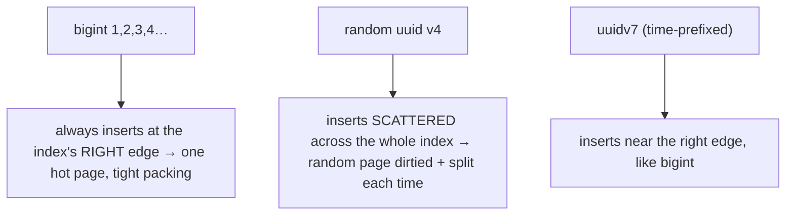

{/* status: authored */}

export const schema = `CREATE TABLE countries (
  iso2 char(2) PRIMARY KEY,          -- a natural key: stable, meaningful, external
  name text NOT NULL
);
INSERT INTO countries VALUES ('DE','Germany'), ('NG','Nigeria'), ('CA','Canada');

CREATE TABLE users (
  id    bigint GENERATED ALWAYS AS IDENTITY PRIMARY KEY,   -- surrogate
  email text,                                              -- natural candidate key
  country_iso2 char(2) NOT NULL REFERENCES countries(iso2)
);`;

# Surrogate vs natural keys: `bigint`, `UUID`, `uuidv7`

## First principles

Every table needs a **primary key** — the column(s) that identify a row. Two
philosophies:

- **Natural key** — a value that already means something and is guaranteed unique
  by the world: a country's ISO code, an ISBN, a `(order_id, line_no)` pair.
- **Surrogate key** — a meaningless value the system generates: an
  auto-incrementing `bigint`, a `UUID`.

**Default to a surrogate PK, keep the natural key as a `UNIQUE` constraint.**
Why:

- Natural keys **change** (a company renames, an email is corrected, a country
  splits). Changing a PK means cascading the update through every FK — painful,
  and `ON UPDATE CASCADE` has locking cost.
- Natural keys are often **wide** (`char(2)` is fine; a `text` name is not) and
  wide keys bloat every index and FK that references them.
- A surrogate is **stable forever** and a compact 8 bytes.

The `UNIQUE` constraint on the natural key still gives you the integrity ("no two
users with this email") and a fast lookup — you just don't build the whole schema
on top of a value that can move.

### `bigint` vs `UUID`

| | `bigint` IDENTITY | random `UUID` (v4) | `uuidv7` (time-ordered) |
|---|---|---|---|
| Size | 8 bytes | 16 bytes | 16 bytes |
| Guessable / enumerable | **yes** (id 41 → try 42) | no | mostly no (timestamp prefix leaks creation time) |
| Generated by | the DB (one sequence) | anywhere (client, multiple DBs) | anywhere |
| **Insert locality** | sequential → appends to the index's right edge, tight | **random → scattered inserts, page splits, index bloat, poor cache hit** | sequential-ish → like `bigint` |
| Good for | internal keys, single-writer | keys created before the DB round-trip; multi-master; exposed IDs | the modern "UUID but without the write penalty" |

**The `UUID` insert problem**: a B-tree index on a random UUID gets writes spread
across the whole index. Every insert dirties a random page, splits pages, and
misses cache — measurably slower and more bloated than a sequential key at scale.
**`uuidv7`** puts a millisecond timestamp in the high bits, so new rows still land
near each other. Use it (Postgres 18 has `uuidv7()`; earlier, an extension or
app-side generation) when you want UUID's properties without the write cost.

## The mechanism

## Hand-trace on dummy data

Where each key type lands an insert in a B-tree already holding many rows:

<QueryTrace
  caption="sequential keys append; random keys scatter — the same 4 inserts, very different index churn"
  steps={[
    {
      title: "1 · index leaf pages (each holds a range of existing keys)",
      table: {
        columns: ["page", "holds keys"],
        rows: [["p1","1–100"],["p2","101–200"],["p3","201–300"],["p4","301–400 (has room)"]],
      },
    },
    {
      title: "2 · insert bigint 401, 402, 403, 404 — all go to p4",
      op: "page",
      table: {
        columns: ["insert", "target page", "effect"],
        rows: [["401","p4","append"],["402","p4","append"],["403","p4","append"],["404","p4 → p5 split"]],
      },
      rows: { match: [0, 1, 2] },
    },
    {
      title: "3 · insert 4 random UUIDs — one per page, each dirtied, two split",
      op: "page",
      table: {
        columns: ["insert", "target page", "effect"],
        rows: [
          ["uuid a…","p2","dirty + split"],
          ["uuid f…","p4","dirty"],
          ["uuid 3…","p1","dirty + split"],
          ["uuid c…","p3","dirty"],
        ],
      },
      rows: { drop: [0, 1, 2, 3] },
    },
    {
      title: "4 · result: 4 inserts",
      table: {
        name: "result",
        result: true,
        columns: ["key type", "pages touched", "page splits", "index bloat"],
        rows: [["bigint / uuidv7", "1", "1", "minimal"], ["random uuid v4", "4", "2", "grows over time"]],
      },
    },
  ]}
/>

## Run it

<SqlRunner title="surrogate PK + natural UNIQUE key" setup={schema}>
{`INSERT INTO users (email, country_iso2) VALUES ('ana@x.com', 'DE'), ('ben@x.com', 'NG')
RETURNING id, email;

-- add the natural key constraint
ALTER TABLE users ADD CONSTRAINT users_email_key UNIQUE (email);
-- INSERT INTO users (email, country_iso2) VALUES ('ana@x.com', 'CA');  -- ERROR: duplicate email

-- the world changes: fix a typo in the email — no FK cascade, it's not the PK
UPDATE users SET email = 'ana@example.com' WHERE email = 'ana@x.com';
SELECT * FROM users ORDER BY id;`}
</SqlRunner>

<SqlRunner title="natural key as PK — the change that cascades" setup={schema}>
{`CREATE TABLE company (name text PRIMARY KEY);            -- natural key as PK (risky)
CREATE TABLE contract (id int PRIMARY KEY, company_name text REFERENCES company(name) ON UPDATE CASCADE);
INSERT INTO company VALUES ('Acme'), ('Globex');
INSERT INTO contract VALUES (1, 'Acme'), (2, 'Acme'), (3, 'Globex');

-- Acme rebrands. This must rewrite every referencing row, holding locks:
UPDATE company SET name = 'Acme International' WHERE name = 'Acme';
SELECT * FROM contract ORDER BY id;   -- all 'Acme' rows changed too`}
</SqlRunner>

<SqlRunner title="key generation options" setup={schema}>
{`SELECT
  'bigint sequence'                     AS kind, 8 AS bytes, 'DB, single writer'   AS generated_by
UNION ALL SELECT 'uuid v4 (random)',    16, 'anywhere; scatters index writes'
UNION ALL SELECT 'uuid v7 (time-sorted)',16, 'anywhere; index-friendly';

SELECT gen_random_uuid() AS a_random_uuid;   -- v4; needs pgcrypto pre-PG13`}
</SqlRunner>

<RunThis file="sql/backend/04_surrogate_vs_natural_keys/topic.sql" />

## Build → Break → Fix → Why

:::tip[🔨 Build]
`id bigint GENERATED ALWAYS AS IDENTITY PRIMARY KEY`, plus `UNIQUE (email)` /
`UNIQUE (external_ref)` for the natural keys. FKs reference `id`.
:::

:::danger[💥 Break]
Make `email` the primary key of `users` and reference it from `orders`,
`sessions`, `audit_log`. A support request to fix a mistyped email now updates
four tables under `ON UPDATE CASCADE`, locking rows across the system — or, if you
didn't add cascade, it's simply impossible without manual surgery.
:::

:::danger[💥 Break (v4 UUID at scale)]
PK is `uuid DEFAULT gen_random_uuid()`. At a few million rows, insert throughput
has quietly dropped, the PK index is 40% bloat, and cache hit ratio fell —
because every insert writes a random page.
:::

:::note[🔧 Fix]
- Surrogate PK (`bigint` or `uuidv7`), natural key as `UNIQUE`.
- Need UUIDs (client-generated IDs, multi-master, non-enumerable public IDs) →
  **`uuidv7`**, not v4.
- Exposing an ID in a URL and don't want v7's timestamp leak → a separate random
  `public_id` column, or an opaque encoding.
:::

:::info[🧠 Why it behaved that way]
A primary key is referenced by every FK and is the thing rows are found by, so it
needs to be *stable* and *compact* — properties business values rarely have. A
B-tree fills left-to-right; sequential keys always insert at the current right
edge, so one page stays hot and packing is dense. Random keys target a uniformly
random page each time, so the working set is the whole index, pages split
half-empty, and you pay in I/O and cache. `uuidv7`'s leading timestamp restores
the sequential-ish ordering.
:::

## Pitfalls & idioms

- Surrogate PK **and** a `UNIQUE` on the natural key — you need both.
- `GENERATED ALWAYS AS IDENTITY` over the old `serial` — cleaner, standard, no
  orphaned sequence.
- Don't expose sequential `bigint` IDs in public URLs if enumeration is a
  problem; add a random `public_id`.
- `uuidv7` for distributed / client-generated IDs. `uuid v4` only when you truly
  need full randomness and accept the write cost (or the table stays small).
- A composite natural key (`(order_id, line_no)`) is a fine PK for a pure child
  table that nothing else references.
- `citext` or `lower(email)` unique index for case-insensitive natural keys.
- Never reuse a surrogate ID after delete; never let the app pick `bigint` PK
  values.

## See also

- [Constraints & keys](/foundations/constraints-and-keys) — PK, UNIQUE, FK
- [Indexes & the B-tree](/foundations/indexes-and-the-b-tree) — why insert locality matters
- [Normalization 1NF → BCNF](/backend/normalization-1nf-to-bcnf) — what the PK anchors
- [Data Engineering → SCD Type 2](/data-engineering/slowly-changing-dimensions-type-2) — surrogate keys per row *version*

## Check yourself

1. What's the default recommendation for a table's PK, and what do you do with
   the natural key?
2. Give two reasons natural keys make poor primary keys.
3. Why does a random-UUID primary key slow inserts on a large table?
4. What does `uuidv7` change about that, and how?
5. You need non-enumerable IDs in public URLs. `bigint`, `uuidv4`, or `uuidv7` —
   and any caveat?
