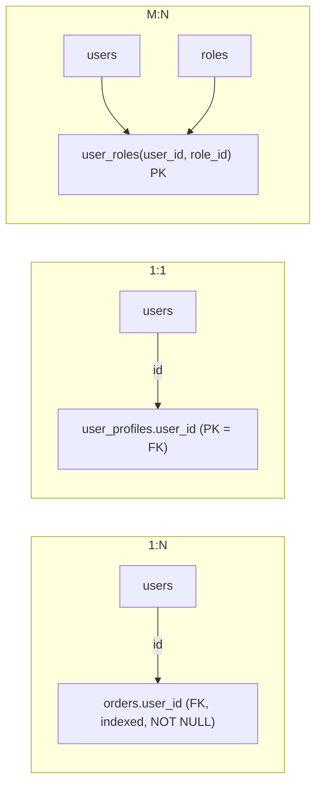

{/* status: authored */}

export const schema = `CREATE TABLE users (
  id    bigint GENERATED ALWAYS AS IDENTITY PRIMARY KEY,
  email text NOT NULL UNIQUE
);
CREATE TABLE roles (
  id   int PRIMARY KEY,
  name text NOT NULL UNIQUE
);
INSERT INTO users (email) VALUES ('ana@x.com'), ('ben@x.com'), ('chidi@x.com');
INSERT INTO roles VALUES (1,'admin'), (2,'editor'), (3,'viewer');`;

# Modeling relationships: 1:1, 1:N, M:N

## First principles

A relationship is represented by a **foreign key**. The only real question is
**which table holds it** — and that follows directly from the cardinality.

### 1:N (one-to-many) — the common case

"One user has many orders." The FK goes on the **many** side:

```sql
CREATE TABLE orders (
  id bigint PRIMARY KEY,
  user_id bigint NOT NULL REFERENCES users(id),   -- FK on the "many" side
  ...
);
CREATE INDEX ON orders (user_id);                  -- index it — always
```

Making `user_id` `NOT NULL` makes it *mandatory* 1:N; nullable makes it optional
(an order might have no user).

### 1:1 (one-to-one)

Put the FK on the **optional / less-common** side, and make it `UNIQUE` (that's
what turns 1:N into 1:1):

```sql
CREATE TABLE user_profiles (
  user_id bigint PRIMARY KEY REFERENCES users(id),   -- PK = FK → exactly one, and unique
  bio text, avatar_url text
);
```

Reasons to split a 1:1 rather than adding columns to `users`:

- The extra columns are **large** (`bio text`, a blob) and rarely selected — keep
  the main table narrow so common reads stay fast.
- The columns are **optional for most rows** — a separate table avoids a sea of
  `NULL`s.
- Different **access control** or **write frequency**.

Otherwise, just add the columns. Don't split a 1:1 reflexively.

### M:N (many-to-many)

"A user has many roles; a role has many users." There is **no** place to put a
single FK — you need a **junction table** (a.k.a. join / bridge / associative
table):

```sql
CREATE TABLE user_roles (
  user_id bigint NOT NULL REFERENCES users(id) ON DELETE CASCADE,
  role_id int    NOT NULL REFERENCES roles(id),
  granted_at timestamptz NOT NULL DEFAULT now(),   -- attributes of the relationship live here
  PRIMARY KEY (user_id, role_id)                   -- composite PK = "each pair at most once"
);
CREATE INDEX ON user_roles (role_id);              -- for "who has role X"
```

The composite PK enforces uniqueness of the pair; the reverse-direction index
makes "all users with role X" fast. Any attribute *of the relationship itself*
(`granted_at`, `granted_by`) belongs on the junction row.

## The mechanism



## Hand-trace on dummy data

Grant roles and answer both directions of the M:N:

<QueryTrace
  caption="junction rows are the relationship; join through them either way"
  steps={[
    {
      title: "1 · users and roles",
      table: { name: "users", columns: ["id", "email"], rows: [[1,"ana@x.com"],[2,"ben@x.com"],[3,"chidi@x.com"]] },
    },
    {
      title: "1b · roles",
      table: { name: "roles", columns: ["id", "name"], rows: [[1,"admin"],[2,"editor"],[3,"viewer"]] },
    },
    {
      title: "2 · user_roles — one row per (user, role) grant",
      op: "user_id",
      table: {
        name: "user_roles",
        columns: ["user_id", "role_id", "granted_at"],
        rows: [[1,1,"2024-01-01"],[1,2,"2024-01-01"],[2,2,"2024-02-01"],[3,3,"2024-02-01"]],
      },
      rows: { add: [0, 1, 2, 3] },
    },
    {
      title: "3 · \"Ana's roles\": users ⋈ user_roles ⋈ roles WHERE user_id = 1",
      op: "user_id",
      table: { columns: ["email", "role"], rows: [["ana@x.com","admin"],["ana@x.com","editor"]] },
      rows: { match: [0, 1] },
    },
    {
      title: "4 · \"who is an editor\": the same junction, other direction — result",
      table: {
        name: "result",
        result: true,
        columns: ["role", "users"],
        rows: [["admin","ana@x.com"],["editor","ana@x.com, ben@x.com"],["viewer","chidi@x.com"]],
      },
    },
  ]}
/>

## Run it

<SqlRunner title="the M:N junction, both directions" setup={schema}>
{`CREATE TABLE user_roles (
  user_id bigint NOT NULL REFERENCES users(id) ON DELETE CASCADE,
  role_id int    NOT NULL REFERENCES roles(id),
  granted_at date NOT NULL DEFAULT DATE '2024-01-01',
  PRIMARY KEY (user_id, role_id)
);
CREATE INDEX ON user_roles (role_id);
INSERT INTO user_roles (user_id, role_id) VALUES (1,1), (1,2), (2,2), (3,3);

-- Ana's roles
SELECT u.email, r.name FROM users u
JOIN user_roles ur ON ur.user_id = u.id
JOIN roles r ON r.id = ur.role_id
WHERE u.id = 1;

-- who has each role
SELECT r.name, string_agg(u.email, ', ' ORDER BY u.email) AS users
FROM roles r
LEFT JOIN user_roles ur ON ur.role_id = r.id
LEFT JOIN users u ON u.id = ur.user_id
GROUP BY r.name ORDER BY r.name;`}
</SqlRunner>

<SqlRunner title="the composite PK forbids duplicate grants" setup={schema}>
{`CREATE TABLE user_roles (
  user_id bigint REFERENCES users(id), role_id int REFERENCES roles(id),
  PRIMARY KEY (user_id, role_id)
);
INSERT INTO user_roles VALUES (1, 1);
-- INSERT INTO user_roles VALUES (1, 1);   -- ERROR: duplicate key
SELECT * FROM user_roles;`}
</SqlRunner>

<SqlRunner title="1:1 via PK = FK" setup={schema}>
{`CREATE TABLE user_profiles (
  user_id bigint PRIMARY KEY REFERENCES users(id) ON DELETE CASCADE,
  bio text
);
INSERT INTO user_profiles VALUES (1, 'Backend engineer');
-- INSERT INTO user_profiles VALUES (1, 'again');   -- ERROR: one profile per user
SELECT u.email, p.bio
FROM users u LEFT JOIN user_profiles p ON p.user_id = u.id
ORDER BY u.id;`}
</SqlRunner>

<RunThis file="sql/backend/05_modeling_relationships/topic.sql" />

## Build → Break → Fix → Why

:::tip[🔨 Build]
M:N → junction table with a **composite PK** on the two FK columns, an index on
the second column, `ON DELETE CASCADE` where a child grant is meaningless without
its parent, and relationship attributes (`granted_at`) on the junction row.
:::

:::danger[💥 Break]
Model "user has many roles" as `roles text[]` on `users`, or a comma string
`'admin,editor'`. Now: no FK (you can grant `'admni'`), "who is an editor"
scans + `unnest`es every user, "rename the editor role" is a full-table string
replace, and you can't record *when* a role was granted.
:::

:::danger[💥 Break (the other way)]
Model M:N as *two* 1:N FKs — `users.primary_role_id` and
`roles.owner_user_id`. This only expresses one role per user and one owner per
role; it can't represent the actual many-to-many.
:::

:::note[🔧 Fix]
- 1:N → FK on the many side, indexed, `NOT NULL` if mandatory.
- 1:1 → FK on the optional side, `UNIQUE` (or PK = FK).
- M:N → junction table. Always. No array, no CSV, no pair of 1:N FKs.
:::

:::info[🧠 Why it behaved that way]
A single FK column can point at exactly one parent row, so it can only ever
express "many children, one parent". Many-to-many needs to represent an arbitrary
*set of pairs*, and the natural home for a set of pairs is a table with one row
per pair. That junction row is also the only place with an identity to hang the
relationship's own attributes on, and the only thing an FK can reference for
integrity.
:::

## Pitfalls & idioms

- **Index the FK column** (both columns of a junction). Postgres doesn't do it
  automatically; un-indexed FKs make joins and parent deletes slow.
- Junction PK is the pair `(a_id, b_id)` — that *is* your uniqueness constraint.
- Put relationship attributes on the junction, not on either entity.
- `ON DELETE CASCADE` for junctions where the grant is meaningless without the
  parent; `RESTRICT` where you want deletes to fail loudly.
- Don't split a 1:1 unless the columns are big, mostly-null, or separately
  governed.
- A "self many-to-many" (users follow users) is a junction referencing the same
  table twice: `follows(follower_id, followee_id)`.
- Bridge tables in a warehouse are the same idea with a weighting factor — see
  [Data Engineering](/data-engineering/).

## See also

- [Constraints & keys](/foundations/constraints-and-keys) — FK, composite PK, cascade
- [Surrogate vs natural keys](/backend/surrogate-vs-natural-keys) — what the FK points at
- [Arrays](/foundations/arrays) — the tempting-but-wrong M:N shortcut
- [INNER JOIN](/foundations/inner-join) — joining through a junction

## Check yourself

1. 1:N — which table gets the FK, and what makes it mandatory vs optional?
2. Two ways to enforce 1:1, and one good reason to split a 1:1 into two tables.
3. Why can't M:N be done with a single foreign key?
4. What goes in the junction table besides the two FK columns?
5. "user has many tags" as `tags text[]` — name three things that breaks.
