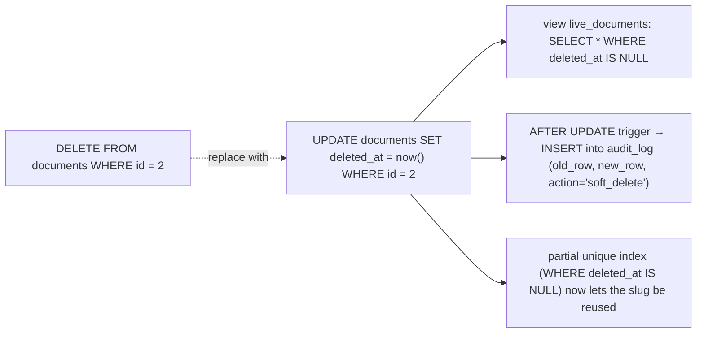

{/* status: authored */}

export const schema = `CREATE TABLE documents (
  id         bigint GENERATED ALWAYS AS IDENTITY PRIMARY KEY,
  owner_id   int NOT NULL,
  slug       text NOT NULL,
  title      text NOT NULL,
  created_at timestamptz NOT NULL DEFAULT now(),
  updated_at timestamptz NOT NULL DEFAULT now(),
  deleted_at timestamptz            -- NULL = live; a timestamp = soft-deleted
);
INSERT INTO documents (owner_id, slug, title) VALUES
  (1, 'roadmap',  'Roadmap'),
  (1, 'budget',   'Budget'),
  (2, 'notes',    'Notes');`;

# Soft deletes, timestamps & audit columns

## First principles

### Soft delete

A hard `DELETE` is irreversible and takes referencing rows (or blocks) with it.
Often you want "gone from the app, still on disk": a nullable **`deleted_at
timestamptz`**. `NULL` = live; a timestamp = deleted (and *when*).

- Every "normal" query adds `WHERE deleted_at IS NULL`. Missing it is the #1 soft-
  delete bug — so wrap the table in a **view** (`live_documents`) or use RLS, and
  query that.
- **Uniqueness must be "among the living"**: a `UNIQUE (owner_id, slug)` blocks a
  user from re-creating a `roadmap` doc after deleting the old one. Use a
  **partial unique index**: `UNIQUE (owner_id, slug) WHERE deleted_at IS NULL`.
- Foreign keys still see soft-deleted rows — decide whether children should too.
- Data-retention / GDPR: soft-deleted rows still contain personal data. Have a
  job that hard-deletes (or anonymises) after a window.

### created_at / updated_at

- `created_at timestamptz NOT NULL DEFAULT now()` — set once, never updated.
- `updated_at` — must be maintained on **every** write. App code forgets;
  use a `BEFORE UPDATE` [trigger](/foundations/triggers-and-plpgsql):
  `NEW.updated_at := now()`. Then it's true no matter who writes.
- Don't let the client send these. `GENERATED`/`DEFAULT`/trigger only.

### Audit log

`updated_at` tells you *when*, not *what* or *who*. For that, an append-only
**audit table**: one row per change, with `(table, row_id, action, changed_by,
changed_at, old_row jsonb, new_row jsonb)`, written by an `AFTER` trigger. It's
insert-only; never updated or deleted from the app.

## The mechanism

## Hand-trace on dummy data

Soft-delete `budget`, then re-create it — the partial unique index allows it:

<QueryTrace
  caption="deleted_at flips a row out of 'live'; the partial index only constrains live rows"
  steps={[
    {
      title: "1 · documents — all live (deleted_at NULL)",
      op: "deleted_at",
      table: {
        name: "documents",
        columns: ["id", "owner_id", "slug", "deleted_at"],
        rows: [[1,1,"roadmap",null],[2,1,"budget",null],[3,2,"notes",null]],
      },
    },
    {
      title: "2 · soft-delete: UPDATE ... SET deleted_at = now() WHERE id = 2",
      op: "deleted_at",
      table: {
        columns: ["id", "owner_id", "slug", "deleted_at"],
        rows: [[1,1,"roadmap",null],[2,1,"budget","2024-06-01 12:00"],[3,2,"notes",null]],
      },
      rows: { drop: [1] },
    },
    {
      title: "3 · SELECT * FROM live_documents — row 2 gone from the app's view",
      op: "deleted_at",
      table: {
        name: "live_documents",
        columns: ["id", "owner_id", "slug"],
        rows: [[1,1,"roadmap"],[3,2,"notes"]],
      },
    },
    {
      title: "4 · INSERT (1,'budget',...) — partial unique index only sees LIVE (1,'budget'), which no longer exists → allowed — result",
      op: "slug",
      table: {
        name: "documents (after)",
        result: true,
        columns: ["id", "owner_id", "slug", "deleted_at"],
        rows: [[1,1,"roadmap",null],[2,1,"budget","2024-06-01"],[3,2,"notes",null],[4,1,"budget",null]],
      },
      rows: { add: [3] },
    },
  ]}
/>

## Run it

<SqlRunner title="soft delete + a view for the app" setup={schema}>
{`CREATE UNIQUE INDEX slug_live_unique ON documents (owner_id, slug) WHERE deleted_at IS NULL;
CREATE VIEW live_documents AS SELECT * FROM documents WHERE deleted_at IS NULL;

UPDATE documents SET deleted_at = now() WHERE id = 2;   -- soft delete
SELECT id, slug FROM live_documents ORDER BY id;        -- budget is gone

-- re-create budget: allowed, because the constraint only covers live rows
INSERT INTO documents (owner_id, slug, title) VALUES (1, 'budget', 'Budget v2')
RETURNING id, slug;
SELECT id, slug, deleted_at FROM documents ORDER BY id;`}
</SqlRunner>

<SqlRunner title="updated_at via trigger — can't be forged or forgotten" setup={schema}>
{`CREATE FUNCTION touch() RETURNS trigger LANGUAGE plpgsql AS $$
BEGIN NEW.updated_at := now(); RETURN NEW; END $$;
CREATE TRIGGER trg_touch BEFORE UPDATE ON documents
FOR EACH ROW EXECUTE FUNCTION touch();

-- app tries to set updated_at to last week — trigger overrides it
UPDATE documents SET title = 'Roadmap 2025', updated_at = TIMESTAMPTZ '2020-01-01'
WHERE id = 1
RETURNING id, title, (updated_at > TIMESTAMPTZ '2024-01-01') AS is_recent;`}
</SqlRunner>

<SqlRunner title="an append-only audit log" setup={schema}>
{`CREATE TABLE audit_log (
  id bigint GENERATED ALWAYS AS IDENTITY PRIMARY KEY,
  tbl text NOT NULL, row_id bigint NOT NULL, action text NOT NULL,
  at timestamptz NOT NULL DEFAULT now(),
  old_row jsonb, new_row jsonb
);
CREATE FUNCTION audit() RETURNS trigger LANGUAGE plpgsql AS $$
BEGIN
  INSERT INTO audit_log (tbl, row_id, action, old_row, new_row)
  VALUES (TG_TABLE_NAME, coalesce(NEW.id, OLD.id), lower(TG_OP),
          to_jsonb(OLD), to_jsonb(NEW));
  RETURN NULL;
END $$;
CREATE TRIGGER trg_audit AFTER INSERT OR UPDATE OR DELETE ON documents
FOR EACH ROW EXECUTE FUNCTION audit();

UPDATE documents SET title = 'Budget FINAL' WHERE id = 2;
UPDATE documents SET deleted_at = now() WHERE id = 2;
SELECT row_id, action, old_row->>'title' AS old_title, new_row->>'title' AS new_title
FROM audit_log ORDER BY id;`}
</SqlRunner>

<RunThis file="sql/backend/06_soft_deletes_and_audit_columns/topic.sql" />

## Build → Break → Fix → Why

:::tip[🔨 Build]
`deleted_at timestamptz` + a partial unique index `WHERE deleted_at IS NULL` + a
`live_x` view the app queries + a `BEFORE UPDATE` trigger for `updated_at` + an
`AFTER` trigger writing an append-only `audit_log`.
:::

:::danger[💥 Break]
Add `deleted_at` but keep querying the base table everywhere. Some endpoints
filter `deleted_at IS NULL`, some don't. Deleted documents show up in search,
counts are inflated, and a user's "deleted" budget is still visible on the
sharing page. Meanwhile `UNIQUE (owner_id, slug)` blocks them from making a new
one.
:::

:::note[🔧 Fix]
- Query a **view** (or an RLS-scoped table), never the raw table, in app code.
- **Partial** unique index so "unique" means "unique among the living".
- `updated_at` from a trigger, not app code.
- Real "who changed what" → an audit table, not `updated_at`.
:::

:::info[🧠 Why it behaved that way]
`deleted_at` turns "does this row exist?" into "is this row's `deleted_at` NULL?"
— a condition every read must now carry, and every forgotten one is a leak. A
plain unique index treats a soft-deleted row as still occupying its slug, so the
name can never be reused; a *partial* index scoped to `deleted_at IS NULL` only
constrains the rows the app considers real. `updated_at` and audit logging are
invariants about *history*, and invariants belong in the database (trigger), not
in the hope that every writer remembers.
:::

## Pitfalls & idioms

- App queries a `live_*` view or RLS-filtered table. The raw table is for admin /
  jobs / restore only.
- Partial unique index `... WHERE deleted_at IS NULL` for "unique among live
  rows" (`EXCLUDE ... WHERE (...)` also works, but needs `btree_gist` for `=`).
- `updated_at` — trigger, always. Reject client-supplied values.
- Audit log is **append-only**: `REVOKE UPDATE, DELETE` from the app role; store
  `old_row`/`new_row` as `jsonb`.
- Restoring = `UPDATE ... SET deleted_at = NULL` — but check the slug isn't now
  taken by a newer row.
- Have a retention job that hard-deletes or anonymises soft-deleted personal data
  after N days.
- Soft delete makes tables grow forever; consider [partitioning by
  `deleted_at`](/data-engineering/) or moving old rows to an archive table.

## See also

- [Constraints & keys](/foundations/constraints-and-keys) — partial unique indexes
- [Triggers & PL/pgSQL basics](/foundations/triggers-and-plpgsql) — `updated_at`, audit triggers
- [Roles, privileges & row-level security](/foundations/roles-privileges-and-row-level-security) — hiding deleted rows with RLS
- [Views & materialized views](/foundations/views-and-materialized-views) — the `live_*` view

## Check yourself

1. Why does a plain `UNIQUE (owner_id, slug)` break with soft deletes, and what
   replaces it?
2. What's the single most common soft-delete bug, and how do you design it away?
3. Why maintain `updated_at` with a trigger instead of in application code?
4. What does an audit log give you that `created_at`/`updated_at` don't?
5. Name one operational cost of soft deletes and a mitigation.
