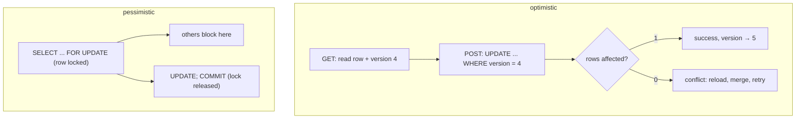

{/* status: authored */}

export const schema = `CREATE TABLE documents (
  id      int PRIMARY KEY,
  title   text NOT NULL,
  body    text NOT NULL,
  version int  NOT NULL DEFAULT 1
);
INSERT INTO documents VALUES (1, 'Draft', 'hello', 1);

CREATE TABLE jobs (
  id     int PRIMARY KEY,
  status text NOT NULL DEFAULT 'queued',
  worker text
);
INSERT INTO jobs VALUES (1,'queued',NULL), (2,'queued',NULL), (3,'queued',NULL);`;

# Optimistic vs pessimistic locking

## First principles

Two requests read the same row, both modify it, both write back — one change is
[lost](/foundations/isolation-levels-and-mvcc). Two strategies prevent it.

### Optimistic — "assume no conflict, detect it on write"

Add a **`version`** column (or use `updated_at`). Read it with the row; on write,
require it to still match:

```sql
UPDATE documents
SET title = $newtitle, version = version + 1
WHERE id = $id AND version = $version_you_read;
```

If someone else wrote first, `version` no longer matches, **0 rows are updated**,
and the app knows to reload and retry (or show "someone else edited this"). No
locks held between read and write.

Best for: **web edit forms** (user thinks for 30s between GET and POST — you
can't hold a lock that long), low contention, read-heavy.

### Pessimistic — "lock the row while I work"

```sql
BEGIN;
SELECT * FROM documents WHERE id = $id FOR UPDATE;   -- row locked until COMMIT
-- ... compute the new value ...
UPDATE documents SET body = $newbody WHERE id = $id;
COMMIT;
```

`FOR UPDATE` blocks any other transaction from locking/updating that row until
you commit. Variants:

- `FOR UPDATE SKIP LOCKED` — don't wait; skip rows someone else holds. **The
  job-queue pattern**: each worker grabs a different unlocked job.
- `FOR UPDATE NOWAIT` — error immediately instead of waiting.
- `FOR NO KEY UPDATE` / `FOR SHARE` — weaker locks.

Best for: **short** critical sections inside one transaction (a balance transfer,
claiming a queue item), high contention on specific rows.

## The mechanism



## Hand-trace: optimistic conflict

Two editors load version 1; both submit:

<QueryTrace
  caption="the WHERE version = 1 predicate makes the second write a no-op"
  steps={[
    {
      title: "1 · documents",
      op: "version",
      table: { name: "documents", columns: ["id", "title", "version"], rows: [[1,"Draft",1]] },
    },
    {
      title: "2 · editor A: UPDATE ... SET title='A edit', version=2 WHERE id=1 AND version=1",
      op: "version",
      table: { columns: ["predicate", "rows affected", "row after"], rows: [["version = 1 → true", "1", "title='A edit', version=2"]] },
      rows: { match: [0] },
    },
    {
      title: "3 · editor B (still thinks version is 1): UPDATE ... WHERE id=1 AND version=1",
      op: "version",
      table: { columns: ["predicate", "rows affected", "row after"], rows: [["version = 1 → FALSE (it's 2)", "0", "unchanged"]] },
      rows: { drop: [0] },
    },
    {
      title: "4 · B sees 0 rows affected → reload (version 2), merge, retry — result",
      table: {
        name: "result",
        result: true,
        columns: ["editor", "outcome"],
        rows: [["A", "committed (version 2)"], ["B", "0 rows → told to reload & retry; no silent loss"]],
      },
    },
  ]}
/>

## Run it

<SqlRunner title="optimistic: version check" setup={schema}>
{`-- editor A reads version 1, then writes:
UPDATE documents SET title = 'A edit', version = version + 1
WHERE id = 1 AND version = 1
RETURNING id, title, version;                 -- 1 row, version now 2

-- editor B also read version 1, writes with the stale version:
UPDATE documents SET title = 'B edit', version = version + 1
WHERE id = 1 AND version = 1;                 -- UPDATE 0  → conflict, B must retry

SELECT * FROM documents;                      -- A's edit stands`}
</SqlRunner>

<SqlRunner title="pessimistic: SELECT FOR UPDATE" setup={schema}>
{`BEGIN;
SELECT title, body FROM documents WHERE id = 1 FOR UPDATE;   -- row locked for this txn
UPDATE documents SET body = 'edited under lock' WHERE id = 1;
COMMIT;                                                       -- lock released
SELECT * FROM documents;`}
</SqlRunner>

<SqlRunner title="job queue: FOR UPDATE SKIP LOCKED" setup={schema}>
{`-- worker A claims a job (in real life another worker runs this concurrently)
BEGIN;
  WITH claimed AS (
    SELECT id FROM jobs WHERE status = 'queued'
    ORDER BY id LIMIT 1
    FOR UPDATE SKIP LOCKED           -- skip anything another worker holds
  )
  UPDATE jobs SET status = 'running', worker = 'A'
  WHERE id IN (SELECT id FROM claimed)
  RETURNING id, worker;
COMMIT;

SELECT * FROM jobs ORDER BY id;`}
</SqlRunner>

<RunThis file="sql/backend/07_optimistic_vs_pessimistic_locking/topic.sql" />

:::note[Runner note]
The in-page engine is one connection, so it can't show two sessions truly
racing. The traces are the thing to study; the runners show the *mechanics*
(`version` predicate, `FOR UPDATE`, `SKIP LOCKED`).
:::

## Build → Break → Fix → Why

:::tip[🔨 Build]
Edit form: GET returns the row + `version`. PUT runs `UPDATE ... WHERE id = $id
AND version = $version`. 0 rows → `409 Conflict`, client reloads.
:::

:::danger[💥 Break]
Edit form does GET then `UPDATE documents SET ... WHERE id = $id` (no version
check). Two people edit the same doc; whoever saves last wins and the other's
changes vanish with no warning. The user swears they saved it.
:::

:::danger[💥 Break (pessimistic misuse)]
Hold `SELECT ... FOR UPDATE` across the user's *think time* — lock the row on
GET, release on POST. Now one slow editor blocks everyone else on that row for
minutes, and an abandoned tab locks it until the transaction times out.
:::

:::note[🔧 Fix]
- User-facing edits, long gaps between read and write → **optimistic** (version
  column, retry on conflict).
- Short server-side critical section in one transaction → **pessimistic**
  (`FOR UPDATE`).
- Queue of work items → `FOR UPDATE SKIP LOCKED`.
- Simple counter increments → neither; one atomic `UPDATE ... SET n = n + 1`.
:::

:::info[🧠 Why it behaved that way]
Optimistic locking encodes "the row is unchanged since I read it" as a `WHERE`
predicate, so a concurrent write simply makes your `UPDATE` match nothing — the
database detects the conflict for you, with no lock held during the user's think
time. Pessimistic `FOR UPDATE` takes a real row lock, so the second transaction
*waits* — correct and simple, but only viable when the lock is held for
milliseconds, not the duration of an HTTP round-trip to a human.
:::

## Pitfalls & idioms

- Optimistic: the retry loop is your responsibility. Bound it; surface a clear
  "reload" to the user after a few tries.
- `updated_at` works as the version token if it's trigger-maintained and has
  enough resolution.
- Pessimistic locks are released only by `COMMIT`/`ROLLBACK` — keep the
  transaction tiny, no external I/O inside.
- `FOR UPDATE` on a `JOIN` locks rows in the named tables; be explicit with
  `FOR UPDATE OF t`.
- `SKIP LOCKED` is for queues; `NOWAIT` for "fail fast rather than wait".
- A plain `UPDATE t SET c = c + 1 WHERE id = $1` is already atomic — don't wrap
  trivial increments in either scheme.
- Deadlocks: always lock multiple rows in a consistent order (e.g. ascending
  `id`).

## See also

- [Isolation levels & MVCC](/foundations/isolation-levels-and-mvcc) — the lost update, snapshots
- [Write skew & lost update in practice](/backend/write-skew-and-lost-update) — the anomalies in detail
- [Transactions & ACID](/foundations/transactions-and-acid) — where locks live
- [Upsert & MERGE](/foundations/upsert-and-merge) — `ON CONFLICT` as another answer

## Check yourself

1. Optimistic locking: what makes the second writer's `UPDATE` a no-op, and what
   must the app do next?
2. Why is pessimistic locking a bad fit for a browser edit form?
3. What does `FOR UPDATE SKIP LOCKED` do, and what's it for?
4. When do you need *neither* scheme?
5. How do you avoid deadlocks when a transaction locks several rows?
