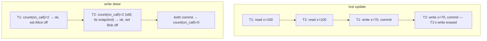

{/* status: authored */}

export const schema = `CREATE TABLE doctors (
  name    text PRIMARY KEY,
  on_call boolean NOT NULL
);
INSERT INTO doctors VALUES ('Alice', true), ('Bob', true);

CREATE TABLE accounts (id text PRIMARY KEY, balance int NOT NULL CHECK (balance >= 0));
INSERT INTO accounts VALUES ('a', 100);`;

# Write skew & lost update in practice

## First principles

Under the default `READ COMMITTED`
([isolation](/foundations/isolation-levels-and-mvcc)), two concurrent
transactions can each be correct in isolation and wrong together. Two named
anomalies show up constantly in application code.

### Lost update

T1 and T2 both read `x = 100`, both compute `x - 30 = 70`, both write `70`. Two
withdrawals happened; the balance only dropped once. **Thirty units vanished.**

The tell: **read a value, modify it in application code, write it back.**

### Write skew

Two transactions read an **overlapping set** of rows, each makes a change that's
valid *given what it read*, but the combination violates an invariant that spans
the set.

Classic: "at least one doctor must stay on call." Alice's transaction checks
"is anyone else on call?" → yes (Bob) → Alice goes off call. Bob's transaction
does the same, concurrently → yes (Alice) → Bob goes off call. Now **nobody is on
call**, and no single row's constraint was violated.

Also: booking the last seat twice, two users claiming the same username after
both check "is it taken?", overdrawing a shared account where each withdrawal is
individually within limits.

## The mechanism

## Hand-trace: write skew

<QueryTrace
  caption="each transaction's snapshot still shows 2 on call when it decides; together they drop it to 0"
  steps={[
    {
      title: "1 · doctors — both on call",
      op: "on_call",
      table: { name: "doctors", columns: ["name", "on_call"], rows: [["Alice",true],["Bob",true]] },
    },
    {
      title: "2 · T1 (Alice): SELECT count(*) WHERE on_call → 2 ≥ 2, safe to leave",
      op: "on_call",
      table: { columns: ["T1 sees", "T1 decides"], rows: [["on_call count = 2", "UPDATE Alice SET on_call = false"]] },
    },
    {
      title: "3 · T2 (Bob), concurrent: its snapshot also shows count = 2 → safe to leave",
      op: "on_call",
      table: { columns: ["T2 sees", "T2 decides"], rows: [["on_call count = 2 (Alice's change not visible)", "UPDATE Bob SET on_call = false"]] },
    },
    {
      title: "4 · both commit — result: nobody on call, no row constraint broken",
      op: "on_call",
      table: {
        name: "doctors (after)",
        result: true,
        columns: ["name", "on_call"],
        rows: [["Alice",false],["Bob",false]],
      },
      rows: { drop: [0, 1] },
    },
  ]}
/>

## Run it

<SqlRunner title="lost update: read-modify-write vs one atomic UPDATE" setup={schema}>
{`-- the bug (what app code does): read, then write a computed absolute value
SELECT balance FROM accounts WHERE id = 'a';       -- app reads 100
UPDATE accounts SET balance = 70 WHERE id = 'a';   -- app writes 100 - 30
-- if a second request did the same concurrently, one -30 is lost

-- the fix: let the database do the arithmetic in one statement
UPDATE accounts SET balance = balance - 30 WHERE id = 'a' AND balance >= 30
RETURNING balance;                                  -- atomic; concurrent ones serialize on the row`}
</SqlRunner>

<SqlRunner title="write skew: the guard that doesn't guard" setup={schema}>
{`-- Alice's transaction logic:
SELECT count(*) AS others_on_call FROM doctors WHERE on_call AND name <> 'Alice';  -- 1
-- 1 >= 1, so it's "safe":
UPDATE doctors SET on_call = false WHERE name = 'Alice';
-- run the mirror for Bob concurrently and you get zero on call

SELECT * FROM doctors;`}
</SqlRunner>

<SqlRunner title="write-skew fix 1: a constraint the DB enforces regardless" setup={schema}>
{`-- move the invariant into the schema: a summary row + CHECK
CREATE TABLE on_call_count (k int PRIMARY KEY DEFAULT 1, n int NOT NULL CHECK (n >= 1));
INSERT INTO on_call_count (n) VALUES (2);

-- going off call decrements the counter in the SAME statement; CHECK stops the last one
UPDATE on_call_count SET n = n - 1;   -- 2 -> 1, ok
UPDATE on_call_count SET n = n - 1;   -- 1 -> 0  ERROR: violates check constraint`}
</SqlRunner>

<SqlRunner title="write-skew fix 2: SELECT ... FOR UPDATE the rows you're reasoning about" setup={schema}>
{`BEGIN;
-- lock every on-call doctor row so the mirror transaction blocks
SELECT name FROM doctors WHERE on_call FOR UPDATE;
-- now re-check under the lock
UPDATE doctors SET on_call = false
WHERE name = 'Alice'
  AND (SELECT count(*) FROM doctors WHERE on_call) > 1;
COMMIT;
SELECT * FROM doctors;`}
</SqlRunner>

<RunThis file="sql/backend/08_write_skew_and_lost_update/topic.sql" />

:::note[Runner note]
One connection can't reproduce a true race. The traces show the interleaving;
the runners show the fixes' mechanics.
:::

## Build → Break → Fix → Why

:::tip[🔨 Build]
Withdrawals as `UPDATE accounts SET balance = balance - $amt WHERE id = $id AND
balance >= $amt` — check the result: 0 rows = insufficient funds. No read-then-
write.
:::

:::danger[💥 Break]
`balance = fetch(); if balance >= amt: save(balance - amt)`. Two withdrawals of
30 from 100 both pass the check, both save 70. Or: two signups both check
`SELECT 1 FROM users WHERE username = $u` (none), both `INSERT`.
:::

:::note[🔧 Fix — four options, roughly in order]
1. **Make it one atomic statement** — `SET x = x - $amt WHERE ... AND x >= $amt`.
   Best when possible.
2. **A constraint** — `UNIQUE (username)` catches the double-signup; a `CHECK` on
   a counter row catches the last-doctor case.
3. **`SELECT ... FOR UPDATE`** the rows your decision depends on, then re-check
   under the lock.
4. **`SERIALIZABLE` isolation** — Postgres detects the read/write dependency
   cycle and aborts one transaction with `40001`; your app **retries**. The only
   option that catches write skew across arbitrary predicates automatically.
:::

:::info[🧠 Why it behaved that way]
`READ COMMITTED` gives each statement a fresh snapshot but takes no locks on rows
you merely *read*. So a decision based on "what I read" can be invalidated by a
commit that lands between your read and your write. Lost update is the single-row
case; write skew is the multi-row case where each row's own constraints stay
satisfied. Atomic statements and locks close the read-write gap for a *specific*
predicate; `SERIALIZABLE` closes it for *any* predicate by tracking dependencies
and refusing to commit a non-serializable schedule.
:::

## Pitfalls & idioms

- Any `read → compute in app → write` on the same data is a lost-update risk.
- `UNIQUE` constraints turn a whole class of races into a clean error you retry.
- `FOR UPDATE` must lock the rows your logic *reads to decide*, not just the row
  you write.
- `SERIALIZABLE`: wrap the transaction in a retry loop for `40001`
  (`serialization_failure`). Keep transactions short so retries are cheap.
- `SELECT ... FOR UPDATE` on zero rows locks nothing — the "does a row exist?"
  race needs a `UNIQUE` constraint or `SERIALIZABLE`, not a lock.
- Advisory locks (`pg_advisory_xact_lock`) for a critical section not tied to a
  row.

## See also

- [Isolation levels & MVCC](/foundations/isolation-levels-and-mvcc) — snapshots, the anomaly catalogue
- [Optimistic vs pessimistic locking](/backend/optimistic-vs-pessimistic-locking) — the two locking strategies
- [Upsert & MERGE](/foundations/upsert-and-merge) — `ON CONFLICT` for the double-insert race
- [Constraints & keys](/foundations/constraints-and-keys) — invariants the DB enforces

## Check yourself

1. Describe the lost-update anomaly as a two-transaction sequence.
2. Why is write skew *not* caught by per-row constraints?
3. Rewrite "withdraw 30 if balance allows" so it's safe under `READ COMMITTED`.
4. Which single fix catches write skew across *any* predicate, and what does it
   demand of your app?
5. Two users signing up with the same username concurrently — which fix, and why
   not `FOR UPDATE`?
