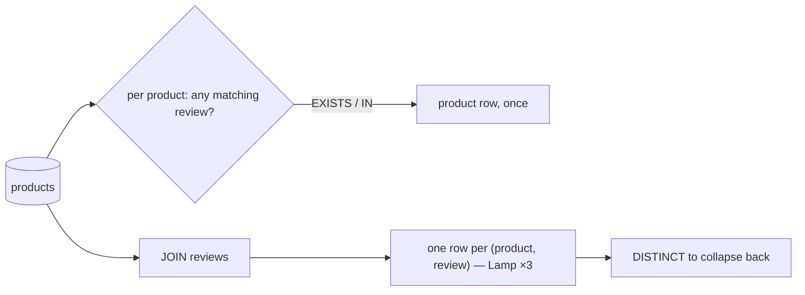

{/* status: authored */}

export const schema = `CREATE TABLE products (id int PRIMARY KEY, name text NOT NULL, price numeric NOT NULL);
CREATE TABLE reviews (
  id int PRIMARY KEY, product_id int, rating int NOT NULL CHECK (rating BETWEEN 1 AND 5)
);
INSERT INTO products VALUES (1,'Lamp',28), (2,'Mug',9), (3,'Cable',8), (4,'Notebook',6);
INSERT INTO reviews VALUES
  (10, 1, 5), (11, 1, 4), (12, 1, 3),   -- Lamp: 3 reviews
  (13, 2, 5),                            -- Mug: 1
  (14, NULL, 2);                         -- an orphan review`;

# `EXISTS` vs `IN` vs `JOIN` for existence checks

## First principles

"Products that have at least one review" — a **semi-join**
([foundations](/foundations/semi-joins-and-anti-joins)). Three common ways to
write it, and they are **not** interchangeable in a backend context:

```sql
-- 1. EXISTS  — correct, no fan-out, NULL-safe, usually the best plan
SELECT p.* FROM products p
WHERE EXISTS (SELECT 1 FROM reviews r WHERE r.product_id = p.id);

-- 2. IN  — correct here; NULL in the subquery is harmless for IN (a trap for NOT IN)
SELECT p.* FROM products p
WHERE p.id IN (SELECT product_id FROM reviews);

-- 3. JOIN + DISTINCT  — works, but you had to remember DISTINCT
SELECT DISTINCT p.* FROM products p
JOIN reviews r ON r.product_id = p.id;
```

The `JOIN` version **multiplies** `products` by the number of matching reviews
(Lamp appears 3 times) — you then need `DISTINCT` to undo the damage, which costs
a sort/hash. `EXISTS` and `IN` return each product **once** by construction.

**Use `JOIN` when you actually want the child columns** ("products *and* their
average rating"). Use `EXISTS` when you only need "does a child exist" — it can
short-circuit on the first match and the planner turns it into a hash/merge
semi-join.

**`NOT` flips the guidance**: `NOT EXISTS` is safe; `NOT IN` against a nullable
column [returns nothing](/foundations/data-types-null-and-three-valued-logic).

## The mechanism



## Hand-trace on dummy data

<QueryTrace
  caption="EXISTS keeps each product once; JOIN fans Lamp out to 3 rows until DISTINCT"
  steps={[
    {
      title: "1 · products and reviews (Lamp has 3, Mug has 1, one orphan review)",
      table: { name: "products", columns: ["id", "name"], rows: [[1,"Lamp"],[2,"Mug"],[3,"Cable"],[4,"Notebook"]] },
    },
    {
      title: "1b · reviews",
      op: "product_id",
      table: { name: "reviews", columns: ["id", "product_id", "rating"], rows: [[10,1,5],[11,1,4],[12,1,3],[13,2,5],[14,null,2]] },
    },
    {
      title: "2 · EXISTS: per product, is there a matching review?",
      op: "product_id",
      table: {
        columns: ["product", "matching review?", "rows out"],
        rows: [["Lamp","yes","1"],["Mug","yes","1"],["Cable","no","0"],["Notebook","no","0"]],
      },
      rows: { drop: [2, 3] },
    },
    {
      title: "3 · JOIN reviews: Lamp fans out to 3 rows before DISTINCT",
      op: "product_id",
      table: {
        columns: ["product", "review_id"],
        rows: [["Lamp",10],["Lamp",11],["Lamp",12],["Mug",13]],
      },
    },
    {
      title: "4 · result — same 2 products; EXISTS: 2 rows scanned-ish, JOIN: 4 rows + a DISTINCT",
      table: {
        name: "result",
        result: true,
        columns: ["approach", "rows before dedup", "extra work"],
        rows: [["EXISTS / IN", "2", "none"], ["JOIN", "4", "DISTINCT (sort/hash)"]],
      },
    },
  ]}
/>

## Run it

<SqlRunner title="three ways, same rows" setup={schema}>
{`SELECT name FROM products p
WHERE EXISTS (SELECT 1 FROM reviews r WHERE r.product_id = p.id) ORDER BY name;

SELECT name FROM products WHERE id IN (SELECT product_id FROM reviews) ORDER BY name;

SELECT DISTINCT p.name FROM products p JOIN reviews r ON r.product_id = p.id ORDER BY p.name;`}
</SqlRunner>

<SqlRunner title="the JOIN fan-out bug (forgot DISTINCT)" setup={schema}>
{`-- looks like "products with reviews" but Lamp is counted 3 times
SELECT count(*) AS product_count FROM products p JOIN reviews r ON r.product_id = p.id;
-- says 4, not 2

-- and if you then sum price, Lamp's price is added 3 times
SELECT sum(p.price) AS inflated FROM products p JOIN reviews r ON r.product_id = p.id;`}
</SqlRunner>

<SqlRunner title="when you DO want the child data — JOIN + GROUP BY" setup={schema}>
{`SELECT p.name, count(r.id) AS n_reviews, round(avg(r.rating), 2) AS avg_rating
FROM products p
LEFT JOIN reviews r ON r.product_id = p.id
GROUP BY p.name
ORDER BY p.name;`}
</SqlRunner>

<SqlRunner title="NOT: the asymmetry" setup={schema}>
{`-- products with NO review: NOT EXISTS is correct
SELECT name FROM products p
WHERE NOT EXISTS (SELECT 1 FROM reviews r WHERE r.product_id = p.id) ORDER BY name;

-- NOT IN: reviews.product_id contains NULL (orphan) -> returns ZERO rows
SELECT name FROM products WHERE id NOT IN (SELECT product_id FROM reviews);`}
</SqlRunner>

<SqlRunner title="the plan: EXISTS becomes a semi-join" setup={schema}>
{`CREATE INDEX ON reviews (product_id);
EXPLAIN SELECT name FROM products p
WHERE EXISTS (SELECT 1 FROM reviews r WHERE r.product_id = p.id);
-- look for "Semi Join" / "Hash Semi Join"`}
</SqlRunner>

<RunThis file="sql/backend/09_exists_vs_in_vs_join/topic.sql" />

## Build → Break → Fix → Why

:::tip[🔨 Build]
"Products with a review" → `WHERE EXISTS (SELECT 1 FROM reviews r WHERE
r.product_id = p.id)`, with an index on `reviews(product_id)`.
:::

:::danger[💥 Break]
Write it as `JOIN reviews` and either forget `DISTINCT` (product count and any
`SUM` over product columns are inflated by the review count) or add `DISTINCT`
over a wide `SELECT p.*` (a big sort on every request).
:::

:::note[🔧 Fix]
- "Does a child exist" → `EXISTS` (or `IN` for the positive case).
- "Give me the child data too" → `JOIN` (+ `GROUP BY` if aggregating).
- Negation → `NOT EXISTS`, never `NOT IN` on a nullable subquery.
:::

:::info[🧠 Why it behaved that way]
A `JOIN` produces one row per matching pair — that's its definition — so a parent
with `n` children appears `n` times, and any aggregate over parent columns
over-counts. `EXISTS` is a boolean test evaluated per parent row: the planner
implements it as a *semi-join* that stops at the first match and emits the parent
once. `IN (subquery)` is the same semi-join for the positive case; `NOT IN`
inherits three-valued logic and breaks on a `NULL`.
:::

## Pitfalls & idioms

- `JOIN` for existence → you owe a `DISTINCT`, which owes a sort. Prefer `EXISTS`.
- `EXISTS (SELECT 1 ...)` — the select list is irrelevant.
- `NOT EXISTS` for anti-joins. `NOT IN` only when the subquery column is
  `NOT NULL` (and even then, `NOT EXISTS` is the safer habit).
- Correlated `EXISTS` needs an index on the child's foreign-key column.
- `IN (list of literals)` is fine and unrelated to the `NOT IN` trap.
- Filtering an API list by "has an X" is a semi-join; adding an X count is a
  `LEFT JOIN ... GROUP BY`. Don't conflate them.
- `count(*)` after a fan-out join is the single most common "why is my number
  wrong" bug — see [INNER JOIN](/foundations/inner-join).

## See also

- [Semi-joins & anti-joins](/foundations/semi-joins-and-anti-joins) — the foundations version
- [Correlated subqueries & EXISTS](/foundations/correlated-subqueries-and-exists) — how `EXISTS` is evaluated
- [INNER JOIN](/foundations/inner-join) — fan-out and double-counting
- [Keyset pagination & the N+1 problem](/backend/keyset-pagination-and-the-n-plus-1-problem) — batching child lookups

## Check yourself

1. Why does `SELECT ... FROM products JOIN reviews` need `DISTINCT` for "products
   with reviews", and what does that cost?
2. When is a `JOIN` the right choice over `EXISTS`?
3. Why is `NOT IN (SELECT product_id FROM reviews)` returning nothing here?
4. What index makes `WHERE EXISTS (SELECT 1 FROM reviews r WHERE r.product_id =
   p.id)` fast?
5. You need "products, each with its review count". `EXISTS`, `IN`, or `JOIN`?
