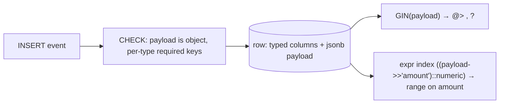

{/* status: authored */}

export const schema = `CREATE TABLE events (
  id         bigint GENERATED ALWAYS AS IDENTITY PRIMARY KEY,
  type       text NOT NULL,                 -- promoted: always present, always filtered
  occurred_at timestamptz NOT NULL,         -- promoted
  payload    jsonb NOT NULL DEFAULT '{}',   -- everything else, shape varies by type
  CONSTRAINT payload_is_object CHECK (jsonb_typeof(payload) = 'object')
);
INSERT INTO events (type, occurred_at, payload) VALUES
  ('page_view', TIMESTAMPTZ '2024-03-01 10:00+00', '{"path":"/pricing","referrer":"google"}'),
  ('page_view', TIMESTAMPTZ '2024-03-01 10:05+00', '{"path":"/docs"}'),
  ('purchase',  TIMESTAMPTZ '2024-03-01 11:00+00', '{"amount":49,"currency":"EUR","items":["lamp"]}'),
  ('signup',    TIMESTAMPTZ '2024-03-02 09:00+00', '{"plan":"pro","source":"referral"}');`;

# JSONB patterns & GIN indexing

## First principles

([JSON & JSONB foundations](/foundations/json-and-jsonb) covers the operators;
this is how to use them in a real schema.)

### The hybrid schema

Don't choose between "columns" and "jsonb" — use both:

- **Promote to real columns**: anything present on *every* row, that you *filter,
  join, sort, or constrain* on (`type`, `occurred_at`, `tenant_id`). Real type,
  real index, real `CHECK`/FK.
- **Keep in `jsonb`**: the type-specific, sparse, or evolving fields (a
  `page_view` has `path`; a `purchase` has `amount` and `items`).

This gives you fast, typed access to the hot path and flexibility for the rest,
without a column explosion or a table-per-event-type.

### Index the queries you run — not the whole document

| Query shape | Index |
|---|---|
| `payload @> '{"path":"/pricing"}'`, `payload ? 'referrer'` | `GIN (payload)` — general containment/key |
| only ever `payload @> ...` (never `?`) | `GIN (payload jsonb_path_ops)` — smaller, faster |
| `WHERE (payload->>'amount')::numeric > 20` | **expression index**: `((payload->>'amount')::numeric)` |
| `WHERE payload->>'plan' = 'pro'` | expression index: `((payload->>'plan'))` |

A `GIN (payload)` index does **not** accelerate
`(payload->>'x')::int > 5` — that's an arbitrary computed predicate and needs its
own expression index.

### Validate shape on write

`jsonb` accepts anything. Add guardrails:

- `CHECK (jsonb_typeof(payload) = 'object')` — no bare arrays/scalars.
- `CHECK (type <> 'purchase' OR (payload ? 'amount' AND jsonb_typeof(payload->'amount') = 'number'))`
  — per-type shape.
- Or a proper JSON Schema check via an extension / the app layer.

## The mechanism

## Hand-trace on dummy data

"Purchases over 20 EUR" — the promoted `type` column filters first, then an
expression index handles the amount:

<QueryTrace
  caption="type = 'purchase' on a real column; (payload->>'amount')::numeric > 20 on an expression index"
  steps={[
    {
      title: "1 · events",
      op: "type",
      table: {
        name: "events",
        columns: ["id", "type", "payload"],
        rows: [
          [1,"page_view",'{"path":"/pricing",…}'],
          [2,"page_view",'{"path":"/docs"}'],
          [3,"purchase",'{"amount":49,"currency":"EUR",…}'],
          [4,"signup",'{"plan":"pro",…}'],
        ],
      },
    },
    {
      title: "2 · WHERE type = 'purchase' — promoted column, plain B-tree",
      op: "type",
      table: {
        columns: ["id", "type", "kept?"],
        rows: [[1,"page_view","no"],[2,"page_view","no"],[3,"purchase","yes"],[4,"signup","no"]],
      },
      rows: { drop: [0, 1, 3] },
    },
    {
      title: "3 · AND (payload->>'amount')::numeric > 20 — expression index",
      op: "payload",
      table: { columns: ["id", "amount (::numeric)", "> 20?"], rows: [[3,49,"yes"]] },
    },
    {
      title: "4 · result",
      table: { name: "result", result: true, columns: ["id", "amount", "currency"], rows: [[3,49,"EUR"]] },
    },
  ]}
/>

## Run it

<SqlRunner title="promoted column + expression index" setup={schema}>
{`CREATE INDEX ON events (type, occurred_at);
CREATE INDEX ON events (((payload ->> 'amount')::numeric));

EXPLAIN
SELECT id, payload ->> 'currency' AS ccy, (payload ->> 'amount')::numeric AS amount
FROM events
WHERE type = 'purchase' AND (payload ->> 'amount')::numeric > 20;`}
</SqlRunner>

<SqlRunner title="GIN for containment across types" setup={schema}>
{`CREATE INDEX ON events USING GIN (payload);
SELECT id, type FROM events WHERE payload @> '{"source":"referral"}';
SELECT id FROM events WHERE payload ? 'referrer';
EXPLAIN SELECT id FROM events WHERE payload @> '{"path":"/pricing"}';`}
</SqlRunner>

<SqlRunner title="per-type shape validation" setup={schema}>
{`ALTER TABLE events ADD CONSTRAINT purchase_has_amount
  CHECK (type <> 'purchase' OR (payload ? 'amount' AND jsonb_typeof(payload -> 'amount') = 'number'));

INSERT INTO events (type, occurred_at, payload)
VALUES ('purchase', now(), '{"amount": 12, "currency": "USD"}');   -- ok
-- INSERT INTO events (type, occurred_at, payload)
-- VALUES ('purchase', now(), '{"currency": "USD"}');              -- ERROR: missing amount
SELECT count(*) FROM events WHERE type = 'purchase';`}
</SqlRunner>

<SqlRunner title="aggregate over a jsonb field" setup={schema}>
{`SELECT payload ->> 'path' AS path, count(*) AS views
FROM events
WHERE type = 'page_view'
GROUP BY payload ->> 'path'
ORDER BY views DESC;`}
</SqlRunner>

<RunThis file="sql/backend/10_jsonb_patterns_and_gin/topic.sql" />

## Build → Break → Fix → Why

:::tip[🔨 Build]
Promote `type`, `occurred_at`, `tenant_id` to columns with a
`(tenant_id, type, occurred_at)` index. Keep the variable payload in `jsonb` with
a `CHECK (jsonb_typeof(payload) = 'object')` and per-type key checks. Add a `GIN`
or expression index per real query.
:::

:::danger[💥 Break]
Everything (including `type` and `tenant_id`) lives in `payload`. Every list
endpoint scans and computes `payload->>'type'`; there's no FK on `tenant_id`;
`WHERE (payload->>'amount')::numeric > 20` never uses an index; and a bug ships
`{"amount": "lots"}` that reads back as `NULL`.
:::

:::note[🔧 Fix]
- Hybrid schema: hot/universal fields as columns, the rest as `jsonb`.
- Index for the **specific** predicates you run (`GIN` for `@>`/`?`, expression
  index for `(->>...)::type` comparisons).
- `CHECK` constraints for shape; don't rely on the app alone.
:::

:::info[🧠 Why it behaved that way]
A `jsonb` column trades schema for flexibility: you lose per-key types,
constraints, and — crucially — the planner's ability to use an index on a
*computed* value unless you build that exact expression index. Promoting a field
to a real column gives it back everything: a compact typed representation, a
B-tree the planner reaches for automatically, and constraint enforcement. GIN
covers the "does this document contain X" question because it's an inverted index
over keys and values; it can't cover "is this document's `amount` greater than
20" because that's not a containment question.
:::

## Pitfalls & idioms

- Promote a field to a column the moment you filter/sort/join/constrain on it
  regularly.
- `GIN (payload jsonb_path_ops)` if you only use `@>` — smaller and faster than
  the default.
- Expression index for `(payload->>'k')::type` comparisons; the index expression
  must match the query expression **exactly**.
- `CHECK (jsonb_typeof(payload) = 'object')` at minimum. Per-type required-key
  checks catch real bugs.
- A missing key is `NULL`, not an error — validate, and `coalesce` on read.
- Don't store huge blobs you never query into `jsonb`; the parse cost is real.
- `jsonb_populate_record` / `jsonb_to_record` to project a payload into typed
  columns in a query.

## See also

- [JSON & JSONB](/foundations/json-and-jsonb) — the operators, first principles
- [Index types](/foundations/index-types) — GIN, `jsonb_path_ops`, expression indexes
- [Generated columns, domains & custom types](/foundations/generated-columns-domains-and-types) — a `STORED` column from a jsonb path
- [Normalization 1NF → BCNF](/backend/normalization-1nf-to-bcnf) — jsonb is not an excuse to skip it

## Check yourself

1. Which fields belong in real columns and which in `jsonb`?
2. Why doesn't `GIN (payload)` help `WHERE (payload->>'amount')::int > 20`?
3. What index does that query need?
4. Give two `CHECK` constraints worth putting on a `jsonb` column.
5. `GIN (payload)` vs `GIN (payload jsonb_path_ops)` — when the second?
