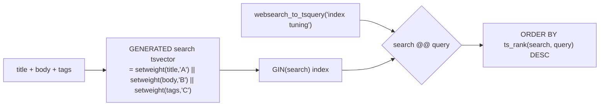

{/* status: authored */}

export const schema = `-- to_tsvector(...) is STABLE, not IMMUTABLE, so a GENERATED column needs an
-- IMMUTABLE wrapper (safe while the text-search config is fixed).
CREATE FUNCTION article_search(title text, body text, tags text[])
RETURNS tsvector LANGUAGE sql IMMUTABLE AS $$
  SELECT setweight(to_tsvector('english', coalesce(title,'')), 'A')
      || setweight(to_tsvector('english', coalesce(body,'')),  'B')
      || setweight(to_tsvector('english', array_to_string(coalesce(tags,'{}'), ' ')), 'C')
$$;

CREATE TABLE articles (
  id     int PRIMARY KEY,
  title  text NOT NULL,
  body   text NOT NULL,
  tags   text[] NOT NULL DEFAULT '{}',
  search tsvector GENERATED ALWAYS AS (article_search(title, body, tags)) STORED
);
CREATE INDEX articles_search_idx ON articles USING GIN (search);

INSERT INTO articles (id, title, body, tags) VALUES
  (1, 'Indexing in PostgreSQL', 'A guide to B-tree, GIN and BRIN indexes and how the planner chooses.', ARRAY['postgres','performance']),
  (2, 'Query tuning basics',    'Read EXPLAIN, find the slow node, add an index. Tuning is iterative.', ARRAY['postgres']),
  (3, 'Kafka for beginners',    'Topics, partitions, consumer groups. Streaming data at scale.', ARRAY['kafka','streaming']),
  (4, 'Writing good tests',     'Fast, isolated, deterministic. A test that flakes is worse than none.', ARRAY['testing']);`;

# Full-text search: `tsvector`, `tsquery`, ranking

## First principles

For "search my content", `ILIKE '%term%'` is wrong
([text foundations](/foundations/text-pattern-matching-and-regex)): no stemming
(`tune` ≠ `tuning`), no ranking, and it can't use a plain index. Postgres has a
real full-text engine.

The pieces:

- **`to_tsvector('english', doc)`** → a sorted set of normalised **lexemes**
  (lowercased, stemmed, stop-words dropped, with positions). `'A guide to
  B-tree indexes'` → `'b':4 'guid':2 'index':6 'tree':5`.
- **`to_tsquery('english', 'index & tree')`** / **`plainto_tsquery`** /
  **`websearch_to_tsquery`** → a query tree. `websearch_to_tsquery` accepts
  Google-style input (`"exact phrase" -excluded term`).
- **`@@`** — match operator. `tsvector @@ tsquery`.
- **`ts_rank` / `ts_rank_cd`** — a relevance score for `ORDER BY`.
- **`ts_headline`** — a snippet with `<b>` around matches.

To make it fast: a **`tsvector` column** (usually
[`GENERATED ALWAYS AS ... STORED`](/foundations/generated-columns-domains-and-types)
so it can't drift) with a **`GIN` index**.

**Weighting**: `setweight(to_tsvector(title), 'A') || setweight(to_tsvector(body),
'B')` makes a title hit outrank a body hit. Weights are `A > B > C > D`.

## The mechanism

## Hand-trace on dummy data

Search `"index tuning"` — stemming matches `Indexing`/`tuning`, title weight
lifts article 1:

<QueryTrace
  caption="lexeme match (stemmed), then rank by weighted relevance"
  steps={[
    {
      title: "1 · articles (title + body)",
      table: {
        name: "articles",
        columns: ["id", "title"],
        rows: [[1,"Indexing in PostgreSQL"],[2,"Query tuning basics"],[3,"Kafka for beginners"],[4,"Writing good tests"]],
      },
    },
    {
      title: "2 · search vector (weighted): title→A, body→B, stemmed",
      op: "title",
      table: {
        columns: ["id", "some lexemes (weight)"],
        rows: [
          [1,"'index':A 'postgresql':A 'gin':B 'brin':B 'plann':B …"],
          [2,"'queri':A 'tune':A 'basic':A 'explain':B 'index':B …"],
          [3,"'kafka':A 'beginn':A 'topic':B 'partit':B …"],
          [4,"'write':A 'good':A 'test':A 'fast':B …"],
        ],
      },
    },
    {
      title: "3 · @@ websearch_to_tsquery('index tuning')  →  'index' & 'tune'",
      op: "title",
      table: {
        columns: ["id", "has 'index'", "has 'tune'", "match?"],
        rows: [[1,"yes (A)","no","no"],[2,"yes (B)","yes (A)","YES"],[3,"no","no","no"],[4,"no","no","no"]],
      },
      rows: { drop: [0, 2, 3] },
    },
    {
      title: "4 · with OR ('index | tuning'): both 1 & 2 match; rank puts 2 first (title hits) — result",
      table: {
        name: "result",
        result: true,
        columns: ["id", "title", "rank"],
        rows: [[2,"Query tuning basics","0.30"],[1,"Indexing in PostgreSQL","0.10"]],
      },
    },
  ]}
/>

## Run it

<SqlRunner title="the generated tsvector column + GIN index (already in the schema)" setup={schema}>
{`-- see the normalized, weighted lexemes the column holds:
SELECT id, left(search::text, 70) || '…' AS search_vector FROM articles ORDER BY id;

SELECT id, title FROM articles
WHERE search @@ websearch_to_tsquery('english', 'index tuning');`}
</SqlRunner>

<SqlRunner title="ranking + snippet" setup={schema}>
{`SELECT a.id, a.title,
  round(ts_rank(a.search, q)::numeric, 4) AS rank,
  ts_headline('english', a.body, q, 'StartSel=[, StopSel=]') AS snippet
FROM articles a, websearch_to_tsquery('english', 'index OR tuning') q
WHERE a.search @@ q
ORDER BY rank DESC;`}
</SqlRunner>

<SqlRunner title="phrase and exclusion (websearch syntax)" setup={schema}>
{`-- "consumer groups" as a phrase, minus anything about testing
SELECT id, title FROM articles
WHERE search @@ websearch_to_tsquery('english', '"consumer groups" -testing');`}
</SqlRunner>

<SqlRunner title="the plan: GIN index used" setup={schema}>
{`EXPLAIN SELECT id FROM articles WHERE search @@ to_tsquery('english', 'index');`}
</SqlRunner>

<RunThis file="sql/backend/11_full_text_search/topic.sql" />

## Build → Break → Fix → Why

:::tip[🔨 Build]
`search tsvector GENERATED ALWAYS AS (setweight(title,'A') || setweight(body,'B'))
STORED`, a `GIN (search)` index, and `WHERE search @@ websearch_to_tsquery($q)
ORDER BY ts_rank(search, q) DESC LIMIT 20`.
:::

:::danger[💥 Break]
Build search as `WHERE title ILIKE '%'||$q||'%' OR body ILIKE '%'||$q||'%'`. It
full-scans on every keystroke, `tune` misses `tuning`, results have no order, and
a `$q` of `%` or `_` matches everything or nothing weirdly.

Or: compute `to_tsvector(body)` **in the `WHERE` clause** with no stored column —
correct, but recomputed for every row of every search, and no index can help.
:::

:::note[🔧 Fix]
- A **stored** (generated) `tsvector` column so the value and the index never
  drift and search doesn't recompute it.
- **`GIN`** index on that column.
- `websearch_to_tsquery` for user input; `ts_rank` for order; `ts_headline` for
  snippets; `setweight` to rank titles above bodies.
:::

:::info[🧠 Why it behaved that way]
`ILIKE '%x%'` matches raw characters, so it can't stem and can't use a B-tree
(the pattern isn't anchored). Full-text search first *normalises* the document
into linguistic roots (`tuning`→`tune`) and stores them in a sorted structure a
`GIN` index can invert (`lexeme → rows`). `@@` then becomes "do the query's
lexemes appear", which is an index lookup, and `ts_rank` scores by lexeme
frequency and position — a real relevance model instead of "substring present:
yes/no".
:::

## Pitfalls & idioms

- Stored generated `tsvector` column, not an ad-hoc `to_tsvector(...)` in the
  `WHERE`.
- `GIN`, not `GiST`, for text search unless you need `GiST`'s incremental updates.
- Pick the config (`'english'`, `'simple'`, …) deliberately and use the **same
  one** in the column and the query.
- `websearch_to_tsquery` for end-user input (won't error on stray syntax);
  `to_tsquery` only for programmatic queries.
- Weight fields with `setweight` + `ts_rank(weights, ...)`; put `LIMIT` after the
  rank `ORDER BY`.
- Trigram (`pg_trgm`) is complementary — use it for fuzzy / typo-tolerant /
  short-string matching where FTS stemming doesn't apply.
- For very large corpora or advanced relevance (BM25, facets, typo tolerance), a
  dedicated engine (OpenSearch, Meilisearch) may still win — but start here.

## See also

- [Text: pattern matching, regex & full-text basics](/foundations/text-pattern-matching-and-regex) — the model, first principles
- [Generated columns, domains & custom types](/foundations/generated-columns-domains-and-types) — the stored `tsvector`
- [Index types](/foundations/index-types) — GIN
- [JSONB patterns & GIN indexing](/backend/jsonb-patterns-and-gin) — GIN for a different job

## Check yourself

1. Why is `ILIKE '%term%'` the wrong basis for a search feature?
2. What does `to_tsvector('english', 'running tests')` produce, roughly?
3. Why store the `tsvector` in a generated column instead of computing it in the
   query?
4. What does `setweight(..., 'A')` on the title buy you?
5. `to_tsquery` vs `websearch_to_tsquery` — which for user input, and why?
