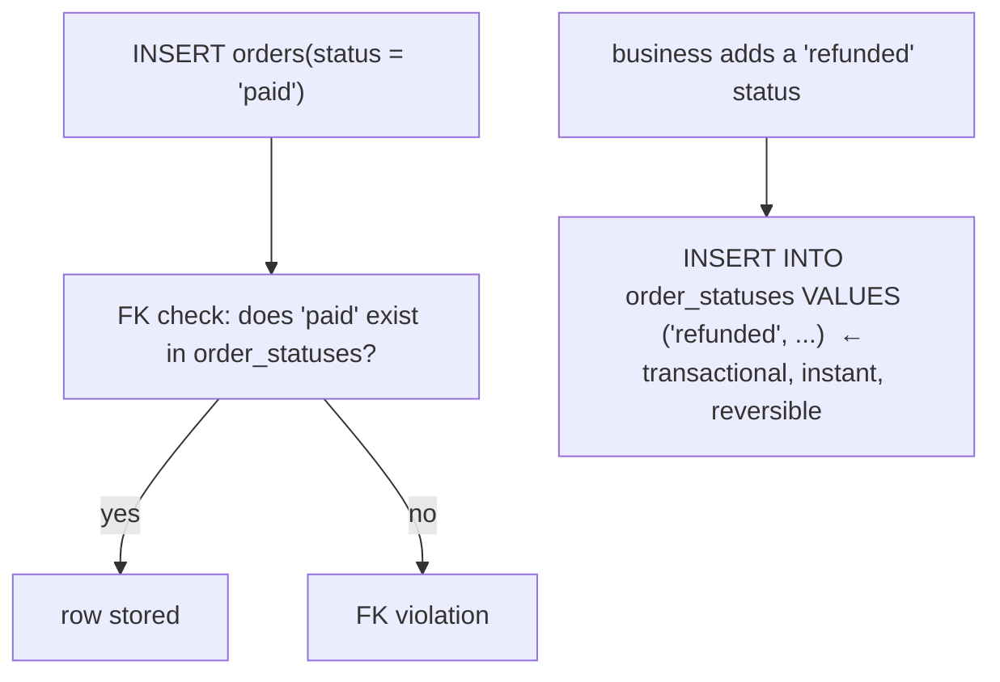

{/* status: authored */}

export const schema = `-- option C: a lookup table
CREATE TABLE order_statuses (
  code  text PRIMARY KEY,
  label text NOT NULL,
  is_terminal boolean NOT NULL DEFAULT false,
  sort  int NOT NULL
);
INSERT INTO order_statuses VALUES
  ('pending',  'Pending',   false, 1),
  ('paid',     'Paid',      false, 2),
  ('shipped',  'Shipped',   false, 3),
  ('delivered','Delivered', true,  4),
  ('cancelled','Cancelled', true,  5);

CREATE TABLE orders (
  id int PRIMARY KEY,
  status text NOT NULL REFERENCES order_statuses(code)
);
INSERT INTO orders VALUES (1,'paid'), (2,'pending'), (3,'delivered');`;

# Enums vs lookup tables

## First principles

You have a `status` column that should only hold a small fixed set of values.
Three ways to enforce that:

| | `CHECK (status IN (...))` | native `ENUM` type | **lookup table + FK** |
|---|---|---|---|
| Storage | `text` (a few bytes) | 4 bytes | `text` FK (a few bytes) |
| Enforced by | check constraint | the type | foreign key |
| Add a value | `ALTER TABLE ... DROP/ADD CONSTRAINT` (table scan, lock) | `ALTER TYPE ... ADD VALUE` (fast, but **can't run in a transaction** with other DDL pre-PG12; **can't be removed or reordered**) | `INSERT` a row (instant, transactional, reversible) |
| Attach metadata (label, sort order, `is_terminal`, permissions) | no | no | **yes — extra columns** |
| Join to it (`... JOIN statuses`) | no | no | yes |
| List valid values to the app / a dropdown | parse the constraint / hardcode | `enum_range()` | `SELECT * FROM statuses` |
| Ordering | declaration order | declaration order (fixed) | a `sort` column you control |

**Default to a lookup table + FK.** It's transactional to change, holds
metadata, is queryable, and the FK gives the same integrity guarantee. The cost
is one extra tiny table and a join when you want the label.

Use a native **`ENUM`** when: the set is *genuinely* fixed forever (weekdays,
`{buy, sell}`), you want the compact 4-byte storage and free ordering, and you
never need per-value metadata.

Use a bare **`CHECK` list** for a tiny throwaway set that won't change and
doesn't deserve a table (`kind IN ('a','b')` on an internal table).

## The mechanism

## Hand-trace on dummy data

Add a new status and use its metadata — no schema change:

<QueryTrace
  caption="a lookup table makes 'add a status' a data change, and gives you label + sort + is_terminal for free"
  steps={[
    {
      title: "1 · order_statuses (the lookup) + orders (FK to it)",
      op: "code",
      table: {
        name: "order_statuses",
        columns: ["code", "label", "is_terminal", "sort"],
        rows: [["pending","Pending",false,1],["paid","Paid",false,2],["delivered","Delivered",true,4]],
      },
    },
    {
      title: "2 · business adds 'refunded' → INSERT one row (no ALTER, no lock)",
      op: "code",
      table: {
        columns: ["code", "label", "is_terminal", "sort"],
        rows: [["refunded","Refunded",true,6]],
      },
      rows: { add: [0] },
    },
    {
      title: "3 · orders JOIN order_statuses — label & is_terminal come along",
      op: "status",
      table: {
        columns: ["order_id", "status", "label", "is_terminal"],
        rows: [[1,"paid","Paid",false],[2,"pending","Pending",false],[3,"delivered","Delivered",true]],
      },
    },
    {
      title: "4 · \"open orders, in workflow order\" — ORDER BY s.sort — result",
      table: {
        name: "result",
        result: true,
        columns: ["order_id", "label"],
        rows: [[2,"Pending"],[1,"Paid"]],
      },
    },
  ]}
/>

## Run it

<SqlRunner title="lookup table + FK: add a value, use its metadata" setup={schema}>
{`-- add 'refunded' — just an INSERT, fully transactional
INSERT INTO order_statuses VALUES ('refunded', 'Refunded', true, 6);

-- the FK rejects a typo
-- INSERT INTO orders VALUES (4, 'shpped');   -- ERROR: FK violation

-- join to get labels + filter on metadata (open orders, workflow order)
SELECT o.id, s.label
FROM orders o JOIN order_statuses s ON s.code = o.status
WHERE NOT s.is_terminal
ORDER BY s.sort;`}
</SqlRunner>

<SqlRunner title="native ENUM: compact, ordered, but rigid" setup={schema}>
{`CREATE TYPE mood AS ENUM ('sad', 'ok', 'happy');
CREATE TEMP TABLE checkins (id int, m mood);
INSERT INTO checkins VALUES (1,'happy'), (2,'sad'), (3,'ok');

SELECT * FROM checkins WHERE m >= 'ok' ORDER BY m;   -- enum order is free
SELECT enum_range(NULL::mood) AS all_values;         -- list for a dropdown
SELECT pg_column_size('happy'::mood) AS bytes;       -- 4

-- adding is one-way and (pre-PG12) can't share a txn with other DDL:
ALTER TYPE mood ADD VALUE 'ecstatic';                -- no removing it later`}
</SqlRunner>

<SqlRunner title="CHECK list: fine for a tiny fixed set" setup={schema}>
{`CREATE TEMP TABLE flags (id int, kind text CHECK (kind IN ('feature', 'bug', 'chore')));
INSERT INTO flags VALUES (1, 'bug'), (2, 'feature');
-- adding 'spike' means: ALTER TABLE flags DROP CONSTRAINT ...; ADD CONSTRAINT ... (scans the table)
SELECT * FROM flags;`}
</SqlRunner>

<RunThis file="sql/backend/12_enums_vs_lookup_tables/topic.sql" />

## Build → Break → Fix → Why

:::tip[🔨 Build]
`order_statuses(code PK, label, sort, is_terminal, ...)` + `orders.status text
REFERENCES order_statuses(code)`. New status = one `INSERT`. Dropdowns and
workflow order come from the table.
:::

:::danger[💥 Break]
Use a native `ENUM` for `order_status`. Six months later the business wants to
rename `shipped` → `dispatched`, add `returned`, and hide `cancelled` from the
UI. Renaming an enum value is possible but `ADD VALUE` can't run alongside your
other migration DDL, you can't *remove* the now-unused values, there's nowhere to
put `label`/`is_visible`, and every "list the statuses" is hardcoded in the app.
:::

:::note[🔧 Fix]
- Anything that might grow, needs metadata, or feeds a UI → lookup table + FK.
- Truly immutable, metadata-free, order-matters set → native `ENUM`.
- Tiny internal set that won't change → `CHECK` list.
:::

:::info[🧠 Why it behaved that way]
A native `ENUM` is a *type definition*, so changing it is DDL: it locks, it's
partly non-transactional, and it can't carry attributes because a type has no
columns. A lookup table is *data*: adding, renaming, or annotating a value is a
DML statement — transactional, reversible, and it can hold as many extra columns
as the value needs. The FK gives byte-for-byte the same "only valid values"
guarantee the enum's type check does.
:::

## Pitfalls & idioms

- Lookup table's PK is the `code` (`'paid'`), not a surrogate — you want
  `orders.status = 'paid'` readable and no join needed for the common filter.
- Index the FK column on the referencing table
  ([modeling relationships](/backend/modeling-relationships)).
- Add `is_active` / `deprecated_at` to the lookup instead of deleting a value
  that historical rows still reference.
- `ENUM` comparison uses declaration order — handy, but you can't insert a value
  "in the middle" without recreating the type.
- Don't over-engineer: a 2-value internal flag doesn't need a table.
- Seed the lookup table in a migration, not by hand, so every environment
  matches.

## See also

- [Constraints & keys](/foundations/constraints-and-keys) — FK vs CHECK
- [Generated columns, domains & custom types](/foundations/generated-columns-domains-and-types) — `CREATE TYPE ... AS ENUM`
- [Modeling relationships](/backend/modeling-relationships) — the FK to the lookup
- [Safe schema migrations](/backend/safe-schema-migrations) — why `ALTER TYPE` / `ALTER TABLE` locks matter

## Check yourself

1. What's the default choice for a constrained value column, and why?
2. Name two things a lookup table gives you that a native `ENUM` can't.
3. Why is adding a value to a native `ENUM` operationally awkward?
4. When is a native `ENUM` actually the right call?
5. Should the lookup table use a surrogate `id` or the `code` as its PK? Why?
