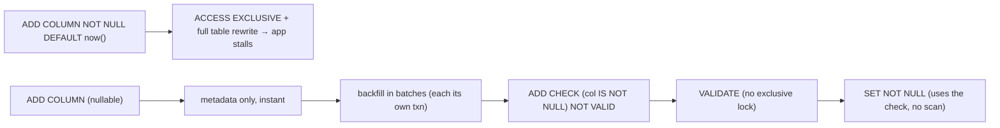

{/* status: authored */}

export const schema = `CREATE TABLE orders (
  id     bigint GENERATED ALWAYS AS IDENTITY PRIMARY KEY,
  total  numeric NOT NULL,
  status text NOT NULL DEFAULT 'pending'
);
INSERT INTO orders (total) SELECT (g % 500) + 1 FROM generate_series(1, 5000) g;`;

# Safe schema migrations: locks, backfills, `NOT VALID`

## First principles

Every `ALTER TABLE` takes a **lock**. On a busy table the wrong one stalls the
whole app for as long as the operation runs (or as long as it waits behind a
long-running query). The question for every migration: **what does this lock, and
for how long?**

| Operation | Lock | Blocks | Duration |
|---|---|---|---|
| `ADD COLUMN` (no default, or a **constant** default in PG11+) | `ACCESS EXCLUSIVE` | everything | **instant** — metadata only |
| `ADD COLUMN ... DEFAULT <volatile>` (e.g. `now()`, `gen_random_uuid()`) | `ACCESS EXCLUSIVE` | everything | **rewrites the whole table** |
| `ADD COLUMN ... NOT NULL` (no default) | `ACCESS EXCLUSIVE` | everything | scans to verify — long on a big table |
| `DROP COLUMN` | `ACCESS EXCLUSIVE` | everything | instant (data cleaned by vacuum later) |
| `ALTER COLUMN TYPE` | `ACCESS EXCLUSIVE` | everything | usually **rewrites** (some casts are free) |
| `CREATE INDEX` | `SHARE` | **writes** (reads ok) | full build |
| **`CREATE INDEX CONCURRENTLY`** | `SHARE UPDATE EXCLUSIVE` | nothing | ~2× slower, but online |
| `ADD CONSTRAINT ... CHECK / FK` | `ACCESS EXCLUSIVE` | everything | scans to validate |
| **`ADD CONSTRAINT ... NOT VALID`** then `VALIDATE CONSTRAINT` | brief `ACCESS EXCLUSIVE`, then `SHARE UPDATE EXCLUSIVE` | writes briefly, then nothing | split |

**The safe playbook:**

1. **Add column**: no volatile default. Backfill in **batches** (`UPDATE ...
   WHERE id BETWEEN ...`), each its own transaction, so you never hold a lock or
   a long transaction.
2. **Add index**: `CREATE INDEX CONCURRENTLY` (can't run inside a transaction
   block; if it fails it leaves an invalid index — drop and retry).
3. **Add constraint / FK**: `... NOT VALID` (fast, enforces for *new* rows), then
   `VALIDATE CONSTRAINT` separately (scans without an exclusive lock).
4. **Add `NOT NULL`**: add a `CHECK (col IS NOT NULL) NOT VALID`, validate it,
   then `SET NOT NULL` (PG12+ uses the validated check, skipping the scan).
5. **Rename / retype a column**: don't. Use **expand → migrate → contract** (see
   below).
6. **Set a short `lock_timeout`** so a blocked migration fails fast instead of
   queuing every request behind it.

**Expand / migrate / contract** — to change a column without downtime:

1. **Expand**: add the new column/table; write to **both** old and new from the
   app; backfill history in batches.
2. **Migrate**: switch reads to the new column once backfill is done and verified.
3. **Contract**: stop writing the old column; drop it in a later release.

## The mechanism

## Hand-trace on dummy data

Add a `NOT NULL` `currency` column to a live `orders` table, online:

<QueryTrace
  caption="nullable add → batched backfill → NOT VALID check → validate → SET NOT NULL"
  steps={[
    {
      title: "1 · ADD COLUMN currency text (nullable) — instant, metadata only",
      op: "currency",
      table: {
        columns: ["step", "lock", "duration"],
        rows: [["ALTER TABLE orders ADD COLUMN currency text", "ACCESS EXCLUSIVE (instant)", "~0 ms"]],
      },
    },
    {
      title: "2 · backfill in batches — each UPDATE its own transaction",
      op: "currency",
      table: {
        columns: ["batch", "statement", "rows"],
        rows: [
          ["1","UPDATE orders SET currency='EUR' WHERE currency IS NULL AND id BETWEEN 1 AND 1000","1000"],
          ["2","… id BETWEEN 1001 AND 2000","1000"],
          ["…","…","…"],
        ],
      },
      rows: { add: [0, 1] },
    },
    {
      title: "3 · ADD CONSTRAINT currency_nn CHECK (currency IS NOT NULL) NOT VALID → then VALIDATE",
      op: "currency",
      table: {
        columns: ["step", "lock", "note"],
        rows: [
          ["ADD ... NOT VALID", "brief ACCESS EXCLUSIVE", "enforced for new rows now"],
          ["VALIDATE CONSTRAINT", "SHARE UPDATE EXCLUSIVE", "scans; reads & writes continue"],
        ],
      },
    },
    {
      title: "4 · ALTER COLUMN currency SET NOT NULL — uses the validated check, no scan — result",
      op: "currency",
      table: {
        name: "result",
        result: true,
        columns: ["outcome", "app impact"],
        rows: [["currency is NOT NULL, backfilled", "no stall at any point"]],
      },
    },
  ]}
/>

## Run it

<SqlRunner title="the online NOT NULL add" setup={schema}>
{`SET lock_timeout = '2s';                          -- fail fast rather than queue

ALTER TABLE orders ADD COLUMN currency text;      -- instant

-- backfill (one batch shown; a real migration loops id ranges)
UPDATE orders SET currency = 'EUR' WHERE currency IS NULL AND id BETWEEN 1 AND 2500;
UPDATE orders SET currency = 'EUR' WHERE currency IS NULL AND id BETWEEN 2501 AND 5000;

ALTER TABLE orders ADD CONSTRAINT currency_nn CHECK (currency IS NOT NULL) NOT VALID;
ALTER TABLE orders VALIDATE CONSTRAINT currency_nn;
ALTER TABLE orders ALTER COLUMN currency SET NOT NULL;

SELECT count(*) FILTER (WHERE currency IS NULL) AS nulls, count(*) AS total FROM orders;`}
</SqlRunner>

<SqlRunner title="the dangerous version — full rewrite" setup={schema}>
{`-- a volatile DEFAULT rewrites every row under ACCESS EXCLUSIVE:
EXPLAIN ANALYZE
UPDATE orders SET total = total;   -- stand-in for the rewrite cost; imagine 5000 → 50,000,000 rows

-- ALTER TABLE orders ADD COLUMN created_at timestamptz NOT NULL DEFAULT now();
--   on a large table: app is down for the duration`}
</SqlRunner>

<SqlRunner title="NOT VALID FK: enforce forward, validate later" setup={schema}>
{`CREATE TABLE customers (id int PRIMARY KEY);
INSERT INTO customers SELECT DISTINCT (total::int % 50) + 1 FROM orders;
ALTER TABLE orders ADD COLUMN customer_id int;
UPDATE orders SET customer_id = (total::int % 50) + 1;

-- fast: new/updated rows are checked immediately, existing rows are not yet
ALTER TABLE orders ADD CONSTRAINT orders_customer_fk
  FOREIGN KEY (customer_id) REFERENCES customers(id) NOT VALID;
-- separate, non-exclusive scan:
ALTER TABLE orders VALIDATE CONSTRAINT orders_customer_fk;

SELECT convalidated FROM pg_constraint WHERE conname = 'orders_customer_fk';`}
</SqlRunner>

<RunThis file="sql/backend/13_safe_schema_migrations/topic.sql" />

## Build → Break → Fix → Why

:::tip[🔨 Build]
Add `NOT NULL` column: nullable `ADD COLUMN` → batched backfill → `CHECK (... IS
NOT NULL) NOT VALID` → `VALIDATE` → `SET NOT NULL`. `CREATE INDEX CONCURRENTLY`.
`ADD CONSTRAINT ... NOT VALID` then `VALIDATE`. `SET lock_timeout` on the
session.
:::

:::danger[💥 Break]
`ALTER TABLE orders ADD COLUMN created_at timestamptz NOT NULL DEFAULT now()` on a
50M-row table during business hours. It takes an `ACCESS EXCLUSIVE` lock and
rewrites every row; the app is fully down for minutes, and worse — the `ALTER`
first *waits* behind any in-flight long query while **already holding a lock that
new queries queue behind**. A 30-second report turns into a site outage.
:::

:::danger[💥 Break (the index one)]
`CREATE INDEX` (not `CONCURRENTLY`) on a hot table — writes are blocked for the
whole build.
:::

:::note[🔧 Fix]
- No volatile column defaults on big tables — add nullable, backfill in batches.
- `CREATE INDEX CONCURRENTLY`.
- `NOT VALID` + `VALIDATE` to split constraint locks.
- `SET lock_timeout` (and `statement_timeout`) so a stuck migration aborts
  instead of taking the site with it.
- Change columns via expand → migrate → contract across releases.
:::

:::info[🧠 Why it behaved that way]
`ACCESS EXCLUSIVE` conflicts with *every* other lock, including the `ACCESS
SHARE` a plain `SELECT` takes — so while the migration holds it, nothing runs.
The rewrite happens because a volatile default means "each row gets a different
value", so Postgres must physically write every row; a constant default is stored
once in the catalog and materialised lazily. `NOT VALID` works because "enforce
for new writes" only needs a catalog flag, while "prove existing rows comply" is
a scan that can safely run under a weaker lock afterwards.
:::

## Pitfalls & idioms

- **Know the lock** before you run an `ALTER`. `pg_locks` + a staging replay of
  the migration.
- `SET lock_timeout` in every migration session — a blocked `ALTER` blocks
  everyone behind it.
- `CREATE INDEX CONCURRENTLY` can't be in a transaction; a failed run leaves an
  `INVALID` index — `DROP INDEX CONCURRENTLY` and retry.
- Backfill in bounded batches, `COMMIT` between them, throttle if replication lag
  grows.
- Adding a column with a **constant** default is free in modern Postgres; a
  volatile one is not.
- Dropping a column is instant; the space comes back on `VACUUM`.
- Migration tools (Flyway, Alembic, Rails) don't make locks safe for you —
  they run whatever SQL you write.
- Test the migration against a copy with production-scale data and concurrent
  load.

## See also

- [Isolation levels & MVCC](/foundations/isolation-levels-and-mvcc) — locks, long transactions
- [Constraints & keys](/foundations/constraints-and-keys) — `NOT VALID` / `VALIDATE`
- [Index types](/foundations/index-types) — `CREATE INDEX CONCURRENTLY`
- [Bulk loading & COPY](/foundations/bulk-loading-and-copy) — batched writes

## Check yourself

1. Why is `ADD COLUMN x int` instant but `ADD COLUMN x int NOT NULL DEFAULT
   now()` a table rewrite?
2. What lock does `CREATE INDEX` take, and what does `CONCURRENTLY` change?
3. Describe the online way to add a `NOT NULL` column to a huge table.
4. What does `ADD CONSTRAINT ... NOT VALID` enforce, and what does it skip?
5. Why set `lock_timeout` on a migration session?
