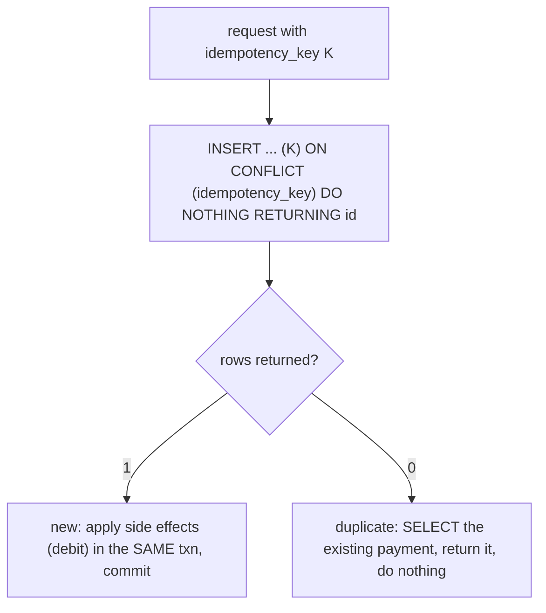

{/* status: authored */}

export const schema = `CREATE TABLE payments (
  id          bigint GENERATED ALWAYS AS IDENTITY PRIMARY KEY,
  account_id  int NOT NULL,
  amount      numeric NOT NULL,
  idempotency_key text NOT NULL UNIQUE,   -- the client-supplied key
  created_at  timestamptz NOT NULL DEFAULT now()
);
CREATE TABLE accounts (id int PRIMARY KEY, balance numeric NOT NULL);
INSERT INTO accounts VALUES (1, 100);`;

# Idempotency keys & exactly-once writes

## First principles

Networks retry. A client sends "charge €30", the response is lost, the client
retries — now you might charge €30 **twice**. Message queues are "at least once":
the same event is redelivered on any hiccup. Webhooks resend. Users double-click.

**Idempotency**: doing the operation twice has the same effect as doing it once.
The mechanism:

1. The **caller** generates a unique **idempotency key** per logical operation
   (a UUID) and sends it with every retry of *that* operation.
2. The **server** stores results keyed by that value. On a repeat, it detects the
   key and returns the *original* result instead of doing the work again.

In SQL this is a **`UNIQUE` constraint on the key** + an **atomic upsert**:

```sql
INSERT INTO payments (account_id, amount, idempotency_key)
VALUES ($1, $2, $3)
ON CONFLICT (idempotency_key) DO NOTHING
RETURNING id;
```

- First call: 1 row inserted, `RETURNING` gives the id → do the side effects
  (debit the account) **in the same transaction**.
- Retry: `ON CONFLICT DO NOTHING` inserts 0 rows, `RETURNING` is empty → the
  payment already exists; fetch and return it, do **nothing** else.

The `UNIQUE` constraint is what makes it safe under **concurrency** — two retries
racing both try to insert; one wins, the other gets the conflict.

## The mechanism



## Hand-trace on dummy data

Same "charge €30, key `abc`" arrives twice:

<QueryTrace
  caption="the UNIQUE key + ON CONFLICT makes the second attempt a no-op"
  steps={[
    {
      title: "1 · payments empty; account 1 balance 100",
      table: { name: "accounts", columns: ["id", "balance"], rows: [[1,100]] },
    },
    {
      title: "2 · attempt 1: INSERT payments (1, 30, 'abc') ON CONFLICT DO NOTHING",
      op: "idempotency_key",
      table: {
        columns: ["rows inserted", "RETURNING id", "action"],
        rows: [["1","7","new → debit account 1 by 30 (same txn)"]],
      },
      rows: { add: [0] },
    },
    {
      title: "3 · attempt 2 (retry, same key 'abc'): INSERT ... ON CONFLICT DO NOTHING",
      op: "idempotency_key",
      table: {
        columns: ["rows inserted", "RETURNING id", "action"],
        rows: [["0","(empty)","duplicate → return payment 7, do NOT debit again"]],
      },
      rows: { drop: [0] },
    },
    {
      title: "4 · result: one payment row, one debit — regardless of retry count",
      op: "balance",
      table: {
        name: "result",
        result: true,
        columns: ["payments rows", "account 1 balance"],
        rows: [["1 (key 'abc')", "70"]],
      },
    },
  ]}
/>

## Run it

<SqlRunner title="idempotent charge: first call does the work" setup={schema}>
{`WITH ins AS (
  INSERT INTO payments (account_id, amount, idempotency_key)
  VALUES (1, 30, 'abc')
  ON CONFLICT (idempotency_key) DO NOTHING
  RETURNING id
)
UPDATE accounts SET balance = balance - 30
WHERE id = 1 AND EXISTS (SELECT 1 FROM ins)      -- debit ONLY if the insert was new
RETURNING balance;

SELECT * FROM payments;
SELECT balance FROM accounts WHERE id = 1;        -- 70`}
</SqlRunner>

<SqlRunner title="the retry: same key, no double charge" setup={schema}>
{`-- do the charge once
WITH ins AS (
  INSERT INTO payments (account_id, amount, idempotency_key) VALUES (1, 30, 'abc')
  ON CONFLICT (idempotency_key) DO NOTHING RETURNING id
)
UPDATE accounts SET balance = balance - 30 WHERE id = 1 AND EXISTS (SELECT 1 FROM ins);

-- retry with the SAME key
WITH ins AS (
  INSERT INTO payments (account_id, amount, idempotency_key) VALUES (1, 30, 'abc')
  ON CONFLICT (idempotency_key) DO NOTHING RETURNING id
)
UPDATE accounts SET balance = balance - 30 WHERE id = 1 AND EXISTS (SELECT 1 FROM ins)
RETURNING balance;                                -- 0 rows updated

SELECT count(*) AS payment_rows FROM payments;    -- 1
SELECT balance FROM accounts WHERE id = 1;        -- still 70, charged once`}
</SqlRunner>

<SqlRunner title="dedup an at-least-once event stream" setup={schema}>
{`CREATE TABLE processed_events (event_id text PRIMARY KEY, at timestamptz NOT NULL DEFAULT now());
CREATE TABLE order_totals (order_id int PRIMARY KEY, total numeric NOT NULL DEFAULT 0);

-- process event e1 (add 10 to order 5) — twice
DO $$
DECLARE i int; new_event bool;
BEGIN
  FOR i IN 1..2 LOOP
    INSERT INTO processed_events (event_id) VALUES ('e1')
    ON CONFLICT DO NOTHING;
    GET DIAGNOSTICS new_event = ROW_COUNT;
    IF new_event THEN
      INSERT INTO order_totals (order_id, total) VALUES (5, 10)
      ON CONFLICT (order_id) DO UPDATE SET total = order_totals.total + 10;
    END IF;
  END LOOP;
END $$;

SELECT * FROM order_totals;         -- total 10, not 20`}
</SqlRunner>

<RunThis file="sql/backend/14_idempotency_keys/topic.sql" />

## Build → Break → Fix → Why

:::tip[🔨 Build]
`idempotency_key text UNIQUE`. Endpoint: `INSERT ... ON CONFLICT (idempotency_key)
DO NOTHING RETURNING id`; if a row came back, do the side effects **in the same
transaction**; if not, load and return the existing result. Store the response
body too, so a retry gets an identical response.
:::

:::danger[💥 Break]
"Check then act": `SELECT 1 FROM payments WHERE idempotency_key = $k` — none —
then `INSERT` + debit. Two retries race: both `SELECT` nothing, both `INSERT`
(one fails the unique constraint *after* it already debited, or you didn't have
the constraint and now there are two payments). The `SELECT`-then-`INSERT` gap is
the [lost-update shape](/backend/write-skew-and-lost-update) again.
:::

:::note[🔧 Fix]
- `UNIQUE` on the key + a single atomic `INSERT ... ON CONFLICT`.
- Side effects in the **same transaction** as the key insert, so "recorded" and
  "applied" commit together.
- Persist the *result* keyed by the idempotency key; a retry returns it verbatim.
- Give keys a TTL / cleanup job.
:::

:::info[🧠 Why it behaved that way]
The `UNIQUE` index is a serialization point: concurrent inserts of the same key
are ordered by the database, and all but the first get a conflict — no
application check-then-act window. Putting the key row and the side effect in one
transaction means they're [atomic](/foundations/transactions-and-acid): you can
never end up with "payment recorded but account not debited" or vice versa. The
key is *client-generated* because only the client knows that retry #3 is the same
logical operation as attempt #1.
:::

## Pitfalls & idioms

- The idempotency key is **per logical operation**, generated by the **caller**,
  reused across retries of that operation only.
- `ON CONFLICT DO NOTHING` + `RETURNING` — empty result means "was a duplicate".
- Side effects and the key row in **one transaction**. Commit together or roll
  back together.
- Store the response so retries are byte-identical (not just "already done").
- Scope the key: usually `(account_id, idempotency_key)` or per-endpoint, so an
  unrelated request can't collide.
- Clean up old keys (a partial index or a `created_at` + retention job).
- For queues, the same idea with the **message/event id** as the unique key in a
  `processed_events` table.
- `ON CONFLICT DO UPDATE` is for "upsert the value"; idempotency wants `DO
  NOTHING` + detect.

## See also

- [Upsert & MERGE](/foundations/upsert-and-merge) — `ON CONFLICT` mechanics
- [Write skew & lost update in practice](/backend/write-skew-and-lost-update) — the check-then-act race
- [Transactions & ACID](/foundations/transactions-and-acid) — atomic side effects
- [Constraints & keys](/foundations/constraints-and-keys) — the `UNIQUE` that does the work

## Check yourself

1. Why does "at least once" delivery force you to make writes idempotent?
2. What makes the `UNIQUE` key + `ON CONFLICT` safe under concurrent retries when
   `SELECT`-then-`INSERT` isn't?
3. Why must the side effect be in the same transaction as the key row?
4. Who generates the idempotency key, and how often does it change?
5. Sketch dedup for an at-least-once event consumer.
