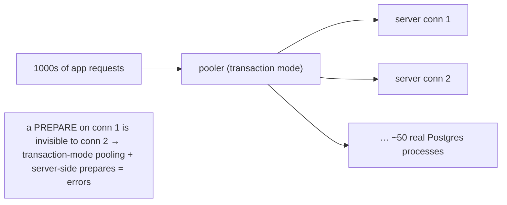

{/* status: authored */}

export const schema = `CREATE TABLE users (id int PRIMARY KEY, email text NOT NULL, region text NOT NULL);
INSERT INTO users SELECT g, 'u'||g||'@x.com', (ARRAY['EU','US','APAC'])[1+(g%3)]
FROM generate_series(1, 5000) g;
CREATE INDEX ON users (region);`;

# Connection pooling & prepared statements

## First principles

### A Postgres connection is a process

Every connection is a **separate OS process** on the server (`postgres` forks
one). Each costs memory (`work_mem`, catalog caches, ~5–10 MB) and a real
fork/auth/TLS handshake on connect. Postgres tops out at a few hundred to ~1–2k
connections before context-switching and memory dominate — far fewer than the
number of concurrent HTTP requests a fleet of app servers generates.

So: **the app should not open a connection per request.** It keeps a small
**pool** of long-lived connections and hands them out.

### Two layers of pooling

- **In-app pool** (HikariCP, `pg-pool`, SQLAlchemy pool): a fixed set of
  connections per process. Sized ~`(2 × cores) + effective_spindle_count` as a
  starting point — *small*. 100 app processes × 5 = 500 connections; that's your
  budget, not "5 per process is fine, scale freely".
- **External pooler** (PgBouncer, pgcat, Supavisor, RDS Proxy): sits between the
  app and Postgres, multiplexing **thousands** of client connections onto
  **dozens** of real ones. Essential once you have many app instances or
  serverless functions.

### Pooling modes (PgBouncer terms)

| Mode | A server connection is returned to the pool… | You lose |
|---|---|---|
| **session** | when the client disconnects | nothing; but low multiplexing |
| **transaction** | at the end of each transaction | session state: `SET`, `LISTEN`, server-side prepared statements, `WITH HOLD` cursors, advisory session locks |
| statement | after each statement | + multi-statement transactions (rarely used) |

**Transaction mode** is the common choice for web apps — but it means **no
session state survives between transactions**, which is where prepared statements
bite.

### Prepared statements

`PREPARE` parses + plans a query once; `EXECUTE` runs it with parameters, skipping
re-parse. Two flavours:

- **Server-side prepared statements** — live on the *connection*. Great with a
  session-mode pool or a direct connection. With **transaction-mode pooling they
  break**: the next transaction may land on a different server connection that
  never saw the `PREPARE`. Fixes: turn off server-side prepares in the driver, or
  use a pooler/protocol that's prepared-statement-aware (PgBouncer 1.21+,
  pgcat, `pg` with `statement_cache` off).
- **Parameterised queries** (`$1`, `$2`) — always do this regardless: it's the
  defence against SQL injection and lets the DB cache a plan even without
  `PREPARE`.

## The mechanism

## Hand-trace: why per-request connections don't scale

<QueryTrace
  caption="300 app instances × 200 req/s, one connection each per request vs a pool"
  steps={[
    {
      title: "1 · the load",
      table: {
        columns: ["metric", "value"],
        rows: [["app instances","300"],["requests/sec each","200"],["p50 query time","3 ms"]],
      },
    },
    {
      title: "2a · connection per request: ~concurrent requests = connections",
      op: "value",
      table: {
        columns: ["approach", "peak server connections", "outcome"],
        rows: [["open on each request","~18,000","✗ Postgres refuses past max_connections; forks thrash"]],
      },
      rows: { drop: [0] },
    },
    {
      title: "3 · in-app pool of 10 per instance",
      op: "value",
      table: {
        columns: ["approach", "peak server connections", "outcome"],
        rows: [["10 per instance","3,000","✗ still too many; each is a 10 MB process"]],
      },
      rows: { drop: [0] },
    },
    {
      title: "4 · + external pooler in transaction mode — result",
      table: {
        name: "result",
        result: true,
        columns: ["approach", "real Postgres connections", "outcome"],
        rows: [["pooler multiplexes","~60","✓ each held for ~3 ms then reused; server comfortable"]],
      },
    },
  ]}
/>

## Run it

<SqlRunner title="parameterised query + PREPARE / EXECUTE" setup={schema}>
{`PREPARE users_by_region (text) AS
  SELECT id, email FROM users WHERE region = $1 ORDER BY id LIMIT 3;

EXECUTE users_by_region('EU');
EXECUTE users_by_region('US');

SELECT name, statement FROM pg_prepared_statements;`}
</SqlRunner>

<SqlRunner title="see the plan a prepared statement uses" setup={schema}>
{`PREPARE q (text) AS SELECT count(*) FROM users WHERE region = $1;
EXPLAIN EXECUTE q('EU');
-- after 5+ executions Postgres may switch to a generic plan; force it:
SET plan_cache_mode = 'force_generic_plan';
EXPLAIN EXECUTE q('EU');`}
</SqlRunner>

<SqlRunner title="session-state that transaction pooling would drop" setup={schema}>
{`-- all of this lives on the connection; a transaction-mode pool can hand the
-- next query to a DIFFERENT connection that never saw it:
SET statement_timeout = '5s';
SET search_path = sqlfp, public;
SELECT current_setting('statement_timeout'), current_setting('search_path');
-- PREPARE ...   -- also connection-local
-- LISTEN channel;   -- also connection-local`}
</SqlRunner>

<SqlRunner title="what the pool budget looks like" setup={schema}>
{`SELECT
  300  AS app_instances,
  5    AS pool_per_instance,
  300 * 5 AS app_layer_connections,
  60   AS after_transaction_pooler,
  (SELECT setting::int FROM pg_settings WHERE name = 'max_connections') AS server_max;`}
</SqlRunner>

<RunThis file="sql/backend/15_connection_pooling_and_prepared_statements/topic.sql" />

## Build → Break → Fix → Why

:::tip[🔨 Build]
Small in-app pool (single digits per process) → external pooler in **transaction
mode** → Postgres with a `max_connections` you actually stay under. Driver
configured for the pooler (server-side prepared statements off, or a
prepared-statement-aware pooler). Always parameterise (`$1`), never string-
concatenate SQL.
:::

:::danger[💥 Break]
App opens a connection per request "for isolation", pool size set to 100 "to be
safe", 40 app instances. That's 4,000 connections; Postgres `max_connections` is
200, so requests fail with `FATAL: sorry, too many clients already` under load —
and even at 200, that's 2 GB of backend processes doing nothing but waiting.
:::

:::danger[💥 Break (the prepared-statement one)]
App uses server-side prepared statements (many drivers do by default) *through* a
transaction-mode PgBouncer. Intermittently: `ERROR: prepared statement "S_3"
does not exist` — because the `EXECUTE` landed on a connection that never ran the
`PREPARE`.
:::

:::note[🔧 Fix]
- Connection budget: `instances × pool_size ≤` (pooler capacity), and
  `real_backends ≤ max_connections` with headroom.
- Transaction-mode pooling + either: disable driver-level server-side prepares,
  or use a pooler that tracks them (PgBouncer ≥ 1.21, pgcat).
- Keep transactions short so a pooled connection is freed fast.
- Don't rely on `SET`/`LISTEN`/session temp tables when behind a transaction
  pooler.
:::

:::info[🧠 Why it behaved that way]
A Postgres backend is a process with private memory and a private session — it
doesn't share a thread pool. So "concurrent work" is bounded by "number of
processes the machine can afford", which is small relative to web concurrency.
Pooling decouples the two: many cheap client slots, few expensive server
processes, each reused the instant a transaction ends. Server-side prepared
statements are *session* objects, and transaction-mode pooling deliberately
doesn't preserve the session across transactions — so a `PREPARE` on one physical
connection simply isn't there when a later `EXECUTE` gets a different one.
:::

## Pitfalls & idioms

- **Small** in-app pools. More connections ≠ more throughput past the CPU count;
  they just queue in the kernel instead of the pool.
- One external pooler (PgBouncer et al.) in **transaction mode** for web
  workloads; **session mode** only if you truly need session state.
- Parameterise every query (`$1`) — injection safety *and* plan reuse.
- `PREPARE`/`EXECUTE` helps when a query runs thousands of times per connection;
  measure before assuming.
- `plan_cache_mode` (`auto` / `force_generic_plan` / `force_custom_plan`) when a
  parameterised query's cached generic plan is bad for skewed data.
- Serverless / lambda: you *must* have an external pooler; each cold start is a
  new client.
- `idle_in_transaction_session_timeout` to kill connections a bug left holding a
  transaction (and locks).
- Monitor `pg_stat_activity` — lots of `idle in transaction` is an app bug.

## See also

- [Transactions & ACID](/foundations/transactions-and-acid) — keep them short for the pool's sake
- [Reading EXPLAIN plans & query optimization](/backend/reading-explain-plans-and-query-optimization) — generic vs custom plans
- [Isolation levels & MVCC](/foundations/isolation-levels-and-mvcc) — idle-in-transaction and bloat
- [Safe schema migrations](/backend/safe-schema-migrations) — long transactions block DDL

## Check yourself

1. Why can't a Postgres server handle "one connection per concurrent HTTP
   request"?
2. What does an external pooler in **transaction mode** give up compared to
   **session mode**?
3. Why do server-side prepared statements break behind a transaction-mode
   pooler?
4. Your in-app pool is 50 and you run 30 app instances against a Postgres with
   `max_connections = 200`. What happens, and what's the fix?
5. Should you parameterise queries even without `PREPARE`? Why?
