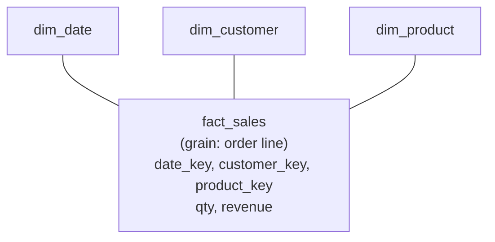
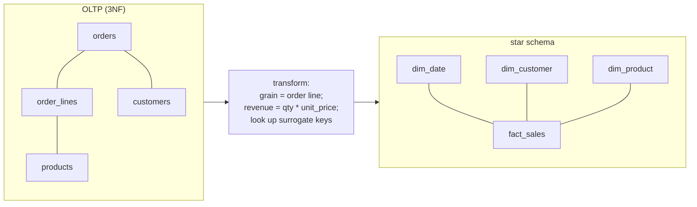

{/* status: authored */}

export const schema = `-- a small normalized OLTP schema (3NF)
CREATE TABLE customers  (customer_id int PRIMARY KEY, name text, city text, country text);
CREATE TABLE products   (product_id int PRIMARY KEY, name text, category text, unit_price numeric);
CREATE TABLE orders     (order_id int PRIMARY KEY, customer_id int, ordered_at date);
CREATE TABLE order_lines(order_id int, product_id int, qty int, PRIMARY KEY (order_id, product_id));

INSERT INTO customers VALUES
  (1,'Ana','Berlin','DE'), (2,'Ben','Berlin','DE'), (3,'Chidi','Lagos','NG');
INSERT INTO products VALUES
  (10,'Notebook','stationery',6), (11,'Desk lamp','home',28), (12,'Mug','home',9);
INSERT INTO orders VALUES
  (100,1,DATE '2024-01-05'), (101,2,DATE '2024-01-05'), (102,1,DATE '2024-02-11'), (103,3,DATE '2024-02-11');
INSERT INTO order_lines VALUES
  (100,10,2),(100,12,1),
  (101,11,1),
  (102,12,3),
  (103,10,1),(103,11,1);`;

# Dimensional modeling: the star schema

## First principles

An **OLTP** schema is normalized (3NF): no redundancy, every fact in one place,
optimized for *writing one row correctly*. Analytics has the opposite needs —
read huge ranges, slice by many attributes, join as little as possible — so the
warehouse uses a different shape: the **star schema**.

- A **fact table** — one row per *measurement event* at a chosen **grain**
  (e.g. "one row per product per order line"). Holds **measures** (numbers you
  aggregate: `qty`, `revenue`) and **foreign keys to dimensions**. Tall and
  narrow; billions of rows.
- **Dimension tables** — the "by what" attributes: `dim_customer` (name, city,
  country, segment…), `dim_product` (name, category, brand…), `dim_date` (day,
  month, quarter, weekday, holiday flag…). Wide and short; denormalized on
  purpose so a query is `fact JOIN dim` and never `dim JOIN dim JOIN dim`.

Key ideas:

- **Grain first.** Decide exactly what one fact row means before anything else.
  Every measure must be true at that grain.
- **Surrogate keys.** Dimensions get a meaningless integer PK (`customer_key`),
  *not* the OLTP `customer_id`. This decouples the warehouse from source systems
  and is what makes [SCD Type 2](/data-engineering/slowly-changing-dimensions-type-2)
  possible (same `customer_id`, many `customer_key` versions over time).
- **Measure additivity.** *Additive* (`revenue` — sums across every dimension),
  *semi-additive* (`account_balance` — sums across customers but not across time),
  *non-additive* (`unit_price`, ratios — never `SUM` them; recompute from
  additive parts).
- **Star vs snowflake.** Star = flat dimensions (one join). Snowflake = dimensions
  normalized into sub-tables (`dim_product → dim_category`). Snowflake saves
  space, costs joins; most teams stay with star.

## The mechanism: OLTP → star

## Hand-trace on dummy data

Build `fact_sales` at **order-line grain** from the four OLTP tables:

<QueryTrace
  caption="join OLTP → one fact row per order line, with revenue and dimension keys"
  steps={[
    {
      title: "1 · OLTP order_lines (the grain we want: one row each)",
      table: {
        name: "order_lines",
        columns: ["order_id", "product_id", "qty"],
        rows: [[100,10,2],[100,12,1],[101,11,1],[102,12,3],[103,10,1],[103,11,1]],
      },
    },
    {
      title: "2 · join orders (→ customer, date) and products (→ category, unit_price)",
      op: "product_id",
      table: {
        columns: ["order_id", "product_id", "qty", "ordered_at", "customer_id", "unit_price"],
        rows: [
          [100,10,2,"2024-01-05",1,6],
          [100,12,1,"2024-01-05",1,9],
          [101,11,1,"2024-01-05",2,28],
          [102,12,3,"2024-02-11",1,9],
          [103,10,1,"2024-02-11",3,6],
          [103,11,1,"2024-02-11",3,28],
        ],
      },
    },
    {
      title: "3 · compute measure revenue = qty * unit_price; swap ids for surrogate keys",
      op: "revenue",
      table: {
        columns: ["date_key", "customer_key", "product_key", "qty", "revenue"],
        rows: [
          [20240105,501,701,2,12],
          [20240105,501,703,1,9],
          [20240105,502,702,1,28],
          [20240211,501,703,3,27],
          [20240211,503,701,1,6],
          [20240211,503,702,1,28],
        ],
      },
    },
    {
      title: "4 · fact_sales — now 'revenue by city and month' is ONE join per dimension",
      table: {
        name: "fact_sales (result)",
        result: true,
        columns: ["date_key", "customer_key", "product_key", "qty", "revenue"],
        rows: [
          [20240105,501,701,2,12],[20240105,501,703,1,9],[20240105,502,702,1,28],
          [20240211,501,703,3,27],[20240211,503,701,1,6],[20240211,503,702,1,28],
        ],
      },
    },
  ]}
/>

## Run it

<SqlRunner title="build the dimensions (denormalized, surrogate keys)" setup={schema}>
{`CREATE TABLE dim_customer (
  customer_key int PRIMARY KEY,
  customer_id  int NOT NULL,        -- natural key from the source
  name text, city text, country text
);
INSERT INTO dim_customer
SELECT 500 + customer_id, customer_id, name, city, country FROM customers;

CREATE TABLE dim_product (
  product_key int PRIMARY KEY,
  product_id  int NOT NULL,
  name text, category text
);
INSERT INTO dim_product
SELECT 700 + product_id, product_id, name, category FROM products;

CREATE TABLE dim_date (
  date_key int PRIMARY KEY,   -- yyyymmdd
  d date NOT NULL, year int, month int, month_name text, weekday text
);
INSERT INTO dim_date
SELECT to_char(d,'YYYYMMDD')::int, d,
       extract(year from d)::int, extract(month from d)::int,
       to_char(d,'Mon'), to_char(d,'Dy')
FROM generate_series(DATE '2024-01-01', DATE '2024-03-31', INTERVAL '1 day') g(d);

SELECT * FROM dim_customer ORDER BY customer_key;`}
</SqlRunner>

<SqlRunner title="build the fact table at order-line grain" setup={schema}>
{`CREATE TABLE dim_customer AS SELECT 500 + customer_id AS customer_key, customer_id, city, country FROM customers;
CREATE TABLE dim_product  AS SELECT 700 + product_id  AS product_key,  product_id,  category    FROM products;

CREATE TABLE fact_sales AS
SELECT to_char(o.ordered_at,'YYYYMMDD')::int AS date_key,
       dc.customer_key,
       dp.product_key,
       ol.qty,
       ol.qty * p.unit_price AS revenue
FROM order_lines ol
JOIN orders   o  ON o.order_id    = ol.order_id
JOIN products p  ON p.product_id  = ol.product_id
JOIN dim_customer dc ON dc.customer_id = o.customer_id
JOIN dim_product  dp ON dp.product_id  = ol.product_id;

SELECT * FROM fact_sales ORDER BY date_key, customer_key, product_key;`}
</SqlRunner>

<SqlRunner title="the payoff: slice revenue by any dimension, one join each" setup={schema}>
{`CREATE TABLE dim_customer AS SELECT 500+customer_id customer_key, customer_id, city FROM customers;
CREATE TABLE dim_product  AS SELECT 700+product_id  product_key,  product_id,  category FROM products;
CREATE TABLE fact_sales AS
  SELECT to_char(o.ordered_at,'YYYYMM')::int AS month_key, dc.customer_key, dp.product_key,
         ol.qty, ol.qty * p.unit_price AS revenue
  FROM order_lines ol
  JOIN orders o ON o.order_id = ol.order_id
  JOIN products p ON p.product_id = ol.product_id
  JOIN dim_customer dc ON dc.customer_id = o.customer_id
  JOIN dim_product dp ON dp.product_id = ol.product_id;

-- revenue by city and category and month
SELECT c.city, p.category, f.month_key, sum(f.revenue) AS revenue, sum(f.qty) AS units
FROM fact_sales f
JOIN dim_customer c USING (customer_key)
JOIN dim_product  p USING (product_key)
GROUP BY ROLLUP (c.city, p.category, f.month_key)
ORDER BY c.city NULLS LAST, p.category NULLS LAST, f.month_key NULLS LAST;`}
</SqlRunner>

<SqlRunner title="non-additive measure trap" setup={schema}>
{`CREATE TABLE fact_sales AS
  SELECT ol.qty, p.unit_price, ol.qty * p.unit_price AS revenue
  FROM order_lines ol JOIN products p USING (product_id);

-- WRONG: summing unit_price is meaningless
SELECT sum(unit_price) AS nonsense, sum(revenue) AS ok, sum(revenue)/sum(qty) AS avg_price
FROM fact_sales;`}
</SqlRunner>

<RunThis file="sql/data-engineering/01_dimensional_modeling_star_schema/topic.sql" />

## Build → Break → Fix → Why

:::tip 🔨 Build
Grain = one row per order line. Measures `qty` and `revenue` (additive). FKs to
`dim_date`, `dim_customer`, `dim_product`. `unit_price` is **not** stored as a
measure — derive `avg price = sum(revenue)/sum(qty)`.
:::

:::danger 💥 Break
Set the grain at "one row per order" but keep product-level measures — you either
lose the product breakdown, or you store `revenue` per order and *also* a
`product_key`, so `SUM(revenue) GROUP BY product` double-counts multi-product
orders. Or: store `unit_price` as a measure and let a dashboard `SUM` it — every
"total price" is garbage.
:::

:::note 🔧 Fix
- Pick the **lowest grain** you'll ever need to analyze (usually the transaction
  line). You can always roll up; you can't drill down past the grain.
- Store only **additive** measures in the fact. Compute ratios and averages at
  query time from `SUM`s.
- One `*_key` per dimension, sourced from the dimension table, never the raw
  business id.
:::

:::info 🧠 Why it behaved that way
The grain *is* the contract: every measure column must be a single well-defined
number for that exact row. `unit_price` isn't — it's a rate, and rates don't add
(2 mugs at €9 and 1 lamp at €28 isn't "€37 of price"). Mixed grains double-count
because a coarser measure gets repeated across the finer rows you join in — the
same [fan-out](/foundations/inner-join) that inflates a `SUM` after a join.
Surrogate keys matter because the source `customer_id` is reused and mutated;
the warehouse needs a stable identity per *version* of a dimension row.
:::

## Pitfalls & idioms

- **Declare the grain in one sentence** and put it in a comment on the fact
  table. Every review question starts there.
- Additive measures only in the fact. Semi-additive (balances, inventory) — sum
  across everything *except* time; take a period-end snapshot or `last_value`
  over time.
- Every fact FK points at a dimension row that **exists** — including an
  "Unknown"/"N/A" row (`key = -1`) for missing/late data, so joins stay `INNER`
  and counts don't silently drop.
- `dim_date` is always worth building: precompute fiscal periods, holidays,
  weekday, "days ago" — so reports never do date math.
- Star (flat dims) unless a dimension is genuinely huge and shared; then
  snowflake that one branch.
- Conformed dimensions: `dim_customer` is the *same* table for the sales fact and
  the support-ticket fact — that's what lets you join metrics across processes.
- The fact table is append-mostly and partitioned by `date_key`
  ([partitioning](/foundations/query-optimization) territory).

## See also

- [Slowly Changing Dimensions — Type 2](/data-engineering/slowly-changing-dimensions-type-2) — versioning a dimension over time
- [INNER JOIN](/foundations/inner-join) — grain & fan-out, the thing that double-counts
- [GROUPING SETS, ROLLUP, CUBE](/foundations/grouping-sets-rollup-cube) — subtotals over a star
- [Views & materialized views](/foundations/views-and-materialized-views) — pre-aggregated marts on top of the star
- [Constraints & keys](/foundations/constraints-and-keys) — surrogate vs natural keys

## Check yourself

1. What is "grain", and why do you decide it before anything else?
2. Fact table vs dimension table — shape, contents, row counts.
3. Classify: `revenue`, `unit_price`, `headcount`, `account_balance` — additive,
   semi-additive, or non-additive?
4. Why does a dimension use a surrogate key instead of the source system's id?
5. You're asked for "average order value by month". What do you store in the
   fact, and how do you compute the average?
