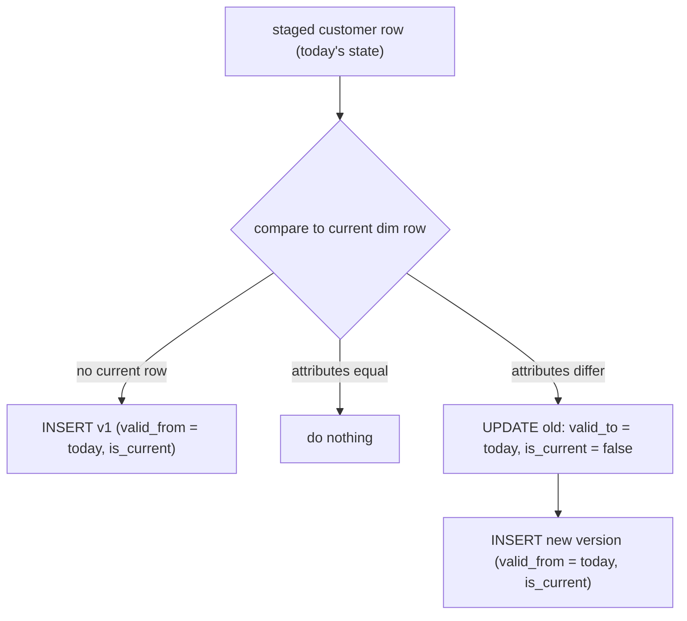

{/* status: authored */}

export const schema = `-- source: the current state of each customer (from the OLTP system)
CREATE TABLE stg_customers (
  customer_id int PRIMARY KEY,
  name        text NOT NULL,
  city        text NOT NULL,
  tier        text NOT NULL
);
INSERT INTO stg_customers VALUES
  (1,'Ana','Berlin','gold'),
  (2,'Ben','Lagos','silver'),
  (3,'Chidi','Cairo','bronze');

-- target: the versioned dimension (starts empty)
CREATE TABLE dim_customer (
  customer_key  bigint GENERATED ALWAYS AS IDENTITY PRIMARY KEY,
  customer_id   int  NOT NULL,          -- natural / business key
  name          text NOT NULL,
  city          text NOT NULL,
  tier          text NOT NULL,
  valid_from    date NOT NULL,
  valid_to      date NOT NULL DEFAULT DATE '9999-12-31',
  is_current    boolean NOT NULL DEFAULT true
);
CREATE UNIQUE INDEX dim_customer_current ON dim_customer (customer_id) WHERE is_current;`;

# Slowly Changing Dimensions — Type 2

## First principles

A dimension attribute changes: Ana moves Berlin → Munich, Ben is upgraded silver
→ gold. How the warehouse records that is an **SCD strategy**:

| Type | Behaviour | History kept? |
|---|---|---|
| **0** | never changes (immutable — a birth date) | n/a |
| **1** | overwrite in place | **none** — old value gone |
| **2** | close the old row, insert a new version | **full** — every state, with dates |
| **3** | keep a `previous_value` column | one step back only |
| **4** | current row in the dim, history in a separate table | full, split |
| **6** | 1 + 2 + 3 combined | full + fast "current" columns |

**Type 2** is the default for anything you'll analyze over time ("revenue by
customer tier *as it was when the order happened*"). The mechanics:

- Each dimension row is **one version** of one business entity, valid for a
  **date range** `[valid_from, valid_to)`.
- `is_current` flags the live version (a partial unique index enforces "exactly
  one current row per `customer_id`").
- The **surrogate key** `customer_key` identifies the *version*, not the person.
  A fact row stores the `customer_key` that was current **at the event's date**,
  freezing that customer's attributes as of then.

When a change arrives:

1. **Close** the current row: set `valid_to = change_date`, `is_current = false`.
2. **Insert** a new row: the new attributes, `valid_from = change_date`,
   `valid_to = 9999-12-31`, `is_current = true`.

Rows whose attributes are unchanged are **left alone** (the load must be
idempotent — re-running it does nothing).

## The mechanism



## Hand-trace on dummy data

Two loads. Load 1 (2024-01-01) seeds three customers. Before load 2 (2024-03-01),
**Ana moved to Munich** and **Ben was upgraded to gold**; Chidi is unchanged.

<QueryTrace
  caption="load 2: Ana & Ben get a closed old row + a new current row; Chidi untouched"
  steps={[
    {
      title: "1 · dim_customer after load 1 (2024-01-01)",
      op: "is_current",
      table: {
        name: "dim_customer",
        columns: ["customer_key", "customer_id", "city", "tier", "valid_from", "valid_to", "is_current"],
        rows: [
          [1,1,"Berlin","gold","2024-01-01","9999-12-31",true],
          [2,2,"Lagos","silver","2024-01-01","9999-12-31",true],
          [3,3,"Cairo","bronze","2024-01-01","9999-12-31",true],
        ],
      },
    },
    {
      title: "2 · new source state (2024-03-01): Ana → Munich, Ben → gold, Chidi same",
      op: "city",
      table: {
        name: "stg_customers",
        columns: ["customer_id", "city", "tier", "vs current"],
        rows: [
          [1,"Munich","gold","city CHANGED"],
          [2,"Lagos","gold","tier CHANGED"],
          [3,"Cairo","bronze","unchanged"],
        ],
      },
      rows: { match: [0, 1] },
    },
    {
      title: "3 · close the changed current rows: valid_to = 2024-03-01, is_current = false",
      op: "valid_to",
      table: {
        columns: ["customer_key", "customer_id", "city", "tier", "valid_from", "valid_to", "is_current"],
        rows: [
          [1,1,"Berlin","gold","2024-01-01","2024-03-01",false],
          [2,2,"Lagos","silver","2024-01-01","2024-03-01",false],
          [3,3,"Cairo","bronze","2024-01-01","9999-12-31",true],
        ],
      },
      rows: { drop: [0, 1] },
    },
    {
      title: "4 · insert the new versions — result",
      op: "is_current",
      table: {
        name: "dim_customer (result)",
        result: true,
        columns: ["customer_key", "customer_id", "city", "tier", "valid_from", "valid_to", "is_current"],
        rows: [
          [1,1,"Berlin","gold","2024-01-01","2024-03-01",false],
          [2,2,"Lagos","silver","2024-01-01","2024-03-01",false],
          [3,3,"Cairo","bronze","2024-01-01","9999-12-31",true],
          [4,1,"Munich","gold","2024-03-01","9999-12-31",true],
          [5,2,"Lagos","gold","2024-03-01","9999-12-31",true],
        ],
      },
      rows: { add: [3, 4] },
    },
  ]}
/>

Now `SELECT city FROM dim_customer WHERE customer_id = 1 AND '2024-02-01' >=
valid_from AND '2024-02-01' < valid_to` returns **Berlin** — the city *as it was*
in February.

## Run it

<SqlRunner title="load 1 — seed the dimension" setup={schema}>
{`INSERT INTO dim_customer (customer_id, name, city, tier, valid_from)
SELECT customer_id, name, city, tier, DATE '2024-01-01' FROM stg_customers;

SELECT customer_key, customer_id, city, tier, valid_from, valid_to, is_current
FROM dim_customer ORDER BY customer_key;`}
</SqlRunner>

<SqlRunner title="load 2 — the SCD2 MERGE (Ana moves, Ben upgraded)" setup={schema}>
{`-- seed load 1
INSERT INTO dim_customer (customer_id, name, city, tier, valid_from)
SELECT customer_id, name, city, tier, DATE '2024-01-01' FROM stg_customers;

-- the source changed:
UPDATE stg_customers SET city = 'Munich' WHERE customer_id = 1;
UPDATE stg_customers SET tier = 'gold'   WHERE customer_id = 2;

-- ---- the load, as of load_date = 2024-03-01 ----
-- step A: close current rows whose attributes changed
UPDATE dim_customer d
SET valid_to = DATE '2024-03-01', is_current = false
FROM stg_customers s
WHERE d.customer_id = s.customer_id
  AND d.is_current
  AND (d.name, d.city, d.tier) IS DISTINCT FROM (s.name, s.city, s.tier);

-- step B: insert new versions for changed rows + brand-new customers
INSERT INTO dim_customer (customer_id, name, city, tier, valid_from)
SELECT s.customer_id, s.name, s.city, s.tier, DATE '2024-03-01'
FROM stg_customers s
LEFT JOIN dim_customer d
  ON d.customer_id = s.customer_id AND d.is_current
WHERE d.customer_id IS NULL              -- no current row (new, or just-closed)
;

SELECT customer_key, customer_id, city, tier, valid_from, valid_to, is_current
FROM dim_customer ORDER BY customer_id, valid_from;`}
</SqlRunner>

<SqlRunner title="idempotency — run the same load twice, nothing changes" setup={schema}>
{`INSERT INTO dim_customer (customer_id, name, city, tier, valid_from)
SELECT customer_id, name, city, tier, DATE '2024-01-01' FROM stg_customers;

-- run the load with NO source changes, twice:
DO $$
DECLARE i int;
BEGIN
  FOR i IN 1..2 LOOP
    UPDATE dim_customer d SET valid_to = DATE '2024-03-01', is_current = false
    FROM stg_customers s
    WHERE d.customer_id = s.customer_id AND d.is_current
      AND (d.name,d.city,d.tier) IS DISTINCT FROM (s.name,s.city,s.tier);
    INSERT INTO dim_customer (customer_id,name,city,tier,valid_from)
    SELECT s.customer_id,s.name,s.city,s.tier,DATE '2024-03-01'
    FROM stg_customers s LEFT JOIN dim_customer d ON d.customer_id=s.customer_id AND d.is_current
    WHERE d.customer_id IS NULL;
  END LOOP;
END $$;

SELECT count(*) AS rows FROM dim_customer;   -- still 3: no spurious versions`}
</SqlRunner>

<SqlRunner title="point-in-time lookup: attributes as of a past date" setup={schema}>
{`INSERT INTO dim_customer (customer_id, name, city, tier, valid_from)
SELECT customer_id, name, city, tier, DATE '2024-01-01' FROM stg_customers;
UPDATE dim_customer SET valid_to = DATE '2024-03-01', is_current = false WHERE customer_id = 1;
INSERT INTO dim_customer (customer_id,name,city,tier,valid_from)
VALUES (1,'Ana','Munich','gold',DATE '2024-03-01');

-- Ana's city on 3 different dates:
SELECT d.d AS as_of, dc.city
FROM (VALUES (DATE '2024-02-01'),(DATE '2024-03-15'),(DATE '2024-06-01')) d(d)
JOIN dim_customer dc
  ON dc.customer_id = 1 AND d.d >= dc.valid_from AND d.d < dc.valid_to
ORDER BY as_of;`}
</SqlRunner>

<RunThis file="sql/data-engineering/02_slowly_changing_dimensions_type_2/topic.sql" />

## Build → Break → Fix → Why

:::tip[🔨 Build]
Two-step load: **close** changed current rows (`valid_to`, `is_current=false`),
then **insert** a new version for every business key that now has no current row.
Guard "exactly one current" with `CREATE UNIQUE INDEX ... WHERE is_current`.
:::

:::danger[💥 Break]
Skip the "attributes actually changed" check and re-version everyone every load:

```sql
UPDATE dim_customer SET is_current = false, valid_to = :load_date WHERE is_current;
INSERT INTO dim_customer (...) SELECT ... FROM stg_customers;
```

Run the daily load 30 times with no real changes → **30 identical versions** per
customer, `valid_from = valid_to` on the junk rows, and point-in-time joins now
match several rows for one date. The dimension is corrupt and huge.
:::

:::note[🔧 Fix]
- Only close/insert when `(new attrs) IS DISTINCT FROM (current attrs)` — `IS
  DISTINCT FROM` so a `NULL → value` change counts.
- Make the load **idempotent**: re-running with the same source is a no-op.
- One `valid_from`/`valid_to` scheme, half-open `[from, to)`, and a check
  constraint `valid_from < valid_to`.
:::

:::info[🧠 Why it behaved that way]
Type 2 history is only meaningful if a version boundary corresponds to a *real
attribute change*. Without the `IS DISTINCT FROM` gate, every load manufactures a
boundary, so "which version was current on date X" stops being a single row —
and any fact joined on `customer_key` or on a date-range predicate multiplies.
`IS DISTINCT FROM` (not `<>`) is required because `<>` returns `NULL` when either
side is `NULL`, so a change *into* or *out of* `NULL` would be missed.
:::

## Pitfalls & idioms

- **Idempotent load.** The test: run it twice against an unchanged source; row
  count and contents identical.
- Half-open intervals `[valid_from, valid_to)`. New row's `valid_from` = old
  row's `valid_to` (no gap, no overlap). Point-in-time predicate:
  `d >= valid_from AND d < valid_to`.
- Use `IS DISTINCT FROM` for the change check, never `<>`.
- Partial unique index `WHERE is_current` = "exactly one live version per
  business key", enforced by the database.
- Track only the columns you *want* history for. Put volatile, history-irrelevant
  attributes (last-login) in a Type 1 column or a separate table (Type 4).
- **Late-arriving changes**: a change effective last month arriving today needs
  you to split an existing interval, not just append — handle explicitly.
- Fact ETL looks up `customer_key` by `WHERE customer_id = ? AND event_date >=
  valid_from AND event_date < valid_to`, not `WHERE is_current`.
- `MERGE` (PG15+) can do steps A and B, but the classic close-then-insert with
  two statements is easier to read and debug; keep the unique index either way.

## See also

- [Dimensional modeling: the star schema](/data-engineering/dimensional-modeling-star-schema) — where the dimension lives
- [Upsert & MERGE](/foundations/upsert-and-merge) — the statement that can do the whole load
- [Constraints & keys](/foundations/constraints-and-keys) — the partial unique index
- [Data types, NULL & three-valued logic](/foundations/data-types-null-and-three-valued-logic) — why `IS DISTINCT FROM`, not `<>`
- [Window functions](/foundations/window-functions-partitioning-and-ranking) — building intervals from a change log with `lead()`

## Check yourself

1. Type 1 vs Type 2 — what does each do when `city` changes, and what's lost?
2. What does the surrogate `customer_key` identify — the customer, or a version
   of the customer? Why does that matter for facts?
3. Why `IS DISTINCT FROM` and not `<>` in the change-detection predicate?
4. What makes an SCD2 load *idempotent*, and how do you test it?
5. Write the point-in-time predicate to get a customer's attributes as they were
   on a given date.
