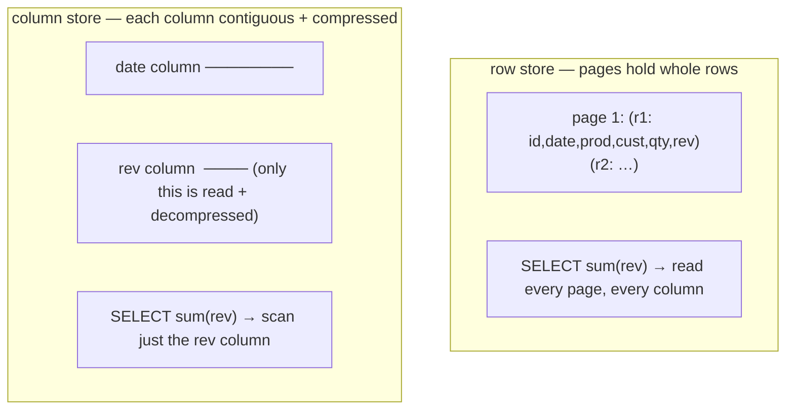

{/* status: authored */}

export const schema = `CREATE TABLE fact_sales (
  sale_id    bigint,
  date_key   int,
  product_key int,
  customer_key int,
  qty        int,
  revenue    numeric(12,2)
);
INSERT INTO fact_sales
SELECT g,
       20240100 + (g % 90) + 1,
       (g % 40) + 1,
       (g % 500) + 1,
       (g % 5) + 1,
       ((g % 200) + 1)::numeric
FROM generate_series(1, 50000) g;`;

# OLTP vs OLAP; row stores vs column stores

## First principles

The same business data is queried two very different ways:

| | **OLTP** (transactions) | **OLAP** (analytics) |
|---|---|---|
| A query touches | a few rows, all columns ("this order") | billions of rows, a few columns ("revenue by month") |
| Writes | many small `INSERT`/`UPDATE` | bulk loads, append-mostly |
| Latency target | milliseconds, per request | seconds–minutes, per report |
| Schema | normalized (3NF) | [dimensional / star](/data-engineering/dimensional-modeling-star-schema) |
| Concurrency | thousands of users | dozens of analysts + pipelines |

### Row store vs column store

- A **row store** (Postgres heap, MySQL/InnoDB) keeps each row's columns
  **together** on a page. Reading one whole row = one page read. Perfect for
  OLTP. But `SELECT sum(revenue) FROM fact` still reads every column of every row
  off disk, because they're interleaved.
- A **column store** (Redshift, BigQuery, Snowflake, ClickHouse, DuckDB, Postgres
  via extensions) keeps each **column** contiguous. `sum(revenue)` reads *only*
  the `revenue` column — 1/6th the I/O here. And because a column is millions of
  the same type, it **compresses** brilliantly (run-length, dictionary,
  delta) — often 5–20× — and the CPU can process it in vectorised batches.

**The trade-off**: a column store makes single-row reads and row-at-a-time
updates slow (it must touch every column file). So you don't run your app on one.
The warehouse *is* a column store; the OLTP database feeds it.

Postgres is a **row store**. It runs modest analytics fine — with the right
indexes, `BRIN`, partitioning, and pre-aggregation (this track) — but a true
column store wins decisively past ~100s of GB of fact data.

## The mechanism

## Hand-trace on dummy data

`SELECT sum(revenue)` over `fact_sales` — what each layout reads:

<QueryTrace
  caption="row store scans all 6 columns; column store scans only revenue"
  steps={[
    {
      title: "1 · fact_sales — 50,000 rows × 6 columns",
      table: {
        name: "fact_sales (sample)",
        columns: ["sale_id", "date_key", "product_key", "customer_key", "qty", "revenue"],
        rows: [[1,20240102,2,2,2,2.0],[2,20240103,3,3,3,3.0],["…","…","…","…","…","…"]],
      },
    },
    {
      title: "2 · row store: SELECT sum(revenue) — Seq Scan reads all 6 columns of all 50k rows",
      op: "revenue",
      table: {
        columns: ["what's read", "bytes (approx)"],
        rows: [["every column of every row", "~2.4 MB (all 6 columns)"]],
      },
    },
    {
      title: "3 · column store: only the revenue column is read, and it's compressed",
      op: "revenue",
      table: {
        columns: ["what's read", "bytes (approx)"],
        rows: [["revenue column only, RLE/delta compressed", "~40 KB"]],
      },
      rows: { match: [0] },
    },
    {
      title: "4 · result — same answer, ~60× less I/O for the column store",
      table: {
        name: "result",
        result: true,
        columns: ["layout", "I/O", "good at"],
        rows: [
          ["row store", "reads all columns", "point reads, updates, OLTP"],
          ["column store", "reads used columns only", "wide scans, aggregation, OLAP"],
        ],
      },
    },
  ]}
/>

## Run it

<SqlRunner title="wide aggregation vs point read on a row store" setup={schema}>
{`-- OLAP-shaped: touches 1 column conceptually, but Postgres (row store) reads all
EXPLAIN (ANALYZE, BUFFERS) SELECT sum(revenue) FROM fact_sales;

-- OLTP-shaped: one row, all columns — the row store's sweet spot
CREATE INDEX ON fact_sales (sale_id);
EXPLAIN (ANALYZE, BUFFERS) SELECT * FROM fact_sales WHERE sale_id = 42000;`}
</SqlRunner>

<SqlRunner title="what a column store buys: compression on a single column" setup={schema}>
{`-- revenue has only 200 distinct values across 50k rows → highly compressible
SELECT count(DISTINCT revenue) AS distinct_revenue, count(*) AS rows FROM fact_sales;
SELECT pg_size_pretty(pg_relation_size('fact_sales')) AS row_store_size;
-- a column store would store 'revenue' as ~200 dictionary entries + tiny codes`}
</SqlRunner>

<SqlRunner title="Postgres tactics that narrow the gap" setup={schema}>
{`-- pre-aggregate: turn 50k row reads into 90 (this track's bread and butter)
CREATE TABLE daily_revenue AS
SELECT date_key, sum(revenue) AS revenue, sum(qty) AS qty
FROM fact_sales GROUP BY date_key;
CREATE UNIQUE INDEX ON daily_revenue (date_key);

EXPLAIN SELECT sum(revenue) FROM daily_revenue;   -- 90 rows, not 50,000`}
</SqlRunner>

<RunThis file="sql/data-engineering/03_oltp_vs_olap_and_columnar/topic.sql" />

## Build → Break → Fix → Why

:::tip[🔨 Build]
OLTP on the row store (Postgres), normalized. A separate warehouse — a real
column store, or Postgres with a [star schema](/data-engineering/dimensional-modeling-star-schema),
[partitioning](/data-engineering/table-partitioning),
[BRIN](/data-engineering/brin-and-append-only-tables), and
[summary tables](/data-engineering/rollup-and-summary-tables) — for analytics,
fed by [incremental loads](/data-engineering/incremental-loads-and-watermarks).
:::

:::danger[💥 Break]
Run the analytics dashboards directly against the OLTP database with big
`GROUP BY` scans over the live `orders` table. Every dashboard refresh does a
multi-second sequential scan that competes with customer traffic for buffer
cache and I/O; p99 checkout latency spikes whenever someone opens the "revenue"
tab.
:::

:::danger[💥 Break (the other way)]
Point your app's "get one order" endpoint at the column-store warehouse. Fetching
one row means reading a slice of *every* column file — slower than the row store
by orders of magnitude for that access pattern.
:::

:::note[🔧 Fix]
- Row store for OLTP, column store (or a Postgres warehouse tuned for scans) for
  OLAP. Separate systems, or at least separate replicas.
- Move analytics off the transactional path with a pipeline.
- In Postgres, close the gap with dimensional modeling, partitioning, BRIN, and
  pre-aggregation — the rest of this track.
:::

:::info[🧠 Why it behaved that way]
Storage layout is a bet on access pattern. Row storage co-locates a row's fields,
so "give me this row" is one read but "sum this column" drags every other column
along. Column storage co-locates a field's values, so "sum this column" reads
only that column *and* the values compress hard (adjacent values are similar) and
vectorise well — at the cost of reassembling a row from many column files. OLTP
and OLAP have opposite access patterns, so they want opposite layouts, which is
why the warehouse is a copy, not the source.
:::

## Pitfalls & idioms

- Don't run heavy analytics on the primary OLTP database. At minimum, a read
  replica; better, a warehouse.
- A column store is not a drop-in app database — single-row CRUD is its weakness.
- Postgres is a capable *small* warehouse: star schema + partition by date + BRIN
  + summary tables get you a long way.
- Columnar Postgres extensions (Citus columnar, Hydra, pg_mooncake) exist if you
  want columnar *inside* Postgres.
- The pipeline OLTP → warehouse is where [incremental
  loads](/data-engineering/incremental-loads-and-watermarks) and
  [SCD](/data-engineering/slowly-changing-dimensions-type-2) live.
- "Just add an index" doesn't fix a query that legitimately needs to aggregate
  half the table — that's a pre-aggregation / columnar problem.

## See also

- [Dimensional modeling: the star schema](/data-engineering/dimensional-modeling-star-schema) — the warehouse schema
- [Rollup & summary tables](/data-engineering/rollup-and-summary-tables) — pre-aggregation in Postgres
- [Declarative partitioning & partition pruning](/data-engineering/table-partitioning) — big fact tables
- [Backend → normalization](/backend/normalization-1nf-to-bcnf) — the OLTP side

## Check yourself

1. Name three ways an OLAP query differs from an OLTP query.
2. Why does `SELECT sum(revenue)` read more than it "needs" on a row store?
3. Two reasons a column store is fast for that query.
4. Why is a column store a bad choice for your application database?
5. Three Postgres techniques that make a row store behave more like a warehouse.
