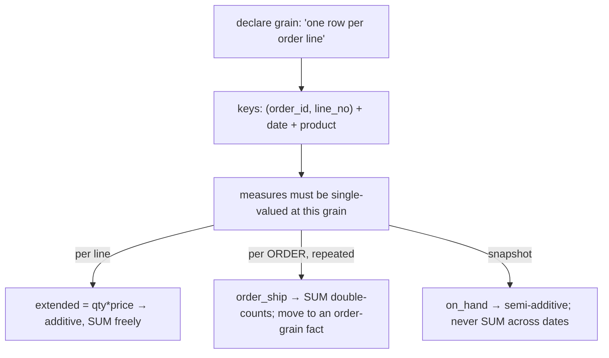

{/* status: authored */}

export const schema = `-- a fact at ORDER-LINE grain
CREATE TABLE fact_order_line (
  order_id   int, line_no int,
  date_key   int, product_key int,
  qty        int,
  unit_price numeric(10,2),
  extended   numeric(12,2),      -- qty * unit_price  (additive)
  order_ship numeric(10,2)       -- shipping charged on the WHOLE order (repeated per line!)
);
INSERT INTO fact_order_line VALUES
  (100,1, 20240101, 10, 2, 6.00,  12.00, 5.00),
  (100,2, 20240101, 12, 1, 9.00,   9.00, 5.00),   -- same order_ship 5.00
  (101,1, 20240102, 14, 1, 75.00, 75.00, 8.00);

-- a daily inventory SNAPSHOT fact (semi-additive)
CREATE TABLE fact_inventory (date_key int, product_key int, on_hand int);
INSERT INTO fact_inventory VALUES
  (20240101, 10, 100), (20240101, 12, 40),
  (20240102, 10,  92), (20240102, 12, 55);`;

# Grain & measure additivity, in depth

## First principles

Two questions define a fact table.

### 1. Grain — what does one row mean?

State it in one sentence: *"one row per order line"*, *"one row per product per
store per day"*, *"one row per website session"*. Everything else follows:

- The **dimension keys** are exactly the things that make a row unique at that
  grain.
- Every **measure** must be a well-defined single number *at that grain*.
- You can always **roll up** (order line → order → day), never **drill below**.
  So pick the **lowest grain you might ever need** — usually the atomic
  transaction event.

**Mixed grain is the #1 fact-table bug.** If most measures are per-line but
`order_ship` is per-*order*, then `SUM(order_ship) GROUP BY date` counts a €5
shipping charge once per line — double for a 2-line order.

### 2. Additivity — SUM across *which* dimensions?

| Class | Can `SUM` across… | Examples | Rule |
|---|---|---|---|
| **Additive** | **every** dimension | `revenue`, `qty`, `cost` | just `SUM` |
| **Semi-additive** | all dimensions **except time** | `account_balance`, `inventory on_hand`, `headcount` | `SUM` across products/stores; across time take a **period-end snapshot** or `avg`/`last_value` |
| **Non-additive** | **none** | `unit_price`, `%`, ratios, `avg`, distinct counts | never store as a measure to `SUM`; **recompute from additive parts**: `avg_price = SUM(revenue) / SUM(qty)` |

Adding 3 days of `on_hand` (100 + 92 + 88) is meaningless — you don't have 280
units, you have ~88. Semi-additive measures need care on the time axis
specifically.

## The mechanism

## Hand-trace on dummy data

`SUM` each measure by `date_key` — which totals are right?

<QueryTrace
  caption="extended sums correctly; order_ship is repeated per line (wrong grain); on_hand can't be summed over dates"
  steps={[
    {
      title: "1 · fact_order_line (grain = order line)",
      table: {
        name: "fact_order_line",
        columns: ["order_id", "line_no", "extended", "order_ship"],
        rows: [[100,1,12.0,5.0],[100,2,9.0,5.0],[101,1,75.0,8.0]],
      },
    },
    {
      title: "2 · SUM(extended) — a true per-line measure, sums fine",
      op: "extended",
      table: { columns: ["date_key", "sum(extended)"], rows: [[20240101,21.0],[20240102,75.0]] },
    },
    {
      title: "3 · SUM(order_ship) — WRONG: order 100's €5 counted twice (once per line)",
      op: "order_ship",
      table: {
        columns: ["date_key", "sum(order_ship)", "actual shipping"],
        rows: [[20240101,10.0,"5.00 (one order)"],[20240102,8.0,"8.00 ✓"]],
      },
      rows: { drop: [0] },
    },
    {
      title: "4 · fact_inventory: SUM(on_hand) over 2 dates = 192 — meaningless (semi-additive) — result",
      op: "on_hand",
      table: {
        name: "result",
        result: true,
        columns: ["measure", "SUM across time?", "correct time aggregation"],
        rows: [
          ["extended", "yes", "SUM"],
          ["order_ship", "no — wrong grain", "put on an order-grain fact"],
          ["on_hand", "no — semi-additive", "period-end value or avg"],
        ],
      },
    },
  ]}
/>

## Run it

<SqlRunner title="additive vs mixed-grain measure" setup={schema}>
{`-- extended: correct
SELECT date_key, sum(extended) AS revenue FROM fact_order_line GROUP BY date_key ORDER BY date_key;

-- order_ship: inflated for multi-line orders
SELECT date_key, sum(order_ship) AS shipping_wrong FROM fact_order_line GROUP BY date_key ORDER BY date_key;

-- fix: dedupe to order grain first
SELECT date_key, sum(order_ship) AS shipping_right FROM (
  SELECT DISTINCT order_id, date_key, order_ship FROM fact_order_line
) o GROUP BY date_key ORDER BY date_key;`}
</SqlRunner>

<SqlRunner title="non-additive: recompute, don't store" setup={schema}>
{`-- average unit price: NOT avg(unit_price) (that averages the averages)
SELECT
  round(avg(unit_price), 2)               AS wrong_avg_of_prices,
  round(sum(extended) / sum(qty), 2)      AS right_weighted_avg
FROM fact_order_line;`}
</SqlRunner>

<SqlRunner title="semi-additive: never SUM inventory over dates" setup={schema}>
{`-- WRONG
SELECT product_key, sum(on_hand) AS nonsense FROM fact_inventory GROUP BY product_key;

-- RIGHT: the latest snapshot per product (period-end)
SELECT DISTINCT ON (product_key) product_key, date_key, on_hand
FROM fact_inventory ORDER BY product_key, date_key DESC;

-- across products on a given day: SUM is fine (that's not the time axis)
SELECT date_key, sum(on_hand) AS total_units FROM fact_inventory GROUP BY date_key ORDER BY date_key;`}
</SqlRunner>

<RunThis file="sql/data-engineering/04_grain_and_measure_additivity/topic.sql" />

## Build → Break → Fix → Why

:::tip[🔨 Build]
Declare the grain in a comment on the fact table. Store only **additive** measures
at that grain. Shipping/discount that applies to the whole order → an
**order-grain** fact. Ratios and averages → computed at query time from the
additive columns.
:::

:::danger[💥 Break]
Order-line fact with `order_discount` (per order) and `line_amount` (per line) as
siblings. `SUM(line_amount) - SUM(order_discount) GROUP BY month` subtracts the
discount once per line — a 5-line order over-discounts 5×, and net revenue is
understated by a lot.
:::

:::danger[💥 Break (semi-additive)]
A "total inventory" tile does `SUM(on_hand)` across a month of daily snapshots and
reports 30× the real stock.
:::

:::note[🔧 Fix]
- One grain per fact table. A measure at a coarser grain gets its **own** fact
  table at that grain.
- Store additive measures; derive non-additive ones.
- Semi-additive measures: `SUM` across every dimension **except time**; on time,
  use a period-end snapshot, `avg`, or `first/last_value`.
:::

:::info[🧠 Why it behaved that way]
A fact row's measures are a promise: "for this exact combination of dimension
keys, here are the numbers." If a measure is actually defined at a coarser grain,
the loader has to *repeat* it across the finer rows, and `SUM` then counts it
once per repetition. Non-additive measures (a rate, an average) aren't "amounts"
at all — adding them has no physical meaning, so you reconstruct them from the
amounts that do add. Semi-additive measures are amounts, but *stocks* not
*flows*: you have "88 units" not "88 unit-days", so summing across time
double-counts the same physical units.
:::

## Pitfalls & idioms

- Write the grain as a one-line comment on the table. Every design review starts
  there.
- One coarser-grain measure among finer ones → split the fact table.
- `avg(rate)` ≠ weighted average. Use `SUM(numerator)/SUM(denominator)`.
- Semi-additive on the time axis: `SUM ... GROUP BY` over dates is almost always
  wrong; you want the latest value or an average.
- A "factless fact" (just keys, no measures) is legitimate — for counting events
  or coverage.
- Distinct counts (`count(distinct customer)`) don't roll up: the monthly
  distinct-customer count isn't the sum of daily ones.
- Add a `count` measure (`1` per row) so "number of order lines" is a plain
  `SUM`.

## See also

- [Dimensional modeling: the star schema](/data-engineering/dimensional-modeling-star-schema) — grain in context
- [INNER JOIN](/foundations/inner-join) — the fan-out that mixed grain causes
- [Rollup & summary tables](/data-engineering/rollup-and-summary-tables) — rolling up additive measures
- [The date dimension](/data-engineering/the-date-dimension-and-gap-filling) — the time axis

## Check yourself

1. State the grain of a fact with keys `(store, product, day)` and one thing that
   makes mixed grain a bug.
2. Classify: `revenue`, `unit_price`, `on_hand_inventory`, `count(distinct
   user)`.
3. Why can't you `SUM` a semi-additive measure across dates? What do you do
   instead?
4. How do you get a correct weighted average unit price from a fact table?
5. You need per-order shipping totals from an order-*line* fact. What's the safe
   way, and the better fix?
