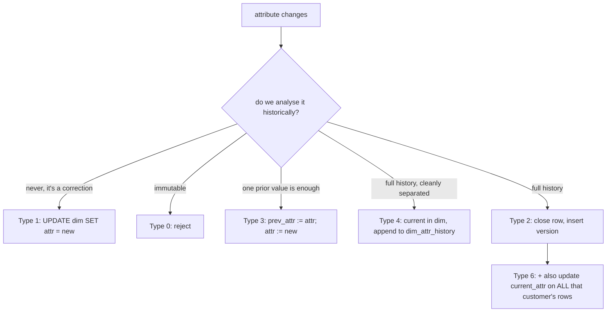

{/* status: authored */}

export const schema = `CREATE TABLE stg_customer (
  customer_id int PRIMARY KEY,
  name        text NOT NULL,
  email       text NOT NULL,
  city        text NOT NULL,
  tier        text NOT NULL
);
INSERT INTO stg_customer VALUES
  (1, 'Ana Ng', 'ana@x.com', 'Berlin', 'gold'),
  (2, 'Ben',    'ben@x.com', 'Lagos',  'silver');`;

# SCD Types 0, 1, 3, 4 & 6

[Type 2](/data-engineering/slowly-changing-dimensions-type-2) keeps full history
with validity windows. It's the workhorse, but it's not always what a given
attribute needs. The family:

## The types

| Type | On change | History | Use when |
|---|---|---|---|
| **0** | reject the change — the attribute is fixed | n/a | date of birth, original acquisition channel, "as-designed" values |
| **1** | **overwrite** in place | **none** | corrections (a typo'd name), attributes where only "now" matters (last-login city) |
| **2** | close old row, insert new version | **full**, with dates | anything you analyse "as it was at event time" |
| **3** | keep a `previous_<attr>` (and maybe `<attr>_changed_at`) column | **one step back** | "compare current region to prior region" where a full timeline is overkill |
| **4** | current values in the dim; **history in a separate table** | **full**, split | a dimension with a few fast-changing attributes among many stable ones |
| **6** | 1 + 2 + 3 in one table: Type-2 rows **plus** a `current_<attr>` column on every row | **full + fast "current"** | you need historical accuracy *and* frequent "group by the customer's *current* tier" without a self-join to the current row |

**Different attributes of the same dimension can be different types.** `email`
might be Type 1 (correction — nobody analyses "email as it was"), `tier` Type 2
(revenue by tier at order time matters), `signup_channel` Type 0 (immutable).

## The mechanism

## Hand-trace on dummy data

Ana's `email` gets corrected (Type 1) and her `tier` changes gold→platinum
(Type 3, keeping one prior value):

<QueryTrace
  caption="Type 1 overwrites and forgets; Type 3 shifts the old value into prev_tier"
  steps={[
    {
      title: "1 · dim_customer before",
      table: {
        name: "dim_customer",
        columns: ["customer_id", "email", "tier", "prev_tier"],
        rows: [[1,"ana@x.com","gold",null],[2,"ben@x.com","silver",null]],
      },
    },
    {
      title: "2 · Type 1: email correction — overwrite, no trace kept",
      op: "email",
      table: {
        columns: ["customer_id", "email (was ana@x.com)", "history?"],
        rows: [[1,"ana.ng@x.com","none — old value gone"]],
      },
      rows: { match: [0] },
    },
    {
      title: "3 · Type 3: tier gold → platinum — shift old value into prev_tier",
      op: "tier",
      table: {
        columns: ["customer_id", "tier", "prev_tier"],
        rows: [[1,"platinum","gold"]],
      },
      rows: { match: [0] },
    },
    {
      title: "4 · result — one row per customer; you can compare current vs prior tier, but not a full timeline",
      op: "tier",
      table: {
        name: "dim_customer (after)",
        result: true,
        columns: ["customer_id", "email", "tier", "prev_tier"],
        rows: [[1,"ana.ng@x.com","platinum","gold"],[2,"ben@x.com","silver",null]],
      },
    },
  ]}
/>

## Run it

<SqlRunner title="Type 1 (overwrite) and Type 0 (reject)" setup={schema}>
{`CREATE TABLE dim_customer (
  customer_id int PRIMARY KEY,
  name text, email text, city text, tier text,
  signup_channel text NOT NULL DEFAULT 'organic'   -- Type 0
);
INSERT INTO dim_customer (customer_id, name, email, city, tier)
SELECT customer_id, name, email, city, tier FROM stg_customer;

-- Type 1: correction, overwrite
UPDATE dim_customer SET email = 'ana.ng@x.com' WHERE customer_id = 1;

-- Type 0: a guard trigger would reject changes to signup_channel; here just don't update it
SELECT customer_id, email, signup_channel FROM dim_customer ORDER BY customer_id;`}
</SqlRunner>

<SqlRunner title="Type 3: previous value column" setup={schema}>
{`CREATE TABLE dim_customer (
  customer_id int PRIMARY KEY, tier text NOT NULL,
  prev_tier text, tier_changed_at date
);
INSERT INTO dim_customer SELECT customer_id, tier, NULL, NULL FROM stg_customer;

CREATE PROCEDURE set_tier(p_id int, p_new text, p_date date) LANGUAGE plpgsql AS $$
BEGIN
  UPDATE dim_customer
  SET prev_tier = tier, tier = p_new, tier_changed_at = p_date
  WHERE customer_id = p_id AND tier IS DISTINCT FROM p_new;
END $$;

CALL set_tier(1, 'platinum', DATE '2024-03-01');
CALL set_tier(1, 'diamond',  DATE '2024-06-01');   -- only the ONE prior value survives
SELECT * FROM dim_customer WHERE customer_id = 1;`}
</SqlRunner>

<SqlRunner title="Type 4: current in dim, history in a side table" setup={schema}>
{`CREATE TABLE dim_customer (customer_id int PRIMARY KEY, city text NOT NULL, tier text NOT NULL);
CREATE TABLE dim_customer_history (
  customer_id int, attr text, old_value text, new_value text, changed_at date
);
INSERT INTO dim_customer SELECT customer_id, city, tier FROM stg_customer;

CREATE FUNCTION log_dim_change() RETURNS trigger LANGUAGE plpgsql AS $$
BEGIN
  IF NEW.tier IS DISTINCT FROM OLD.tier THEN
    INSERT INTO dim_customer_history VALUES (OLD.customer_id,'tier',OLD.tier,NEW.tier,CURRENT_DATE);
  END IF;
  IF NEW.city IS DISTINCT FROM OLD.city THEN
    INSERT INTO dim_customer_history VALUES (OLD.customer_id,'city',OLD.city,NEW.city,CURRENT_DATE);
  END IF;
  RETURN NEW;
END $$;
CREATE TRIGGER trg AFTER UPDATE ON dim_customer FOR EACH ROW EXECUTE FUNCTION log_dim_change();

UPDATE dim_customer SET tier = 'platinum', city = 'Munich' WHERE customer_id = 1;
SELECT * FROM dim_customer WHERE customer_id = 1;          -- current
SELECT * FROM dim_customer_history ORDER BY attr;          -- full history, separate`}
</SqlRunner>

<SqlRunner title="Type 6: Type-2 rows + a current_ column" setup={schema}>
{`CREATE TABLE dim_customer (
  customer_key bigint GENERATED ALWAYS AS IDENTITY PRIMARY KEY,
  customer_id int NOT NULL,
  tier text NOT NULL,              -- historical (as of this version)
  current_tier text NOT NULL,      -- always the latest, on EVERY version row
  valid_from date NOT NULL, valid_to date NOT NULL DEFAULT DATE '9999-12-31',
  is_current boolean NOT NULL DEFAULT true
);
INSERT INTO dim_customer (customer_id, tier, current_tier, valid_from)
SELECT customer_id, tier, tier, DATE '2024-01-01' FROM stg_customer;

-- tier change: close old, insert new, AND update current_tier on all of this customer's rows
UPDATE dim_customer SET valid_to = DATE '2024-03-01', is_current = false
WHERE customer_id = 1 AND is_current;
INSERT INTO dim_customer (customer_id, tier, current_tier, valid_from)
VALUES (1, 'platinum', 'platinum', DATE '2024-03-01');
UPDATE dim_customer SET current_tier = 'platinum' WHERE customer_id = 1;

-- now: historical tier per version, current_tier the same everywhere -> "group by current tier" needs no join
SELECT customer_id, tier, current_tier, valid_from, is_current
FROM dim_customer WHERE customer_id = 1 ORDER BY valid_from;`}
</SqlRunner>

<RunThis file="sql/data-engineering/05_scd_types_1_3_4_6/topic.sql" />

## Build → Break → Fix → Why

:::tip[🔨 Build]
Assign a type **per attribute**: corrections and "now only" → Type 1; immutable →
Type 0; analytically historical → Type 2; "current vs one prior" → Type 3; a few
volatile attributes in a stable dim → Type 4; need current-grouping without a
self-join → Type 6.
:::

:::danger[💥 Break]
Make *every* attribute Type 2, including `email` and `last_login_city`. Every
email correction spawns a new dimension version, exploding the row count, and
"customer's email as of the order date" is a question nobody asks. Or the
reverse: `tier` as Type 1, so "revenue by tier" retroactively re-buckets every
historical order whenever a customer upgrades — last quarter's numbers change.
:::

:::note[🔧 Fix]
- Type per attribute, driven by "do we analyse this historically?"
- Type 1 for corrections; never for anything that changes the meaning of past
  facts.
- Type 6 (or a Type-2 dim joined to a "current" view) when reports need both the
  historical value and easy current-grouping.
:::

:::info[🧠 Why it behaved that way]
An SCD type is a choice about *what a fact's dimension reference means*. Type 2
freezes attributes at event time — correct for "revenue by tier". Type 1 makes
every fact reflect the *current* attribute — correct for "email" (there's no
meaningful historical email). Type 3 and Type 6 are compromises: Type 3 keeps
just enough history for a before/after comparison in one row; Type 6 pays the
storage of a `current_` column on every version so "group by current tier" is a
plain `GROUP BY` instead of a join back to `is_current`.
:::

## Pitfalls & idioms

- The type is a property of the **attribute**, not the dimension.
- Type 1 silently rewrites the past for any fact that reads the current value —
  only use it where that's *intended*.
- Type 3's "previous value" is exactly one deep; a second change loses the first
  prior value. Don't reach for it when you actually need a timeline.
- Type 4's history table is easy to under-index — index `(customer_id, attr,
  changed_at)`.
- Type 6's `current_` column must be updated on **every** version row for that
  business key on each change — a common bug is updating only the new row.
- A Type-0 attribute needs a guard (trigger or app rule) or it's just "we hope
  nobody changes it".
- Mixed types in one dim: document which column is which type.

## See also

- [Slowly Changing Dimensions — Type 2](/data-engineering/slowly-changing-dimensions-type-2) — the full-history workhorse
- [Triggers & PL/pgSQL basics](/foundations/triggers-and-plpgsql) — Type 4 history triggers, Type 0 guards
- [Data types, NULL & three-valued logic](/foundations/data-types-null-and-three-valued-logic) — `IS DISTINCT FROM` for change detection
- [Dimensional modeling: the star schema](/data-engineering/dimensional-modeling-star-schema) — where dimensions live

## Check yourself

1. Match to a type: a mistyped customer name; `signup_channel`; `tier` (used in
   "revenue by tier"); "current region vs the one before".
2. Why is making `email` a Type 2 attribute wasteful?
3. Why is making `tier` a Type 1 attribute dangerous for historical reports?
4. What does Type 6 add over Type 2, and what does it cost?
5. Type 3 keeps how many prior values? What breaks if you need more?
