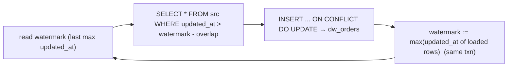

{/* status: authored */}

export const schema = `-- source system (OLTP)
CREATE TABLE src_orders (
  order_id   int PRIMARY KEY,
  customer_id int NOT NULL,
  amount     numeric NOT NULL,
  updated_at timestamptz NOT NULL       -- bumped on every change
);
INSERT INTO src_orders VALUES
  (100, 1, 40, TIMESTAMPTZ '2024-03-01 09:00+00'),
  (101, 2, 15, TIMESTAMPTZ '2024-03-01 11:00+00'),
  (102, 1, 90, TIMESTAMPTZ '2024-03-02 08:00+00');

-- warehouse target + a place to remember progress
CREATE TABLE dw_orders (
  order_id int PRIMARY KEY, customer_id int NOT NULL, amount numeric NOT NULL,
  updated_at timestamptz NOT NULL, loaded_at timestamptz NOT NULL DEFAULT now()
);
CREATE TABLE load_state (
  table_name text PRIMARY KEY,
  watermark  timestamptz NOT NULL
);
INSERT INTO load_state VALUES ('dw_orders', TIMESTAMPTZ '2000-01-01');`;

# Incremental loads & watermarks

## First principles

Re-copying the whole source table every run doesn't scale. An **incremental
load** pulls only rows that **changed since last time**.

You need:

1. **A change-tracking column on the source** — usually `updated_at
   timestamptz`, bumped on every insert *and* update (a
   [trigger](/foundations/triggers-and-plpgsql), never trusted from the app). Or
   a monotonic `id` for insert-only tables. Or CDC (logical replication) for the
   real-time case.
2. **A stored watermark** — the max `updated_at` you've successfully loaded,
   persisted in a `load_state` table (not a variable that resets).
3. **The load query**: `WHERE src.updated_at > :watermark`.
4. **An idempotent target write**: `INSERT ... ON CONFLICT DO UPDATE`
   ([upsert](/foundations/upsert-and-merge)) so re-running a batch is harmless.
5. **Advance the watermark** to the max `updated_at` you just processed — **in
   the same transaction** as the load, so a crash can't skip rows.

### The late-data overlap

Rows can be committed to the source with an `updated_at` *earlier* than
`now()` — clock skew, a long transaction, backdated corrections. If you set the
watermark to `now()` you'll **miss** those. Fixes:

- Set the watermark to `max(updated_at)` of rows you actually loaded, not
  `now()`.
- Re-scan a small **overlap window**: `WHERE updated_at > :watermark - INTERVAL
  '1 hour'`. The upsert makes re-processing those rows a no-op.

## The mechanism

## Hand-trace on dummy data

Run 1 loads everything; a new + an updated row arrive; run 2 loads only those:

<QueryTrace
  caption="watermark gates the source scan; upsert makes the target write idempotent"
  steps={[
    {
      title: "1 · run 1 — watermark = 2000-01-01, load all 3 rows, advance watermark to 2024-03-02 08:00",
      op: "updated_at",
      table: {
        name: "src_orders",
        columns: ["order_id", "amount", "updated_at"],
        rows: [[100,40,"03-01 09:00"],[101,15,"03-01 11:00"],[102,90,"03-02 08:00"]],
      },
      rows: { add: [0, 1, 2] },
    },
    {
      title: "2 · source changes: order 101 amount 15→25 (updated_at 03-03 10:00), new order 103 (03-03 12:00)",
      op: "updated_at",
      table: {
        columns: ["order_id", "amount", "updated_at", "vs watermark 03-02 08:00"],
        rows: [
          [100,40,"03-01 09:00","≤ watermark — skip"],
          [101,25,"03-03 10:00","> watermark — load"],
          [102,90,"03-02 08:00","≤ watermark — skip"],
          [103,7,"03-03 12:00","> watermark — load"],
        ],
      },
      rows: { drop: [0, 2] },
    },
    {
      title: "3 · run 2 — WHERE updated_at > watermark → 2 rows; upsert into dw_orders",
      op: "order_id",
      table: {
        columns: ["order_id", "action"],
        rows: [[101,"ON CONFLICT DO UPDATE (amount → 25)"],[103,"INSERT (new)"]],
      },
      rows: { match: [0, 1] },
    },
    {
      title: "4 · advance watermark to 03-03 12:00 — result",
      table: {
        name: "dw_orders (result)",
        result: true,
        columns: ["order_id", "amount"],
        rows: [[100,40],[101,25],[102,90],[103,7]],
      },
    },
  ]}
/>

## Run it

<SqlRunner title="an idempotent incremental load procedure" setup={schema}>
{`CREATE PROCEDURE load_dw_orders() LANGUAGE plpgsql AS $$
DECLARE wm timestamptz;
BEGIN
  SELECT watermark INTO wm FROM load_state WHERE table_name = 'dw_orders' FOR UPDATE;

  INSERT INTO dw_orders (order_id, customer_id, amount, updated_at)
  SELECT order_id, customer_id, amount, updated_at
  FROM src_orders
  WHERE updated_at > wm - INTERVAL '1 hour'          -- overlap window
  ON CONFLICT (order_id) DO UPDATE
    SET amount = EXCLUDED.amount, updated_at = EXCLUDED.updated_at, loaded_at = now();

  UPDATE load_state
  SET watermark = greatest(wm, (SELECT max(updated_at) FROM src_orders))
  WHERE table_name = 'dw_orders';
END $$;

CALL load_dw_orders();
SELECT order_id, amount FROM dw_orders ORDER BY order_id;
SELECT watermark FROM load_state WHERE table_name = 'dw_orders';`}
</SqlRunner>

<SqlRunner title="second run loads only the delta" setup={schema}>
{`CREATE PROCEDURE load_dw_orders() LANGUAGE plpgsql AS $$
DECLARE wm timestamptz;
BEGIN
  SELECT watermark INTO wm FROM load_state WHERE table_name = 'dw_orders' FOR UPDATE;
  INSERT INTO dw_orders (order_id, customer_id, amount, updated_at)
  SELECT order_id, customer_id, amount, updated_at FROM src_orders
  WHERE updated_at > wm - INTERVAL '1 hour'
  ON CONFLICT (order_id) DO UPDATE SET amount = EXCLUDED.amount, updated_at = EXCLUDED.updated_at;
  UPDATE load_state SET watermark = greatest(wm, (SELECT max(updated_at) FROM src_orders))
  WHERE table_name = 'dw_orders';
END $$;

CALL load_dw_orders();                                        -- run 1
-- source changes:
UPDATE src_orders SET amount = 25, updated_at = TIMESTAMPTZ '2024-03-03 10:00+00' WHERE order_id = 101;
INSERT INTO src_orders VALUES (103, 3, 7, TIMESTAMPTZ '2024-03-03 12:00+00');

CALL load_dw_orders();                                        -- run 2: only 101, 103
SELECT order_id, amount FROM dw_orders ORDER BY order_id;

-- re-run with no changes: no-op
CALL load_dw_orders();
SELECT count(*) AS rows, max(updated_at) AS wm_matches
FROM dw_orders;`}
</SqlRunner>

<SqlRunner title="insert-only source: watermark on a monotonic id" setup={schema}>
{`CREATE TABLE src_events (id bigint PRIMARY KEY, kind text);
INSERT INTO src_events SELECT g, 'e' FROM generate_series(1, 100) g;
CREATE TABLE dw_events (id bigint PRIMARY KEY, kind text);
CREATE TABLE ev_state (last_id bigint NOT NULL); INSERT INTO ev_state VALUES (0);

-- load
INSERT INTO dw_events SELECT id, kind FROM src_events WHERE id > (SELECT last_id FROM ev_state);
UPDATE ev_state SET last_id = (SELECT max(id) FROM dw_events);
SELECT (SELECT count(*) FROM dw_events) AS loaded, (SELECT last_id FROM ev_state) AS watermark;`}
</SqlRunner>

<RunThis file="sql/data-engineering/06_incremental_loads_and_watermarks/topic.sql" />

## Build → Break → Fix → Why

:::tip[🔨 Build]
Source `updated_at` (trigger-maintained) → `load_state.watermark` table →
`WHERE updated_at > watermark - overlap` → `INSERT ... ON CONFLICT DO UPDATE` →
advance watermark to `max(updated_at)` **in the same transaction**.
:::

:::danger[💥 Break]
Set the watermark to `now()` at the end of the run. A row committed during the
run with `updated_at` two minutes ago (long transaction, clock skew) is now
`< watermark` and will **never** be loaded — a permanent silent gap. Or: advance
the watermark in a *separate* transaction from the load; a crash between them
either double-processes (fine, if idempotent) or skips (data loss, if you also
committed the load).
:::

:::note[🔧 Fix]
- Watermark = `max(updated_at)` of loaded rows, not wall-clock.
- Re-scan an overlap window; rely on the upsert to absorb duplicates.
- Load + watermark advance in **one transaction**.
- `updated_at` bumped by a trigger on every write, including updates.
:::

:::info[🧠 Why it behaved that way]
An incremental load is a "give me everything since X" query, so it's only as
correct as your definition of X and your guarantee that every changed row's X is
truly greater than the last one you saw. Wall-clock `now()` isn't that guarantee
— commit order and `updated_at` order can diverge. Advancing the watermark from
the *data you loaded*, plus a small overlap re-scan backed by an idempotent
upsert, closes the window: worst case you reprocess a few rows harmlessly;
you never skip one.
:::

## Pitfalls & idioms

- `updated_at` must change on **every** write. Trigger, not app code. A missed
  bump = a missed row.
- Persist the watermark durably (a table). A process-local variable resets and
  re-loads everything or nothing.
- Watermark from loaded data; add an overlap window for late/skewed rows.
- Idempotent target write (`ON CONFLICT` / `MERGE`) so overlap and retries are
  safe.
- One transaction for load + watermark, or you get gaps/dupes on failure.
- Hard deletes in the source are invisible to an `updated_at` scan — use soft
  deletes, a tombstone stream, or a periodic full-key reconcile.
- Very large first load: seed with a bulk `COPY`, then switch to incremental.

## See also

- [Upsert & MERGE](/foundations/upsert-and-merge) — the idempotent target write
- [Transactions & ACID](/foundations/transactions-and-acid) — load + watermark atomicity
- [Late-arriving dimensions & facts](/data-engineering/late-arriving-data) — the harder late-data cases
- [Bulk loading & COPY](/foundations/bulk-loading-and-copy) — the initial full load

## Check yourself

1. What three things does an incremental load need on the source and target
   sides?
2. Why is setting the watermark to `now()` a bug?
3. What does the overlap window protect against, and why is it safe?
4. Why must the watermark advance in the same transaction as the load?
5. How do you detect source deletes with an `updated_at`-based load? (You can't
   directly — what do you do?)
