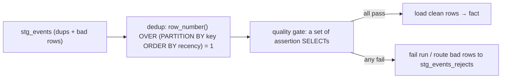

{/* status: authored */}

export const schema = `CREATE TABLE stg_events (
  event_id text,
  user_id  int,
  kind     text,
  ts       timestamptz,
  amount   numeric,
  ingested_at timestamptz NOT NULL DEFAULT now()
);
INSERT INTO stg_events (event_id, user_id, kind, ts, amount) VALUES
  ('e1', 1, 'purchase', TIMESTAMPTZ '2024-03-01 10:00+00', 40),
  ('e1', 1, 'purchase', TIMESTAMPTZ '2024-03-01 10:00+00', 40),   -- exact dup (retry)
  ('e2', 1, 'purchase', TIMESTAMPTZ '2024-03-01 10:00+00', 45),   -- same key, later/different value
  ('e3', 2, 'view',     TIMESTAMPTZ '2024-03-01 11:00+00', NULL),
  ('e4', NULL, 'view',  TIMESTAMPTZ '2024-03-01 12:00+00', NULL), -- null user_id (bad)
  ('e5', 3, 'purchase', TIMESTAMPTZ '2024-03-01 13:00+00', -10);  -- negative amount (bad)`;

# Deduplication & data-quality checks

## First principles

Staged data has duplicates (at-least-once delivery, retries, re-runs) and bad
rows (nulls where required, out-of-range values, orphans). A pipeline
**deduplicates** and then **asserts**.

### Deduplicating

- **Exact duplicates** (every column identical): `SELECT DISTINCT`, or
  `GROUP BY <all columns>`.
- **Key duplicates, keep one** (same business key, differing other columns —
  keep newest/first): `row_number()` over a partition, filter `= 1`.

```sql
SELECT * FROM (
  SELECT *, row_number() OVER (
    PARTITION BY event_id                 -- the business key
    ORDER BY ingested_at DESC, ts DESC    -- "one wins" rule
  ) AS rn
  FROM stg_events
) d WHERE rn = 1;
```

- **Fuzzy duplicates** (`"Acme Inc"` vs `"ACME, Inc."`): normalise first
  (`lower(trim(regexp_replace(name, '[^a-z0-9]', '', 'gi')))`), then dedup on the
  normalised key; or `pg_trgm` similarity for near-matches.
- Load-time: `INSERT ... ON CONFLICT (event_id) DO NOTHING` prevents dups from
  ever landing (needs a unique key) — see
  [incremental loads](/data-engineering/incremental-loads-and-watermarks).

### Data-quality assertions

Run a fixed battery on every load; **fail the pipeline** (or quarantine rows) on
violation:

| Check | SQL shape |
|---|---|
| **Not null** on required columns | `count(*) FILTER (WHERE user_id IS NULL) = 0` |
| **Uniqueness** of a key | `count(*) = count(DISTINCT event_id)` |
| **Range / domain** | `count(*) FILTER (WHERE amount < 0) = 0`, `kind IN (...)` |
| **Referential** (no orphans) | `NOT EXISTS` a parent → 0 rows |
| **Row count sanity** | within ±X% of the trailing average (catches truncated/doubled loads) |
| **Freshness** | `max(ts) > now() - INTERVAL '2 days'` |
| **Sum reconciliation** | `sum(amount)` in the warehouse == `sum(amount)` in the source ± rounding |

Frameworks (dbt tests, Great Expectations, Soda) formalise this, but it's just
`SELECT`s that must return 0 bad rows.

## The mechanism



## Hand-trace on dummy data

Dedup `stg_events` on `event_id`, then run the checks:

<QueryTrace
  caption="row_number() keeps one row per event_id; the assertions catch the null user and negative amount"
  steps={[
    {
      title: "1 · stg_events — e1 duplicated exactly; e4 has null user_id; e5 amount -10",
      table: {
        name: "stg_events",
        columns: ["event_id", "user_id", "kind", "amount"],
        rows: [
          ["e1",1,"purchase",40],["e1",1,"purchase",40],["e2",1,"purchase",45],
          ["e3",2,"view",null],["e4",null,"view",null],["e5",3,"purchase",-10],
        ],
      },
    },
    {
      title: "2 · row_number() OVER (PARTITION BY event_id ORDER BY ingested_at DESC)",
      op: "event_id",
      table: {
        columns: ["event_id", "rn", "keep?"],
        rows: [["e1",1,"yes"],["e1",2,"no (dup)"],["e2",1,"yes"],["e3",1,"yes"],["e4",1,"yes"],["e5",1,"yes"]],
      },
      rows: { drop: [1] },
    },
    {
      title: "3 · quality gate on the 5 deduped rows",
      op: "user_id",
      table: {
        columns: ["check", "bad rows", "verdict"],
        rows: [
          ["user_id IS NOT NULL", "1 (e4)", "✗ FAIL"],
          ["amount >= 0 OR NULL", "1 (e5)", "✗ FAIL"],
          ["event_id unique", "0", "✓"],
        ],
      },
    },
    {
      title: "4 · route bad rows to rejects, load the 3 clean rows — result",
      table: {
        name: "result",
        result: true,
        columns: ["outcome", "rows"],
        rows: [["loaded to fact", "e1, e2, e3"], ["quarantined (stg_events_rejects)", "e4, e5"]],
      },
    },
  ]}
/>

## Run it

<SqlRunner title="dedup: exact and keep-one" setup={schema}>
{`-- exact dups
SELECT count(*) AS raw, count(*) FILTER (WHERE true) - count(DISTINCT (event_id, user_id, kind, ts, amount)) AS exact_dups
FROM stg_events;

-- keep one row per event_id (newest ingested wins)
SELECT event_id, user_id, kind, amount FROM (
  SELECT *, row_number() OVER (PARTITION BY event_id ORDER BY ingested_at DESC, ts DESC) AS rn
  FROM stg_events
) d WHERE rn = 1
ORDER BY event_id;`}
</SqlRunner>

<SqlRunner title="the quality battery — each must return 0 bad rows" setup={schema}>
{`WITH deduped AS (
  SELECT * FROM (
    SELECT *, row_number() OVER (PARTITION BY event_id ORDER BY ingested_at DESC) AS rn FROM stg_events
  ) d WHERE rn = 1
)
SELECT
  count(*) FILTER (WHERE user_id IS NULL)                       AS null_user,
  count(*) FILTER (WHERE amount IS NOT NULL AND amount < 0)     AS negative_amount,
  count(*) FILTER (WHERE kind NOT IN ('purchase','view'))       AS bad_kind,
  count(*) - count(DISTINCT event_id)                           AS dup_keys,
  (max(ts) < TIMESTAMPTZ '2024-02-28')::int                     AS is_stale
FROM deduped;`}
</SqlRunner>

<SqlRunner title="quarantine bad rows instead of failing hard" setup={schema}>
{`CREATE TABLE stg_events_rejects (LIKE stg_events, reason text);

WITH deduped AS (
  SELECT * FROM (SELECT *, row_number() OVER (PARTITION BY event_id ORDER BY ingested_at DESC) rn FROM stg_events) d WHERE rn = 1
),
classified AS (
  SELECT *,
    CASE WHEN user_id IS NULL THEN 'null user_id'
         WHEN amount < 0       THEN 'negative amount'
         ELSE NULL END AS reject_reason
  FROM deduped
)
INSERT INTO stg_events_rejects
SELECT event_id, user_id, kind, ts, amount, ingested_at, reject_reason
FROM classified WHERE reject_reason IS NOT NULL;

SELECT event_id, reason FROM stg_events_rejects;   -- e4, e5`}
</SqlRunner>

<SqlRunner title="fuzzy dedup on a normalised key" setup={schema}>
{`CREATE TEMP TABLE companies (id int, name text);
INSERT INTO companies VALUES (1,'Acme Inc'), (2,'ACME, Inc.'), (3,'Acme  inc'), (4,'Globex');

SELECT lower(regexp_replace(name, '[^a-z0-9]', '', 'gi')) AS norm_key,
       array_agg(name ORDER BY id) AS variants,
       min(id) AS canonical_id
FROM companies
GROUP BY 1
ORDER BY 1;`}
</SqlRunner>

<RunThis file="sql/data-engineering/07_deduplication_and_data_quality/topic.sql" />

## Build → Break → Fix → Why

:::tip[🔨 Build]
Dedup with `row_number() OVER (PARTITION BY <key> ORDER BY <recency>) = 1`. Then a
CTE of assertion `count(*) FILTER (...)` — nonzero → fail the run or route those
rows to a rejects table. Reconcile `sum()` against the source.
:::

:::danger[💥 Break]
Load staged data straight into the fact with no dedup and no checks. A pipeline
retry doubles a day's revenue; a source bug ships negative amounts that flip a
`SUM` negative; a null `customer_id` silently drops rows from every dimensional
join. Nobody notices for a week because "the pipeline is green".
:::

:::note[🔧 Fix]
- Dedup on the business key at load time (`ON CONFLICT DO NOTHING`) or in
  transform (`row_number() = 1`).
- A **fixed assertion suite** that runs every load and can fail it.
- Quarantine, don't silently drop — you need to see what's being rejected.
- Reconcile totals against the source; a green pipeline that loses money is worse
  than a red one.
:::

:::info[🧠 Why it behaved that way]
`row_number()` imposes a total order *within* each key partition, so "the one with
`rn = 1`" is a deterministic single winner given your `ORDER BY` — that's the
whole dedup. Quality checks are just predicates that *should* match nothing:
`count(*) FILTER (WHERE bad_condition)` is the count of rows that shouldn't
exist, and a pipeline that treats a nonzero result as success is asserting
nothing. Reconciliation catches the failures your row-level checks can't see —
a load that's internally consistent but 2× too big.
:::

## Pitfalls & idioms

- Dedup `ORDER BY` must be **total** (add a tiebreaker like the primary key) or
  "the winner" is nondeterministic.
- `SELECT DISTINCT` only removes *exact* dups; key-level dedup needs
  `row_number()` or `DISTINCT ON`.
- Normalise before fuzzy-matching; `pg_trgm` (`similarity()`, `%`) for
  near-duplicate strings.
- Assertions as `SELECT`s that return 0 — easy to run in CI, dbt, or a
  `DO $$ ... RAISE EXCEPTION $$`.
- Row-count and sum reconciliation catch the errors that pass every per-row
  check.
- Route rejects to a table with a `reason` and a timestamp; alert if the reject
  rate spikes.
- Idempotent loads ([upsert](/foundations/upsert-and-merge)) so a re-run after a
  fix doesn't itself create dups.

## See also

- [DISTINCT & DISTINCT ON](/foundations/distinct-and-distinct-on) — the dedup primitives
- [Window functions](/foundations/window-functions-partitioning-and-ranking) — `row_number()` for keep-one
- [Incremental loads & watermarks](/data-engineering/incremental-loads-and-watermarks) — dedup at load time
- [Text: pattern matching](/foundations/text-pattern-matching-and-regex) — normalising for fuzzy match

## Check yourself

1. `SELECT DISTINCT` vs `row_number() OVER (...) = 1` — when do you need the
   second?
2. Why must the dedup `ORDER BY` be a total order?
3. Write the assertion "no null `customer_id` in the staged rows".
4. What does row-count / sum reconciliation catch that per-row checks don't?
5. Why quarantine bad rows rather than filtering them out silently?
