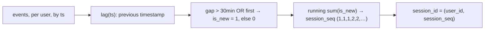

{/* status: authored */}

export const schema = `CREATE TABLE events (
  user_id int NOT NULL,
  ts      timestamptz NOT NULL,
  page    text NOT NULL
);
INSERT INTO events (user_id, ts, page) VALUES
  (1, TIMESTAMPTZ '2024-03-01 09:00+00', '/home'),
  (1, TIMESTAMPTZ '2024-03-01 09:05+00', '/pricing'),
  (1, TIMESTAMPTZ '2024-03-01 09:20+00', '/docs'),
  (1, TIMESTAMPTZ '2024-03-01 11:00+00', '/home'),      -- 100-min gap → new session
  (1, TIMESTAMPTZ '2024-03-01 11:10+00', '/checkout'),
  (2, TIMESTAMPTZ '2024-03-01 09:02+00', '/home'),
  (2, TIMESTAMPTZ '2024-03-01 09:40+00', '/blog');       -- 38-min gap → new session`;

# Sessionization with window functions

## First principles

A **session** is a run of activity by one user with no gap longer than some
threshold (30 minutes is the web analytics convention). Raw events don't carry a
session id; you compute it.

The standard SQL pattern, per user, ordered by time:

1. **`lag(ts)`** — the previous event's timestamp.
2. **Gap flag**: `ts - lag(ts) > INTERVAL '30 min'` (or `lag(ts) IS NULL` for the
   first event) → `1`, else `0`. This marks every event that *starts* a new
   session.
3. **Cumulative sum** of that flag → a session number that increments at each
   boundary and stays constant within a session.
4. Combine with `user_id` for a globally unique `session_id`.

```sql
SELECT *,
  sum(is_new_session) OVER (PARTITION BY user_id ORDER BY ts) AS session_seq
FROM (
  SELECT *,
    CASE WHEN ts - lag(ts) OVER (PARTITION BY user_id ORDER BY ts) > INTERVAL '30 min'
           OR lag(ts) OVER (PARTITION BY user_id ORDER BY ts) IS NULL
         THEN 1 ELSE 0 END AS is_new_session
  FROM events
) g;
```

Once every event has a `session_id`, session-level metrics are a `GROUP BY
session_id`: duration (`max(ts) - min(ts)`), page count, entry/exit page
(`first_value`/`last_value`), bounce (`count(*) = 1`).

## The mechanism



## Hand-trace on dummy data

User 1's five events → two sessions (the 100-minute gap splits them):

<QueryTrace
  caption="lag → gap → cumulative sum of the boundary flag"
  steps={[
    {
      title: "1 · events for user 1, ordered by ts",
      op: "ts",
      table: {
        columns: ["ts", "page"],
        rows: [["09:00","/home"],["09:05","/pricing"],["09:20","/docs"],["11:00","/home"],["11:10","/checkout"]],
      },
    },
    {
      title: "2 · lag(ts) and the gap",
      op: "ts",
      table: {
        columns: ["ts", "lag(ts)", "gap", "> 30 min?"],
        rows: [
          ["09:00","(null)","—","new (first)"],
          ["09:05","09:00","5 min","no"],
          ["09:20","09:05","15 min","no"],
          ["11:00","09:20","100 min","YES → new"],
          ["11:10","11:00","10 min","no"],
        ],
      },
    },
    {
      title: "3 · is_new_session flag, then running sum",
      op: "ts",
      table: {
        columns: ["ts", "is_new", "sum(is_new) = session_seq"],
        rows: [["09:00",1,1],["09:05",0,1],["09:20",0,1],["11:00",1,2],["11:10",0,2]],
      },
    },
    {
      title: "4 · session metrics: GROUP BY (user_id, session_seq) — result",
      table: {
        name: "result",
        result: true,
        columns: ["session_id", "events", "duration", "entry", "exit"],
        rows: [["1-1",3,"20 min","/home","/docs"],["1-2",2,"10 min","/home","/checkout"]],
      },
    },
  ]}
/>

## Run it

<SqlRunner title="assign session ids" setup={schema}>
{`SELECT user_id, ts, page,
       user_id || '-' || sum(is_new) OVER (PARTITION BY user_id ORDER BY ts) AS session_id
FROM (
  SELECT *,
    CASE WHEN ts - lag(ts) OVER w > INTERVAL '30 min' OR lag(ts) OVER w IS NULL
         THEN 1 ELSE 0 END AS is_new
  FROM events
  WINDOW w AS (PARTITION BY user_id ORDER BY ts)
) g
ORDER BY user_id, ts;`}
</SqlRunner>

<SqlRunner title="session-level metrics" setup={schema}>
{`WITH sessioned AS (
  SELECT *, user_id || '-' || sum(is_new) OVER (PARTITION BY user_id ORDER BY ts) AS session_id
  FROM (
    SELECT *, CASE WHEN ts - lag(ts) OVER w > INTERVAL '30 min' OR lag(ts) OVER w IS NULL
                   THEN 1 ELSE 0 END AS is_new
    FROM events WINDOW w AS (PARTITION BY user_id ORDER BY ts)
  ) g
)
SELECT session_id,
       count(*)                       AS pageviews,
       min(ts)                        AS started,
       max(ts) - min(ts)              AS duration,
       (array_agg(page ORDER BY ts))[1]                       AS entry_page,
       (array_agg(page ORDER BY ts DESC))[1]                  AS exit_page,
       (count(*) = 1)                 AS bounced
FROM sessioned
GROUP BY session_id
ORDER BY session_id;`}
</SqlRunner>

<SqlRunner title="tune the gap threshold" setup={schema}>
{`-- with a 60-minute gap, user 2's 38-min gap no longer splits
SELECT user_id, count(DISTINCT session_id) AS sessions FROM (
  SELECT user_id, user_id || '-' || sum(is_new) OVER (PARTITION BY user_id ORDER BY ts) AS session_id
  FROM (
    SELECT *, CASE WHEN ts - lag(ts) OVER w > INTERVAL '60 min' OR lag(ts) OVER w IS NULL
                   THEN 1 ELSE 0 END AS is_new
    FROM events WINDOW w AS (PARTITION BY user_id ORDER BY ts)
  ) g
) s GROUP BY user_id ORDER BY user_id;`}
</SqlRunner>

<RunThis file="sql/data-engineering/08_sessionization_with_window_functions/topic.sql" />

## Build → Break → Fix → Why

:::tip[🔨 Build]
`lag(ts)` → boundary flag (`gap > threshold OR first`) → `sum(flag) OVER
(PARTITION BY user ORDER BY ts)` → `session_id = (user_id, seq)`. Then `GROUP BY
session_id` for every session metric.
:::

:::danger[💥 Break]
Define a session as "all events for a user on the same calendar day". A user
active 23:50–00:10 gets split into two "sessions"; a user with a 6-hour gap at
lunch counts as one. Or: forget `PARTITION BY user_id`, and the running sum
carries across users so everyone shares session numbers.
:::

:::note[🔧 Fix]
- Session boundary is an **inactivity gap**, not a clock boundary.
- `PARTITION BY user_id` on **both** window functions (the `lag` and the running
  `sum`).
- Handle the first event (`lag` is `NULL`) explicitly as a boundary.
- Order by `(ts, tiebreaker)` if timestamps can collide.
:::

:::info[🧠 Why it behaved that way]
`lag()` gives you the previous row's value *within the ordered partition*, so
`ts - lag(ts)` is exactly the inactivity gap. Turning "is this the start of a new
session?" into a 0/1 flag makes it *additive*, and a running `sum` of an additive
0/1 flag is a step function that increments precisely at each boundary and is
constant in between — which is exactly what a session number is. Partitioning by
user keeps each user's sessions independent.
:::

## Pitfalls & idioms

- Both windows partition by the entity (`user_id`); a missing `PARTITION BY`
  bleeds state across users.
- First-row handling: `lag(ts) IS NULL` → new session.
- `WINDOW w AS (...)` to define the spec once and reuse it.
- Threshold is a business choice (30 min web, longer for mobile/IoT). Make it a
  parameter.
- For entry/exit pages, `(array_agg(page ORDER BY ts))[1]` is robust;
  `first_value`/`last_value` need a careful frame.
- Same pattern for "trips" (GPS points), "conversations" (messages), "outages"
  (alerts) — any gap-delimited grouping.
- Materialise `session_id` onto the fact once, don't recompute per query.

## See also

- [Window functions: PARTITION BY & ranking](/foundations/window-functions-partitioning-and-ranking) — `lag`, running aggregates
- [Window frames](/foundations/window-frames) — `first_value` / `last_value`
- [Dates, times, intervals & time zones](/foundations/dates-times-and-time-zones) — the gap arithmetic
- [Rollup & summary tables](/data-engineering/rollup-and-summary-tables) — a sessions fact table

## Check yourself

1. What are the three window-function steps that turn events into sessions?
2. Why make the "new session" a 0/1 flag before summing?
3. What breaks if you forget `PARTITION BY user_id` on the running sum?
4. How do you handle a user's very first event?
5. Why is "same calendar day" a bad session definition?
