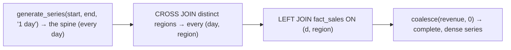

{/* status: authored */}

export const schema = `CREATE TABLE fact_sales (
  d       date NOT NULL,
  region  text NOT NULL,
  revenue numeric NOT NULL
);
INSERT INTO fact_sales VALUES
  (DATE '2024-03-01','EU', 100),
  (DATE '2024-03-01','US', 200),
  (DATE '2024-03-03','EU', 140),   -- nothing on the 2nd
  (DATE '2024-03-05','US', 260);   -- nothing on the 2nd or 4th`;

# The date dimension & filling time-series gaps

## First principles

### The date dimension (`dim_date`)

A table with **one row per calendar day**, pre-loaded for a wide range
(2000–2050), with every attribute a report might slice by:

`date_key` (yyyymmdd int) · `d` (the date) · `year` · `quarter` · `month` ·
`month_name` · `day_of_week` · `is_weekend` · `iso_week` · `is_holiday` (per
locale) · `fiscal_year` / `fiscal_quarter` · `day_of_year` · `days_ago` (if
maintained).

Why bother instead of `EXTRACT()` in each query:

- **Fiscal calendars, holidays, "week starts Monday", 4-4-5 periods** aren't
  expressible in `EXTRACT` — they're lookups.
- Reports **join** `fact.date_key → dim_date.date_key` and group by
  `dim_date.month_name` — no date functions, consistent labels, and the join is a
  fast integer key.
- One place to fix a calendar rule.

Build it once with `generate_series` (see the runner). It's tiny (~18k rows for
50 years) and static.

### Filling gaps

A `GROUP BY d` over the fact only produces rows for days that **have** data.
"Revenue per day, 0 on quiet days" needs a **spine** of all days
`LEFT JOIN`ed to the fact:

```sql
SELECT gs.d, coalesce(sum(f.revenue), 0) AS revenue
FROM generate_series(DATE '2024-03-01', DATE '2024-03-05', INTERVAL '1 day') AS gs(d)
LEFT JOIN fact_sales f ON f.d = gs.d::date
GROUP BY gs.d
ORDER BY gs.d;
```

For **per-group** gap filling (every region × every day), `CROSS JOIN` the day
spine with the distinct groups, then `LEFT JOIN` the fact.

**Carry-forward** (last known value on a gap day, e.g. a price or a balance):
`LEFT JOIN` the spine, then
`coalesce(value, lag(value) ignore nulls ...)` — or a correlated "latest ≤ d"
subquery / `DISTINCT ON`.

## The mechanism



## Hand-trace on dummy data

Dense daily revenue for EU, March 1–5 (data only on the 1st and 3rd):

<QueryTrace
  caption="the day spine is the driver; LEFT JOIN + coalesce fills the 2nd, 4th, 5th with 0"
  steps={[
    {
      title: "1 · fact_sales (EU rows only)",
      op: "d",
      table: { name: "fact_sales", columns: ["d", "region", "revenue"], rows: [["2024-03-01","EU",100],["2024-03-03","EU",140]] },
    },
    {
      title: "2 · spine: generate_series(03-01, 03-05, '1 day')",
      op: "d",
      table: { columns: ["d"], rows: [["2024-03-01"],["2024-03-02"],["2024-03-03"],["2024-03-04"],["2024-03-05"]] },
    },
    {
      title: "3 · spine LEFT JOIN fact_sales ON d — non-matching spine days get NULL revenue",
      op: "revenue",
      table: {
        columns: ["d", "f.revenue"],
        rows: [["2024-03-01",100],["2024-03-02",null],["2024-03-03",140],["2024-03-04",null],["2024-03-05",null]],
      },
      rows: { add: [1, 3, 4] },
    },
    {
      title: "4 · coalesce(sum(revenue), 0) — result: a row for every day",
      op: "revenue",
      table: {
        name: "result",
        result: true,
        columns: ["d", "revenue"],
        rows: [["2024-03-01",100],["2024-03-02",0],["2024-03-03",140],["2024-03-04",0],["2024-03-05",0]],
      },
    },
  ]}
/>

## Run it

<SqlRunner title="build a small dim_date" setup={schema}>
{`CREATE TABLE dim_date AS
SELECT
  to_char(d, 'YYYYMMDD')::int              AS date_key,
  d,
  extract(year  from d)::int               AS year,
  extract(quarter from d)::int             AS quarter,
  extract(month from d)::int               AS month,
  to_char(d, 'Mon')                        AS month_name,
  extract(isodow from d)::int              AS iso_dow,     -- 1=Mon
  (extract(isodow from d) >= 6)            AS is_weekend,
  extract(week from d)::int                AS iso_week
FROM generate_series(DATE '2024-01-01', DATE '2024-12-31', INTERVAL '1 day') AS g(d);
ALTER TABLE dim_date ADD PRIMARY KEY (date_key);

SELECT date_key, month_name, iso_dow, is_weekend FROM dim_date WHERE d BETWEEN DATE '2024-03-01' AND DATE '2024-03-05';`}
</SqlRunner>

<SqlRunner title="gap fill: every day, 0 where none" setup={schema}>
{`SELECT gs.d::date AS d, coalesce(sum(f.revenue), 0) AS revenue
FROM generate_series(DATE '2024-03-01', DATE '2024-03-05', INTERVAL '1 day') AS gs(d)
LEFT JOIN fact_sales f ON f.d = gs.d::date AND f.region = 'EU'
GROUP BY gs.d
ORDER BY gs.d;`}
</SqlRunner>

<SqlRunner title="per-group gap fill: every (day, region)" setup={schema}>
{`WITH days AS (SELECT d::date FROM generate_series(DATE '2024-03-01', DATE '2024-03-05', INTERVAL '1 day') g(d)),
     regions AS (SELECT DISTINCT region FROM fact_sales)
SELECT d, region, coalesce(sum(f.revenue), 0) AS revenue
FROM days CROSS JOIN regions
LEFT JOIN fact_sales f USING (d, region)
GROUP BY d, region
ORDER BY d, region;`}
</SqlRunner>

<SqlRunner title="report via dim_date — no date functions in the query" setup={schema}>
{`CREATE TABLE dim_date AS
SELECT to_char(d,'YYYYMMDD')::int AS date_key, d, to_char(d,'Mon') AS month_name, extract(isodow from d)::int AS iso_dow
FROM generate_series(DATE '2024-03-01', DATE '2024-03-31', INTERVAL '1 day') g(d);

SELECT dd.month_name, sum(f.revenue) AS revenue
FROM fact_sales f JOIN dim_date dd ON dd.d = f.d
WHERE dd.iso_dow <= 5                       -- weekdays, via the dimension
GROUP BY dd.month_name;`}
</SqlRunner>

<RunThis file="sql/data-engineering/10_the_date_dimension_and_gap_filling/topic.sql" />

## Build → Break → Fix → Why

:::tip[🔨 Build]
`dim_date` pre-loaded for the full range with calendar/fiscal/holiday attributes.
Reports join `fact.date_key → dim_date` and group by its columns. Dense
time-series = a `generate_series` spine `LEFT JOIN`ed (`CROSS JOIN` groups first
for per-group density) + `coalesce(..., 0)`.
:::

:::danger[💥 Break]
Chart "daily revenue" straight from `GROUP BY d` over the fact. Quiet days simply
aren't rows, so the line chart connects the 1st to the 3rd as if the 2nd had the
average — a fake trend. Or: compute "fiscal quarter" with a `CASE` on `EXTRACT
(month ...)` in fifteen different reports, and get fifteen slightly different
answers when the fiscal year shifts.
:::

:::note[🔧 Fix]
- Calendar logic in **`dim_date`**, once. Reports never call `EXTRACT`.
- Gap-fill with a `generate_series` spine + `LEFT JOIN` + `coalesce`.
- Per-group gaps: `CROSS JOIN` the group list into the spine before the
  `LEFT JOIN`.
- Carry-forward for stocks/prices, not `0`.
:::

:::info[🧠 Why it behaved that way]
`GROUP BY` only produces a row where the group *exists in the input* — a day with
no sales contributes no rows, so it can't appear. A spine (`generate_series`)
supplies the rows that *should* exist; `LEFT JOIN` keeps every spine row and
attaches the fact where it matches; `coalesce` turns the resulting `NULL` into
the value a missing day means (`0` for a flow, the previous value for a stock).
`dim_date` is the same principle applied to *labels and hierarchies*: encode the
calendar as data so every query is a join, not a re-derivation.
:::

## Pitfalls & idioms

- `generate_series(date, date, interval)` returns `timestamptz` — cast `::date`
  and mind the session time zone for day boundaries.
- Per-group gap fill: build `days × groups` first, *then* `LEFT JOIN` the fact.
  A `LEFT JOIN` to just the day spine loses groups with no data at all.
- `coalesce(sum(x), 0)` for flows; carry-forward (`last_value` / `DISTINCT ON`
  latest ≤ d) for balances and prices.
- `dim_date` PK is `date_key` (int yyyymmdd) — compact join key, human-readable.
- Add an "Unknown" date row (`date_key = -1`) for facts with a missing date, so
  the join stays `INNER` and counts don't drop.
- Time-of-day → a separate `dim_time` (1440 rows), don't cram it into `dim_date`.
- Precompute the range you need plus headroom; refreshing `dim_date` is a rare
  batch job.

## See also

- [Dates, times, intervals & time zones](/foundations/dates-times-and-time-zones) — the `generate_series` spine, day boundaries
- [Outer joins](/foundations/outer-joins) — `LEFT JOIN` + `coalesce`
- [Self-joins & CROSS JOIN](/foundations/self-joins-and-cross-joins) — the day × group grid
- [Dimensional modeling: the star schema](/data-engineering/dimensional-modeling-star-schema) — where `dim_date` fits

## Check yourself

1. Two things `dim_date` handles that `EXTRACT()` can't.
2. Why does `SELECT d, sum(revenue) ... GROUP BY d` skip quiet days?
3. Write the pattern to get one revenue row per day in a range, `0` where there's
   no data.
4. Why must per-group gap filling `CROSS JOIN` the groups before the `LEFT JOIN`?
5. When do you carry the previous value forward instead of using `0`?
