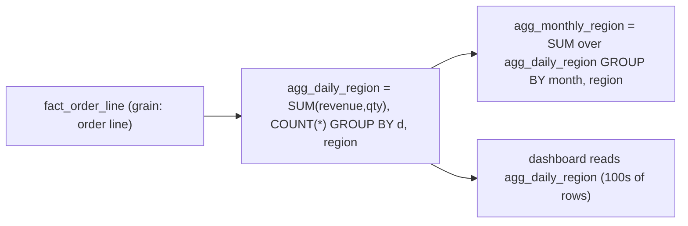

{/* status: authored */}

export const schema = `CREATE TABLE fact_order_line (
  order_id  int, line_no int,
  d         date NOT NULL,
  region    text NOT NULL,
  product   text NOT NULL,
  qty       int NOT NULL,
  revenue   numeric(12,2) NOT NULL
);
INSERT INTO fact_order_line
SELECT (g/3)+1, (g%3)+1,
       DATE '2024-03-01' + (g % 10),
       (ARRAY['EU','US'])[1+(g%2)],
       (ARRAY['lamp','mug','cable'])[1+(g%3)],
       (g % 4) + 1,
       (((g % 4) + 1) * (ARRAY[28,9,8])[1+(g%3)])::numeric
FROM generate_series(0, 599) g;`;

# Rollup & summary tables

## First principles

A dashboard that repeatedly aggregates a huge fact table for the same views is
doing the same work thousands of times. A **summary table** (a.k.a. rollup,
aggregate table, pre-aggregation, cube) computes those aggregates **once per
load** and stores them at a **coarser grain**.

`fact_order_line` (millions of rows, grain = order line) → `agg_daily_region`
(hundreds of rows, grain = day × region). A "revenue by region this month" query
reads hundreds of rows instead of millions.

Rules:

- **Pick the grain from the query patterns.** One summary per common
  "group-by set": `(day, region)`, `(month, product)`, `(day, region, product)`.
  A [materialized view](/foundations/views-and-materialized-views) or a real
  table.
- **Only additive measures.** `sum(revenue)`, `sum(qty)`, `count(*)` roll up
  cleanly. **Never store `avg` or a ratio** — store the numerator and
  denominator, divide at read time
  ([grain & additivity](/data-engineering/grain-and-measure-additivity)).
- **Distinct counts don't roll up.** `count(distinct customer)` for a month is
  *not* the sum of daily distinct counts. Store raw IDs, use HyperLogLog, or
  accept a separate query.
- **Refresh** either fully (`REFRESH MATERIALIZED VIEW`, simple, or `TRUNCATE +
  INSERT SELECT`) or **incrementally**: re-aggregate only the partitions/days
  that the last load touched, and `MERGE`/upsert them in.
- **Reconcile.** `sum(summary) == sum(fact)` after every refresh, or you've
  shipped a silently wrong number.

You can layer them: `fact → agg_daily → agg_monthly`. Each level is additive over
the one below.

## The mechanism

## Hand-trace on dummy data

Roll `fact_order_line` up to `(d, region)`, then check it reconciles:

<QueryTrace
  caption="GROUP BY the summary grain; keep additive measures; totals must match the fact"
  steps={[
    {
      title: "1 · fact_order_line (grain = order line) — many rows per (d, region)",
      table: {
        name: "fact_order_line (sample)",
        columns: ["d", "region", "product", "qty", "revenue"],
        rows: [["03-01","EU","lamp",1,28],["03-01","EU","mug",2,18],["03-01","US","cable",3,24],["…","…","…","…","…"]],
      },
    },
    {
      title: "2 · GROUP BY d, region — one row per pair, additive measures only",
      op: "region",
      table: {
        columns: ["d", "region", "sum(revenue)", "sum(qty)", "count(*)"],
        rows: [["03-01","EU","46","3","2"],["03-01","US","24","3","1"],["…","…","…","…","…"]],
      },
    },
    {
      title: "3 · avg order-line value = sum(revenue)/count(*)  (computed at read, NOT stored)",
      op: "revenue",
      table: {
        columns: ["d", "region", "avg_line = revenue / lines"],
        rows: [["03-01","EU","23.00"],["03-01","US","24.00"]],
      },
    },
    {
      title: "4 · reconcile: sum(agg.revenue) == sum(fact.revenue) — result",
      table: {
        name: "result",
        result: true,
        columns: ["agg_daily_region total", "fact total", "match?"],
        rows: [["Σ = X", "Σ = X", "✓ — safe to publish"]],
      },
    },
  ]}
/>

## Run it

<SqlRunner title="build the summary table" setup={schema}>
{`CREATE TABLE agg_daily_region AS
SELECT d, region,
       sum(revenue) AS revenue,
       sum(qty)     AS qty,
       count(*)     AS order_lines,
       count(DISTINCT order_id) AS orders
FROM fact_order_line
GROUP BY d, region;
ALTER TABLE agg_daily_region ADD PRIMARY KEY (d, region);

SELECT * FROM agg_daily_region ORDER BY d, region LIMIT 6;
SELECT count(*) AS summary_rows FROM agg_daily_region;   -- ~20, vs 600 fact rows`}
</SqlRunner>

<SqlRunner title="ratios computed at read time" setup={schema}>
{`CREATE TABLE agg AS
SELECT region, sum(revenue) AS revenue, sum(qty) AS qty, count(*) AS lines
FROM fact_order_line GROUP BY region;

SELECT region,
       revenue, qty,
       round(revenue / qty, 2)   AS avg_unit_price,   -- from stored sums
       round(revenue / lines, 2) AS avg_line_value
FROM agg ORDER BY region;`}
</SqlRunner>

<SqlRunner title="incremental refresh: only the changed days" setup={schema}>
{`CREATE TABLE agg_daily_region (
  d date, region text, revenue numeric, qty int, order_lines int,
  PRIMARY KEY (d, region)
);
INSERT INTO agg_daily_region SELECT d, region, sum(revenue), sum(qty), count(*)
FROM fact_order_line GROUP BY d, region;

-- new fact rows land for 2024-03-11
INSERT INTO fact_order_line VALUES (999, 1, DATE '2024-03-11', 'EU', 'lamp', 2, 56);

-- re-aggregate ONLY that day and upsert
INSERT INTO agg_daily_region
SELECT d, region, sum(revenue), sum(qty), count(*)
FROM fact_order_line WHERE d = DATE '2024-03-11'
GROUP BY d, region
ON CONFLICT (d, region) DO UPDATE
  SET revenue = EXCLUDED.revenue, qty = EXCLUDED.qty, order_lines = EXCLUDED.order_lines;

SELECT * FROM agg_daily_region WHERE d = DATE '2024-03-11';`}
</SqlRunner>

<SqlRunner title="reconcile the summary against the fact" setup={schema}>
{`CREATE TABLE agg AS SELECT d, region, sum(revenue) AS revenue FROM fact_order_line GROUP BY d, region;
SELECT
  (SELECT sum(revenue) FROM agg)              AS summary_total,
  (SELECT sum(revenue) FROM fact_order_line)  AS fact_total,
  (SELECT sum(revenue) FROM agg) = (SELECT sum(revenue) FROM fact_order_line) AS reconciles;`}
</SqlRunner>

<RunThis file="sql/data-engineering/11_rollup_and_summary_tables/topic.sql" />

## Build → Break → Fix → Why

:::tip[🔨 Build]
One summary per common group-by set, grain chosen from the dashboards. Store
`sum(...)`, `count(*)` — additive only. Ratios/averages computed at read from the
stored sums. Incremental refresh re-aggregates only touched partitions and
upserts. Reconcile totals every load.
:::

:::danger[💥 Break]
Store `avg_order_value` in the daily summary. The monthly view does
`avg(avg_order_value)` — the average of daily averages, which weights a slow
Tuesday the same as a busy Saturday. The number is plausibly wrong, so nobody
catches it.
:::

:::danger[💥 Break (distinct counts)]
Store `daily_distinct_customers` and `SUM` it for a monthly figure — customers who
visited on 5 days are counted 5 times, inflating "monthly active users" ~3–5×.
:::

:::note[🔧 Fix]
- Additive measures only. Derive ratios from stored numerator/denominator.
- Distinct counts: don't pre-aggregate them (or use HLL, or keep raw IDs).
- Refresh incrementally by partition/day; reconcile against the fact.
- If freshness matters more than cost, keep it as a live
  [view](/foundations/views-and-materialized-views); if cost matters more, a
  table refreshed on a schedule.
:::

:::info[🧠 Why it behaved that way]
`SUM` and `COUNT` are associative — `sum(sum(x))` over a partition equals
`sum(x)` over the whole — so an additive measure can be rolled through as many
levels as you like and stay exact. `AVG` isn't: it's `sum/count`, and averaging
averages loses the per-group weights. `COUNT(DISTINCT)` isn't even additive
between *disjoint* sets that overlap in membership over time. So the rule "store
sums, derive the rest" isn't a style choice — it's the only thing that survives
aggregation.
:::

## Pitfalls & idioms

- Grain from the queries. Too fine = barely smaller than the fact; too coarse =
  can't answer the question. Multiple summaries is normal.
- Additive measures + `count(*)`. A `count` column makes "number of lines" a
  `SUM`.
- Add a `sum(x)` **and** the `count` behind every average you'll want.
- Incremental refresh keyed on the load's affected partitions (usually date);
  `ON CONFLICT` / `MERGE` to upsert.
- Full refresh (`TRUNCATE; INSERT SELECT` or `REFRESH MATERIALIZED VIEW`) is fine
  when it's fast enough — simpler and drift-free.
- Reconcile every refresh; alert on mismatch.
- Layer summaries (`daily → monthly`) rather than re-scanning the fact for each.
- Index the summary for its read patterns like any table.

## See also

- [Grain & measure additivity](/data-engineering/grain-and-measure-additivity) — what can and can't roll up
- [Views & materialized views](/foundations/views-and-materialized-views) — matview vs table
- [Incremental loads & watermarks](/data-engineering/incremental-loads-and-watermarks) — the refresh pattern
- [GROUPING SETS, ROLLUP, CUBE](/foundations/grouping-sets-rollup-cube) — building several grains in one pass

## Check yourself

1. How do you choose a summary table's grain?
2. Why must you not store `avg_revenue` in a summary — and what do you store
   instead?
3. Why can't you `SUM` daily distinct-customer counts to get a monthly figure?
4. Sketch an incremental refresh for a `(day, region)` summary.
5. What check runs after every summary refresh?
