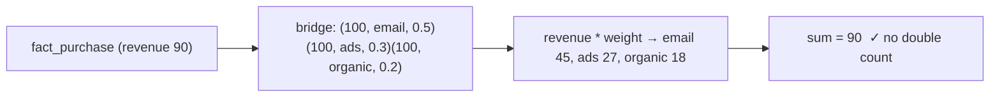

{/* status: authored */}

export const schema = `CREATE TABLE dim_customer (customer_key int PRIMARY KEY, name text);
CREATE TABLE dim_channel  (channel_key int PRIMARY KEY, name text);
INSERT INTO dim_customer VALUES (1,'Ana'), (2,'Ben');
INSERT INTO dim_channel  VALUES (10,'email'), (11,'ads'), (12,'organic');

-- a purchase is attributed to MULTIPLE marketing channels
CREATE TABLE fact_purchase (
  purchase_id int PRIMARY KEY,
  customer_key int NOT NULL,
  revenue numeric(12,2) NOT NULL
);
INSERT INTO fact_purchase VALUES (100, 1, 90), (101, 2, 40);`;

# Bridge tables for many-to-many in a star schema

## First principles

A [star schema](/data-engineering/dimensional-modeling-star-schema) fact row
points at **one** member of each dimension. But some relationships are
many-to-many *at the fact grain*:

- a purchase attributed to **several marketing channels**,
- a bank account with **multiple holders**,
- a hospital visit with **multiple diagnoses**,
- a document with **multiple tags**.

You can't put a single `channel_key` on `fact_purchase`. The solutions:

### 1. A bridge table

`bridge_purchase_channel(purchase_key, channel_key, weight)` — one row per
(fact, dimension member), plus an **allocation factor** (`weight`) that sums to
`1.0` per fact. Then:

```sql
SELECT c.name AS channel, sum(f.revenue * b.weight) AS attributed_revenue
FROM fact_purchase f
JOIN bridge_purchase_channel b ON b.purchase_key = f.purchase_id
JOIN dim_channel c ON c.channel_key = b.channel_key
GROUP BY c.name;
```

`revenue * weight` splits each purchase's revenue across its channels, so
`sum(attributed_revenue) == sum(revenue)` — **no double-counting**.

Without the weight (or with `weight = 1` per row) you can still answer "revenue
that *touched* the email channel" — but you **must not** `SUM` it as a grand
total, because a 3-channel purchase is counted 3×. Report it as "influenced
revenue", clearly labelled.

### 2. A group / "many-valued dimension" key

Give each *set* of members an id: `dim_channel_group(group_key)` +
`bridge(group_key, channel_key, weight)`. The fact stores one `channel_group_key`.
Good when the same combinations recur (fewer bridge rows) and you sometimes want
to filter on the whole set.

### 3. Pick a primary + keep the rest as attributes

"Last-touch channel" as `channel_key` on the fact (single-valued, no bridge),
with the full list in a bridge for the rare multi-channel report. Simplest if the
business mostly wants one attribution model.

## The mechanism



## Hand-trace on dummy data

Purchase 100 (€90) attributed 50/30/20 to email/ads/organic:

<QueryTrace
  caption="the bridge fans the fact out to one row per channel; weight splits the measure"
  steps={[
    {
      title: "1 · fact_purchase",
      table: { name: "fact_purchase", columns: ["purchase_id", "customer_key", "revenue"], rows: [[100,1,90],[101,2,40]] },
    },
    {
      title: "2 · bridge_purchase_channel — weights sum to 1.0 per purchase",
      op: "weight",
      table: {
        name: "bridge_purchase_channel",
        columns: ["purchase_key", "channel_key", "weight"],
        rows: [[100,10,0.5],[100,11,0.3],[100,12,0.2],[101,10,1.0]],
      },
    },
    {
      title: "3 · join + revenue * weight",
      op: "weight",
      table: {
        columns: ["purchase", "channel", "revenue * weight"],
        rows: [[100,"email","45.00"],[100,"ads","27.00"],[100,"organic","18.00"],[101,"email","40.00"]],
      },
    },
    {
      title: "4 · GROUP BY channel — attributed revenue sums back to 130 — result",
      op: "channel",
      table: {
        name: "result",
        result: true,
        columns: ["channel", "attributed_revenue"],
        rows: [["ads",27.0],["email",85.0],["organic",18.0]],
      },
    },
  ]}
/>

## Run it

<SqlRunner title="weighted attribution — no double count" setup={schema}>
{`CREATE TABLE bridge_purchase_channel (
  purchase_key int NOT NULL REFERENCES fact_purchase(purchase_id),
  channel_key  int NOT NULL REFERENCES dim_channel(channel_key),
  weight numeric(5,4) NOT NULL,
  PRIMARY KEY (purchase_key, channel_key)
);
INSERT INTO bridge_purchase_channel VALUES
  (100, 10, 0.5), (100, 11, 0.3), (100, 12, 0.2),
  (101, 10, 1.0);

SELECT c.name AS channel, sum(f.revenue * b.weight) AS attributed_revenue
FROM fact_purchase f
JOIN bridge_purchase_channel b ON b.purchase_key = f.purchase_id
JOIN dim_channel c ON c.channel_key = b.channel_key
GROUP BY c.name
ORDER BY c.name;

-- the grand total still reconciles:
SELECT sum(f.revenue * b.weight) AS attributed, (SELECT sum(revenue) FROM fact_purchase) AS actual
FROM fact_purchase f JOIN bridge_purchase_channel b ON b.purchase_key = f.purchase_id;`}
</SqlRunner>

<SqlRunner title="the double-count you get without weights" setup={schema}>
{`CREATE TABLE bridge (purchase_key int, channel_key int, PRIMARY KEY (purchase_key, channel_key));
INSERT INTO bridge VALUES (100,10),(100,11),(100,12),(101,10);

-- "influenced revenue" per channel — useful, but DON'T sum it as a total
SELECT c.name, sum(f.revenue) AS influenced_revenue
FROM fact_purchase f JOIN bridge b ON b.purchase_key = f.purchase_id
JOIN dim_channel c ON c.channel_key = b.channel_key
GROUP BY c.name ORDER BY c.name;

SELECT sum(f.revenue) AS inflated_total   -- 90*3 + 40 = 310, not 130
FROM fact_purchase f JOIN bridge b ON b.purchase_key = f.purchase_id;`}
</SqlRunner>

<SqlRunner title="a group key instead of a per-fact bridge" setup={schema}>
{`CREATE TABLE dim_channel_group (group_key int PRIMARY KEY, label text);
CREATE TABLE bridge_group_channel (group_key int, channel_key int, weight numeric, PRIMARY KEY (group_key, channel_key));
INSERT INTO dim_channel_group VALUES (1,'email+ads+organic'), (2,'email only');
INSERT INTO bridge_group_channel VALUES (1,10,0.5),(1,11,0.3),(1,12,0.2),(2,10,1.0);

ALTER TABLE fact_purchase ADD COLUMN channel_group_key int;
UPDATE fact_purchase SET channel_group_key = CASE purchase_id WHEN 100 THEN 1 ELSE 2 END;

SELECT c.name, sum(f.revenue * b.weight) AS attributed
FROM fact_purchase f
JOIN bridge_group_channel b ON b.group_key = f.channel_group_key
JOIN dim_channel c ON c.channel_key = b.channel_key
GROUP BY c.name ORDER BY c.name;`}
</SqlRunner>

<RunThis file="sql/data-engineering/12_bridge_tables/topic.sql" />

## Build → Break → Fix → Why

:::tip[🔨 Build]
`bridge_fact_dim(fact_key, dim_key, weight)`, weights summing to `1.0` per fact,
`PRIMARY KEY (fact_key, dim_key)`. Report `sum(measure * weight)` grouped by the
dimension — reconciles to the fact total.
:::

:::danger[💥 Break]
Bridge with no weight, and the revenue-by-channel dashboard does `sum(revenue)`.
A purchase touching 3 channels adds its full revenue to all 3, so "total revenue
across channels" is 2–3× the real number and the CFO's deck is wrong.
:::

:::danger[💥 Break (the other way)]
Avoid the bridge by stuffing channels into `fact.channels text[]`. Now
"attributed revenue by channel" needs an `unnest` and you've still no place for
the weight — you're rebuilding a bridge table badly.
:::

:::note[🔧 Fix]
- Bridge table with an **allocation `weight`** for any measure you'll total.
- Enforce `sum(weight) = 1.0` per fact (a check via a trigger or a load-time
  assertion).
- Without weights, only report "influenced/touched" metrics, never a summed
  total.
- Group key when combinations recur and you filter on the set.
:::

:::info[🧠 Why it behaved that way]
A star join is one-to-many from fact to bridge, so joining a fact through a
bridge **fans it out** — one fact row becomes N. Any additive measure on the fact
is then repeated N times, and `SUM` over-counts by exactly the fan-out. The
`weight` column undoes it: multiplying the measure by a factor that sums to 1
across the fan-out redistributes the measure instead of duplicating it, so the
grand total is preserved. It's the same fan-out math as a
[bad JOIN](/foundations/inner-join), made safe by the allocation.
:::

## Pitfalls & idioms

- `sum(measure * weight)`, and check `sum(weight) = 1` per fact at load time.
- `PRIMARY KEY (fact_key, dim_key)` on the bridge; index the `dim_key` for
  reverse lookups.
- "Influenced" / "touched" metrics (no weight) are legitimate — just never
  present them as a total.
- Group/set key reduces bridge rows when combinations recur; per-fact bridge is
  simpler otherwise.
- Attribution models (first-touch, last-touch, linear, time-decay) are just
  different `weight` assignments — you can store several weight columns or
  several bridges.
- A bridge is a [junction table](/backend/modeling-relationships) with an
  allocation factor — same shape, warehouse purpose.
- Watch the row explosion: `fact × avg(members)` can be large; consider
  pre-aggregating the attributed measure.

## See also

- [Dimensional modeling: the star schema](/data-engineering/dimensional-modeling-star-schema) — single-valued dimensions
- [INNER JOIN](/foundations/inner-join) — the fan-out the weight tames
- [Backend → modeling relationships](/backend/modeling-relationships) — junction tables
- [Grain & measure additivity](/data-engineering/grain-and-measure-additivity) — why the total must reconcile

## Check yourself

1. Why can't a fact row just have a `channel_key` column for multi-channel
   attribution?
2. What does the `weight` column do, and what must it sum to per fact?
3. What can you safely report from a bridge *without* weights, and what can't
   you?
4. When is a channel-group key better than a per-fact bridge?
5. How are "first-touch" and "linear" attribution modelled with a bridge?
