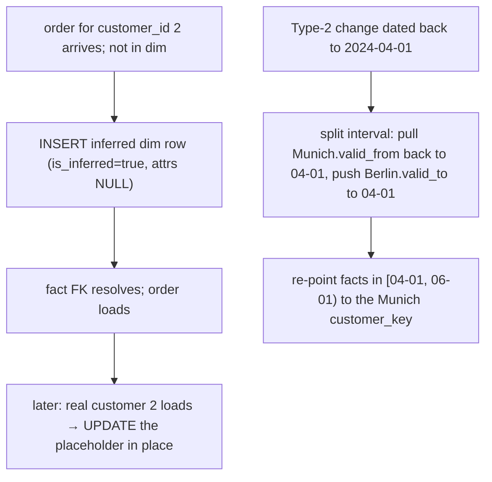

{/* status: authored */}

export const schema = `CREATE TABLE dim_customer (
  customer_key bigint GENERATED ALWAYS AS IDENTITY PRIMARY KEY,
  customer_id  int NOT NULL,
  name text, city text,
  valid_from date NOT NULL, valid_to date NOT NULL DEFAULT DATE '9999-12-31',
  is_current boolean NOT NULL DEFAULT true,
  is_inferred boolean NOT NULL DEFAULT false     -- placeholder for a not-yet-loaded customer
);
CREATE UNIQUE INDEX ON dim_customer (customer_id) WHERE is_current;
INSERT INTO dim_customer (customer_id, name, city, valid_from)
VALUES (1, 'Ana', 'Berlin', DATE '2024-01-01');

CREATE TABLE fact_order (
  order_id int PRIMARY KEY,
  customer_key bigint NOT NULL REFERENCES dim_customer(customer_key),
  ordered_on date NOT NULL,
  amount numeric NOT NULL
);`;

# Late-arriving dimensions & facts

## First principles

Two related problems.

### Late-arriving fact (early-arriving fact / late dimension)

An order for `customer_id = 2` arrives, but customer 2 isn't in `dim_customer`
yet (the customer feed runs later). You can't drop the order, and the FK to
`dim_customer` must resolve.

**Fix: an inferred (placeholder) dimension member.** Insert a `dim_customer` row
for `customer_id = 2` now, with attributes `NULL`/`'Unknown'` and
`is_inferred = true`. The fact joins to it. When the real customer record loads,
**update the placeholder in place** (Type 1) rather than creating a second row.

### Late-arriving dimension change

You process a [Type 2](/data-engineering/slowly-changing-dimensions-type-2)
change on **2024-06-01**: Ana moved to Munich. Then you learn the move was
*effective 2024-04-01*, and there are April/May orders that should point at the
Munich version.

**Fix: split the existing interval.** The Berlin version was
`[2024-01-01, 9999-12-31)`; the naive June load made it `[2024-01-01,
2024-06-01)` + Munich `[2024-06-01, ...)`. Correct history:

- Berlin: `[2024-01-01, 2024-04-01)`
- Munich: `[2024-04-01, 9999-12-31)` — `valid_from` moved *back*

and any fact rows in `[2024-04-01, 2024-06-01)` that got the Berlin
`customer_key` must be **re-pointed** to the Munich `customer_key` (or you re-run
the fact key-lookup for that window).

## The mechanism

## Hand-trace on dummy data

An order for the not-yet-loaded customer 2, then the real record arrives:

<QueryTrace
  caption="inferred member lets the fact load now; the real record updates it in place — same key"
  steps={[
    {
      title: "1 · dim_customer has only customer 1; an order for customer 2 arrives",
      op: "customer_id",
      table: {
        name: "dim_customer",
        columns: ["customer_key", "customer_id", "name", "is_inferred"],
        rows: [[1,1,"Ana",false]],
      },
    },
    {
      title: "2 · INSERT inferred row for customer_id 2 — attrs Unknown, is_inferred = true",
      op: "is_inferred",
      table: {
        columns: ["customer_key", "customer_id", "name", "is_inferred"],
        rows: [[2,2,"(Unknown)",true]],
      },
      rows: { add: [0] },
    },
    {
      title: "3 · the order loads: fact_order(customer_key = 2) — FK resolves",
      op: "customer_key",
      table: { name: "fact_order", columns: ["order_id", "customer_key", "amount"], rows: [[500,2,40]] },
      rows: { add: [0] },
    },
    {
      title: "4 · real customer 2 loads → UPDATE dim_customer SET name='Ben', city='Lagos', is_inferred=false WHERE customer_key = 2 — result",
      op: "is_inferred",
      table: {
        name: "dim_customer (after)",
        result: true,
        columns: ["customer_key", "customer_id", "name", "city", "is_inferred"],
        rows: [[1,1,"Ana","Berlin",false],[2,2,"Ben","Lagos",false]],
      },
    },
  ]}
/>

## Run it

<SqlRunner title="inferred dimension member for a late fact" setup={schema}>
{`-- an order for customer_id 2, who isn't loaded yet
-- 1. create the placeholder
INSERT INTO dim_customer (customer_id, name, city, valid_from, is_inferred)
SELECT 2, '(Unknown)', '(Unknown)', DATE '2024-03-01', true
WHERE NOT EXISTS (SELECT 1 FROM dim_customer WHERE customer_id = 2 AND is_current);

-- 2. load the fact against it
INSERT INTO fact_order (order_id, customer_key, ordered_on, amount)
SELECT 500, dc.customer_key, DATE '2024-03-01', 40
FROM dim_customer dc WHERE dc.customer_id = 2 AND dc.is_current;

SELECT o.order_id, c.name, c.is_inferred FROM fact_order o JOIN dim_customer c USING (customer_key);

-- 3. the real customer record arrives — update the placeholder IN PLACE
UPDATE dim_customer SET name = 'Ben', city = 'Lagos', is_inferred = false
WHERE customer_id = 2 AND is_current AND is_inferred;

SELECT o.order_id, c.name, c.is_inferred FROM fact_order o JOIN dim_customer c USING (customer_key);`}
</SqlRunner>

<SqlRunner title="late Type-2 change: split the interval" setup={schema}>
{`-- current state: Ana Berlin [2024-01-01, 9999)
-- a NAIVE June load already split it at 2024-06-01:
UPDATE dim_customer SET valid_to = DATE '2024-06-01', is_current = false WHERE customer_id = 1;
INSERT INTO dim_customer (customer_id, name, city, valid_from)
VALUES (1, 'Ana', 'Munich', DATE '2024-06-01');

-- now we learn the move was effective 2024-04-01. Correct the boundary:
UPDATE dim_customer SET valid_to = DATE '2024-04-01'
WHERE customer_id = 1 AND city = 'Berlin';
UPDATE dim_customer SET valid_from = DATE '2024-04-01'
WHERE customer_id = 1 AND city = 'Munich';

SELECT customer_key, city, valid_from, valid_to FROM dim_customer WHERE customer_id = 1 ORDER BY valid_from;`}
</SqlRunner>

<SqlRunner title="re-point facts caught in the corrected window" setup={schema}>
{`-- rebuild: Ana Berlin [01-01, 04-01), Munich [04-01, 9999)
UPDATE dim_customer SET valid_to = DATE '2024-04-01', is_current = false WHERE customer_id = 1 AND city = 'Berlin';
INSERT INTO dim_customer (customer_id, name, city, valid_from) VALUES (1, 'Ana', 'Munich', DATE '2024-04-01');

-- a May order was loaded pointing at the BERLIN key (wrong)
INSERT INTO fact_order
SELECT 600, customer_key, DATE '2024-05-15', 90 FROM dim_customer WHERE customer_id = 1 AND city = 'Berlin';

-- re-point every fact to the version valid on its own date
UPDATE fact_order f
SET customer_key = dc.customer_key
FROM dim_customer dc
WHERE dc.customer_id = 1
  AND f.ordered_on >= dc.valid_from AND f.ordered_on < dc.valid_to
  AND f.customer_key <> dc.customer_key;

SELECT f.order_id, f.ordered_on, c.city
FROM fact_order f JOIN dim_customer c USING (customer_key) ORDER BY f.order_id;`}
</SqlRunner>

<RunThis file="sql/data-engineering/13_late_arriving_data/topic.sql" />

## Build → Break → Fix → Why

:::tip[🔨 Build]
Late fact → **inferred dimension member** (`is_inferred = true`, attrs unknown),
FK resolves, fact loads; real record later **updates the placeholder in place**.
Late dimension change → **split the interval** (move a `valid_from`/`valid_to`
boundary) and **re-point** facts in the corrected window to the right
`customer_key`.
:::

:::danger[💥 Break]
Drop or reject facts whose dimension member isn't loaded yet. You permanently
lose orders that happened to arrive before their customer's profile synced — and
the loss is invisible because there's no row to count.

Or: process the back-dated move as a *new* Type-2 version at *today's* date. Now
April–May orders point at "Berlin" and "revenue by city in Q2" is wrong forever.
:::

:::note[🔧 Fix]
- Never drop a fact for a missing dimension member — infer a placeholder.
- Placeholder gets updated **in place** when the real record arrives (don't spawn
  a duplicate).
- Back-dated dimension changes: adjust the interval boundary to the *effective*
  date, not the processing date, and re-point affected facts.
- Re-point by "the version valid on the fact's own date", a range predicate.
:::

:::info[🧠 Why it behaved that way]
A fact's dimension key encodes "the state of this entity when the event
happened." An early-arriving fact just means you don't *know* that state yet — a
placeholder holds the key stable so the fact isn't lost, and updating it in place
keeps the key valid once you do know. A back-dated change means the *timeline* was
wrong: the correct fix is to move the version boundary to where the change really
took effect and reconcile any facts that fell in the gap, because their key was
assigned against a timeline that has since been corrected.
:::

## Pitfalls & idioms

- `is_inferred` (or `is_placeholder`) flag so you can report on / re-drive
  unresolved rows.
- Update the placeholder **in place** — creating a second `is_current` row breaks
  the partial unique index and splits history.
- Interval splitting: exactly one `valid_from`/`valid_to` boundary moves; keep
  `[from, to)` contiguous and non-overlapping.
- Re-point facts with `WHERE fact.date >= v.valid_from AND fact.date <
  v.valid_to`, not `WHERE v.is_current`.
- Bound the re-point to the affected window and business key — don't rescan the
  whole fact table.
- If facts are immutable in your platform, re-point via a corrections/overwrite
  layer instead of `UPDATE`.
- Alert when the inferred-member count or the back-dated-change count is
  non-trivial — it signals an upstream ordering problem.

## See also

- [Slowly Changing Dimensions — Type 2](/data-engineering/slowly-changing-dimensions-type-2) — the intervals being split
- [Incremental loads & watermarks](/data-engineering/incremental-loads-and-watermarks) — the overlap window for late rows
- [Constraints & keys](/foundations/constraints-and-keys) — the FK the placeholder satisfies
- [Deduplication & data-quality checks](/data-engineering/deduplication-and-data-quality) — detecting the problem

## Check yourself

1. An order arrives for a customer not yet in the dimension. What do you do, and
   what do you *not* do?
2. When the real customer record arrives, do you insert a new dim row? Why (not)?
3. A Type-2 change is discovered to have been effective two months earlier. Which
   date do you use for the version boundary?
4. After correcting that boundary, what else must you fix?
5. Which predicate re-points a fact to the correct dimension version?
