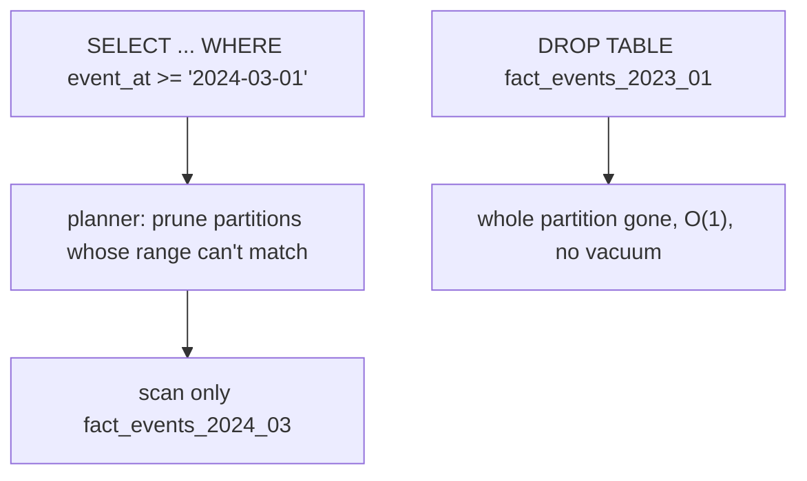

{/* status: authored */}

export const schema = `CREATE TABLE fact_events (
  id       bigint GENERATED ALWAYS AS IDENTITY,
  event_at timestamptz NOT NULL,
  user_id  int NOT NULL,
  kind     text NOT NULL,
  amount   numeric
) PARTITION BY RANGE (event_at);

CREATE TABLE fact_events_2024_01 PARTITION OF fact_events
  FOR VALUES FROM ('2024-01-01') TO ('2024-02-01');
CREATE TABLE fact_events_2024_02 PARTITION OF fact_events
  FOR VALUES FROM ('2024-02-01') TO ('2024-03-01');
CREATE TABLE fact_events_2024_03 PARTITION OF fact_events
  FOR VALUES FROM ('2024-03-01') TO ('2024-04-01');

INSERT INTO fact_events (event_at, user_id, kind, amount)
SELECT TIMESTAMPTZ '2024-01-01' + (g || ' hours')::interval,
       (g % 500) + 1,
       (ARRAY['view','click','purchase'])[1 + (g % 3)],
       CASE WHEN g % 3 = 2 THEN (g % 100) + 1 END
FROM generate_series(0, 2100) g;`;

# Declarative partitioning & partition pruning

## First principles

A single 500 GB fact table is one giant heap and one giant set of indexes.
**Declarative partitioning** splits it into child tables ("partitions") by a
**partition key** — usually a date range — while it still looks like one table
to queries.

```sql
CREATE TABLE fact_events (...) PARTITION BY RANGE (event_at);
CREATE TABLE fact_events_2024_03 PARTITION OF fact_events
  FOR VALUES FROM ('2024-03-01') TO ('2024-04-01');
```

What you gain:

- **Partition pruning**: a query with `WHERE event_at >= '2024-03-01'` scans
  *only* the March partition — the planner excludes the rest before execution.
  This is the big win for time-bounded analytics.
- **O(1) data lifecycle**: drop last year in one `DROP TABLE
  fact_events_2023_*` — instant, no `DELETE`, no bloat, no vacuum storm.
  `DETACH PARTITION` to archive.
- **Per-partition maintenance**: `VACUUM`/`ANALYZE`/`REINDEX` run per partition;
  autovacuum isn't blocked by one huge table.
- **Smaller indexes**: each partition's B-tree fits better in cache; the hot
  (recent) partition stays warm.
- **Bulk load / attach**: build a partition offline, `ATTACH` it validated.

Costs / rules:

- Every query should filter on the **partition key** (directly or via a joined
  predicate) or it scans *all* partitions.
- A `UNIQUE` / `PRIMARY KEY` must **include the partition key** (Postgres can't
  enforce global uniqueness across partitions cheaply).
- Too many partitions (thousands) slows planning; pick a granularity (monthly is
  common; daily only for very high volume).
- You need automation to create future partitions (`pg_partman`, or a cron job).
- Partition key must be **immutable-ish**; moving a row across partitions
  (updating `event_at` past a boundary) is a delete+insert.

**Sub-partitioning** (partition by month, then by `region`) is possible but
usually over-engineering — start with one dimension.

## The mechanism



## Hand-trace on dummy data

`WHERE event_at >= '2024-03-01'` — pruning:

<QueryTrace
  caption="the planner keeps only the partition whose range overlaps the predicate"
  steps={[
    {
      title: "1 · fact_events — 3 monthly partitions",
      op: "event_at",
      table: {
        columns: ["partition", "range", "rows"],
        rows: [
          ["fact_events_2024_01","[2024-01-01, 2024-02-01)","~744"],
          ["fact_events_2024_02","[2024-02-01, 2024-03-01)","~696"],
          ["fact_events_2024_03","[2024-03-01, 2024-04-01)","~660"],
        ],
      },
    },
    {
      title: "2 · WHERE event_at >= '2024-03-01' — which ranges can contain a match?",
      op: "event_at",
      table: {
        columns: ["partition", "range vs predicate", "keep?"],
        rows: [
          ["fact_events_2024_01","entirely < 2024-03-01","prune"],
          ["fact_events_2024_02","entirely < 2024-03-01","prune"],
          ["fact_events_2024_03","overlaps","scan"],
        ],
      },
      rows: { drop: [0, 1] },
    },
    {
      title: "3 · plan: Append over 1 partition (not 3)",
      op: "event_at",
      table: {
        columns: ["node", "partitions scanned"],
        rows: [["Append → Seq Scan on fact_events_2024_03", "1 of 3"]],
      },
    },
    {
      title: "4 · lifecycle: DROP TABLE fact_events_2024_01 — result",
      table: {
        name: "result",
        result: true,
        columns: ["operation", "cost"],
        rows: [["query March only", "1/3 the I/O"], ["delete January", "O(1) DROP, no bloat"]],
      },
    },
  ]}
/>

## Run it

<SqlRunner title="partition pruning in the plan" setup={schema}>
{`ANALYZE fact_events;

-- prunes to one partition:
EXPLAIN SELECT count(*) FROM fact_events WHERE event_at >= TIMESTAMPTZ '2024-03-01';

-- no partition-key filter: scans ALL partitions
EXPLAIN SELECT count(*) FROM fact_events WHERE kind = 'purchase';`}
</SqlRunner>

<SqlRunner title="O(1) data lifecycle" setup={schema}>
{`SELECT count(*) AS total FROM fact_events;

-- drop January in one statement — no DELETE, no vacuum
DROP TABLE fact_events_2024_01;

SELECT count(*) AS after_drop FROM fact_events;
SELECT min(event_at)::date AS earliest FROM fact_events;   -- now Feb 1`}
</SqlRunner>

<SqlRunner title="attach a pre-built partition" setup={schema}>
{`-- build April offline
CREATE TABLE fact_events_2024_04 (LIKE fact_events INCLUDING ALL);
INSERT INTO fact_events_2024_04 (event_at, user_id, kind, amount)
SELECT TIMESTAMPTZ '2024-04-05', 1, 'view', NULL;

-- attach it (Postgres validates the rows fit the range)
ALTER TABLE fact_events ATTACH PARTITION fact_events_2024_04
  FOR VALUES FROM ('2024-04-01') TO ('2024-05-01');

SELECT count(*) FROM fact_events WHERE event_at >= TIMESTAMPTZ '2024-04-01';`}
</SqlRunner>

<SqlRunner title="the PK-must-include-partition-key rule" setup={schema}>
{`-- this fails: a plain PK on id can't be enforced across partitions
-- ALTER TABLE fact_events ADD PRIMARY KEY (id);
--   ERROR: unique constraint on partitioned table must include all partitioning columns

ALTER TABLE fact_events ADD PRIMARY KEY (id, event_at);   -- ok
SELECT count(*) FROM fact_events;`}
</SqlRunner>

<RunThis file="sql/data-engineering/14_table_partitioning/topic.sql" />

## Build → Break → Fix → Why

:::tip[🔨 Build]
`PARTITION BY RANGE (event_at)`, one partition per month, an automation job that
creates next month's partition ahead of time, PK `(id, event_at)`, and a monthly
`DROP`/`DETACH` of partitions past your retention. Every analytical query filters
on `event_at`.
:::

:::danger[💥 Break]
Partition by `event_at` but run dashboards that filter on `user_id` or
`created_date` (a *different* column) with no `event_at` predicate. Every query
does an `Append` over all 60 partitions — slower than the unpartitioned table
was, because now there's per-partition planning overhead on top.
:::

:::danger[💥 Break (too fine)]
Partition daily for a table with 2 years of history = 730 partitions. Planning
time balloons, `\d` is unreadable, and `pg_class` bloats. Monthly would've been
24.
:::

:::note[🔧 Fix]
- Partition on the column your queries filter on. If two access patterns fight,
  the warehouse copy can be partitioned differently from the OLTP one.
- Monthly granularity unless volume genuinely demands finer.
- PK / unique constraints include the partition key.
- Automate future-partition creation; automate old-partition drop.
:::

:::info[🧠 Why it behaved that way]
Partition pruning is a *planning-time* optimisation: each partition declares a
range, and the planner can prove a partition is irrelevant if its range can't
satisfy the `WHERE`, so it never generates a scan node for it. That proof needs a
predicate on the **partition key** — a filter on any other column tells the
planner nothing about which ranges to skip. Dropping a partition is O(1) because
it's just unlinking a table file, versus `DELETE` which rewrites rows, generates
WAL, and leaves dead tuples for `VACUUM`.
:::

## Pitfalls & idioms

- Queries must filter the **partition key** to prune. Check `EXPLAIN` shows fewer
  scans than partitions.
- PK/unique must include the partition key — plan your keys around it, or use a
  non-unique surrogate + application-level dedup.
- Monthly partitions for most; daily only for very high ingest. Thousands of
  partitions hurt planning.
- Automate: create partitions ahead (a NULL-target "default partition" catches
  strays but disables some pruning — prefer explicit).
- `DETACH PARTITION CONCURRENTLY` (PG14+) to archive without a long lock.
- Indexes are created per partition; `CREATE INDEX ON parent` cascades. Use
  `ONLY` + per-partition builds for online creation on huge tables.
- Foreign keys *referencing* a partitioned table work (PG12+); keep them in mind
  for detach.
- Combine with [BRIN](/data-engineering/brin-and-append-only-tables) on the
  partition key inside each partition for cheap intra-partition range scans.

## See also

- [Query optimization](/foundations/query-optimization) — pruning as a planner decision
- [Reading query plans](/foundations/reading-query-plans) — spotting `Append` over N partitions
- [BRIN indexes for append-only fact tables](/data-engineering/brin-and-append-only-tables) — the complementary index
- [Safe schema migrations](/backend/safe-schema-migrations) — `ATTACH`/`DETACH` locking

## Check yourself

1. What must a query filter on for partition pruning to happen?
2. Why is `DROP TABLE fact_events_2023_01` so much cheaper than `DELETE FROM
   fact_events WHERE event_at < '2024-01-01'`?
3. Why must a primary key on a partitioned table include the partition key?
4. What's the downside of daily partitions over two years?
5. You partition by `event_at` but your dashboards filter by `user_id`. What
   happens, and what are your options?
