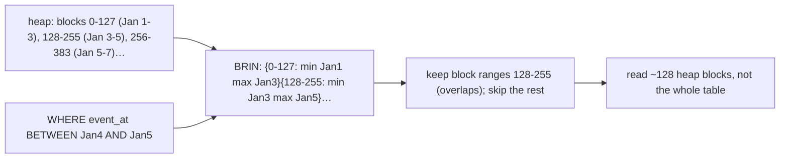

{/* status: authored */}

export const schema = `CREATE TABLE fact_events (
  id       bigint GENERATED ALWAYS AS IDENTITY PRIMARY KEY,
  event_at timestamptz NOT NULL,
  user_id  int NOT NULL,
  amount   numeric
);
-- append-only, in time order: event_at is physically correlated with the heap
INSERT INTO fact_events (event_at, user_id, amount)
SELECT TIMESTAMPTZ '2024-01-01' + (g || ' minutes')::interval,
       (g % 1000) + 1,
       (g % 200) + 1
FROM generate_series(0, 60000) g;`;

# BRIN indexes for append-only fact tables

## First principles

A **B-tree** index on a 100 M-row fact table's `event_at` is itself gigabytes,
and every insert updates it. A **BRIN** (Block Range INdex) is different: it
stores, for each **range of table blocks** (128 by default), just the
**min and max** of the indexed column in that range.

For `WHERE event_at BETWEEN a AND b`, Postgres scans the BRIN, keeps only the
block ranges whose `[min, max]` overlaps `[a, b]`, and reads just those heap
blocks. On a 100 GB table a BRIN might be **a few hundred KB**.

**The catch — physical correlation.** BRIN only helps when the column's values
track the **physical row order**. That's true for:

- `created_at` / `event_at` on an **append-only** table (rows land in time
  order),
- an auto-incrementing `id`,
- the partition key *inside* each [partition](/data-engineering/table-partitioning).

If rows for the same day are scattered all over the heap (random inserts, heavy
updates, a shuffled bulk load), every block range's `[min, max]` spans the whole
domain, no ranges get excluded, and BRIN degrades to a full scan. Check
`correlation` in `pg_stats` — near `1.0` (or `-1.0`) is BRIN territory; near `0`
is not.

BRIN vs B-tree:

| | B-tree | BRIN |
|---|---|---|
| Size | ~large (per-row) | tiny (per block range) |
| Maintenance cost | per insert/update | almost none |
| Point lookup (`= x`) | excellent | poor |
| Range scan on a **correlated** column | excellent | good, at a fraction of the size |
| Range scan on an **uncorrelated** column | good | useless |

## The mechanism

## Hand-trace on dummy data

`WHERE event_at BETWEEN '2024-01-15' AND '2024-01-16'` on an append-only table:

<QueryTrace
  caption="BRIN keeps only the block ranges whose min/max straddles the target day"
  steps={[
    {
      title: "1 · fact_events — 60k rows inserted in time order (event_at correlates with block #)",
      op: "event_at",
      table: {
        columns: ["heap block range", "min(event_at)", "max(event_at)"],
        rows: [
          ["blocks 0–127","2024-01-01 00:00","2024-01-06 08:00"],
          ["blocks 128–255","2024-01-06 08:00","2024-01-12 04:00"],
          ["blocks 256–383","2024-01-12 04:00","2024-01-18 01:00"],
          ["blocks 384–511","2024-01-18 01:00","2024-01-24 12:00"],
        ],
      },
    },
    {
      title: "2 · predicate: event_at ∈ [2024-01-15, 2024-01-16) — which ranges overlap?",
      op: "event_at",
      table: {
        columns: ["block range", "[min,max] overlaps target?", "keep?"],
        rows: [
          ["0–127","Jan 1–6 — no","skip"],
          ["128–255","Jan 6–12 — no","skip"],
          ["256–383","Jan 12–18 — YES","scan"],
          ["384–511","Jan 18–24 — no","skip"],
        ],
      },
      rows: { drop: [0, 1, 3] },
    },
    {
      title: "3 · read only blocks 256–383, recheck the row predicate",
      op: "event_at",
      table: {
        columns: ["heap blocks read", "of total"],
        rows: [["128 (one range)", "~470"]],
      },
    },
    {
      title: "4 · result — a ~4 KB index, ~1/4 the heap read, near-zero insert cost",
      table: {
        name: "result",
        result: true,
        columns: ["index", "size", "range scan", "point lookup"],
        rows: [["BRIN (event_at)", "tiny", "good (if correlated)", "poor — use B-tree"]],
      },
    },
  ]}
/>

## Run it

<SqlRunner title="BRIN vs no index on a correlated column" setup={schema}>
{`ANALYZE fact_events;
-- check correlation first — near 1.0 means BRIN will work
SELECT attname, correlation FROM pg_stats
WHERE tablename = 'fact_events' AND attname IN ('event_at', 'user_id');

CREATE INDEX idx_brin ON fact_events USING BRIN (event_at);
ANALYZE fact_events;

EXPLAIN (ANALYZE, BUFFERS)
SELECT count(*) FROM fact_events
WHERE event_at BETWEEN TIMESTAMPTZ '2024-01-15' AND TIMESTAMPTZ '2024-01-16';

SELECT pg_size_pretty(pg_relation_size('idx_brin'))               AS brin_size,
       pg_size_pretty(pg_relation_size('fact_events'))            AS table_size;`}
</SqlRunner>

<SqlRunner title="BRIN on an UNCORRELATED column is useless" setup={schema}>
{`-- user_id is scattered across the heap (correlation ~0)
CREATE INDEX idx_brin_user ON fact_events USING BRIN (user_id);
ANALYZE fact_events;
EXPLAIN SELECT count(*) FROM fact_events WHERE user_id = 42;
-- every block range's [min,max] spans ~1..1000, so nothing is excluded -> Seq Scan`}
</SqlRunner>

<SqlRunner title="tune pages_per_range for the data density" setup={schema}>
{`-- smaller ranges = finer granularity, slightly bigger index
CREATE INDEX idx_brin_fine ON fact_events USING BRIN (event_at) WITH (pages_per_range = 32);
ANALYZE fact_events;
EXPLAIN (ANALYZE)
SELECT count(*) FROM fact_events WHERE event_at BETWEEN TIMESTAMPTZ '2024-01-15' AND TIMESTAMPTZ '2024-01-15 06:00';`}
</SqlRunner>

<SqlRunner title="B-tree for the point lookup, BRIN for the range" setup={schema}>
{`CREATE INDEX idx_brin ON fact_events USING BRIN (event_at);        -- big range scans, tiny
CREATE INDEX idx_btree_user ON fact_events (user_id);             -- point lookups on user_id
ANALYZE fact_events;

EXPLAIN SELECT * FROM fact_events WHERE user_id = 42;                            -- uses btree
EXPLAIN SELECT count(*) FROM fact_events WHERE event_at >= TIMESTAMPTZ '2024-01-20'; -- uses brin`}
</SqlRunner>

<RunThis file="sql/data-engineering/15_brin_and_append_only_tables/topic.sql" />

## Build → Break → Fix → Why

:::tip[🔨 Build]
On an append-only fact table: `CREATE INDEX ... USING BRIN (event_at)` for
time-range scans (near-free to maintain, tiny on disk), plus a B-tree on any
column you do point lookups or joins on. Confirm `pg_stats.correlation` for the
BRIN column is close to ±1.
:::

:::danger[💥 Break]
Put a BRIN on `user_id` (or any column not correlated with row order) and expect
range/point queries to speed up. Because rows for one user are spread across
every block, no block range can be excluded, and the query does a full Seq Scan —
now with a useless index also being maintained.
:::

:::danger[💥 Break (correlation lost)]
BRIN on `event_at` works great, then a backfill job re-inserts a year of
historical rows at the *end* of the heap. Now recent blocks contain both new and
year-old timestamps, block-range `[min, max]` widths explode, and pruning stops
working until a `VACUUM`/`CLUSTER` reorders the heap.
:::

:::note[🔧 Fix]
- BRIN only on columns physically correlated with the heap: `created_at`/`id` on
  append-only tables, the partition key within a partition.
- Check `pg_stats.correlation` before and after.
- Keep it correlated: append in order; a big historical backfill should go into
  its own partition or be followed by `CLUSTER`.
- Point lookups and joins still need a B-tree.

- `brin_summarize_range()` / autovacuum keeps the summary current for new blocks.
:::

:::info[🧠 Why it behaved that way]
BRIN's whole trick is "if a block range's values are all between 5 and 8, and you
want 20, skip it." That works only when a block range's values are *tight* — which
happens when values arrive in roughly the order they're stored. On an append-only
table, `event_at` and physical position advance together, so each 128-block range
covers a narrow time window and most ranges can be excluded for a bounded query.
Scatter the column across the heap and every range covers the whole domain, so
`[min, max]` always overlaps the predicate and nothing is skipped.
:::

## Pitfalls & idioms

- BRIN needs **correlation**. `SELECT correlation FROM pg_stats WHERE
  attname = ...` — want ~`1.0` or ~`-1.0`.
- Perfect for `created_at`/`event_at` on logs, events, and append-only facts;
  useless on high-cardinality scattered columns.
- Tiny index, near-zero write cost — you can afford it "just in case" on the time
  column.
- `pages_per_range` trades index size for granularity; default 128 is usually
  fine.
- Not for `= x` point lookups or `ORDER BY ... LIMIT` — B-tree there.
- A backfill or `UPDATE`-heavy workload erodes correlation; `VACUUM` maintains
  the summary but can't reorder rows — `CLUSTER` (locking) or partition-and-
  rebuild does.
- Inside [partitions](/data-engineering/table-partitioning), BRIN on the
  partition key gives cheap intra-partition range scans on top of partition
  pruning.

## See also

- [Index types](/foundations/index-types) — BRIN alongside B-tree, GIN, GiST
- [Indexes & the B-tree](/foundations/indexes-and-the-b-tree) — the point-lookup index
- [Declarative partitioning & partition pruning](/data-engineering/table-partitioning) — the complementary technique
- [Reading query plans](/foundations/reading-query-plans) — `Bitmap Index Scan` on a BRIN

## Check yourself

1. What does a BRIN index actually store, and why is it so small?
2. What property must the indexed column have for BRIN to help? How do you check
   it?
3. Why is BRIN on `user_id` (random inserts) useless?
4. What breaks a working `event_at` BRIN, and how do you restore it?
5. You have an append-only events table queried both by time range and by
   `user_id = ?`. What indexes?
