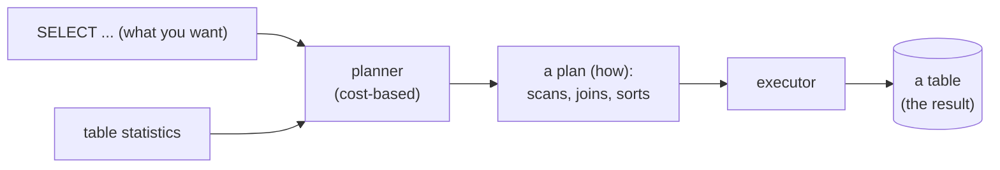
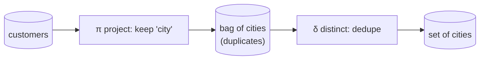

{/* status: authored */}

export const schema = `CREATE TABLE customers (
  customer_id int PRIMARY KEY,
  name        text NOT NULL,
  city        text NOT NULL
);
INSERT INTO customers (customer_id, name, city) VALUES
  (1, 'Ana',   'Berlin'),
  (2, 'Ben',   'Berlin'),
  (3, 'Chidi', 'Lagos'),
  (4, 'Dana',  'Toronto');`;

# The relational model & what a query engine does

## First principles

SQL sits on one idea from 1970: model data as **relations**.

A **relation** is a *set of tuples* over a fixed set of named, typed
**attributes**. "Set" is doing real work there:

- **no order** — a relation has no first tuple;
- **no duplicates** — a tuple is either in the set or not.

A SQL **table** relaxes both: rows have a physical order (which you must not rely
on), and duplicate rows are allowed unless a key forbids them. So a table is
really a **bag** (multiset), not a pure set. Many SQL surprises trace back to
that gap — `DISTINCT`, `UNION` vs `UNION ALL`, why `GROUP BY` exists.

The second idea: **every operator takes tables and returns a table.** Filter a
table → table. Join two tables → table. Aggregate → table. This is *closure*,
and it's why subqueries and CTEs need no special rules: the input to a query can
be another query.

The third idea: SQL is **declarative**. You describe the *set of rows you want*.
The **query planner** decides *how* — which index, which join algorithm, which
order — from statistics about the data. The same `SELECT` runs as a sequential
scan on 100 rows and an index scan on 100 million.



## The mechanism

A query is a **pipeline of relational operators**. Each box is a table flowing
into the next:



The planner may reorder or fuse these steps, but the **result is defined** by
this logical pipeline, not by how it runs.

## Hand-trace on dummy data

Four customers. Watch the `city` column become a bag, then a set.

<QueryTrace
  caption="SELECT city FROM customers → a bag;  SELECT DISTINCT city → a set"
  steps={[
    {
      title: "1 · customers — the base relation",
      note: "Four tuples over (customer_id, name, city).",
      table: {
        name: "customers",
        columns: ["customer_id", "name", "city"],
        rows: [[1,"Ana","Berlin"],[2,"Ben","Berlin"],[3,"Chidi","Lagos"],[4,"Dana","Toronto"]],
      },
    },
    {
      title: "2 · SELECT city — project onto one attribute",
      note: "Keep only the city column. Nothing is deduplicated: this is a bag.",
      op: "city",
      table: {
        name: "(intermediate bag)",
        columns: ["city"],
        rows: [["Berlin"],["Berlin"],["Lagos"],["Toronto"]],
      },
      rows: { match: [0, 1] },
    },
    {
      title: "3 · SELECT DISTINCT city — collapse to a set",
      note: "The duplicate 'Berlin' is removed. Now it is a true relation.",
      op: "city",
      table: {
        name: "result",
        result: true,
        columns: ["city"],
        rows: [["Berlin"],["Lagos"],["Toronto"]],
      },
    },
  ]}
/>

## Run it

The `customers` table above is already loaded. Run each query, then edit it.

<SqlRunner title="a bag" setup={schema}>
{`-- 4 rows, 'Berlin' appears twice
SELECT city FROM customers;`}
</SqlRunner>

<SqlRunner title="a set" setup={schema}>
{`-- 3 rows: DISTINCT gives you set semantics on demand
SELECT DISTINCT city FROM customers;`}
</SqlRunner>

<SqlRunner title="closure" setup={schema}>
{`-- the result of a query is a table you can query again
SELECT count(*) AS distinct_cities
FROM (SELECT DISTINCT city FROM customers) AS t;`}
</SqlRunner>

<SqlRunner title="declarative — ask what it chose" setup={schema}>
{`-- you never said HOW. See the plan the planner picked:
EXPLAIN SELECT DISTINCT city FROM customers;`}
</SqlRunner>

<RunThis file="sql/foundations/01_the_relational_model/topic.sql" />

## Build → Break → Fix → Why

:::tip[🔨 Build]
`SELECT DISTINCT city FROM customers ORDER BY city;` — a deterministic list of
the distinct cities.
:::

:::danger[💥 Break]
Drop the `ORDER BY` and rely on the rows coming back alphabetically because they
did once. Add a few rows, or run it on a bigger table, or let a parallel scan
kick in, and the same query returns the cities in a different order — a snapshot
test starts flapping.

```sql
-- looks sorted... today
SELECT DISTINCT city FROM customers;
```
:::

:::note[🔧 Fix]
If you need an order, ask for it: `ORDER BY city`. A relation has no order; the
*only* thing that puts rows in a defined sequence is `ORDER BY` in the outermost
query.
:::

:::info[🧠 Why it behaved that way]
"Set of tuples" means unordered. Postgres returns rows in whatever order the
chosen plan produces — heap-scan order for a fresh small table, hash-bucket order
after a hash aggregate, something else after a merge. None of that is a contract.
`ORDER BY` is the contract.
:::

## Pitfalls & idioms

- **Never rely on row order without `ORDER BY`** — not even "it's always sorted
  by primary key". It isn't.
- `SELECT *` in stored queries/views: the column set becomes whatever the table
  has that day. List columns in anything that outlives the session.
- A query returns a **bag**. If downstream code assumes uniqueness, enforce it
  (`DISTINCT`, a key, or `GROUP BY`).
- "It's slow" is usually a planner problem (bad estimate, missing index), not a
  "rewrite the SQL" problem. Read the plan first —
  [Reading query plans](/foundations/reading-query-plans).

## See also

- [Data types, NULL & three-valued logic](/foundations/data-types-null-and-three-valued-logic) — the other half of the model
- [Logical query processing order](/foundations/logical-query-processing-order) — the operator pipeline in detail
- [DISTINCT & DISTINCT ON](/foundations/distinct-and-distinct-on) — set semantics on demand
- [Reading query plans](/foundations/reading-query-plans) — what "the planner decides how" looks like

## Check yourself

1. A relation is a set of tuples. In what two ways is a SQL table *not* a set?
2. What does "closure" mean for relational operators, and why does it make
   subqueries work without special rules?
3. "SQL is declarative." Give one query and two execution strategies for it.
4. Why does the model need `NULL` and a three-valued logic rather than just
   using `0` or `''`?
5. `SELECT city FROM customers` returns rows in alphabetical order on your
   machine today. Name two things that could change that order tomorrow.
