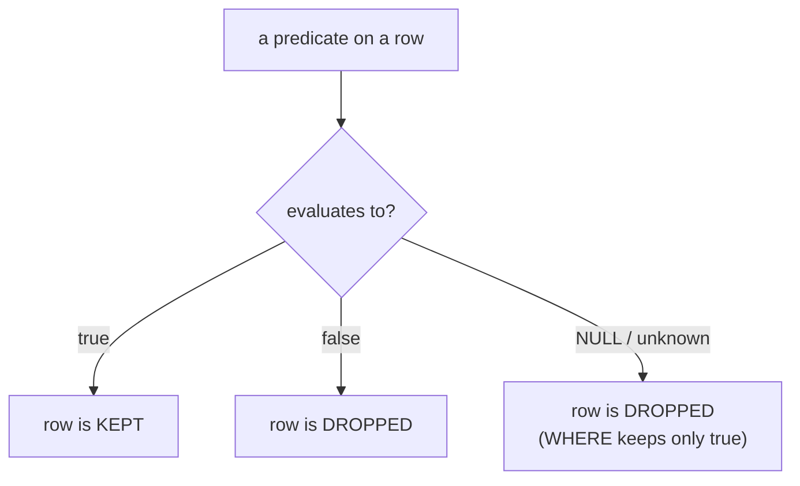

{/* status: authored */}

export const schema = `CREATE TABLE employees (
  employee_id int PRIMARY KEY,
  name        text NOT NULL,
  manager_id  int,          -- NULL = "no manager" (the CEO)
  bonus       numeric       -- NULL = "not decided yet"
);
INSERT INTO employees (employee_id, name, manager_id, bonus) VALUES
  (1, 'Root',  NULL, 5000),
  (2, 'Mara',  1,    2000),
  (3, 'Nikhil',1,    NULL),
  (4, 'Omar',  2,    NULL),
  (5, 'Priya', 2,    900);`;

# Data types, NULL & three-valued logic

## First principles

Every column has a **type** — `integer`, `numeric`, `text`, `boolean`, `date`,
`timestamptz`, `jsonb`, … — and a type is a *domain*: the set of values allowed,
plus the operations on them. Postgres is strict about this: `'5' + 3` works
(implicit cast), `'abc' + 3` is an error, and `'2024-13-01'::date` is an error.
Pick the tightest type that fits — `numeric(10,2)` for money (never `float`),
`timestamptz` for instants (never `text`), a real `date` for dates.

Then there is **`NULL`** — the value that means **"unknown"**. Not zero, not the
empty string, not `false`. "We don't know Nikhil's bonus yet" is different from
"Nikhil's bonus is 0", and `NULL` is how SQL says the first one.

Because `NULL` is *unknown*, any comparison involving it is also **unknown**:

```
NULL = NULL   →  NULL      (are two unknowns equal? unknown)
NULL = 5      →  NULL
NULL <> 5     →  NULL
NULL + 5      →  NULL
```

So SQL booleans have **three** values: `true`, `false`, and `NULL` (unknown).
That's **three-valued logic (3VL)**, and it's the source of most "why did that
row disappear?" bugs.



## The mechanism

`WHERE`, `ON`, and `HAVING` keep a row only when the predicate is **`true`**.
`false` and `NULL` are both "not true", so both drop the row. The 3VL rules for
combining predicates:

| `A` | `B` | `A AND B` | `A OR B` |
|---|---|---|---|
| true | true | true | true |
| true | NULL | **NULL** | true |
| false | NULL | false | **NULL** |
| NULL | NULL | NULL | NULL |

`NOT NULL` is `NULL`. `NULL IS NULL` is `true` (that's a different operator —
`IS` compares for the *state* of being null, not for equality).

## Hand-trace on dummy data

Five employees; two have an unknown `bonus`. Watch `WHERE bonus > 1000`.

<QueryTrace
  caption="WHERE bonus > 1000  — the two NULL rows evaluate to unknown and are dropped"
  steps={[
    {
      title: "1 · employees — base rows",
      table: {
        name: "employees",
        columns: ["employee_id", "name", "manager_id", "bonus"],
        rows: [
          [1, "Root", null, 5000],
          [2, "Mara", 1, 2000],
          [3, "Nikhil", 1, null],
          [4, "Omar", 2, null],
          [5, "Priya", 2, 900],
        ],
      },
    },
    {
      title: "2 · evaluate  bonus > 1000  per row",
      note: "5000>1000 → true; 2000>1000 → true; NULL>1000 → NULL; NULL>1000 → NULL; 900>1000 → false.",
      op: "bonus",
      table: {
        columns: ["employee_id", "name", "bonus", "bonus > 1000"],
        rows: [
          [1, "Root", 5000, "true"],
          [2, "Mara", 2000, "true"],
          [3, "Nikhil", null, "NULL"],
          [4, "Omar", null, "NULL"],
          [5, "Priya", 900, "false"],
        ],
      },
      rows: { drop: [2, 3, 4] },
    },
    {
      title: "3 · keep only rows where the predicate is true — the result",
      op: "bonus",
      table: {
        name: "result",
        result: true,
        columns: ["employee_id", "name", "bonus"],
        rows: [
          [1, "Root", 5000],
          [2, "Mara", 2000],
        ],
      },
    },
  ]}
/>

`WHERE bonus <> 1000` would *also* drop Nikhil and Omar — `NULL <> 1000` is
`NULL`. The only way to include unknowns is to ask for them explicitly:
`WHERE bonus <> 1000 OR bonus IS NULL`.

## Run it

<SqlRunner title="the trace" setup={schema}>
{`-- the 2 NULL-bonus rows vanish, and so would they with <>
SELECT employee_id, name, bonus FROM employees WHERE bonus > 1000;`}
</SqlRunner>

<SqlRunner title="IS NULL vs = NULL" setup={schema}>
{`SELECT
  name,
  bonus,
  bonus = NULL   AS "bonus = NULL",     -- always NULL — wrong
  bonus IS NULL  AS "bonus IS NULL"     -- right
FROM employees;`}
</SqlRunner>

<SqlRunner title="NULL-safe comparison + COALESCE" setup={schema}>
{`SELECT
  name,
  bonus,
  bonus IS DISTINCT FROM 900 AS "distinct from 900",  -- NULL-safe <>
  coalesce(bonus, 0)         AS bonus_or_zero,
  count(bonus)  OVER ()      AS non_null_bonuses,      -- count() ignores NULL
  count(*)      OVER ()      AS all_rows
FROM employees;`}
</SqlRunner>

<SqlRunner title="the NOT IN landmine" setup={schema}>
{`-- "employees who are not managers"
-- manager_id set is {NULL, 1, 2} — NOT IN against a set containing NULL is never true
SELECT name FROM employees
WHERE employee_id NOT IN (SELECT manager_id FROM employees);
-- returns ZERO rows. Try it, then see the fix below.`}
</SqlRunner>

<RunThis file="sql/foundations/02_data_types_null_and_three_valued_logic/topic.sql" />

## Build → Break → Fix → Why

:::tip[🔨 Build]
Employees who are nobody's manager, with `NOT EXISTS`:

```sql
SELECT e.name FROM employees e
WHERE NOT EXISTS (
  SELECT 1 FROM employees m WHERE m.manager_id = e.employee_id
);
-- Nikhil, Omar, Priya
```
:::

:::danger[💥 Break]
Write it with `NOT IN`:

```sql
SELECT name FROM employees
WHERE employee_id NOT IN (SELECT manager_id FROM employees);
```

**Zero rows.** The subquery yields `{NULL, 1, 2}`. `x NOT IN (NULL, 1, 2)` is
`x<>NULL AND x<>1 AND x<>2` → `NULL AND ... ` → never `true`. Every row is
dropped.
:::

:::note[🔧 Fix]
`NOT EXISTS` (correlated), or make the subquery non-nullable:
`... NOT IN (SELECT manager_id FROM employees WHERE manager_id IS NOT NULL)`.
Prefer `NOT EXISTS` — it's immune to this and usually plans as well or better.
:::

:::info[🧠 Why it behaved that way]
`NOT IN (list)` expands to a chain of `AND`-ed `<>` comparisons. One `NULL` in
the list makes one comparison `NULL`, and `true AND NULL` is `NULL`, and `WHERE`
drops `NULL`. `EXISTS` / `NOT EXISTS` don't compare values — they ask "did the
subquery produce any row?", which is always a clean `true`/`false`.
:::

## Pitfalls & idioms

- `= NULL` / `<> NULL` are **always** `NULL`. Use `IS NULL` / `IS NOT NULL`, or
  `IS [NOT] DISTINCT FROM` for a NULL-safe `=` / `<>`.
- `NOT IN (subquery)` + a nullable column = silent empty result. Reach for
  `NOT EXISTS`.
- `count(col)` skips `NULL`s; `count(*)` counts rows. `sum`, `avg`, `min`, `max`
  all ignore `NULL` — `avg` of `{2000, NULL, NULL}` is `2000`, not `667`.
- `NULL` sorts last by default in `ASC` (Postgres); flip with
  `ORDER BY col NULLS FIRST`.
- Concatenation: `'a' || NULL` is `NULL`. Use `concat('a', NULL)` (ignores NULL)
  or `coalesce`.
- A `UNIQUE` constraint lets in **multiple `NULL`s** (they're all "unknown", so
  not equal to each other). Use `UNIQUE NULLS NOT DISTINCT` (PG15+) if you want
  at most one.
- Money → `numeric`. Timestamps → `timestamptz`. Don't store either as `text` or
  `float`.

## See also

- [The relational model](/foundations/the-relational-model) — why the model needs a "no value" marker
- [Filtering rows](/foundations/filtering-rows) — `WHERE` in depth
- [Semi-joins & anti-joins](/foundations/semi-joins-and-anti-joins) — `NOT EXISTS` vs `NOT IN`, fully
- [Sorting & limiting](/foundations/sorting-and-limiting) — `NULLS FIRST` / `LAST`
- [Constraints & keys](/foundations/constraints-and-keys) — `NOT NULL`, and `NULL` in `UNIQUE`

## Check yourself

1. `WHERE bonus <> 2000` — which of the five employees come back, and why isn't
   it "everyone except Mara"?
2. What's the difference between `x = NULL` and `x IS NULL`, and what does each
   evaluate to when `x` is `NULL`?
3. Explain in one sentence why `NOT IN (SELECT manager_id FROM employees)`
   returns nothing here.
4. `avg(bonus)` over the five rows — what number, and which rows contributed?
5. You add `UNIQUE (email)` to a `users` table and can still insert two rows with
   `email = NULL`. Why, and how do you forbid it?
