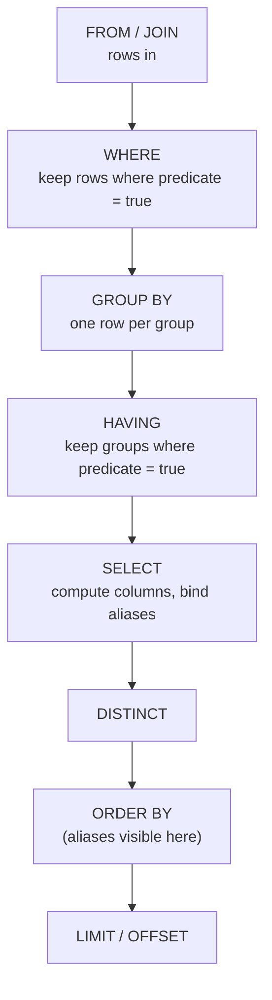

{/* status: authored */}

export const schema = `CREATE TABLE orders (
  order_id    int PRIMARY KEY,
  customer_id int NOT NULL,
  status      text NOT NULL,
  amount      numeric NOT NULL
);
INSERT INTO orders (order_id, customer_id, status, amount) VALUES
  (100, 1, 'paid',      40),
  (101, 1, 'paid',      12),
  (102, 2, 'pending',   75),
  (103, 3, 'paid',       9),
  (104, 3, 'cancelled', 28),
  (106, 1, 'paid',      75),
  (107, 5, 'pending',    6);`;

# Logical query processing order

## First principles

A `SELECT` is written in one order and **evaluated in another**. The evaluation
order is fixed, and almost every "why doesn't that work?" in single-table SQL
falls out of it:

| # | Clause | What it does | Can see… |
|---|---|---|---|
| 1 | `FROM` / `JOIN` | produce the working set of rows | base tables |
| 2 | `WHERE` | drop rows (predicate must be `true`) | columns from `FROM` — **not** aggregates, **not** `SELECT` aliases |
| 3 | `GROUP BY` | collapse rows into one row per group | `FROM` columns |
| 4 | `HAVING` | drop **groups** | grouping columns + aggregates |
| 5 | `SELECT` | compute the output columns / expressions | groups + aggregates; assigns aliases |
| 6 | `DISTINCT` | dedupe the output rows | `SELECT` output |
| 7 | `ORDER BY` | sort | `SELECT` output **including aliases** |
| 8 | `LIMIT` / `OFFSET` | keep a slice | ordered output |

Two rules to memorise, both consequences of the table:

- **`WHERE` runs before `SELECT`**, so it can't use a `SELECT` alias and can't use
  an aggregate (aggregates don't exist until `GROUP BY`). Filter rows with
  `WHERE`, filter groups with `HAVING`.
- **`ORDER BY` runs after `SELECT`**, so it *can* use an alias, and it can even
  sort by an expression that isn't in the `SELECT` list.

## The mechanism



## Hand-trace on dummy data

`SELECT customer_id, sum(amount) AS total FROM orders WHERE status='paid' GROUP BY
customer_id HAVING sum(amount) > 20 ORDER BY total DESC`:

<QueryTrace
  caption="the seven rows through WHERE → GROUP BY → HAVING → SELECT → ORDER BY"
  steps={[
    {
      title: "1 · FROM orders",
      table: {
        name: "orders",
        columns: ["order_id", "customer_id", "status", "amount"],
        rows: [
          [100,1,"paid",40],[101,1,"paid",12],[102,2,"pending",75],
          [103,3,"paid",9],[104,3,"cancelled",28],[106,1,"paid",75],[107,5,"pending",6],
        ],
      },
    },
    {
      title: "2 · WHERE status = 'paid'",
      op: "status",
      table: {
        columns: ["order_id", "customer_id", "status", "amount"],
        rows: [
          [100,1,"paid",40],[101,1,"paid",12],[102,2,"pending",75],
          [103,3,"paid",9],[104,3,"cancelled",28],[106,1,"paid",75],[107,5,"pending",6],
        ],
      },
      rows: { drop: [2, 4, 6] },
    },
    {
      title: "3 · GROUP BY customer_id",
      op: "customer_id",
      table: {
        columns: ["order_id", "customer_id", "amount"],
        rows: [[100,1,40],[101,1,12],[106,1,75],[103,3,9]],
      },
      groups: [
        { label: "cust 1", rows: [0, 1, 2] },
        { label: "cust 3", rows: [3] },
      ],
    },
    {
      title: "4 · SELECT sum(amount) AS total, then HAVING total > 20",
      note: "cust 1 → 127 (kept). cust 3 → 9 (dropped by HAVING).",
      op: "amount",
      table: {
        columns: ["customer_id", "total"],
        rows: [[1, 127], [3, 9]],
      },
      rows: { drop: [1] },
    },
    {
      title: "5 · ORDER BY total DESC — the result",
      op: "total",
      table: {
        name: "result",
        result: true,
        columns: ["customer_id", "total"],
        rows: [[1, 127]],
      },
    },
  ]}
/>

## Run it

<SqlRunner title="the full pipeline" setup={schema}>
{`SELECT customer_id, sum(amount) AS total
FROM orders
WHERE status = 'paid'
GROUP BY customer_id
HAVING sum(amount) > 20
ORDER BY total DESC;`}
</SqlRunner>

<SqlRunner title="alias visibility" setup={schema}>
{`-- ORDER BY sees the alias 'total'; WHERE would not.
SELECT customer_id, sum(amount) AS total
FROM orders
GROUP BY customer_id
ORDER BY total DESC;

-- now try moving the filter: change ORDER BY line to  WHERE total > 20  and re-run`}
</SqlRunner>

<RunThis file="sql/foundations/03_logical_query_processing_order/topic.sql" />

## Build → Break → Fix → Why

:::tip 🔨 Build
"Customers whose paid total exceeds 20":

```sql
SELECT customer_id, sum(amount) AS total
FROM orders
WHERE status = 'paid'
GROUP BY customer_id
HAVING sum(amount) > 20;
```
:::

:::danger 💥 Break
Try to filter the total in `WHERE`, using the alias:

```sql
SELECT customer_id, sum(amount) AS total
FROM orders
WHERE status = 'paid' AND total > 20        -- ERROR: column "total" does not exist
GROUP BY customer_id;
```

And with the aggregate spelled out: `WHERE sum(amount) > 20` →
`ERROR: aggregate functions are not allowed in WHERE`.
:::

:::note 🔧 Fix
Row filters go in `WHERE`; group filters go in `HAVING`:

```sql
... WHERE status = 'paid'
GROUP BY customer_id
HAVING sum(amount) > 20;
```
:::

:::info 🧠 Why it behaved that way
`WHERE` is step 2; the alias `total` is bound in step 5 (`SELECT`) and the
aggregate `sum(amount)` doesn't exist until the grouping in step 3. So at the
moment `WHERE` runs, neither name means anything. `HAVING` is step 4 — after
grouping — so it can see `sum(amount)`. `ORDER BY` is step 7, after `SELECT`, so
it can see `total`.
:::

## Pitfalls & idioms

- `WHERE` before grouping, `HAVING` after. Putting a plain row filter in `HAVING`
  works but is slower and misleading — keep row filters in `WHERE`.
- You can `ORDER BY` a column you didn't `SELECT` (`ORDER BY signup_date` while
  selecting only `name`). You cannot `ORDER BY` an aggregate you didn't compute
  unless you write the aggregate in the `ORDER BY`.
- `LIMIT` without `ORDER BY` gives you *an arbitrary* slice, not "the first" —
  see [The relational model](/foundations/the-relational-model).
- Column numbers work in `GROUP BY 1` / `ORDER BY 2` but hurt readability; fine
  for quick exploration.
- A `SELECT` alias is also invisible to another `SELECT` expression on the same
  level (`SELECT a+b AS s, s*2` fails). Wrap in a subquery or CTE.

## See also

- [Filtering rows](/foundations/filtering-rows) — `WHERE` in depth
- [Aggregation & GROUP BY](/foundations/group-by-and-aggregation) — steps 3 & 5
- [HAVING vs WHERE](/foundations/having-vs-where) — step 2 vs step 4, with traces
- [Sorting & limiting](/foundations/sorting-and-limiting) — steps 7 & 8
- [Common Table Expressions](/foundations/common-table-expressions) — when one level isn't enough

## Check yourself

1. Put the eight clauses in evaluation order from memory.
2. Why can `ORDER BY` use a `SELECT` alias but `WHERE` can't?
3. `WHERE sum(amount) > 100` — what's the exact error and what did you mean?
4. You `SELECT name` but `ORDER BY signup_date`. Legal? Why or why not?
5. `SELECT price * qty AS line_total, line_total * 0.2 AS tax` — why does this
   fail, and what are two fixes?
