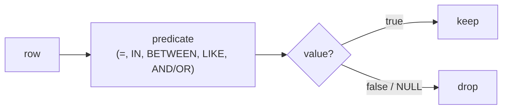

{/* status: authored */}

export const schema = `CREATE TABLE products (
  product_id int PRIMARY KEY,
  name       text NOT NULL,
  category   text NOT NULL,
  price      numeric NOT NULL,
  discontinued_on date        -- NULL = still sold
);
INSERT INTO products (product_id, name, category, price, discontinued_on) VALUES
  (10, 'Notebook',   'stationery',  6.00, NULL),
  (11, 'Pen pack',   'stationery',  4.50, DATE '2024-02-01'),
  (12, 'Desk lamp',  'home',       28.00, NULL),
  (13, 'Mug',        'home',        9.00, NULL),
  (14, 'Headphones', 'tech',       75.00, NULL),
  (15, 'USB cable',  'tech',        8.00, DATE '2023-11-15');`;

# Filtering rows: `WHERE`, `IN`, `BETWEEN`, `LIKE`, `CASE`

## First principles

`WHERE` runs once per row (step 2 of [processing
order](/foundations/logical-query-processing-order)) and keeps the row **only if
the predicate evaluates to `true`** — `false` and `NULL` both drop it.

A predicate is any boolean expression. The building blocks:

| Operator | Means | NULL behaviour |
|---|---|---|
| `=` `<>` `<` `>` `<=` `>=` | comparison | `NULL` if either side is `NULL` |
| `BETWEEN a AND b` | `x >= a AND x <= b` (inclusive) | `NULL` if `x` is `NULL` |
| `IN (a, b, c)` | `x = a OR x = b OR x = c` | a `NULL` in the list can't make it `true` |
| `LIKE 'a%'` | pattern: `%` = any run, `_` = one char | `NULL` if `x` is `NULL` |
| `IS NULL` / `IS NOT NULL` | test the null state | always `true`/`false` |
| `AND` `OR` `NOT` | combine, with [3VL](/foundations/data-types-null-and-three-valued-logic) | see the 3VL table |

`CASE` is not a filter — it's an *expression* that returns a value, usable in
`SELECT`, `WHERE`, `ORDER BY`, `GROUP BY`:

```sql
CASE WHEN price < 10 THEN 'cheap'
     WHEN price < 50 THEN 'mid'
     ELSE 'premium' END
```

It evaluates arms top to bottom and stops at the first `true`. No match and no
`ELSE` → `NULL`.

## The mechanism



## Hand-trace on dummy data

`WHERE category IN ('home','tech') AND price BETWEEN 8 AND 30 AND discontinued_on
IS NULL`:

<QueryTrace
  caption="three ANDed predicates, evaluated left to right"
  steps={[
    {
      title: "1 · products",
      table: {
        name: "products",
        columns: ["product_id", "name", "category", "price", "discontinued_on"],
        rows: [
          [10,"Notebook","stationery",6,null],
          [11,"Pen pack","stationery",4.5,"2024-02-01"],
          [12,"Desk lamp","home",28,null],
          [13,"Mug","home",9,null],
          [14,"Headphones","tech",75,null],
          [15,"USB cable","tech",8,"2023-11-15"],
        ],
      },
    },
    {
      title: "2 · category IN ('home','tech')",
      op: "category",
      table: {
        columns: ["product_id","name","category","price","discontinued_on"],
        rows: [
          [10,"Notebook","stationery",6,null],
          [11,"Pen pack","stationery",4.5,"2024-02-01"],
          [12,"Desk lamp","home",28,null],
          [13,"Mug","home",9,null],
          [14,"Headphones","tech",75,null],
          [15,"USB cable","tech",8,"2023-11-15"],
        ],
      },
      rows: { drop: [0, 1] },
    },
    {
      title: "3 · AND price BETWEEN 8 AND 30",
      op: "price",
      table: {
        columns: ["product_id","name","category","price","discontinued_on"],
        rows: [
          [12,"Desk lamp","home",28,null],
          [13,"Mug","home",9,null],
          [14,"Headphones","tech",75,null],
          [15,"USB cable","tech",8,"2023-11-15"],
        ],
      },
      rows: { drop: [2] },
    },
    {
      title: "4 · AND discontinued_on IS NULL — the result",
      op: "discontinued_on",
      table: {
        name: "result",
        result: true,
        columns: ["product_id","name","category","price"],
        rows: [[12,"Desk lamp","home",28],[13,"Mug","home",9]],
      },
    },
  ]}
/>

## Run it

<SqlRunner title="the trace" setup={schema}>
{`SELECT product_id, name, category, price
FROM products
WHERE category IN ('home','tech')
  AND price BETWEEN 8 AND 30
  AND discontinued_on IS NULL;`}
</SqlRunner>

<SqlRunner title="LIKE and CASE" setup={schema}>
{`SELECT
  name,
  price,
  name LIKE '%e%'                    AS has_e,
  CASE WHEN price < 10 THEN 'cheap'
       WHEN price < 50 THEN 'mid'
       ELSE 'premium' END            AS tier
FROM products
ORDER BY price;`}
</SqlRunner>

<SqlRunner title="filter on a CASE / boolean" setup={schema}>
{`-- CASE is an expression, so it works in WHERE too
SELECT name, price FROM products
WHERE CASE WHEN category = 'tech' THEN price > 50 ELSE price > 5 END;`}
</SqlRunner>

<RunThis file="sql/foundations/04_filtering_rows/topic.sql" />

## Build → Break → Fix → Why

:::tip 🔨 Build
"Currently-sold products under €10": `WHERE price < 10 AND discontinued_on IS NULL`.
:::

:::danger 💥 Break
Exclude discontinued products with `discontinued_on <> NULL` or
`discontinued_on != '...'`:

```sql
SELECT name FROM products WHERE price < 10 AND discontinued_on <> DATE '1900-01-01';
```

The still-sold products (`discontinued_on IS NULL`) **disappear** —
`NULL <> anything` is `NULL`, which `WHERE` drops. You get only *discontinued*
cheap products: the opposite of what you wanted.
:::

:::note 🔧 Fix
`discontinued_on IS NULL` for "still sold". If you need "sold, or discontinued
after some date": `(discontinued_on IS NULL OR discontinued_on > DATE '2024-01-01')`.
:::

:::info 🧠 Why it behaved that way
Any comparison operator (`<>`, `=`, `<`, `LIKE`, `BETWEEN`) with a `NULL` operand
yields `NULL`, and `WHERE` keeps only `true`. The null-state tests `IS NULL` /
`IS NOT DISTINCT FROM` are the only operators that give a clean boolean when
`NULL` is involved.
:::

## Pitfalls & idioms

- `col <> 'x'` silently excludes rows where `col IS NULL`. Add `OR col IS NULL`
  if you want them.
- `IN (subquery)` where the subquery can yield `NULL`: fine for `IN`, a trap for
  `NOT IN` — see [three-valued logic](/foundations/data-types-null-and-three-valued-logic).
- `LIKE` is case-sensitive; `ILIKE` (Postgres) is not. For "contains", `%x%` —
  but a leading `%` can't use a plain B-tree index
  ([sargability](/foundations/query-optimization)).
- `BETWEEN` is **inclusive** on both ends. For half-open ranges (common with
  timestamps) write `>= start AND < end`.
- Big `OR` chains on one column → `IN (...)`. Big `AND` ranges → `BETWEEN` or two
  comparisons.
- `WHERE` can't see `SELECT` aliases or aggregates
  ([processing order](/foundations/logical-query-processing-order)).

## See also

- [Data types, NULL & three-valued logic](/foundations/data-types-null-and-three-valued-logic) — why `<> NULL` drops rows
- [Logical query processing order](/foundations/logical-query-processing-order) — where `WHERE` sits
- [Sorting & limiting](/foundations/sorting-and-limiting) — the clauses after `SELECT`
- [Query optimization](/foundations/query-optimization) — which predicates an index can use

## Check yourself

1. `WHERE discontinued_on <> DATE '2020-01-01'` — why might a "still sold"
   product not appear?
2. Rewrite `x >= 10 AND x <= 20` two other ways.
3. What does `CASE WHEN price < 10 THEN 'cheap' END` return for a €28 product?
4. `name LIKE 'D_sk%'` — does "Desk lamp" match? What about "Dusk"?
5. When is `col IN (1, 2, NULL)` different from `col IN (1, 2)`? When is
   `col NOT IN (1, 2, NULL)`?
