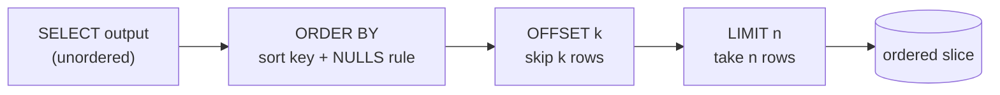

{/* status: authored */}

export const schema = `CREATE TABLE customers (
  customer_id int PRIMARY KEY,
  name        text NOT NULL,
  city        text,
  signup_date date NOT NULL
);
INSERT INTO customers (customer_id, name, city, signup_date) VALUES
  (1, 'Ana',   'Berlin',  DATE '2023-01-05'),
  (2, 'Ben',   NULL,      DATE '2023-02-11'),
  (3, 'Chidi', 'Lagos',   DATE '2023-02-11'),
  (4, 'Dana',  'Toronto', DATE '2023-03-02'),
  (5, 'Eve',   NULL,      DATE '2023-05-19'),
  (6, 'Farah', 'Cairo',   DATE '2023-07-01');`;

# Sorting & limiting: `ORDER BY`, `NULLS`, `LIMIT`/`OFFSET`

## First principles

`ORDER BY` (step 7) is the **only** thing that gives a query a defined row order.
Without it, order is whatever the plan produced —
[not a contract](/foundations/the-relational-model).

- `ORDER BY a, b` — sort by `a`; break ties with `b`.
- `ASC` (default) / `DESC` per column: `ORDER BY signup_date DESC, name ASC`.
- **NULLs**: Postgres puts them **last** for `ASC`, **first** for `DESC`.
  Override with `NULLS FIRST` / `NULLS LAST`.
- Runs *after* `SELECT`, so it can use aliases and expressions.

`LIMIT n` keeps the first `n` rows of the ordered result; `OFFSET k` skips `k`
first. `LIMIT` **without** `ORDER BY` returns an arbitrary slice.

**The `OFFSET` trap**: `OFFSET 100000 LIMIT 20` still *computes and discards* the
first 100 000 rows. Cost grows with page number. For deep pagination use
**keyset** (seek) pagination instead — covered in
[Backend → Keyset pagination](/backend/keyset-pagination-and-the-n-plus-1-problem).

## The mechanism



## Hand-trace on dummy data

`ORDER BY signup_date DESC, name ASC` then `LIMIT 3 OFFSET 1`:

<QueryTrace
  caption="sort by two keys, then skip 1 and take 3"
  steps={[
    {
      title: "1 · customers (as scanned — no order)",
      table: {
        name: "customers",
        columns: ["customer_id", "name", "city", "signup_date"],
        rows: [
          [1,"Ana","Berlin","2023-01-05"],
          [2,"Ben",null,"2023-02-11"],
          [3,"Chidi","Lagos","2023-02-11"],
          [4,"Dana","Toronto","2023-03-02"],
          [5,"Eve",null,"2023-05-19"],
          [6,"Farah","Cairo","2023-07-01"],
        ],
      },
    },
    {
      title: "2 · ORDER BY signup_date DESC, name ASC",
      note: "Ben & Chidi tie on date (2023-02-11); 'Ben' < 'Chidi' breaks the tie.",
      op: "signup_date",
      table: {
        columns: ["customer_id", "name", "signup_date"],
        rows: [
          [6,"Farah","2023-07-01"],
          [5,"Eve","2023-05-19"],
          [4,"Dana","2023-03-02"],
          [2,"Ben","2023-02-11"],
          [3,"Chidi","2023-02-11"],
          [1,"Ana","2023-01-05"],
        ],
      },
    },
    {
      title: "3 · OFFSET 1 — drop the first row",
      table: {
        columns: ["customer_id", "name", "signup_date"],
        rows: [
          [6,"Farah","2023-07-01"],
          [5,"Eve","2023-05-19"],
          [4,"Dana","2023-03-02"],
          [2,"Ben","2023-02-11"],
          [3,"Chidi","2023-02-11"],
          [1,"Ana","2023-01-05"],
        ],
      },
      rows: { drop: [0] },
    },
    {
      title: "4 · LIMIT 3 — the result",
      table: {
        name: "result",
        result: true,
        columns: ["customer_id", "name", "signup_date"],
        rows: [
          [5,"Eve","2023-05-19"],
          [4,"Dana","2023-03-02"],
          [2,"Ben","2023-02-11"],
        ],
      },
    },
  ]}
/>

## Run it

<SqlRunner title="the trace" setup={schema}>
{`SELECT customer_id, name, signup_date
FROM customers
ORDER BY signup_date DESC, name ASC
LIMIT 3 OFFSET 1;`}
</SqlRunner>

<SqlRunner title="where NULLs land" setup={schema}>
{`SELECT name, city FROM customers ORDER BY city;             -- NULLs last (ASC default)
-- edit to:  ORDER BY city DESC          -> NULLs first
-- edit to:  ORDER BY city ASC NULLS FIRST`}
</SqlRunner>

<SqlRunner title="sort by an expression / alias" setup={schema}>
{`SELECT name, length(name) AS len
FROM customers
ORDER BY len DESC, name;`}
</SqlRunner>

<RunThis file="sql/foundations/05_sorting_and_limiting/topic.sql" />

## Build → Break → Fix → Why

:::tip[🔨 Build]
"The 3 most recent signups":

```sql
SELECT name, signup_date FROM customers
ORDER BY signup_date DESC, customer_id DESC
LIMIT 3;
```

The `customer_id` tie-breaker makes the order **total** — no ambiguity when
dates tie.
:::

:::danger[💥 Break]
Drop the tie-breaker and paginate:

```sql
-- page 1
SELECT name FROM customers ORDER BY signup_date DESC LIMIT 2;
-- page 2
SELECT name FROM customers ORDER BY signup_date DESC LIMIT 2 OFFSET 2;
```

Ben and Chidi share `2023-02-11`. Across two runs the engine may order that pair
differently, so one of them can appear on **both** pages or **neither**.
:::

:::note[🔧 Fix]
Always sort by something unique last: `ORDER BY signup_date DESC, customer_id
DESC`. Then every row has one definite position, and pagination is stable.
:::

:::info[🧠 Why it behaved that way]
`ORDER BY signup_date` only constrains the *date* order. Rows with equal dates
are in an undefined order among themselves, and the plan can produce that order
differently between executions (different scan, parallel workers, a sort spill).
`LIMIT`/`OFFSET` then slice an unstable sequence. A unique final sort key removes
the ambiguity.
:::

## Pitfalls & idioms

- **No `ORDER BY`, no order.** `LIMIT 10` is "some 10 rows", not "the first 10".
- Pagination needs a **total order** — end `ORDER BY` with a unique column.
- `OFFSET` is O(offset). Past a few pages, switch to keyset:
  `WHERE (signup_date, customer_id) < ($1,$2) ORDER BY signup_date DESC, customer_id DESC LIMIT n`.
- `NULLS FIRST/LAST` is independent of `ASC/DESC` — set it explicitly when NULLs
  matter.
- An index can satisfy `ORDER BY` for free only if its column order and
  direction match (`CREATE INDEX ON t (signup_date DESC, customer_id DESC)`).
- `ORDER BY random() LIMIT 1` works but scans + sorts everything; for big tables
  use `TABLESAMPLE` or a keyed random pick.

## See also

- [The relational model](/foundations/the-relational-model) — why order isn't a default
- [Logical query processing order](/foundations/logical-query-processing-order) — `ORDER BY` is step 7
- [Backend → Keyset pagination](/backend/keyset-pagination-and-the-n-plus-1-problem) — the `OFFSET` fix in full
- [Window functions](/foundations/window-functions-partitioning-and-ranking) — `row_number()` for "top N per group"

## Check yourself

1. Why is `SELECT * FROM t LIMIT 5` not "the first five rows"?
2. Default Postgres: where do `NULL`s sort under `ORDER BY city` and
   `ORDER BY city DESC`?
3. What makes a sort order *total*, and why does pagination need it?
4. Estimate the relative cost of `OFFSET 20 LIMIT 20` vs `OFFSET 200000 LIMIT 20`.
5. You want `ORDER BY signup_date DESC` served entirely from an index. What
   index?
