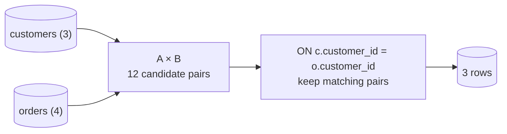

{/* status: authored */}

export const schema = `CREATE TABLE customers (
  customer_id int PRIMARY KEY,
  name        text NOT NULL
);
CREATE TABLE orders (
  order_id    int PRIMARY KEY,
  customer_id int,
  amount      numeric NOT NULL
);
CREATE TABLE order_items (
  order_id   int,
  product    text,
  qty        int
);
INSERT INTO customers VALUES (1,'Ana'), (2,'Ben'), (3,'Chidi');
INSERT INTO orders VALUES
  (100, 1, 40),
  (101, 1, 12),
  (102, 2, 75),
  (103, NULL, 9);   -- an order with no customer_id
INSERT INTO order_items VALUES
  (100,'lamp',1), (100,'mug',1), (100,'cable',1),   -- order 100 has 3 items
  (101,'notebook',2),
  (102,'headphones',1);`;

# `INNER JOIN`: the cross-product-and-filter model

## First principles

The definition to hold in your head:

> `A INNER JOIN B ON p` = take every pairing of a row from `A` with a row from
> `B` (the **Cartesian product**, `A × B`), then keep only the pairs where `p` is
> `true`.

That's it. `3 customers × 4 orders = 12 candidate pairs`; the `ON customers.customer_id
= orders.customer_id` predicate keeps the 3 that match. Everything else about
joins is a consequence:

- **A customer with no orders disappears** — no pair satisfies `p`. (Want them
  kept? That's a [`LEFT JOIN`](/foundations/outer-joins).)
- **A customer with 3 orders appears 3 times** — three pairs match. Joins
  *multiply* rows; that's how you get accidental double-counting in a `SUM`.
- **`NULL` never matches** — `NULL = 1` is `NULL`, not `true`. Order 103
  (`customer_id NULL`) joins to nobody.
- **Join direction doesn't matter for `INNER`** — `A JOIN B` and `B JOIN A`
  return the same rows.

The engine doesn't literally build all 12 pairs — it uses a hash or merge or
index-nested-loop join ([join algorithms](/foundations/query-optimization)). But
the *result* is defined by product-then-filter.

## The mechanism



## Hand-trace on dummy data

<QueryTrace
  caption="customers × orders, then keep pairs where the ids match"
  steps={[
    {
      title: "1 · the two tables",
      table: {
        name: "customers (left)",
        columns: ["customer_id", "name"],
        rows: [[1,"Ana"],[2,"Ben"],[3,"Chidi"]],
      },
    },
    {
      title: "1b · orders",
      table: {
        name: "orders (right)",
        columns: ["order_id", "customer_id", "amount"],
        rows: [[100,1,40],[101,1,12],[102,2,75],[103,null,9]],
      },
    },
    {
      title: "2 · the Cartesian product (12 pairs) — evaluate c.id = o.id",
      op: "customer_id",
      table: {
        columns: ["c.customer_id", "name", "o.order_id", "o.customer_id", "match?"],
        rows: [
          [1,"Ana",100,1,"true"],
          [1,"Ana",101,1,"true"],
          [1,"Ana",102,2,"false"],
          [1,"Ana",103,null,"NULL"],
          [2,"Ben",100,1,"false"],
          [2,"Ben",102,2,"true"],
          [3,"Chidi",103,null,"NULL"],
        ],
      },
      rows: { drop: [2, 3, 4, 6] },
    },
    {
      title: "3 · keep matching pairs — the result (Chidi & order 103 gone)",
      op: "customer_id",
      table: {
        name: "result",
        result: true,
        columns: ["name", "order_id", "amount"],
        rows: [["Ana",100,40],["Ana",101,12],["Ben",102,75]],
      },
    },
  ]}
/>

(The product really has 12 rows; the trace shows a representative 7.)

## Run it

<SqlRunner title="inner join" setup={schema}>
{`SELECT c.name, o.order_id, o.amount
FROM customers c
JOIN orders o ON o.customer_id = c.customer_id
ORDER BY c.name, o.order_id;`}
</SqlRunner>

<SqlRunner title="joins multiply — watch the SUM" setup={schema}>
{`-- Ana has 2 orders, so this counts her once per order
SELECT c.name, count(*) AS order_rows, sum(o.amount) AS total
FROM customers c
JOIN orders o ON o.customer_id = c.customer_id
GROUP BY c.name;`}
</SqlRunner>

<SqlRunner title="the raw Cartesian product" setup={schema}>
{`-- no ON clause = every pairing: 3 x 4 = 12 rows
SELECT c.name, o.order_id FROM customers c CROSS JOIN orders o ORDER BY c.name, o.order_id;`}
</SqlRunner>

<RunThis file="sql/foundations/06_inner_join/topic.sql" />

## Build → Break → Fix → Why

:::tip[🔨 Build]
Total spend per customer who has ordered:

```sql
SELECT c.name, sum(o.amount) AS total
FROM customers c JOIN orders o ON o.customer_id = c.customer_id
GROUP BY c.name;
```
:::

:::danger[💥 Break]
Now also join `order_items` to include line detail, and keep the same `sum(o.amount)`:

<SqlRunner title="the inflated total" setup={schema}>
{`SELECT c.name, sum(o.amount) AS total
FROM customers c
JOIN orders o       ON o.customer_id = c.customer_id
JOIN order_items oi ON oi.order_id   = o.order_id      -- an order has many items
GROUP BY c.name;`}
</SqlRunner>

`total` is now **inflated**: order 100 with 3 items contributes `o.amount` three
times, so Ana's total jumps from 52 to 40+40+40+12+12 = 144. The second join
multiplied the order rows.
:::

:::note[🔧 Fix]
Aggregate at one grain per subtree. Pre-aggregate orders in a CTE before joining
detail:

```sql
WITH per_order AS (
  SELECT customer_id, sum(amount) AS order_total
  FROM orders GROUP BY customer_id
)
SELECT c.name, po.order_total
FROM customers c JOIN per_order po ON po.customer_id = c.customer_id;
```

:::

:::info[🧠 Why it behaved that way]
Each `JOIN` forms a product with what's already there. `customers ⋈ orders` has
one row per (customer, order). Joining `order_items` turns that into one row per
(customer, order, item). `o.amount` is now repeated across a whole order's items,
so `sum` over-counts. The join didn't "add a column" — it changed the **grain**
of the row.
:::

## Pitfalls & idioms

- A join changes the **grain** of your rows. Know what "one row" means before and
  after every join.
- `JOIN` with no `ON` (or `ON true`) is a `CROSS JOIN` — usually a typo when it's
  a huge result.
- Always qualify columns (`o.customer_id`, not `customer_id`) in a join — it
  prevents ambiguity and silent wrong-column bugs.
- `USING (customer_id)` is shorthand for `ON a.customer_id = b.customer_id` and
  merges the column into one. Fine when names match exactly.
- Join on indexed columns. A join predicate on an unindexed column forces a hash
  or a scan ([join algorithms](/foundations/query-optimization)).
- Missing rows after a join you expected to be "just adding info" → you wanted a
  [`LEFT JOIN`](/foundations/outer-joins).

## See also

- [Outer joins](/foundations/outer-joins) — keeping the non-matching rows
- [ON vs WHERE](/foundations/on-vs-where) — where the predicate goes
- [Self-joins & CROSS JOIN](/foundations/self-joins-and-cross-joins) — a table joined to itself / the bare product
- [Aggregation & GROUP BY](/foundations/group-by-and-aggregation) — where fan-out becomes double-counting
- [Query optimization](/foundations/query-optimization) — hash vs merge vs nested-loop

## Check yourself

1. State the product-then-filter definition of `INNER JOIN` in one sentence.
2. `customers` has 3 rows, `orders` has 4 (one with `customer_id` NULL). How many
   rows does the inner join on `customer_id` return, and why not 4?
3. Why does a customer with no orders vanish from an inner join?
4. You join `orders` to `order_items` and your revenue `SUM(orders.amount)`
   doubles. What happened?
5. Does `A JOIN B` ever return different rows from `B JOIN A` for an inner join?
