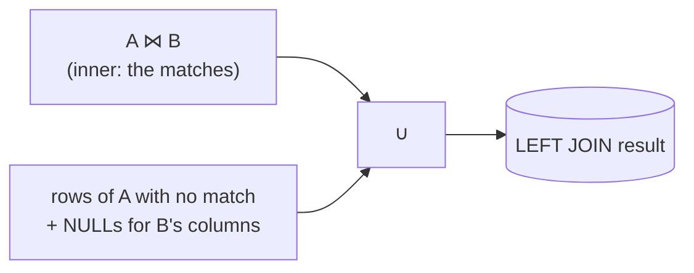

{/* status: authored */}

export const schema = `CREATE TABLE customers (
  customer_id int PRIMARY KEY,
  name        text NOT NULL
);
CREATE TABLE orders (
  order_id    int PRIMARY KEY,
  customer_id int,
  amount      numeric NOT NULL
);
INSERT INTO customers VALUES (1,'Ana'), (2,'Ben'), (3,'Chidi'), (4,'Dana');
INSERT INTO orders VALUES
  (100, 1, 40),
  (101, 1, 12),
  (102, 2, 75),
  (900, 99, 5);   -- orphan: customer 99 does not exist`;

# Outer joins: `LEFT`, `RIGHT`, `FULL` & `NULL` semantics

## First principles

> `A LEFT JOIN B ON p` = the [inner join](/foundations/inner-join), **plus** every
> row of `A` that matched nothing, with `B`'s columns filled with `NULL`.

So a `LEFT JOIN` **never loses a left row**. That's the whole point: "give me all
customers, and their orders *if any*".

- `LEFT` (a.k.a. `LEFT OUTER`) — keep all of the left table.
- `RIGHT` — keep all of the right table. `A RIGHT JOIN B` = `B LEFT JOIN A` with
  columns swapped; most people just always write `LEFT`.
- `FULL` — keep unmatched rows from **both** sides, NULL-padded.

The NULL-padding is what makes outer joins tricky:

- Testing `WHERE b.some_col IS NULL` after a `LEFT JOIN` finds the **left rows
  with no match** — this is an **anti-join**
  ([more](/foundations/semi-joins-and-anti-joins)).
- Any `WHERE` condition on a right-table column (other than `IS NULL`) throws
  away the NULL-padded rows and silently turns your `LEFT JOIN` back into an
  `INNER JOIN` — see [ON vs WHERE](/foundations/on-vs-where).
- `count(b.order_id)` counts only real matches; `count(*)` counts the padded
  rows too.

## The mechanism



## Hand-trace on dummy data

`customers LEFT JOIN orders ON orders.customer_id = customers.customer_id`:

<QueryTrace
  caption="inner matches, then add unmatched customers with NULL order columns"
  steps={[
    {
      title: "1 · the tables (4 customers, 4 orders incl. 1 orphan)",
      table: {
        name: "customers (left)",
        columns: ["customer_id", "name"],
        rows: [[1,"Ana"],[2,"Ben"],[3,"Chidi"],[4,"Dana"]],
      },
    },
    {
      title: "1b · orders",
      table: {
        name: "orders (right)",
        columns: ["order_id", "customer_id", "amount"],
        rows: [[100,1,40],[101,1,12],[102,2,75],[900,99,5]],
      },
    },
    {
      title: "2 · inner matches",
      op: "customer_id",
      table: {
        columns: ["name", "order_id", "amount"],
        rows: [["Ana",100,40],["Ana",101,12],["Ben",102,75]],
      },
      rows: { match: [0, 1, 2] },
    },
    {
      title: "3 · add left rows that matched nothing (Chidi, Dana), NULL-padded",
      op: "order_id",
      table: {
        columns: ["name", "order_id", "amount"],
        rows: [
          ["Ana",100,40],["Ana",101,12],["Ben",102,75],
          ["Chidi",null,null],["Dana",null,null],
        ],
      },
      rows: { add: [3, 4] },
    },
    {
      title: "4 · the result — 5 rows. Order 900 (orphan) is NOT here",
      op: "order_id",
      table: {
        name: "result",
        result: true,
        columns: ["name", "order_id", "amount"],
        rows: [
          ["Ana",100,40],["Ana",101,12],["Ben",102,75],
          ["Chidi",null,null],["Dana",null,null],
        ],
      },
    },
  ]}
/>

A `FULL JOIN` would also add a 6th row: `(NULL, 900, 5)` for the orphan order.

## Run it

<SqlRunner title="LEFT JOIN" setup={schema}>
{`SELECT c.name, o.order_id, o.amount
FROM customers c
LEFT JOIN orders o ON o.customer_id = c.customer_id
ORDER BY c.name, o.order_id;`}
</SqlRunner>

<SqlRunner title="count(*) vs count(col), and totals" setup={schema}>
{`SELECT c.name,
       count(*)          AS star,       -- counts padded rows
       count(o.order_id) AS real_orders,-- counts matches only
       coalesce(sum(o.amount), 0) AS total
FROM customers c
LEFT JOIN orders o ON o.customer_id = c.customer_id
GROUP BY c.name
ORDER BY c.name;`}
</SqlRunner>

<SqlRunner title="anti-join: customers with no orders" setup={schema}>
{`SELECT c.name
FROM customers c
LEFT JOIN orders o ON o.customer_id = c.customer_id
WHERE o.order_id IS NULL;`}
</SqlRunner>

<SqlRunner title="FULL JOIN: see the orphan order too" setup={schema}>
{`SELECT c.name, o.order_id, o.customer_id
FROM customers c
FULL JOIN orders o ON o.customer_id = c.customer_id
ORDER BY c.name NULLS LAST, o.order_id;`}
</SqlRunner>

<RunThis file="sql/foundations/07_outer_joins/topic.sql" />

## Build → Break → Fix → Why

:::tip[🔨 Build]
"Every customer with their order count (0 for those who never ordered)":

```sql
SELECT c.name, count(o.order_id) AS orders
FROM customers c
LEFT JOIN orders o ON o.customer_id = c.customer_id
GROUP BY c.name;
```
:::

:::danger[💥 Break]
Add "only orders over 20" in the `WHERE`:

```sql
SELECT c.name, count(o.order_id) AS orders
FROM customers c
LEFT JOIN orders o ON o.customer_id = c.customer_id
WHERE o.amount > 20
GROUP BY c.name;
```

Chidi and Dana **vanish** from the result, and so does Ana's €12 order's row —
you're back to an inner join. `o.amount > 20` is `NULL` for the padded rows, and
`WHERE` drops `NULL`.
:::

:::note[🔧 Fix]
Put the right-table filter in the `ON` clause, where it's applied *before*
padding:

```sql
LEFT JOIN orders o
  ON o.customer_id = c.customer_id AND o.amount > 20
```

Now Chidi/Dana stay (with `count = 0`), and Ana's small order just doesn't
contribute.
:::

:::info[🧠 Why it behaved that way]
The `LEFT JOIN` produces its padded rows first; then `WHERE` runs on the whole
result. A predicate on a right-table column is `NULL` for every padded row, and
`WHERE` keeps only `true`, so the padded rows die and the outer join collapses to
inner. Conditions in `ON` are part of forming the join, before any padding — see
[ON vs WHERE](/foundations/on-vs-where).
:::

## Pitfalls & idioms

- **`LEFT JOIN` + a `WHERE` on the right table (not `IS NULL`) = accidental inner
  join.** Move the condition to `ON`.
- `count(*)` after a `LEFT JOIN` counts unmatched left rows as 1. Use
  `count(right_pk)` for "real matches".
- Wrap right-side aggregates in `coalesce(sum(x), 0)` so "no rows" reads as `0`,
  not `NULL`.
- Chained `LEFT JOIN`s: once a row is NULL-padded, joining *another* table to its
  now-NULL key matches nothing — keep left joins left.
- `RIGHT JOIN` is just a `LEFT JOIN` written backwards; pick one direction (LEFT)
  and stick to it for readability.
- `FULL JOIN ... WHERE a.k IS NULL OR b.k IS NULL` = "rows that exist on only one
  side" (a symmetric anti-join).

## See also

- [INNER JOIN](/foundations/inner-join) — the part an outer join extends
- [ON vs WHERE](/foundations/on-vs-where) — the single most common outer-join bug
- [Semi-joins & anti-joins](/foundations/semi-joins-and-anti-joins) — `IS NULL` after `LEFT JOIN`, and `NOT EXISTS`
- [Data types, NULL & three-valued logic](/foundations/data-types-null-and-three-valued-logic) — why the padded rows drop

## Check yourself

1. Define `LEFT JOIN` in terms of `INNER JOIN`.
2. `customers LEFT JOIN orders` — which rows are added versus the inner join, and
   what's in the order columns for them?
3. Why does adding `WHERE o.status = 'paid'` after a `LEFT JOIN orders o` usually
   break it, and where should that predicate go instead?
4. After a `LEFT JOIN`, `count(*)` says 5 and `count(o.order_id)` says 3. What
   are the other 2?
5. Write "orders whose `customer_id` points at no customer" two ways (one with a
   join).
