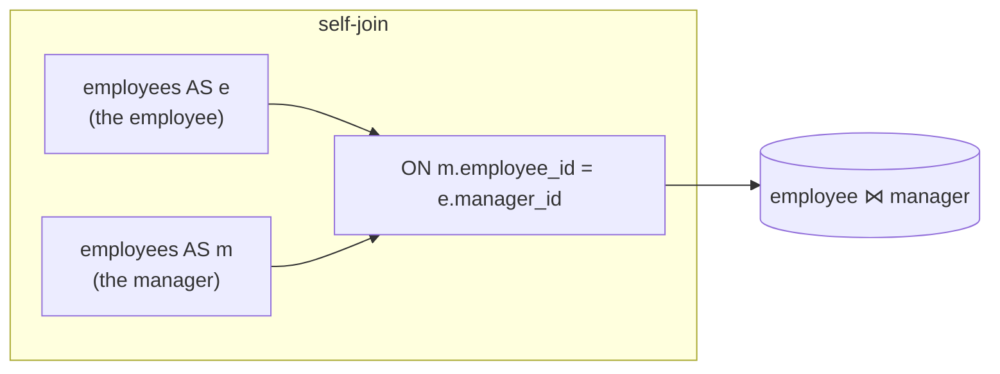

{/* status: authored */}

export const schema = `CREATE TABLE employees (
  employee_id int PRIMARY KEY,
  name        text NOT NULL,
  manager_id  int,
  salary      numeric NOT NULL
);
INSERT INTO employees (employee_id, name, manager_id, salary) VALUES
  (1, 'Root',   NULL, 180000),
  (2, 'Mara',   1,    140000),
  (3, 'Nikhil', 1,    138000),
  (4, 'Omar',   2,    110000),
  (5, 'Priya',  2,    105000);

CREATE TABLE sizes  (size text);
CREATE TABLE colors (color text);
INSERT INTO sizes  VALUES ('S'), ('M'), ('L');
INSERT INTO colors VALUES ('red'), ('blue');`;

# Self-joins & `CROSS JOIN`

## First principles

**Self-join**: a table joined to itself. There's no special syntax — you list
the table twice with **different aliases**, and the query engine treats them as
two independent inputs. Use it when a row relates to *another row in the same
table*: an employee and their manager, an event and the previous event, a price
and yesterday's price.

```sql
FROM employees e
JOIN employees m ON m.employee_id = e.manager_id
```

`e` is "the employee", `m` is "their manager" — same physical table, two roles.

**`CROSS JOIN`**: the [Cartesian product](/foundations/inner-join) with no `ON` —
every left row paired with every right row. `3 sizes × 2 colors = 6` rows. Not
always a bug: it's how you generate a grid, a calendar, all combinations, or a
row per (store, day).

## The mechanism



## Hand-trace on dummy data

Pair each employee with their manager's row:

<QueryTrace
  caption="employees e  JOIN  employees m  ON  m.employee_id = e.manager_id"
  steps={[
    {
      title: "1 · employees, read as 'e' (the employee)",
      op: "manager_id",
      table: {
        name: "e",
        columns: ["employee_id", "name", "manager_id"],
        rows: [[1,"Root",null],[2,"Mara",1],[3,"Nikhil",1],[4,"Omar",2],[5,"Priya",2]],
      },
    },
    {
      title: "2 · the same rows, read as 'm' (the manager) — match e.manager_id → m.employee_id",
      op: "employee_id",
      table: {
        name: "m",
        columns: ["employee_id", "name"],
        rows: [[1,"Root"],[2,"Mara"],[3,"Nikhil"],[4,"Omar"],[5,"Priya"]],
      },
    },
    {
      title: "3 · matched pairs — Root has manager_id NULL, so no pair (inner join drops it)",
      op: "manager_id",
      table: {
        name: "result",
        result: true,
        columns: ["employee", "manager"],
        rows: [["Mara","Root"],["Nikhil","Root"],["Omar","Mara"],["Priya","Mara"]],
      },
      rows: { match: [0, 1, 2, 3] },
    },
  ]}
/>

Use a `LEFT JOIN` instead if you want Root in the output with `manager = NULL`.

## Run it

<SqlRunner title="self-join: employee → manager" setup={schema}>
{`SELECT e.name AS employee, m.name AS manager
FROM employees e
LEFT JOIN employees m ON m.employee_id = e.manager_id
ORDER BY e.employee_id;`}
</SqlRunner>

<SqlRunner title="self-join: pairs earning more than a teammate" setup={schema}>
{`-- everyone paired with a same-manager colleague they out-earn
SELECT a.name AS higher, b.name AS lower, a.salary, b.salary
FROM employees a
JOIN employees b
  ON a.manager_id = b.manager_id      -- same team
 AND a.salary > b.salary              -- a earns more
ORDER BY a.manager_id, a.name;`}
</SqlRunner>

<SqlRunner title="CROSS JOIN: a size × color grid" setup={schema}>
{`SELECT s.size, c.color FROM sizes s CROSS JOIN colors c ORDER BY s.size, c.color;`}
</SqlRunner>

<SqlRunner title="CROSS JOIN: generate a date series (no table needed)" setup={schema}>
{`SELECT d::date AS day
FROM generate_series(DATE '2024-01-01', DATE '2024-01-05', INTERVAL '1 day') AS g(d);`}
</SqlRunner>

<RunThis file="sql/foundations/08_self_joins_and_cross_joins/topic.sql" />

## Build → Break → Fix → Why

:::tip 🔨 Build
"Employees paired with same-team colleagues" — needs `a.employee_id <> b.employee_id`:

```sql
SELECT a.name, b.name
FROM employees a JOIN employees b
  ON a.manager_id = b.manager_id AND a.employee_id <> b.employee_id;
```
:::

:::danger 💥 Break
Forget the `<> `:

```sql
SELECT a.name, b.name
FROM employees a JOIN employees b ON a.manager_id = b.manager_id;
```

Every employee is now also paired **with themselves** (`Omar, Omar`), because a
row trivially matches itself on `manager_id`. Counts and averages over this are
wrong.
:::

:::note 🔧 Fix
Add `a.employee_id <> b.employee_id` for "any other row", or
`a.employee_id < b.employee_id` for "each unordered pair once" (no self, no
mirror duplicate).
:::

:::info 🧠 Why it behaved that way
The two aliases are independent scans of the same rows, so the pair `(Omar,
Omar)` is a legitimate element of the product and it satisfies
`a.manager_id = b.manager_id`. Nothing excludes the diagonal unless you do.
`<` also removes the `(x,y)` / `(y,x)` duplication.
:::

## Pitfalls & idioms

- Self-join **must** alias both instances; unqualified columns are an error or,
  worse, ambiguous.
- Exclude the diagonal: `a.id <> b.id` (all ordered pairs) or `a.id < b.id`
  (each unordered pair once).
- "Compare to the previous row" is usually a [window
  function](/foundations/window-frames) (`lag()`), not a self-join — cleaner and
  faster.
- `CROSS JOIN` a small dimension deliberately (calendar × store); `CROSS JOIN` by
  accident (missing `ON`) explodes row counts — check the plan's estimated rows.
- `generate_series(...)` and `LATERAL` remove the need for many helper tables in
  a cross join.
- Hierarchies more than one level deep → [recursive
  CTE](/foundations/recursive-ctes), not N self-joins.

## See also

- [INNER JOIN](/foundations/inner-join) — the product-and-filter model
- [Recursive CTEs](/foundations/recursive-ctes) — multi-level hierarchies
- [Window frames](/foundations/window-frames) — `lag()`/`lead()` instead of a self-join
- [Data Engineering → Dimensional modeling](/data-engineering/dimensional-modeling-star-schema) — calendar dimensions via cross join

## Check yourself

1. Why does a self-join need aliases?
2. `employees a JOIN employees b ON a.manager_id = b.manager_id` — why is
   `(Omar, Omar)` in the result, and how do you remove it?
3. When would you use `a.id < b.id` instead of `a.id <> b.id`?
4. How many rows does `sizes CROSS JOIN colors` produce here, and what's a
   legitimate reason to want that?
5. "Each employee with the previous hire's date" — self-join or window function?
   Why?
