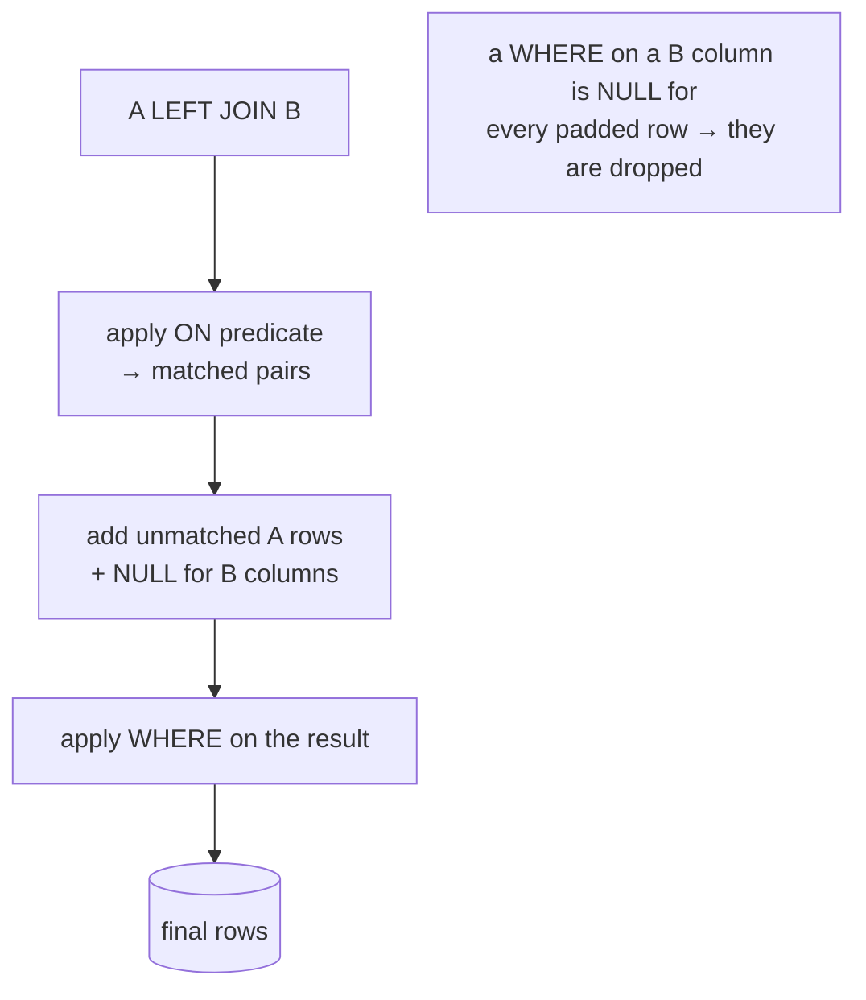

{/* status: authored */}

export const schema = `CREATE TABLE customers (customer_id int PRIMARY KEY, name text NOT NULL);
CREATE TABLE orders (
  order_id int PRIMARY KEY, customer_id int, status text NOT NULL, amount numeric NOT NULL
);
INSERT INTO customers VALUES (1,'Ana'), (2,'Ben'), (3,'Chidi');
INSERT INTO orders VALUES
  (100,1,'paid',    40),
  (101,1,'refunded',12),
  (102,2,'paid',    75);`;

# `ON` vs `WHERE`: predicate placement in joins

## First principles

Both clauses hold predicates. The difference is **when they run**:

- **`ON`** is part of *forming the join*. It decides which left/right pairs
  match. For an outer join, it runs **before** the NULL-padding of unmatched
  rows.
- **`WHERE`** runs **after** the whole join (including any padding), on the
  combined result.

For an **inner join**, `A JOIN B ON p1 WHERE p2` and `A JOIN B ON (p1 AND p2)`
give the same rows — inner joins keep only matches anyway, so it's just style
(keep the join condition in `ON`, keep filters in `WHERE`).

For an **outer join** the placement changes the answer:

| Predicate on… | in `ON` | in `WHERE` |
|---|---|---|
| the **preserved** (left) side | filters which left rows can match; unmatched left rows still kept | filters the final result normally |
| the **optional** (right) side | limits matches; left rows with no surviving match are kept, NULL-padded | **drops every NULL-padded row → outer join becomes inner** |

## The mechanism

## Hand-trace on dummy data

Goal: **every customer, with their _paid_ order total** (0 if none). Watch
`status = 'paid'` in `ON` vs `WHERE`.

<QueryTrace
  caption="LEFT JOIN orders ON ...  — the 'refunded' row and the placement of status='paid'"
  steps={[
    {
      title: "1 · after LEFT JOIN ON o.customer_id = c.customer_id",
      table: {
        columns: ["name", "order_id", "status", "amount"],
        rows: [
          ["Ana",100,"paid",40],
          ["Ana",101,"refunded",12],
          ["Ben",102,"paid",75],
          ["Chidi",null,null,null],
        ],
      },
    },
    {
      title: "2a · status='paid' in WHERE — drops row 4 (NULL) AND Ana's refund row",
      op: "status",
      table: {
        columns: ["name", "order_id", "status", "amount"],
        rows: [
          ["Ana",100,"paid",40],
          ["Ana",101,"refunded",12],
          ["Ben",102,"paid",75],
          ["Chidi",null,null,null],
        ],
      },
      rows: { drop: [1, 3] },
    },
    {
      title: "2a → result: Chidi is GONE. Outer join collapsed to inner. ✗",
      table: {
        name: "WHERE result (wrong)",
        columns: ["name", "paid_total"],
        rows: [["Ana",40],["Ben",75]],
      },
      rows: { drop: [] },
    },
    {
      title: "2b · status='paid' in ON — only Ana's refund row fails to match; Chidi still padded",
      op: "status",
      table: {
        columns: ["name", "order_id", "status", "amount"],
        rows: [
          ["Ana",100,"paid",40],
          ["Ben",102,"paid",75],
          ["Chidi",null,null,null],
        ],
      },
      rows: { add: [2] },
    },
    {
      title: "2b → result: Chidi kept with 0. ✓",
      table: {
        name: "ON result (correct)",
        result: true,
        columns: ["name", "paid_total"],
        rows: [["Ana",40],["Ben",75],["Chidi",0]],
      },
    },
  ]}
/>

## Run it

<SqlRunner title="filter in WHERE — Chidi disappears" setup={schema}>
{`SELECT c.name, coalesce(sum(o.amount), 0) AS paid_total
FROM customers c
LEFT JOIN orders o ON o.customer_id = c.customer_id
WHERE o.status = 'paid'
GROUP BY c.name
ORDER BY c.name;`}
</SqlRunner>

<SqlRunner title="filter in ON — Chidi kept with 0" setup={schema}>
{`SELECT c.name, coalesce(sum(o.amount), 0) AS paid_total
FROM customers c
LEFT JOIN orders o
  ON o.customer_id = c.customer_id AND o.status = 'paid'
GROUP BY c.name
ORDER BY c.name;`}
</SqlRunner>

<SqlRunner title="on an INNER join it doesn't matter" setup={schema}>
{`-- these two return identical rows
SELECT c.name, o.amount FROM customers c JOIN orders o
  ON o.customer_id = c.customer_id WHERE o.status = 'paid';
SELECT c.name, o.amount FROM customers c JOIN orders o
  ON o.customer_id = c.customer_id AND o.status = 'paid';`}
</SqlRunner>

<RunThis file="sql/foundations/09_on_vs_where/topic.sql" />

## Build → Break → Fix → Why

:::tip 🔨 Build
"All customers + count of their `paid` orders": `LEFT JOIN orders o ON
o.customer_id = c.customer_id AND o.status = 'paid'`, then
`count(o.order_id)`.
:::

:::danger 💥 Break
Move `status = 'paid'` to `WHERE`. Customers with zero paid orders drop out
entirely — you can no longer see that they have 0.
:::

:::note 🔧 Fix
Right-table filters that must not shrink the preserved side go in `ON`. A filter
that legitimately *should* restrict the final rows (e.g. "only customers in
Berlin", a left-table condition) belongs in `WHERE`.
:::

:::info 🧠 Why it behaved that way
`ON` participates in matching; a right row failing `ON` just isn't a match, and
the left row is still preserved and NULL-padded. `WHERE` runs on the padded
result; `o.status = 'paid'` is `NULL` for a padded row, `WHERE` keeps only
`true`, so the padded rows die — and with them the "outer" in outer join.
:::

## Pitfalls & idioms

- Join condition → `ON`. Filter on the **optional** side of an outer join → `ON`.
  Filter on the **preserved** side, or a genuine result filter → `WHERE`.
- The tell-tale bug: a `LEFT JOIN` whose result has no unmatched rows. Check for
  a `WHERE` on the right table.
- `WHERE right.col IS NULL` is the deliberate exception — that's an
  [anti-join](/foundations/semi-joins-and-anti-joins).
- For inner joins, keep the equality in `ON` and filters in `WHERE` for
  readability, even though it's equivalent.
- `USING (col)` is an `ON` equality; extra conditions still go after it in `ON`
  or in `WHERE` per the rules above.

## See also

- [Outer joins](/foundations/outer-joins) — the padding that `WHERE` destroys
- [INNER JOIN](/foundations/inner-join) — where placement is just style
- [Semi-joins & anti-joins](/foundations/semi-joins-and-anti-joins) — the `IS NULL`-after-`LEFT JOIN` pattern
- [Logical query processing order](/foundations/logical-query-processing-order) — `ON` (in `FROM`) is step 1, `WHERE` is step 2

## Check yourself

1. For an inner join, does it matter whether a non-join filter sits in `ON` or
   `WHERE`? For a left join?
2. `A LEFT JOIN B ON A.k = B.k WHERE B.status = 'x'` — what does this effectively
   become?
3. You want "all customers, and their orders from 2024 only". Which clause does
   the date filter go in?
4. When is `WHERE B.col IS NULL` after a `LEFT JOIN` correct and intentional?
5. "Only customers in Berlin, with their orders if any" — `ON` or `WHERE` for the
   city filter?
