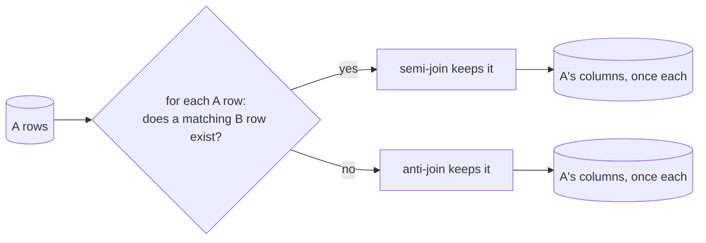

{/* status: authored */}

export const schema = `CREATE TABLE customers (customer_id int PRIMARY KEY, name text NOT NULL);
CREATE TABLE orders (order_id int PRIMARY KEY, customer_id int, amount numeric NOT NULL);
INSERT INTO customers VALUES (1,'Ana'), (2,'Ben'), (3,'Chidi'), (4,'Dana');
INSERT INTO orders VALUES
  (100, 1, 40),
  (101, 1, 12),
  (102, 2, 75),
  (900, NULL, 5);   -- an order with unknown customer`;

# Semi-joins & anti-joins (`EXISTS`, `NOT IN` trap)

## First principles

Sometimes you want to filter `A` by *whether* a related row exists in `B`, not to
combine their columns. Two shapes:

- **Semi-join** — "rows of `A` with **at least one** match in `B`". Each `A` row
  appears **once** (no fan-out), and you get **only `A`'s columns**.
  → `WHERE EXISTS (...)` or `WHERE a.k IN (SELECT k FROM b)`.
- **Anti-join** — "rows of `A` with **no** match in `B`".
  → `WHERE NOT EXISTS (...)` or `LEFT JOIN b ... WHERE b.k IS NULL`.

Why not just `JOIN`? Because a plain join **multiplies** `A` rows by the number of
matches (Ana with 2 orders → 2 rows). If you only wanted "customers who ordered",
you'd then need `DISTINCT`, which is slower and easy to forget.

The **`NOT IN` trap**: if the subquery can produce a `NULL`, `x NOT IN (...)` is
never `true` and the whole result is empty
([three-valued logic](/foundations/data-types-null-and-three-valued-logic)).
`NOT EXISTS` is immune.

## The mechanism



## Hand-trace on dummy data

Semi-join: customers who have ordered. Anti-join: customers who have not.

<QueryTrace
  caption="check each customer against orders.customer_id — once, no fan-out"
  steps={[
    {
      title: "1 · customers, and the set of customer_ids in orders",
      table: {
        name: "customers",
        columns: ["customer_id", "name"],
        rows: [[1,"Ana"],[2,"Ben"],[3,"Chidi"],[4,"Dana"]],
      },
    },
    {
      title: "1b · orders.customer_id values = {1, 1, 2, NULL}",
      op: "customer_id",
      table: {
        name: "orders",
        columns: ["order_id", "customer_id"],
        rows: [[100,1],[101,1],[102,2],[900,null]],
      },
    },
    {
      title: "2 · semi-join: EXISTS a matching order?",
      op: "customer_id",
      table: {
        columns: ["customer_id", "name", "has order?"],
        rows: [[1,"Ana","yes"],[2,"Ben","yes"],[3,"Chidi","no"],[4,"Dana","no"]],
      },
      rows: { drop: [2, 3] },
    },
    {
      title: "3a · semi-join result — each customer once",
      table: {
        name: "EXISTS result",
        result: true,
        columns: ["name"],
        rows: [["Ana"],["Ben"]],
      },
    },
    {
      title: "3b · anti-join result (NOT EXISTS) — the complement",
      table: {
        name: "NOT EXISTS result",
        result: true,
        columns: ["name"],
        rows: [["Chidi"],["Dana"]],
      },
    },
  ]}
/>

## Run it

<SqlRunner title="semi-join: EXISTS" setup={schema}>
{`SELECT c.name
FROM customers c
WHERE EXISTS (SELECT 1 FROM orders o WHERE o.customer_id = c.customer_id)
ORDER BY c.name;`}
</SqlRunner>

<SqlRunner title="semi-join: IN (same result here)" setup={schema}>
{`SELECT name FROM customers
WHERE customer_id IN (SELECT customer_id FROM orders)
ORDER BY name;`}
</SqlRunner>

<SqlRunner title="anti-join: NOT EXISTS  vs  NOT IN" setup={schema}>
{`-- NOT EXISTS: correct -> Chidi, Dana
SELECT name FROM customers c
WHERE NOT EXISTS (SELECT 1 FROM orders o WHERE o.customer_id = c.customer_id);

-- NOT IN against a column containing NULL -> ZERO rows
SELECT name FROM customers
WHERE customer_id NOT IN (SELECT customer_id FROM orders);`}
</SqlRunner>

<SqlRunner title="anti-join via LEFT JOIN ... IS NULL" setup={schema}>
{`SELECT c.name
FROM customers c
LEFT JOIN orders o ON o.customer_id = c.customer_id
WHERE o.order_id IS NULL
ORDER BY c.name;`}
</SqlRunner>

<RunThis file="sql/foundations/10_semi_joins_and_anti_joins/topic.sql" />

## Build → Break → Fix → Why

:::tip[🔨 Build]
"Customers who have never ordered":

```sql
SELECT name FROM customers c
WHERE NOT EXISTS (SELECT 1 FROM orders o WHERE o.customer_id = c.customer_id);
```
:::

:::danger[💥 Break]
Write it with `NOT IN`:

```sql
SELECT name FROM customers
WHERE customer_id NOT IN (SELECT customer_id FROM orders);
```

**Zero rows.** `orders.customer_id` includes the `NULL` from order 900.
`x NOT IN (1, 1, 2, NULL)` = `x<>1 AND x<>1 AND x<>2 AND x<>NULL` — the last term
is `NULL`, so the whole `AND` can never be `true`.
:::

:::note[🔧 Fix]
`NOT EXISTS` (correlated) — it asks "did the subquery return a row?", a clean
boolean. Or filter the subquery: `NOT IN (SELECT customer_id FROM orders WHERE
customer_id IS NOT NULL)`. Prefer `NOT EXISTS`.
:::

:::info[🧠 Why it behaved that way]
`IN` / `NOT IN` are value comparisons, so they inherit
[3VL](/foundations/data-types-null-and-three-valued-logic): one `NULL` in the
list poisons `NOT IN`. `EXISTS` / `NOT EXISTS` don't compare values — they test
"is the subquery non-empty?" — which is always `true` or `false`. Modern
Postgres plans `NOT EXISTS` as an efficient anti-join hash.
:::

## Pitfalls & idioms

- **`NOT IN` + nullable subquery = silent empty result.** Default to
  `NOT EXISTS`.
- Use a semi-join (`EXISTS`/`IN`), not `JOIN ... DISTINCT`, when you only need
  "does a match exist" — no fan-out, clearer intent, usually a better plan.
- `EXISTS (SELECT 1 ...)` — the select list is irrelevant; `1`, `*`, anything.
- `IN (list of literals)` is fine and not the trap — the trap is `NOT IN
  (subquery)`.
- Anti-join via `LEFT JOIN ... IS NULL` is fine and sometimes plans better; pick
  whichever your team reads faster. `NOT EXISTS` is the safe default.
- `EXISTS` short-circuits on the first matching row; a correlated
  `COUNT(*) > 0` scans them all.

## See also

- [Correlated subqueries & EXISTS](/foundations/correlated-subqueries-and-exists) — how `EXISTS` is evaluated
- [Data types, NULL & three-valued logic](/foundations/data-types-null-and-three-valued-logic) — the `NOT IN` mechanism
- [Outer joins](/foundations/outer-joins) — `LEFT JOIN ... IS NULL`
- [Subqueries](/foundations/subqueries) — `IN`, `ANY`, `ALL`

## Check yourself

1. What does a semi-join give you that a plain `JOIN` doesn't?
2. Why does `customer_id NOT IN (SELECT customer_id FROM orders)` return nothing
   when one order has `customer_id NULL`?
3. Rewrite that anti-join two safe ways.
4. In `EXISTS (SELECT 1 FROM orders o WHERE o.customer_id = c.customer_id)`, does
   it matter that it's `SELECT 1` and not `SELECT *`?
5. You wrote `JOIN orders ... GROUP BY c.name` to list "customers who ordered"
   and got duplicates before adding `DISTINCT`. What should you have used?
