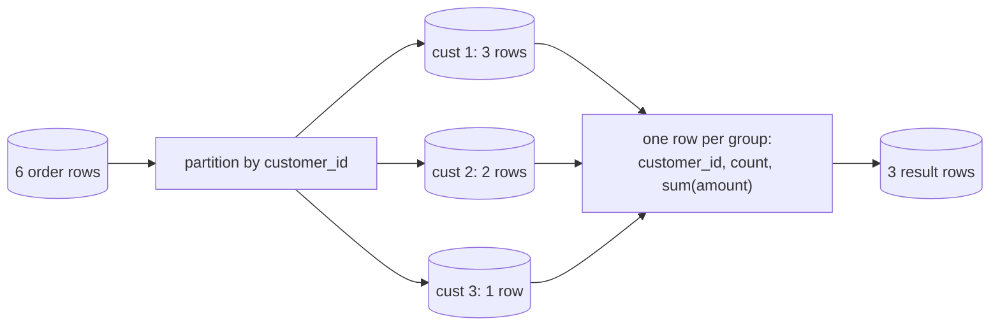

{/* status: authored */}

export const schema = `CREATE TABLE orders (
  order_id    int PRIMARY KEY,
  customer_id int NOT NULL,
  status      text NOT NULL,
  amount      numeric,          -- nullable on purpose
  ordered_at  date NOT NULL
);
INSERT INTO orders (order_id, customer_id, status, amount, ordered_at) VALUES
  (100, 1, 'paid',      40,   DATE '2024-01-05'),
  (101, 1, 'paid',      12,   DATE '2024-01-20'),
  (102, 2, 'paid',      75,   DATE '2024-01-22'),
  (103, 2, 'pending',   NULL, DATE '2024-02-01'),
  (104, 3, 'paid',      NULL, DATE '2024-02-03'),
  (105, 1, 'cancelled', 28,   DATE '2024-02-10');`;

# Aggregation & `GROUP BY`

## First principles

`GROUP BY k` does two things (step 3 of [processing
order](/foundations/logical-query-processing-order)):

1. **Partition** the rows into groups — one group per distinct value of `k`.
2. **Collapse** each group into exactly **one output row**.

Because each group becomes one row, every expression in `SELECT` must produce one
value per group. That means each `SELECT` item is either:

- **a grouping column** (`k`), or
- **an aggregate** over the group (`sum(amount)`, `count(*)`, `avg(price)`,
  `min`, `max`, `array_agg`, `string_agg`, …).

Reference any other bare column and Postgres errors: `column "x" must appear in
the GROUP BY clause or be used in an aggregate function`. There's nothing sensible
to show — the group has many `x` values and room for one.

**Aggregates and NULL**: `count(*)` counts rows; `count(col)`, `sum`, `avg`,
`min`, `max` **skip NULLs**. `avg` of `{40, NULL}` is `40`, not `20`. `sum` of
all-NULL is `NULL` (not `0`).

**No `GROUP BY`** but an aggregate in `SELECT` → the whole table is one group:
`SELECT count(*), sum(amount) FROM orders` returns one row.

## The mechanism



## Hand-trace on dummy data

`SELECT customer_id, count(*), sum(amount) FROM orders GROUP BY customer_id`:

<QueryTrace
  caption="partition by customer_id; count(*) counts rows, sum(amount) skips NULLs"
  steps={[
    {
      title: "1 · orders",
      table: {
        name: "orders",
        columns: ["order_id", "customer_id", "status", "amount"],
        rows: [
          [100,1,"paid",40],[101,1,"paid",12],[102,2,"paid",75],
          [103,2,"pending",null],[104,3,"paid",null],[105,1,"cancelled",28],
        ],
      },
    },
    {
      title: "2 · GROUP BY customer_id — three partitions",
      op: "customer_id",
      table: {
        columns: ["order_id", "customer_id", "amount"],
        rows: [
          [100,1,40],[101,1,12],[105,1,28],
          [102,2,75],[103,2,null],
          [104,3,null],
        ],
      },
      groups: [
        { label: "cust 1", rows: [0, 1, 2] },
        { label: "cust 2", rows: [3, 4] },
        { label: "cust 3", rows: [5] },
      ],
    },
    {
      title: "3 · collapse — count(*) all rows, sum(amount) ignores NULL — the result",
      op: "amount",
      table: {
        name: "result",
        result: true,
        columns: ["customer_id", "count", "sum"],
        rows: [[1, 3, 80], [2, 2, 75], [3, 1, null]],
      },
    },
  ]}
/>

Note cust 3: `count(*)` is `1`, but `sum(amount)` is `NULL` (the only row's
amount is `NULL`). Wrap in `coalesce(sum(amount), 0)` if you want `0`.

## Run it

<SqlRunner title="the trace" setup={schema}>
{`SELECT customer_id, count(*) AS orders, sum(amount) AS total
FROM orders
GROUP BY customer_id
ORDER BY customer_id;`}
</SqlRunner>

<SqlRunner title="count(*) vs count(col), and FILTER" setup={schema}>
{`SELECT
  customer_id,
  count(*)                                AS all_orders,
  count(amount)                           AS with_amount,   -- skips NULL
  count(*) FILTER (WHERE status = 'paid') AS paid_orders,   -- conditional count
  sum(amount) FILTER (WHERE status = 'paid') AS paid_total
FROM orders
GROUP BY customer_id
ORDER BY customer_id;`}
</SqlRunner>

<SqlRunner title="whole table = one group" setup={schema}>
{`SELECT count(*) AS rows, count(DISTINCT customer_id) AS customers,
       min(ordered_at) AS first_order, max(ordered_at) AS last_order
FROM orders;`}
</SqlRunner>

<SqlRunner title="string_agg / array_agg" setup={schema}>
{`SELECT customer_id, string_agg(status, ', ' ORDER BY order_id) AS statuses
FROM orders GROUP BY customer_id ORDER BY customer_id;`}
</SqlRunner>

<RunThis file="sql/foundations/11_group_by_and_aggregation/topic.sql" />

## Build → Break → Fix → Why

:::tip 🔨 Build
Paid revenue per customer:

```sql
SELECT customer_id, sum(amount) AS paid_total
FROM orders WHERE status = 'paid'
GROUP BY customer_id;
```
:::

:::danger 💥 Break
Also show the status without grouping by it:

```sql
SELECT customer_id, status, sum(amount)
FROM orders
GROUP BY customer_id;
-- ERROR: column "orders.status" must appear in the GROUP BY clause
--        or be used in an aggregate function
```
:::

:::note 🔧 Fix
Decide what you meant:

- one row per **customer** → drop `status`, or aggregate it
  (`string_agg(DISTINCT status, ',')`);
- one row per **customer & status** → `GROUP BY customer_id, status`;
- **filter** to one status → `WHERE status = 'paid'` and don't select it.
:::

:::info 🧠 Why it behaved that way
After `GROUP BY customer_id`, the group "customer 1" holds three rows with
statuses `paid, paid, cancelled`. `SELECT status` asks for a single value; there
are three, and no rule picks one. (MySQL with `ONLY_FULL_GROUP_BY` off *would*
pick an arbitrary one — a footgun Postgres refuses.)
:::

## Pitfalls & idioms

- Every non-aggregated `SELECT` column must be in `GROUP BY`. No exceptions in
  Postgres.
- `count(*)` ≠ `count(col)` when `col` has NULLs. `count(DISTINCT col)` for
  uniques.
- `sum`/`avg` over an all-NULL (or empty) group is `NULL`. `coalesce(sum(x), 0)`.
- **`GROUP BY` on a fanned-out join double-counts.** Aggregate before joining
  detail — see [INNER JOIN](/foundations/inner-join).
- `FILTER (WHERE ...)` gives you conditional aggregates without a `CASE` inside
  `sum` — cleaner and it also works for `count`.
- Grouping by a functional expression is fine: `GROUP BY date_trunc('month',
  ordered_at)`. Put the same expression in `SELECT`.
- Filtering groups (not rows) → [`HAVING`](/foundations/having-vs-where), not
  `WHERE`.

## See also

- [Logical query processing order](/foundations/logical-query-processing-order) — `GROUP BY` is step 3, `SELECT` is step 5
- [HAVING vs WHERE](/foundations/having-vs-where) — filtering groups
- [GROUPING SETS, ROLLUP, CUBE](/foundations/grouping-sets-rollup-cube) — several groupings in one pass
- [Window functions](/foundations/window-functions-partitioning-and-ranking) — aggregate *without* collapsing rows

## Check yourself

1. What are the only two kinds of expression allowed in `SELECT` alongside
   `GROUP BY customer_id`?
2. `count(*)` is 1 for a group but `sum(amount)` is `NULL`. How?
3. `SELECT customer_id, status, count(*) FROM orders GROUP BY customer_id` — the
   error, and three different fixes depending on intent.
4. Write "number of paid orders and number of cancelled orders per customer" in
   one query, one row per customer.
5. Why does `SELECT sum(o.amount) FROM orders o JOIN order_items i ON ...` often
   over-count, and what's the fix?
