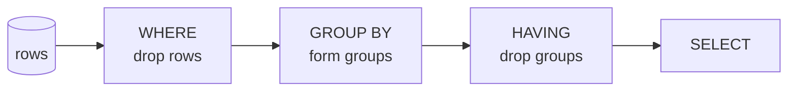

{/* status: authored */}

export const schema = `CREATE TABLE orders (
  order_id    int PRIMARY KEY,
  customer_id int NOT NULL,
  status      text NOT NULL,
  amount      numeric NOT NULL
);
INSERT INTO orders VALUES
  (100, 1, 'paid',      40),
  (101, 1, 'paid',      12),
  (102, 1, 'cancelled', 90),
  (103, 2, 'paid',      75),
  (104, 3, 'paid',       9),
  (105, 3, 'paid',       8);`;

# `HAVING` vs `WHERE`

## First principles

They filter different things at different times
([processing order](/foundations/logical-query-processing-order)):

| | `WHERE` | `HAVING` |
|---|---|---|
| Runs | step 2 — **before** `GROUP BY` | step 4 — **after** `GROUP BY` |
| Filters | individual **rows** | whole **groups** |
| Can see | base columns | grouping columns + **aggregates** |
| Can't see | aggregates, `SELECT` aliases | non-grouped base columns |

So:

- "only paid orders" → **`WHERE status = 'paid'`** (a row property).
- "only customers whose paid total > 50" → **`HAVING sum(amount) > 50`** (a group
  property).
- Both at once: `WHERE status='paid' ... GROUP BY customer_id HAVING sum(amount)
  > 50`.

`HAVING` without `GROUP BY` treats the whole table as one group:
`SELECT count(*) FROM orders HAVING count(*) > 100` returns one row or none.

## The mechanism



## Hand-trace on dummy data

`WHERE status='paid'` then `GROUP BY customer_id` then `HAVING sum(amount) > 20`:

<QueryTrace
  caption="row filter first, group, then group filter"
  steps={[
    {
      title: "1 · orders",
      table: {
        name: "orders",
        columns: ["order_id", "customer_id", "status", "amount"],
        rows: [
          [100,1,"paid",40],[101,1,"paid",12],[102,1,"cancelled",90],
          [103,2,"paid",75],[104,3,"paid",9],[105,3,"paid",8],
        ],
      },
    },
    {
      title: "2 · WHERE status = 'paid' — drop the cancelled row (a ROW filter)",
      op: "status",
      table: {
        columns: ["order_id", "customer_id", "status", "amount"],
        rows: [
          [100,1,"paid",40],[101,1,"paid",12],[102,1,"cancelled",90],
          [103,2,"paid",75],[104,3,"paid",9],[105,3,"paid",8],
        ],
      },
      rows: { drop: [2] },
    },
    {
      title: "3 · GROUP BY customer_id — sum(amount) per group",
      op: "customer_id",
      table: {
        columns: ["customer_id", "sum(amount)"],
        rows: [[1, 52], [2, 75], [3, 17]],
      },
      groups: [
        { label: "cust 1", rows: [0] },
        { label: "cust 2", rows: [1] },
        { label: "cust 3", rows: [2] },
      ],
    },
    {
      title: "4 · HAVING sum(amount) > 20 — drop cust 3's group (a GROUP filter) — result",
      op: "sum(amount)",
      table: {
        name: "result",
        result: true,
        columns: ["customer_id", "paid_total"],
        rows: [[1, 52], [2, 75]],
      },
    },
  ]}
/>

Cust 1's `cancelled` €90 order never reaches the sum — `WHERE` removed it before
grouping. That's the point of doing the status filter in `WHERE`.

## Run it

<SqlRunner title="the trace" setup={schema}>
{`SELECT customer_id, sum(amount) AS paid_total
FROM orders
WHERE status = 'paid'
GROUP BY customer_id
HAVING sum(amount) > 20
ORDER BY customer_id;`}
</SqlRunner>

<SqlRunner title="HAVING can use count(*) and aggregates; WHERE cannot" setup={schema}>
{`SELECT customer_id, count(*) AS n, sum(amount) AS total
FROM orders
GROUP BY customer_id
HAVING count(*) >= 2 AND sum(amount) > 40
ORDER BY customer_id;`}
</SqlRunner>

<RunThis file="sql/foundations/12_having_vs_where/topic.sql" />

## Build → Break → Fix → Why

:::tip[🔨 Build]
"Customers with 2+ paid orders":

```sql
SELECT customer_id, count(*)
FROM orders WHERE status = 'paid'
GROUP BY customer_id
HAVING count(*) >= 2;
```
:::

:::danger[💥 Break]
Put the aggregate in `WHERE`:

```sql
SELECT customer_id, count(*)
FROM orders
WHERE status = 'paid' AND count(*) >= 2
GROUP BY customer_id;
-- ERROR: aggregate functions are not allowed in WHERE
```

Or put the row filter in `HAVING` and lose the pre-filter:

```sql
SELECT customer_id, count(*)
FROM orders
GROUP BY customer_id
HAVING status = 'paid' AND count(*) >= 2;
-- ERROR: column "orders.status" must appear in the GROUP BY clause
```
:::

:::note[🔧 Fix]
Row conditions → `WHERE`. Group/aggregate conditions → `HAVING`:

```sql
WHERE status = 'paid'
GROUP BY customer_id
HAVING count(*) >= 2
```
:::

:::info[🧠 Why it behaved that way]
`WHERE` runs before grouping, so `count(*)` (which only exists once groups are
formed) is meaningless there — hence the error. `HAVING` runs after grouping;
`orders.status` isn't a grouping column and a group has many statuses, so it's
also meaningless there. Each clause can only see what exists at its step.
:::

## Pitfalls & idioms

- **Row filter in `WHERE`, group filter in `HAVING`.** A plain row filter in
  `HAVING` (e.g. `HAVING customer_id = 3`) sometimes works but does more work and
  reads wrong.
- `HAVING count(*) > 1` is the canonical "find duplicates" filter.
- `WHERE` shrinks the input to `GROUP BY` — always prefer it for anything that's
  a row property; it's less to aggregate.
- `HAVING` can reference aggregates not in `SELECT`:
  `... HAVING max(amount) > 100` while selecting only `customer_id`.
- Postgres lets `HAVING` use a `SELECT` alias in newer versions, but portable SQL
  repeats the aggregate expression.

## See also

- [Aggregation & GROUP BY](/foundations/group-by-and-aggregation) — forming the groups
- [Logical query processing order](/foundations/logical-query-processing-order) — step 2 vs step 4
- [Filtering rows](/foundations/filtering-rows) — `WHERE` predicates
- [GROUPING SETS, ROLLUP, CUBE](/foundations/grouping-sets-rollup-cube) — filtering across multiple groupings

## Check yourself

1. One sentence each: what does `WHERE` filter, what does `HAVING` filter?
2. Why is `WHERE count(*) > 1` an error?
3. "Paid orders only, for customers with 3+ total orders" — which condition goes
   where?
4. Can `HAVING` reference an aggregate that isn't in the `SELECT` list? Can
   `WHERE` reference a `SELECT` alias?
5. Move `status = 'paid'` from `WHERE` to `HAVING` in the trace query — what
   error or wrong number do you get, and why?
