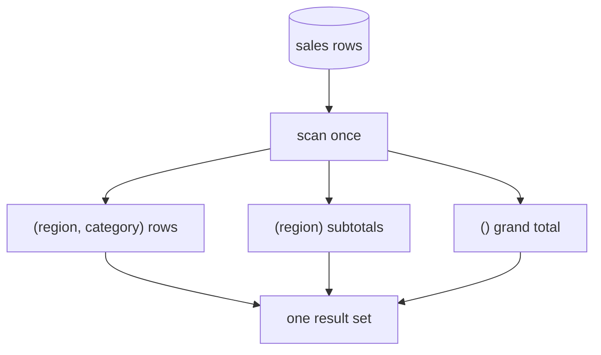

{/* status: authored */}

export const schema = `CREATE TABLE sales (
  region   text NOT NULL,
  category text NOT NULL,
  amount   numeric NOT NULL
);
INSERT INTO sales (region, category, amount) VALUES
  ('EU', 'tech',       100),
  ('EU', 'tech',        40),
  ('EU', 'home',        30),
  ('US', 'tech',       200),
  ('US', 'home',        60),
  ('US', 'home',        20);`;

# `GROUPING SETS`, `ROLLUP`, `CUBE`

## First principles

A plain `GROUP BY region, category` gives you one grain: **(region, category)**.
Reports usually want more in the same table — per category *and* a region
subtotal *and* a grand total. Without these keywords you'd `UNION ALL` three
queries that each scan `sales`.

`GROUPING SETS` lets one query produce **several groupings at once**:

```sql
GROUP BY GROUPING SETS ( (region, category), (region), () )
```

- `(region, category)` — the detail rows.
- `(region)` — one row per region, `category` shown as `NULL`.
- `()` — the empty set: one grand-total row, both keys `NULL`.

Shorthands:

- `ROLLUP(a, b)` = `GROUPING SETS ((a,b), (a), ())` — a **hierarchy** of
  subtotals (good for region → category).
- `CUBE(a, b)` = `GROUPING SETS ((a,b), (a), (b), ())` — **every** combination.

The `NULL`s in the key columns of subtotal rows are ambiguous with real `NULL`s;
`GROUPING(col)` returns `1` when the `NULL` is "this column was rolled up" and
`0` when it's a real value.

## The mechanism



## Hand-trace on dummy data

`GROUP BY ROLLUP(region, category)` over 6 sales rows:

<QueryTrace
  caption="detail rows, then region subtotals, then the grand total — all in one result"
  steps={[
    {
      title: "1 · sales",
      table: {
        name: "sales",
        columns: ["region", "category", "amount"],
        rows: [
          ["EU","tech",100],["EU","tech",40],["EU","home",30],
          ["US","tech",200],["US","home",60],["US","home",20],
        ],
      },
    },
    {
      title: "2 · grouping set (region, category) — the detail",
      op: "category",
      table: {
        columns: ["region", "category", "sum"],
        rows: [["EU","home",30],["EU","tech",140],["US","home",80],["US","tech",200]],
      },
    },
    {
      title: "3 · grouping set (region) — category rolled up to NULL",
      op: "region",
      table: {
        columns: ["region", "category", "sum"],
        rows: [["EU",null,170],["US",null,280]],
      },
      rows: { add: [0, 1] },
    },
    {
      title: "4 · grouping set () — the grand total — combined result",
      table: {
        name: "result",
        result: true,
        columns: ["region", "category", "sum"],
        rows: [
          ["EU","home",30],["EU","tech",140],["EU",null,170],
          ["US","home",80],["US","tech",200],["US",null,280],
          [null,null,450],
        ],
      },
      rows: { add: [2, 5, 6] },
    },
  ]}
/>

## Run it

<SqlRunner title="ROLLUP" setup={schema}>
{`SELECT region, category, sum(amount) AS total
FROM sales
GROUP BY ROLLUP(region, category)
ORDER BY region NULLS LAST, category NULLS LAST;`}
</SqlRunner>

<SqlRunner title="GROUPING() to label subtotal rows" setup={schema}>
{`SELECT
  CASE WHEN GROUPING(region)=1   THEN 'ALL'    ELSE region   END AS region,
  CASE WHEN GROUPING(category)=1 THEN 'all'    ELSE category END AS category,
  sum(amount) AS total
FROM sales
GROUP BY ROLLUP(region, category)
ORDER BY GROUPING(region), region, GROUPING(category), category;`}
</SqlRunner>

<SqlRunner title="CUBE: every combination (adds per-category totals)" setup={schema}>
{`SELECT region, category, sum(amount) AS total
FROM sales
GROUP BY CUBE(region, category)
ORDER BY region NULLS LAST, category NULLS LAST;`}
</SqlRunner>

<SqlRunner title="explicit GROUPING SETS — pick exactly the levels you want" setup={schema}>
{`SELECT region, category, sum(amount) AS total
FROM sales
GROUP BY GROUPING SETS ((region), (category), ())
ORDER BY region NULLS LAST, category NULLS LAST;`}
</SqlRunner>

<RunThis file="sql/foundations/13_grouping_sets_rollup_cube/topic.sql" />

## Build → Break → Fix → Why

:::tip[🔨 Build]
Category totals plus a grand total:

```sql
SELECT category, sum(amount) FROM sales
GROUP BY GROUPING SETS ((category), ());
```
:::

:::danger[💥 Break]
Try to tell the grand-total row apart with `WHERE category IS NOT NULL` (to hide
it) — but `sales` has no real NULL categories, so it works by luck. Add a row
with a genuinely `NULL` category and your filter now also hides a real group. Or:
sort by `category` and the total row lands in a confusing spot.
:::

:::note[🔧 Fix]
Use `GROUPING(category)` — it's `1` only for rolled-up NULLs, `0` for real
values:

```sql
... HAVING GROUPING(category) = 0            -- hide the grand total
... ORDER BY GROUPING(category), category    -- total row last, deterministically
```
:::

:::info[🧠 Why it behaved that way]
Subtotal rows carry `NULL` in the columns that were rolled up, and SQL has no
separate "aggregated away" marker in the value itself. `GROUPING(col)` is that
marker, returned as a separate bit. Filtering or sorting on the raw `NULL`
conflates "rolled up" with "actually null".
:::

## Pitfalls & idioms

- `ROLLUP(a,b)` for a **hierarchy** (year → month → day). `CUBE(a,b)` for a
  **matrix** (all dimension combinations). `GROUPING SETS` when you want a
  specific subset.
- Always disambiguate subtotal `NULL`s with `GROUPING()` in `SELECT`, `HAVING`,
  and `ORDER BY`.
- One scan beats `N` `UNION ALL` queries — and the planner can share work.
- `count(*)` in a subtotal row counts all detail rows in that rollup, which is
  usually what you want.
- These are standard SQL and supported by Postgres, SQL Server, Oracle,
  BigQuery, Snowflake. MySQL only has `WITH ROLLUP`.

## See also

- [Aggregation & GROUP BY](/foundations/group-by-and-aggregation) — the single-grouping base case
- [HAVING vs WHERE](/foundations/having-vs-where) — `HAVING GROUPING(x) = 0`
- [Set operations](/foundations/set-operations) — the `UNION ALL` this replaces
- [Data Engineering → Dimensional modeling](/data-engineering/dimensional-modeling-star-schema) — pre-aggregated rollup tables

## Check yourself

1. Write `ROLLUP(a, b)` as an equivalent `GROUPING SETS (...)`.
2. What's in the `region` / `category` columns of a grand-total row, and how do
   you tell it apart from a real `NULL`?
3. `CUBE(region, category)` produces how many grouping sets? Name them.
4. Why is one `GROUP BY GROUPING SETS` query usually cheaper than three
   `UNION ALL`ed `GROUP BY`s?
5. You need per-region totals and a grand total but **not** per-category. Which
   construct?
