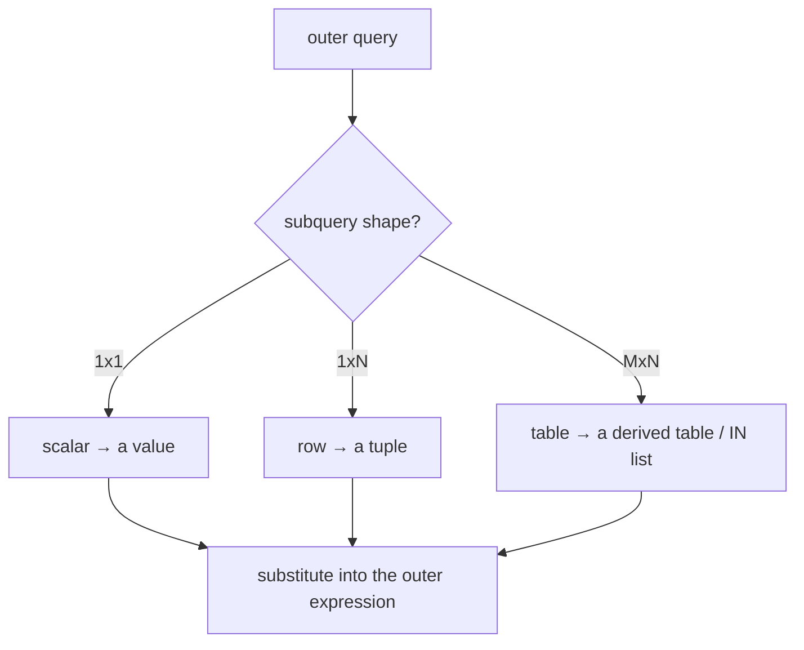

{/* status: authored */}

export const schema = `CREATE TABLE products (
  product_id int PRIMARY KEY,
  name       text NOT NULL,
  category   text NOT NULL,
  price      numeric NOT NULL
);
INSERT INTO products VALUES
  (10,'Notebook','stationery', 6),
  (11,'Pen pack','stationery',  4),
  (12,'Desk lamp','home',      28),
  (13,'Mug','home',             9),
  (14,'Headphones','tech',     75),
  (15,'USB cable','tech',       8);`;

# Subqueries: scalar, row, table

## First principles

A subquery is a `SELECT` wrapped in parentheses and used inside another
statement. Thanks to [closure](/foundations/the-relational-model) its result is
just a table; what differs is **its shape** and therefore **where it's legal**:

| Shape | Returns | Legal in | Example |
|---|---|---|---|
| **Scalar** | exactly 1 row, 1 column | anywhere a value is: `SELECT` list, `WHERE`, `ON` | `WHERE price > (SELECT avg(price) FROM products)` |
| **Row** | 1 row, several columns | row comparisons | `WHERE (a, b) = (SELECT x, y FROM ...)` |
| **Table** | many rows/columns | `FROM`, `IN`, `EXISTS`, `= ANY` | `FROM (SELECT category, avg(price) ... ) t` |

Two more distinctions:

- **Uncorrelated** — the subquery doesn't reference the outer query, so it can be
  run **once**. `(SELECT avg(price) FROM products)` is a constant.
- **Correlated** — it references an outer column, so it's conceptually
  re-evaluated per outer row — see [Correlated
  subqueries](/foundations/correlated-subqueries-and-exists).

A scalar subquery that returns **more than one row** is a runtime error
(`more than one row returned by a subquery used as an expression`). Returning
**zero** rows yields `NULL`.

`x = ANY (subquery)` is `IN`. `x <> ALL (subquery)` is `NOT IN` (with the same
[NULL trap](/foundations/semi-joins-and-anti-joins)).

## The mechanism



## Hand-trace on dummy data

`WHERE price > (SELECT avg(price) FROM products)`:

<QueryTrace
  caption="run the scalar subquery once, then filter with its value"
  steps={[
    {
      title: "1 · products",
      op: "price",
      table: {
        name: "products",
        columns: ["product_id", "name", "price"],
        rows: [[10,"Notebook",6],[11,"Pen pack",4],[12,"Desk lamp",28],[13,"Mug",9],[14,"Headphones",75],[15,"USB cable",8]],
      },
    },
    {
      title: "2 · the scalar subquery: SELECT avg(price) → 21.67 (computed once)",
      table: {
        name: "(scalar)",
        columns: ["avg_price"],
        rows: [[21.67]],
      },
    },
    {
      title: "3 · WHERE price > 21.67 — the result",
      op: "price",
      table: {
        name: "result",
        result: true,
        columns: ["name", "price"],
        rows: [["Desk lamp",28],["Headphones",75]],
      },
    },
  ]}
/>

## Run it

<SqlRunner title="scalar in WHERE" setup={schema}>
{`SELECT name, price FROM products
WHERE price > (SELECT avg(price) FROM products)
ORDER BY price;`}
</SqlRunner>

<SqlRunner title="scalar in the SELECT list" setup={schema}>
{`SELECT name, price,
       price - (SELECT avg(price) FROM products) AS vs_avg
FROM products ORDER BY vs_avg;`}
</SqlRunner>

<SqlRunner title="table subquery in FROM (a derived table)" setup={schema}>
{`SELECT t.category, t.avg_price
FROM (SELECT category, avg(price) AS avg_price FROM products GROUP BY category) AS t
WHERE t.avg_price > 10
ORDER BY t.avg_price DESC;`}
</SqlRunner>

<SqlRunner title="table subquery with IN / = ANY" setup={schema}>
{`SELECT name, category FROM products
WHERE category IN (
  SELECT category FROM products GROUP BY category HAVING count(*) >= 2
)
ORDER BY category, name;`}
</SqlRunner>

<SqlRunner title="row subquery" setup={schema}>
{`SELECT name, category, price FROM products
WHERE (category, price) = (
  SELECT category, max(price) FROM products WHERE category = 'tech' GROUP BY category
);`}
</SqlRunner>

<RunThis file="sql/foundations/14_subqueries/topic.sql" />

## Build → Break → Fix → Why

:::tip 🔨 Build
"The single most expensive product":

```sql
SELECT name, price FROM products
WHERE price = (SELECT max(price) FROM products);
```
:::

:::danger 💥 Break
"Products priced like the most expensive one in their category":

```sql
SELECT name FROM products
WHERE price = (SELECT max(price) FROM products GROUP BY category);
-- ERROR: more than one row returned by a subquery used as an expression
```

The `GROUP BY` makes the subquery return one max per category — three rows — but
`price = (...)` needs a single value.
:::

:::note 🔧 Fix
Either make it a proper multi-row test with `IN` /`= ANY`:

```sql
WHERE price IN (SELECT max(price) FROM products GROUP BY category)
```

or (better, because it ties price to *its own* category) a **correlated**
subquery:

```sql
WHERE price = (SELECT max(p2.price) FROM products p2 WHERE p2.category = products.category)
```
:::

:::info 🧠 Why it behaved that way
`price = (subquery)` is a scalar context: SQL expects the subquery to yield one
value to compare against. `GROUP BY category` yields one row per group, so the
expression is fed 3 values and the engine can't reduce them to one — runtime
error. `IN` / `ANY` accept a set; a correlated subquery narrows the set back to
one row per outer row.
:::

## Pitfalls & idioms

- Scalar subquery, 0 rows → `NULL` (silently). Many rows → runtime error. Guard
  with `LIMIT 1` + an `ORDER BY` if "any one" is acceptable.
- A derived table in `FROM` **must** be aliased (`... ) AS t`).
- `WHERE x IN (SELECT ...)` where the subquery can be `NULL`: fine for `IN`,
  broken for `NOT IN` — use `NOT EXISTS`.
- Repeating the same uncorrelated subquery several times → lift it into a
  [CTE](/foundations/common-table-expressions) for readability (the planner
  usually computes it once either way).
- A correlated subquery in `SELECT` that returns one aggregate per row is often
  clearer as a `LEFT JOIN` to a grouped subquery — check the plan.
- `= ANY (array)` also works on an array literal, not just a subquery:
  `id = ANY ('{1,2,3}'::int[])`.

## See also

- [Correlated subqueries & EXISTS](/foundations/correlated-subqueries-and-exists) — the per-row kind
- [Common Table Expressions](/foundations/common-table-expressions) — naming subqueries
- [Semi-joins & anti-joins](/foundations/semi-joins-and-anti-joins) — `IN` / `NOT IN` / `EXISTS`
- [The relational model](/foundations/the-relational-model) — closure, why this works at all

## Check yourself

1. Name the three subquery shapes and one place each is legal.
2. What does a scalar subquery return when it matches zero rows? More than one?
3. `WHERE price = (SELECT max(price) FROM products GROUP BY category)` — the error
   and two fixes.
4. Why must a `FROM (SELECT ...)` subquery have an alias?
5. When is `x = ANY (SELECT ...)` exactly `x IN (SELECT ...)`?
