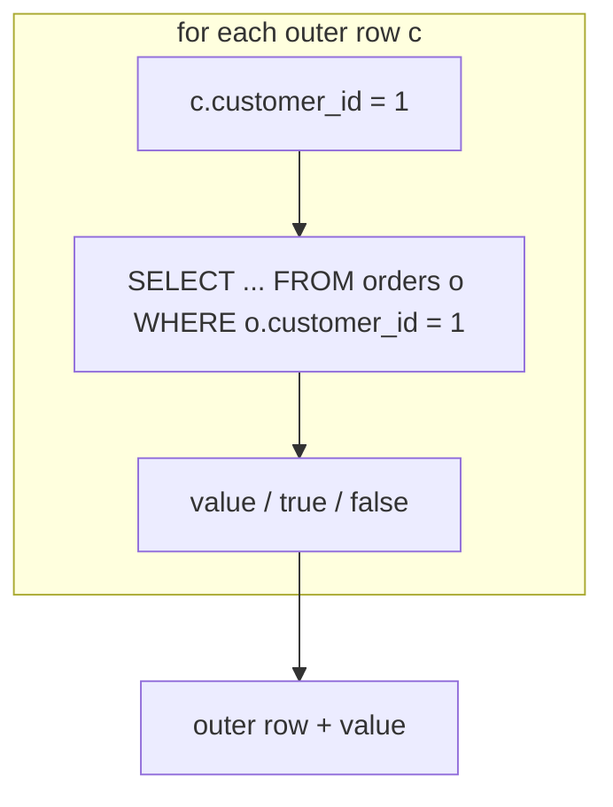

{/* status: authored */}

export const schema = `CREATE TABLE customers (customer_id int PRIMARY KEY, name text NOT NULL, city text NOT NULL);
CREATE TABLE orders (
  order_id int PRIMARY KEY, customer_id int NOT NULL, amount numeric NOT NULL, ordered_at date NOT NULL
);
INSERT INTO customers VALUES (1,'Ana','Berlin'), (2,'Ben','Berlin'), (3,'Chidi','Lagos'), (4,'Dana','Lagos');
INSERT INTO orders VALUES
  (100,1,40,DATE '2024-01-10'),
  (101,1,90,DATE '2024-02-11'),
  (102,2,15,DATE '2024-01-15'),
  (103,3,120,DATE '2024-03-01');`;

# Correlated subqueries & `EXISTS`

## First principles

A **correlated** subquery references a column from the outer query, so it can't
be computed once — conceptually it runs **once per outer row**, with that row's
values plugged in.

```sql
SELECT c.name,
       (SELECT count(*) FROM orders o WHERE o.customer_id = c.customer_id) AS n_orders
FROM customers c;
```

For each `c`, the inner query counts *that customer's* orders. `c.customer_id` is
the correlation.

**`EXISTS (subquery)`** is a correlated subquery used as a boolean: `true` if the
subquery produces **at least one** row, `false` otherwise. It **short-circuits** —
stops at the first matching row — and its `SELECT` list is irrelevant (`SELECT 1`
by convention).

`EXISTS` / `NOT EXISTS` are the safe way to do
[semi/anti-joins](/foundations/semi-joins-and-anti-joins); they don't have the
`NOT IN` NULL trap and modern planners turn them into hash semi/anti-joins, so
"runs per row" is the *semantics*, not necessarily the execution.

## The mechanism



## Hand-trace on dummy data

`SELECT name, (SELECT count(*) FROM orders o WHERE o.customer_id = c.customer_id)`:

<QueryTrace
  caption="the inner count runs once per customer, filtered by that customer's id"
  steps={[
    {
      title: "1 · customers (outer)",
      op: "customer_id",
      table: {
        name: "customers",
        columns: ["customer_id", "name"],
        rows: [[1,"Ana"],[2,"Ben"],[3,"Chidi"],[4,"Dana"]],
      },
    },
    {
      title: "2 · orders (inner source)",
      op: "customer_id",
      table: {
        name: "orders",
        columns: ["order_id", "customer_id", "amount"],
        rows: [[100,1,40],[101,1,90],[102,2,15],[103,3,120]],
      },
    },
    {
      title: "3 · per outer row, count orders WHERE o.customer_id = c.customer_id",
      table: {
        columns: ["customer_id", "name", "inner filter", "count"],
        rows: [
          [1,"Ana","o.customer_id = 1",2],
          [2,"Ben","o.customer_id = 2",1],
          [3,"Chidi","o.customer_id = 3",1],
          [4,"Dana","o.customer_id = 4",0],
        ],
      },
    },
    {
      title: "4 · the result",
      table: {
        name: "result",
        result: true,
        columns: ["name", "n_orders"],
        rows: [["Ana",2],["Ben",1],["Chidi",1],["Dana",0]],
      },
    },
  ]}
/>

## Run it

<SqlRunner title="correlated count in SELECT" setup={schema}>
{`SELECT c.name,
       (SELECT count(*)          FROM orders o WHERE o.customer_id = c.customer_id) AS n_orders,
       (SELECT coalesce(sum(amount),0) FROM orders o WHERE o.customer_id = c.customer_id) AS total
FROM customers c
ORDER BY c.name;`}
</SqlRunner>

<SqlRunner title="EXISTS: customers with an order over 50" setup={schema}>
{`SELECT c.name FROM customers c
WHERE EXISTS (SELECT 1 FROM orders o WHERE o.customer_id = c.customer_id AND o.amount > 50)
ORDER BY c.name;`}
</SqlRunner>

<SqlRunner title="correlated in WHERE: each customer's biggest order" setup={schema}>
{`SELECT o.order_id, o.customer_id, o.amount
FROM orders o
WHERE o.amount = (SELECT max(o2.amount) FROM orders o2 WHERE o2.customer_id = o.customer_id)
ORDER BY o.customer_id;`}
</SqlRunner>

<SqlRunner title="correlated vs join — same answer" setup={schema}>
{`-- as a join to a grouped subquery (often the better plan on big data)
SELECT c.name, coalesce(g.n, 0) AS n_orders
FROM customers c
LEFT JOIN (SELECT customer_id, count(*) AS n FROM orders GROUP BY customer_id) g
  ON g.customer_id = c.customer_id
ORDER BY c.name;`}
</SqlRunner>

<RunThis file="sql/foundations/15_correlated_subqueries_and_exists/topic.sql" />

## Build → Break → Fix → Why

:::tip 🔨 Build
"Customers who have ordered" — `EXISTS`:

```sql
SELECT name FROM customers c
WHERE EXISTS (SELECT 1 FROM orders o WHERE o.customer_id = c.customer_id);
```
:::

:::danger 💥 Break
Use a correlated `COUNT` instead, and forget it counts everything:

```sql
SELECT name FROM customers c
WHERE (SELECT count(*) FROM orders o WHERE o.customer_id = c.customer_id) > 0;
```

Correct result, but on a big `orders` table it **counts every matching row for
every customer** — `EXISTS` stops at the first. On millions of orders that's the
difference between a quick index probe and a full per-customer scan.
:::

:::note 🔧 Fix
`EXISTS (SELECT 1 ...)` for "is there at least one". Reserve the correlated
`COUNT` for when you actually need the number.
:::

:::info 🧠 Why it behaved that way
`count(*) > 0` forces the subquery to *enumerate and count* all matches before
comparing. `EXISTS` is satisfied by the **first** row the subquery can produce,
so with an index on `orders(customer_id)` it's one index seek per customer and
done. Same result, very different work.
:::

## Pitfalls & idioms

- `EXISTS (SELECT 1 ...)` not `COUNT(*) > 0` for existence tests.
- A correlated scalar subquery in `SELECT` returning an aggregate: fine, but
  compare the plan to a `LEFT JOIN` on a grouped subquery — the join is often
  faster and computes all customers in one pass.
- Correlated subquery returning **more than one row** in a scalar spot → runtime
  error. Correlate tighter or aggregate.
- `NOT EXISTS` is the anti-join that dodges the
  [`NOT IN` NULL trap](/foundations/semi-joins-and-anti-joins).
- "Greatest-N-per-group" via correlated `= (SELECT max...)` works but re-scans;
  a [window function](/foundations/window-functions-partitioning-and-ranking)
  `row_number()` is usually cleaner.
- The correlation column should be indexed on the inner table.

## See also

- [Subqueries](/foundations/subqueries) — the uncorrelated kinds
- [Semi-joins & anti-joins](/foundations/semi-joins-and-anti-joins) — `EXISTS` / `NOT EXISTS` in full
- [Window functions](/foundations/window-functions-partitioning-and-ranking) — top-N-per-group without a correlated subquery
- [Query optimization](/foundations/query-optimization) — semi-join vs nested-loop plans

## Check yourself

1. What makes a subquery "correlated", and what does that imply about how often
   it runs?
2. Why is `EXISTS (SELECT 1 ...)` preferable to `(SELECT count(*) ...) > 0`?
3. Does the `SELECT` list inside `EXISTS(...)` matter?
4. Rewrite "each customer's order count" as (a) a correlated subquery and (b) a
   `LEFT JOIN`.
5. A correlated scalar subquery in `SELECT` sometimes raises "more than one row".
   What did you correlate wrong?
