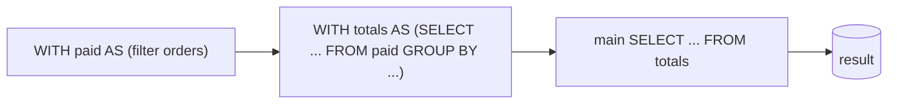

{/* status: authored */}

export const schema = `CREATE TABLE orders (
  order_id int PRIMARY KEY, customer_id int NOT NULL, status text NOT NULL, amount numeric NOT NULL
);
INSERT INTO orders VALUES
  (100,1,'paid',      40),
  (101,1,'paid',      12),
  (102,2,'paid',      75),
  (103,2,'pending',   10),
  (104,3,'paid',       9),
  (105,3,'paid',       8),
  (106,4,'cancelled', 50);`;

# Common Table Expressions (`WITH`)

## First principles

A CTE is a **named subquery** written before the main query:

```sql
WITH paid AS (
  SELECT customer_id, amount FROM orders WHERE status = 'paid'
)
SELECT customer_id, sum(amount) FROM paid GROUP BY customer_id;
```

`paid` is usable like a table for the rest of the statement. CTEs buy you:

- **Readability** — a pipeline reads top to bottom instead of inside-out.
- **Reuse** — reference the same CTE several times without repeating its SQL.
- **Chaining** — `WITH a AS (...), b AS (SELECT ... FROM a), c AS (...)` builds a
  step-by-step transformation.
- **Recursion** — `WITH RECURSIVE` for hierarchies (its own
  [topic](/foundations/recursive-ctes)).

A CTE is scoped to the single statement it precedes. It's not a temp table; it
vanishes when the statement finishes.

**Materialization** (Postgres): historically a CTE was an *optimization fence* —
always computed once into a temp result, even if that hurt. Since **Postgres 12**
the planner may **inline** a CTE that's referenced once and has no side effects,
folding it into the main query. You can force either way:

```sql
WITH x AS MATERIALIZED (...)      -- always compute once, store
WITH x AS NOT MATERIALIZED (...)  -- always inline
```

## The mechanism



## Hand-trace on dummy data

`WITH paid AS (paid orders), totals AS (sum per customer) SELECT ... WHERE total >
20`:

<QueryTrace
  caption="each CTE is a step; the main query consumes the last one"
  steps={[
    {
      title: "1 · orders",
      op: "status",
      table: {
        name: "orders",
        columns: ["order_id", "customer_id", "status", "amount"],
        rows: [
          [100,1,"paid",40],[101,1,"paid",12],[102,2,"paid",75],
          [103,2,"pending",10],[104,3,"paid",9],[105,3,"paid",8],[106,4,"cancelled",50],
        ],
      },
    },
    {
      title: "2 · CTE `paid` = orders WHERE status = 'paid'",
      op: "status",
      table: {
        name: "paid",
        columns: ["customer_id", "amount"],
        rows: [[1,40],[1,12],[2,75],[3,9],[3,8]],
      },
    },
    {
      title: "3 · CTE `totals` = SELECT customer_id, sum(amount) FROM paid GROUP BY customer_id",
      op: "customer_id",
      table: {
        name: "totals",
        columns: ["customer_id", "total"],
        rows: [[1,52],[2,75],[3,17]],
      },
    },
    {
      title: "4 · main query: SELECT * FROM totals WHERE total > 20 — result",
      op: "total",
      table: {
        name: "result",
        result: true,
        columns: ["customer_id", "total"],
        rows: [[1,52],[2,75]],
      },
    },
  ]}
/>

## Run it

<SqlRunner title="a two-step CTE pipeline" setup={schema}>
{`WITH paid AS (
  SELECT customer_id, amount FROM orders WHERE status = 'paid'
),
totals AS (
  SELECT customer_id, sum(amount) AS total FROM paid GROUP BY customer_id
)
SELECT * FROM totals WHERE total > 20 ORDER BY customer_id;`}
</SqlRunner>

<SqlRunner title="reuse one CTE twice (compare each customer to the average)" setup={schema}>
{`WITH totals AS (
  SELECT customer_id, sum(amount) AS total
  FROM orders WHERE status = 'paid' GROUP BY customer_id
)
SELECT t.customer_id, t.total,
       (SELECT round(avg(total), 2) FROM totals) AS avg_total,
       t.total - (SELECT avg(total) FROM totals) AS diff
FROM totals t
ORDER BY diff DESC;`}
</SqlRunner>

<SqlRunner title="materialization: fence vs inline" setup={schema}>
{`EXPLAIN
WITH big AS NOT MATERIALIZED (SELECT * FROM orders WHERE amount > 10)
SELECT customer_id, count(*) FROM big GROUP BY customer_id;
-- swap NOT MATERIALIZED -> MATERIALIZED and compare the plan`}
</SqlRunner>

<RunThis file="sql/foundations/16_common_table_expressions/topic.sql" />

## Build → Break → Fix → Why

:::tip 🔨 Build
Pre-aggregate before joining detail (avoids the
[fan-out double-count](/foundations/inner-join)):

```sql
WITH per_order AS (
  SELECT order_id, sum(qty * price) AS order_total FROM order_items GROUP BY order_id
)
SELECT o.order_id, po.order_total
FROM orders o JOIN per_order po USING (order_id);
```
:::

:::danger 💥 Break
Assume a CTE is always a one-time computation and put an expensive function in a
CTE referenced 5 times, expecting it to run once — then on Postgres 12+ the
planner **inlines** it and the function runs per reference, 5×. (Or the reverse:
you rely on inlining for an index to be used, and an older Postgres fences it.)
:::

:::note 🔧 Fix
Be explicit when it matters: `WITH x AS MATERIALIZED (...)` to guarantee one
computation, `NOT MATERIALIZED` to guarantee inlining. Don't assume the default.
:::

:::info 🧠 Why it behaved that way
Pre-12 Postgres always materialized CTEs — predictable but sometimes a
pessimization (predicates couldn't be pushed in). Modern Postgres inlines a CTE
that's referenced once and side-effect-free, so it optimizes across the boundary.
A CTE referenced multiple times, or marked `MATERIALIZED`, or containing
`INSERT`/`UPDATE`/`DELETE`, is still computed once.
:::

## Pitfalls & idioms

- CTEs are for **readability and structure**. They're not faster than a
  subquery; sometimes (when fenced) slower.
- A data-modifying CTE (`WITH moved AS (DELETE ... RETURNING *) INSERT ...`) runs
  once and is a genuinely useful pattern — see
  [Modifying data](/foundations/modifying-data).
- Prefer a chain of small CTEs over one deeply nested subquery — future-you will
  thank you.
- CTE ≠ temp table: no statistics, no indexes, gone after the statement. For
  something reused across statements, use a real `TEMP TABLE`.
- Don't wrap a trivial one-liner in a CTE; don't build a 12-CTE monster either.
- `MATERIALIZED` a CTE you reference many times *and* that's expensive to
  recompute.

## See also

- [Subqueries](/foundations/subqueries) — what a CTE is, unnamed
- [Recursive CTEs](/foundations/recursive-ctes) — `WITH RECURSIVE`
- [Modifying data](/foundations/modifying-data) — `WITH ... AS (DELETE ... RETURNING)`
- [Reading query plans](/foundations/reading-query-plans) — spotting a CTE Scan / materialize node

## Check yourself

1. Three reasons to use a CTE over an inline subquery.
2. Is a CTE a temp table? What's the scope of `WITH x AS (...)`?
3. Post-Postgres-12, when does the planner inline a CTE and when does it still
   materialize it?
4. Write a two-CTE pipeline: filter, then aggregate, then filter the aggregate.
5. You need the same expensive subquery in three places and want it computed
   once. What do you write?
