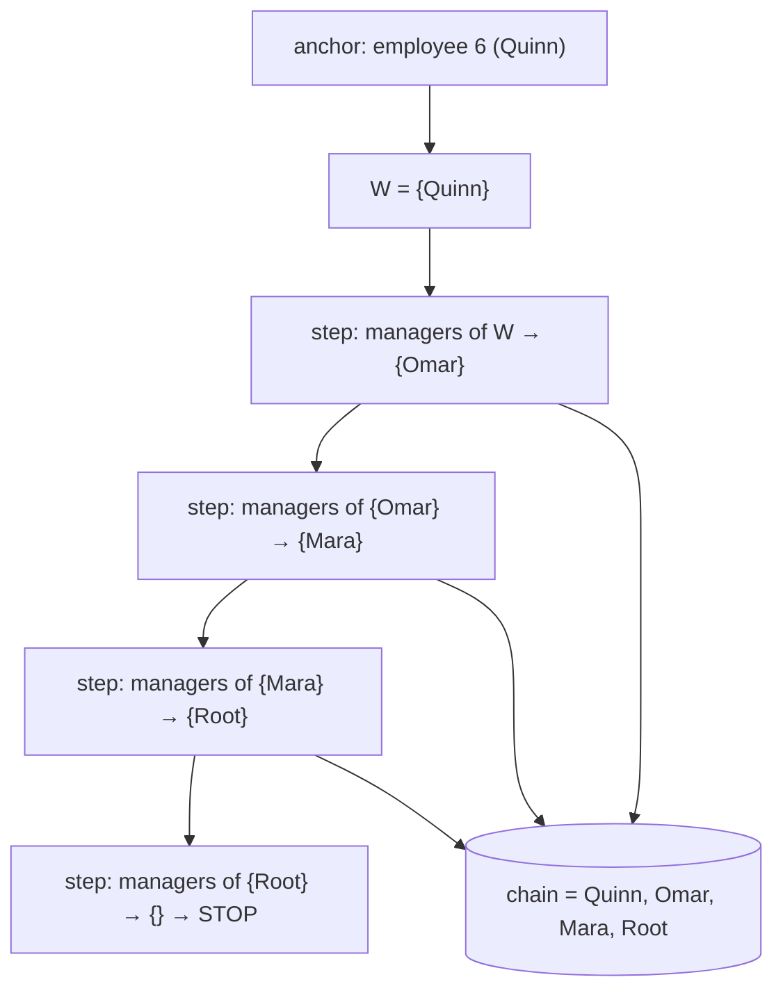

{/* status: authored */}

export const schema = `CREATE TABLE employees (
  employee_id int PRIMARY KEY,
  name        text NOT NULL,
  manager_id  int REFERENCES employees(employee_id)
);
INSERT INTO employees (employee_id, name, manager_id) VALUES
  (1, 'Root',   NULL),
  (2, 'Mara',   1),
  (3, 'Nikhil', 1),
  (4, 'Omar',   2),
  (5, 'Priya',  2),
  (6, 'Quinn',  4);`;

# Recursive CTEs: hierarchies & graphs

## First principles

SQL is set-based; a manager chain of unknown depth doesn't fit a fixed number of
joins. `WITH RECURSIVE` handles it by **iterating**:

```sql
WITH RECURSIVE chain AS (
  -- anchor: the starting row(s)
  SELECT employee_id, name, manager_id, 1 AS depth
  FROM employees WHERE employee_id = 6

  UNION ALL

  -- recursive term: join the CTE to the table to step one level
  SELECT e.employee_id, e.name, e.manager_id, c.depth + 1
  FROM employees e
  JOIN chain c ON e.employee_id = c.manager_id
)
SELECT * FROM chain;
```

How it runs:

1. Evaluate the **anchor** → working set `W`.
2. Evaluate the **recursive term** with `chain` = `W` → new rows `N`.
3. Emit `N`, set `W = N`, repeat from step 2.
4. Stop when a step produces **no rows**.

`UNION` (not `ALL`) additionally de-duplicates the accumulated result each step —
essential for **graphs with cycles**, wasteful for pure trees.

**Runaway protection**: a cycle with `UNION ALL` loops forever. Guard with a
`depth < 100` predicate, or Postgres 14+ `CYCLE ... SET ... USING ...`.

## The mechanism



## Hand-trace on dummy data

Walk up from Quinn (6) to the root:

<QueryTrace
  caption="anchor row, then each recursive step joins chain.manager_id → employees.employee_id"
  steps={[
    {
      title: "1 · employees",
      op: "manager_id",
      table: {
        name: "employees",
        columns: ["employee_id", "name", "manager_id"],
        rows: [[1,"Root",null],[2,"Mara",1],[3,"Nikhil",1],[4,"Omar",2],[5,"Priya",2],[6,"Quinn",4]],
      },
    },
    {
      title: "2 · anchor: employee_id = 6",
      table: { columns: ["employee_id", "name", "manager_id", "depth"], rows: [[6,"Quinn",4,1]] },
      rows: { add: [0] },
    },
    {
      title: "3 · step 1: rows where employee_id = (prev manager_id 4) → Omar",
      op: "employee_id",
      table: { columns: ["employee_id", "name", "manager_id", "depth"], rows: [[4,"Omar",2,2]] },
      rows: { add: [0] },
    },
    {
      title: "4 · step 2: employee_id = 2 → Mara; step 3: employee_id = 1 → Root; step 4: manager_id NULL → {} stop",
      table: {
        columns: ["employee_id", "name", "manager_id", "depth"],
        rows: [[2,"Mara",1,3],[1,"Root",null,4]],
      },
      rows: { add: [0, 1] },
    },
    {
      title: "5 · UNION ALL of every step — the result",
      table: {
        name: "chain",
        result: true,
        columns: ["employee_id", "name", "depth"],
        rows: [[6,"Quinn",1],[4,"Omar",2],[2,"Mara",3],[1,"Root",4]],
      },
    },
  ]}
/>

## Run it

<SqlRunner title="walk up: Quinn → Root" setup={schema}>
{`WITH RECURSIVE chain AS (
  SELECT employee_id, name, manager_id, 1 AS depth
  FROM employees WHERE employee_id = 6
  UNION ALL
  SELECT e.employee_id, e.name, e.manager_id, c.depth + 1
  FROM employees e JOIN chain c ON e.employee_id = c.manager_id
)
SELECT depth, name FROM chain ORDER BY depth;`}
</SqlRunner>

<SqlRunner title="walk down: everyone under Mara, with an indented path" setup={schema}>
{`WITH RECURSIVE tree AS (
  SELECT employee_id, name, 0 AS depth, name::text AS path
  FROM employees WHERE name = 'Mara'
  UNION ALL
  SELECT e.employee_id, e.name, t.depth + 1, t.path || ' > ' || e.name
  FROM employees e JOIN tree t ON e.manager_id = t.employee_id
)
SELECT repeat('  ', depth) || name AS org, path FROM tree ORDER BY path;`}
</SqlRunner>

<SqlRunner title="number series without a table" setup={schema}>
{`WITH RECURSIVE n(i) AS (
  SELECT 1
  UNION ALL
  SELECT i + 1 FROM n WHERE i < 10
)
SELECT i, i*i AS square FROM n;`}
</SqlRunner>

<RunThis file="sql/foundations/17_recursive_ctes/topic.sql" />

## Build → Break → Fix → Why

:::tip[🔨 Build]
"All reports under a manager" with a `depth` guard:

```sql
WITH RECURSIVE tree AS (
  SELECT employee_id, name, 0 AS depth FROM employees WHERE name = 'Root'
  UNION ALL
  SELECT e.employee_id, e.name, t.depth + 1
  FROM employees e JOIN tree t ON e.manager_id = t.employee_id
  WHERE t.depth < 20
)
SELECT * FROM tree;
```
:::

:::danger[💥 Break]
Introduce a cycle (`UPDATE employees SET manager_id = 6 WHERE employee_id = 1`)
and run the unguarded walk-down with `UNION ALL`. It never terminates — each step
keeps finding "new" rows around the loop. In the in-page runner it'll spin until
it errors or you reset.
:::

:::note[🔧 Fix]
- `UNION` instead of `UNION ALL` to dedupe accumulated rows (handles cycles by
  stopping when nothing new appears), **or**
- a `WHERE depth < N` guard on the recursive term, **or**
- Postgres 14+: `... ) CYCLE employee_id SET is_cycle USING path` and filter
  `WHERE NOT is_cycle`.
:::

:::info[🧠 Why it behaved that way]
`UNION ALL` emits every row the recursive term produces, and with a cycle the
term produces rows forever (Root → … → Root → …). The iteration only stops when a
step yields **zero** rows. `UNION` compares against everything seen so far, so a
revisited node adds nothing and the loop dries up; an explicit depth bound or
`CYCLE` clause does the same job deterministically.
:::

## Pitfalls & idioms

- Structure is fixed: **anchor `UNION [ALL]` recursive-term**, and the recursive
  term must reference the CTE name exactly once.
- `UNION ALL` for trees (no cycles, keep every path), `UNION` or a guard for
  graphs.
- Always carry a `depth` and either bound it or use `CYCLE` — even "trees"
  acquire loops from bad data.
- Build a `path` array/string in the recursive term for ordering
  (`ORDER BY path`) and cycle detection.
- The recursive term can't use `ORDER BY`, `LIMIT`, aggregates, or `DISTINCT`
  directly — do those in the outer `SELECT`.
- For deep hierarchies queried constantly, consider a materialized closure table
  or `ltree` instead of recursing every time.

## See also

- [Common Table Expressions](/foundations/common-table-expressions) — non-recursive `WITH`
- [Self-joins & CROSS JOIN](/foundations/self-joins-and-cross-joins) — one level of hierarchy
- [Set operations](/foundations/set-operations) — `UNION` vs `UNION ALL`
- [Data Engineering → Dimensional modeling](/data-engineering/dimensional-modeling-star-schema) — flattening hierarchies for a warehouse

## Check yourself

1. Name the three parts of a `WITH RECURSIVE` and what each contributes.
2. When does the iteration stop?
3. `UNION` vs `UNION ALL` in a recursive CTE — what's the practical difference?
4. Your recursive query hangs. Give two ways to make it terminate.
5. Write a recursive CTE that produces the integers 1..100.
