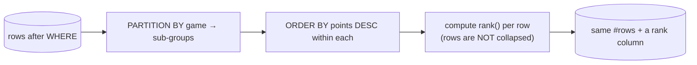

{/* status: authored */}

export const schema = `CREATE TABLE scores (
  player   text NOT NULL,
  game     text NOT NULL,
  points   int  NOT NULL
);
INSERT INTO scores (player, game, points) VALUES
  ('Ana',   'chess', 30),
  ('Ben',   'chess', 30),
  ('Chidi', 'chess', 20),
  ('Dana',  'chess', 10),
  ('Ana',   'go',    12),
  ('Ben',   'go',    25),
  ('Chidi', 'go',    25);`;

# Window functions: `PARTITION BY` & ranking

## First principles

`GROUP BY` collapses a group to one row. A **window function** computes a value
*over a set of related rows* but **keeps every row**:

```sql
SELECT player, game, points,
       rank() OVER (PARTITION BY game ORDER BY points DESC) AS rnk
FROM scores;
```

The `OVER (...)` clause defines the **window** for the current row:

- **`PARTITION BY game`** — the window is rows with the same `game` (like a
  `GROUP BY`, but not collapsed). Omit it → the whole result is one partition.
- **`ORDER BY points DESC`** — orders rows *within* the partition; ranking and
  offset functions need it.
- (a **frame** further narrows it to rows around the current one — next
  [topic](/foundations/window-frames).)

Window functions run **after** `WHERE`/`GROUP BY`/`HAVING`, at step ~5.5, so you
can't filter on them in `WHERE` — wrap the query
([see below](#build--break--fix--why)).

**The ranking family:**

| Function | Ties | 1,1,then | Use |
|---|---|---|---|
| `row_number()` | no ties — arbitrary among equals | 1,2,3,4 | pick exactly one per group |
| `rank()` | equal rank, then a **gap** | 1,1,3,4 | "standings" |
| `dense_rank()` | equal rank, **no gap** | 1,1,2,3 | "distinct score tiers" |
| `ntile(n)` | splits into n buckets | — | quartiles, percentiles |

Also: `lag()`, `lead()`, `first_value()`, `last_value()`, `nth_value()` — offset
functions.

## The mechanism



## Hand-trace on dummy data

`rank() OVER (PARTITION BY game ORDER BY points DESC)`:

<QueryTrace
  caption="partition by game, order by points desc, assign rank — every row survives"
  steps={[
    {
      title: "1 · scores",
      table: {
        name: "scores",
        columns: ["player", "game", "points"],
        rows: [
          ["Ana","chess",30],["Ben","chess",30],["Chidi","chess",20],["Dana","chess",10],
          ["Ana","go",12],["Ben","go",25],["Chidi","go",25],
        ],
      },
    },
    {
      title: "2 · PARTITION BY game — two windows",
      op: "game",
      table: {
        columns: ["player", "game", "points"],
        rows: [
          ["Ana","chess",30],["Ben","chess",30],["Chidi","chess",20],["Dana","chess",10],
          ["Ben","go",25],["Chidi","go",25],["Ana","go",12],
        ],
      },
      groups: [
        { label: "chess", rows: [0, 1, 2, 3] },
        { label: "go", rows: [4, 5, 6] },
      ],
    },
    {
      title: "3 · ORDER BY points DESC within each window, assign rank()",
      op: "points",
      table: {
        columns: ["player", "game", "points", "rank"],
        rows: [
          ["Ana","chess",30,1],["Ben","chess",30,1],["Chidi","chess",20,3],["Dana","chess",10,4],
          ["Ben","go",25,1],["Chidi","go",25,1],["Ana","go",12,3],
        ],
      },
    },
    {
      title: "4 · result — 7 rows in, 7 rows out (rank() gaps after ties: 1,1,3)",
      table: {
        name: "result",
        result: true,
        columns: ["player", "game", "points", "rank"],
        rows: [
          ["Ana","chess",30,1],["Ben","chess",30,1],["Chidi","chess",20,3],["Dana","chess",10,4],
          ["Ben","go",25,1],["Chidi","go",25,1],["Ana","go",12,3],
        ],
      },
    },
  ]}
/>

## Run it

<SqlRunner title="the three rankings side by side" setup={schema}>
{`SELECT player, game, points,
       row_number() OVER w AS rn,
       rank()       OVER w AS rnk,
       dense_rank() OVER w AS dense
FROM scores
WINDOW w AS (PARTITION BY game ORDER BY points DESC)
ORDER BY game, points DESC;`}
</SqlRunner>

<SqlRunner title="top-2 per game (filter on a window result)" setup={schema}>
{`SELECT player, game, points
FROM (
  SELECT player, game, points,
         row_number() OVER (PARTITION BY game ORDER BY points DESC, player) AS rn
  FROM scores
) ranked
WHERE rn <= 2
ORDER BY game, rn;`}
</SqlRunner>

<SqlRunner title="window aggregate: each score vs its game's average" setup={schema}>
{`SELECT player, game, points,
       round(avg(points) OVER (PARTITION BY game), 1) AS game_avg,
       points - avg(points) OVER (PARTITION BY game)  AS vs_avg
FROM scores
ORDER BY game, points DESC;`}
</SqlRunner>

<RunThis file="sql/foundations/18_window_functions_partitioning_and_ranking/topic.sql" />

## Build → Break → Fix → Why

:::tip[🔨 Build]
"The single top scorer per game" — `row_number()` (picks one even on a tie):

```sql
SELECT * FROM (
  SELECT *, row_number() OVER (PARTITION BY game ORDER BY points DESC, player) AS rn
  FROM scores
) s WHERE rn = 1;
```
:::

:::danger[💥 Break]
Filter the rank in `WHERE` of the same query:

```sql
SELECT player, game,
       row_number() OVER (PARTITION BY game ORDER BY points DESC) AS rn
FROM scores
WHERE rn = 1;
-- ERROR: column "rn" does not exist
```

Or use `rank() = 1` and get **two** rows for chess (Ana *and* Ben tie at 30).
:::

:::note[🔧 Fix]
- Window functions can't be referenced in `WHERE`/`HAVING` — wrap the query in a
  subquery or CTE and filter the outer query.
- Want exactly one row per group even on ties → `row_number()` with a
  tie-breaker in the `ORDER BY`. Want all tied leaders → `rank() = 1`.
:::

:::info[🧠 Why it behaved that way]
Window functions are evaluated *after* `WHERE` (which is why they can see the
post-filter row set), so their output isn't available to `WHERE` on the same
query level — hence "column does not exist". `rank()` deliberately gives ties the
same number, so `rank() = 1` returns every joint-first row; `row_number()` forces
a total order, so a deterministic tie-breaker in `ORDER BY` makes "row 1" unique.
:::

## Pitfalls & idioms

- Can't filter a window result in `WHERE`/`HAVING` — use a subquery/CTE
  (`WHERE rn <= 3`).
- `row_number()` for "exactly N per group"; `rank()`/`dense_rank()` for
  "including ties". Add a tie-breaker to `row_number()`'s `ORDER BY` for
  determinism.
- A window function still returns every input row — if you wanted one row per
  group, you wanted `GROUP BY`.
- `count(*) OVER ()` = total row count alongside each row (no extra query).
- Name a window once with `WINDOW w AS (...)` and reuse it as `OVER w`.
- `PARTITION BY` with high cardinality + `ORDER BY` = a sort per partition; an
  index on `(partition_cols, order_cols)` can remove it.

## See also

- [Window frames](/foundations/window-frames) — running totals, moving averages, `lag`/`lead`
- [Aggregation & GROUP BY](/foundations/group-by-and-aggregation) — the collapsing cousin
- [DISTINCT & DISTINCT ON](/foundations/distinct-and-distinct-on) — another "one row per group" tool
- [Logical query processing order](/foundations/logical-query-processing-order) — where windows sit

## Check yourself

1. One sentence: how does a window function differ from `GROUP BY`?
2. `row_number()` vs `rank()` vs `dense_rank()` on the scores `30, 30, 20, 10`.
3. Why can't you write `WHERE row_number() OVER (...) = 1`?
4. Write "top 3 scores per game, ties broken by player name".
5. `count(*) OVER ()` returns what, and how many queries does it cost?
