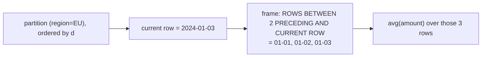

{/* status: authored */}

export const schema = `CREATE TABLE daily_sales (
  d       date   NOT NULL,
  region  text   NOT NULL,
  amount  numeric NOT NULL
);
INSERT INTO daily_sales (d, region, amount) VALUES
  (DATE '2024-01-01','EU', 10),
  (DATE '2024-01-02','EU', 20),
  (DATE '2024-01-03','EU', 20),
  (DATE '2024-01-04','EU',  5),
  (DATE '2024-01-05','EU', 45),
  (DATE '2024-01-01','US', 30),
  (DATE '2024-01-02','US', 10);`;

# Window frames: running totals & moving averages

## First principles

Within a partition, a **frame** is the subset of rows a window *aggregate* looks
at, relative to the current row. Syntax:

```sql
sum(amount) OVER (
  PARTITION BY region
  ORDER BY d
  ROWS BETWEEN <start> AND <end>
)
```

Bounds: `UNBOUNDED PRECEDING`, `n PRECEDING`, `CURRENT ROW`, `n FOLLOWING`,
`UNBOUNDED FOLLOWING`.

- **Running total**: `ROWS BETWEEN UNBOUNDED PRECEDING AND CURRENT ROW`.
- **Trailing 3-row moving average**: `ROWS BETWEEN 2 PRECEDING AND CURRENT ROW`.
- **Centered**: `ROWS BETWEEN 1 PRECEDING AND 1 FOLLOWING`.

**`ROWS` vs `RANGE`:**

- `ROWS` counts **physical rows**.
- `RANGE` counts rows **with a value in range of the current row's** `ORDER BY`
  value — so all rows *tied* on the sort key share a frame edge.

**The default frame bites**: with `ORDER BY` and *no* frame clause, the frame is
`RANGE BETWEEN UNBOUNDED PRECEDING AND CURRENT ROW`. On a running total, two rows
with the **same** `ORDER BY` value both get the *group's* cumulative sum, not a
per-row one. If you want a strict per-row running total, say `ROWS`.

Ranking/offset functions (`row_number`, `rank`, `lag`, `lead`) ignore the frame;
`first_value`/`last_value`/`nth_value` and the plain aggregates respect it.

## The mechanism



## Hand-trace on dummy data

Running total and 3-day moving average for EU:

<QueryTrace
  caption="ORDER BY d; running total uses UNBOUNDED PRECEDING → CURRENT, moving avg uses 2 PRECEDING → CURRENT"
  steps={[
    {
      title: "1 · daily_sales, EU partition ordered by d",
      op: "d",
      table: {
        name: "daily_sales (EU)",
        columns: ["d", "amount"],
        rows: [
          ["2024-01-01",10],["2024-01-02",20],["2024-01-03",20],
          ["2024-01-04",5],["2024-01-05",45],
        ],
      },
    },
    {
      title: "2 · running total: sum over rows [start .. current]",
      op: "amount",
      table: {
        columns: ["d", "amount", "frame", "running_total"],
        rows: [
          ["2024-01-01",10,"[1]",10],
          ["2024-01-02",20,"[1,2]",30],
          ["2024-01-03",20,"[1,2,3]",50],
          ["2024-01-04",5,"[1..4]",55],
          ["2024-01-05",45,"[1..5]",100],
        ],
      },
    },
    {
      title: "3 · 3-day moving average: avg over rows [current-2 .. current]",
      op: "amount",
      table: {
        columns: ["d", "amount", "frame", "mov_avg_3"],
        rows: [
          ["2024-01-01",10,"[1]",10.0],
          ["2024-01-02",20,"[1,2]",15.0],
          ["2024-01-03",20,"[1,2,3]",16.67],
          ["2024-01-04",5,"[2,3,4]",15.0],
          ["2024-01-05",45,"[3,4,5]",23.33],
        ],
      },
    },
    {
      title: "4 · result",
      table: {
        name: "result",
        result: true,
        columns: ["d", "amount", "running_total", "mov_avg_3"],
        rows: [
          ["2024-01-01",10,10,10.0],
          ["2024-01-02",20,30,15.0],
          ["2024-01-03",20,50,16.67],
          ["2024-01-04",5,55,15.0],
          ["2024-01-05",45,100,23.33],
        ],
      },
    },
  ]}
/>

## Run it

<SqlRunner title="running total + moving average + day-over-day" setup={schema}>
{`SELECT d, amount,
  sum(amount)   OVER (PARTITION BY region ORDER BY d
                      ROWS BETWEEN UNBOUNDED PRECEDING AND CURRENT ROW) AS running_total,
  round(avg(amount) OVER (PARTITION BY region ORDER BY d
                      ROWS BETWEEN 2 PRECEDING AND CURRENT ROW), 2)     AS mov_avg_3,
  amount - lag(amount) OVER (PARTITION BY region ORDER BY d)            AS dod_change
FROM daily_sales
WHERE region = 'EU'
ORDER BY d;`}
</SqlRunner>

<SqlRunner title="ROWS vs RANGE with a tie on the sort key" setup={schema}>
{`-- 01-02 and 01-03 both = 20. RANGE lumps ties; ROWS doesn't.
SELECT d, amount,
  sum(amount) OVER (ORDER BY amount ROWS  BETWEEN UNBOUNDED PRECEDING AND CURRENT ROW) AS rows_sum,
  sum(amount) OVER (ORDER BY amount RANGE BETWEEN UNBOUNDED PRECEDING AND CURRENT ROW) AS range_sum
FROM daily_sales WHERE region = 'EU'
ORDER BY amount;`}
</SqlRunner>

<SqlRunner title="first/last value in the partition" setup={schema}>
{`SELECT d, region, amount,
  first_value(amount) OVER (PARTITION BY region ORDER BY d) AS first_day,
  last_value(amount)  OVER (PARTITION BY region ORDER BY d
                            ROWS BETWEEN UNBOUNDED PRECEDING AND UNBOUNDED FOLLOWING) AS last_day
FROM daily_sales ORDER BY region, d;`}
</SqlRunner>

<RunThis file="sql/foundations/19_window_frames/topic.sql" />

## Build → Break → Fix → Why

:::tip 🔨 Build
A per-day running total for each region:

```sql
sum(amount) OVER (PARTITION BY region ORDER BY d
                  ROWS BETWEEN UNBOUNDED PRECEDING AND CURRENT ROW)
```
:::

:::danger 💥 Break
Drop the `ROWS` clause and rely on the default while ordering by a column with
ties:

```sql
sum(amount) OVER (PARTITION BY region ORDER BY amount)   -- no frame clause
```

Rows tied on `amount` (the two €20 EU days) both show the **same** cumulative
sum — the total *through the end of that tie group* — not a distinct running
value per row. Your "running total" has plateaus.
:::

:::note 🔧 Fix
State the frame explicitly: `ROWS BETWEEN UNBOUNDED PRECEDING AND CURRENT ROW` for
a strict per-row running total. Order by something unique (a timestamp, an id) so
each row has a definite position.
:::

:::info 🧠 Why it behaved that way
With `ORDER BY` and no frame clause, the default is `RANGE ... CURRENT ROW`, and
under `RANGE` "current row" means "all rows whose sort value equals this one".
Tied rows therefore share the frame's end, so they share the aggregate. `ROWS`
makes "current row" literal — this physical row — giving each its own frame edge.
:::

## Pitfalls & idioms

- **Always write the frame** for running/rolling aggregates. The `RANGE` default
  surprises on ties.
- `last_value()` with the default frame returns the **current** row's value (the
  frame ends at `CURRENT ROW`). Add `ROWS BETWEEN UNBOUNDED PRECEDING AND
  UNBOUNDED FOLLOWING` — or just use `first_value()` with `ORDER BY ... DESC`.
- `lag(col, n, default)` / `lead(col, n, default)` — the 3rd arg fills the edge
  instead of `NULL`.
- Moving average over *time* (not rows): `RANGE BETWEEN INTERVAL '6 days'
  PRECEDING AND CURRENT ROW` — respects gaps in dates.
- Frames need an `ORDER BY` in the `OVER` clause; a bare `PARTITION BY` has no
  meaningful frame.
- Multiple windows with the same spec → define once with `WINDOW w AS (...)`.

## See also

- [Window functions: PARTITION BY & ranking](/foundations/window-functions-partitioning-and-ranking) — the ranking family
- [Aggregation & GROUP BY](/foundations/group-by-and-aggregation) — aggregates that *do* collapse
- [Data Engineering → Dimensional modeling](/data-engineering/dimensional-modeling-star-schema) — running totals in reporting tables
- [Self-joins & CROSS JOIN](/foundations/self-joins-and-cross-joins) — the `lag()` alternative you don't want

## Check yourself

1. Give the frame clause for: (a) running total, (b) trailing 7-row average, (c)
   centered 3-row average.
2. What is the *default* frame when `OVER` has an `ORDER BY` and no frame clause?
3. Why does `last_value()` often "not work", and what's the fix?
4. `ROWS` vs `RANGE` — what differs when the `ORDER BY` column has duplicate
   values?
5. Compute day-over-day change without a self-join.
