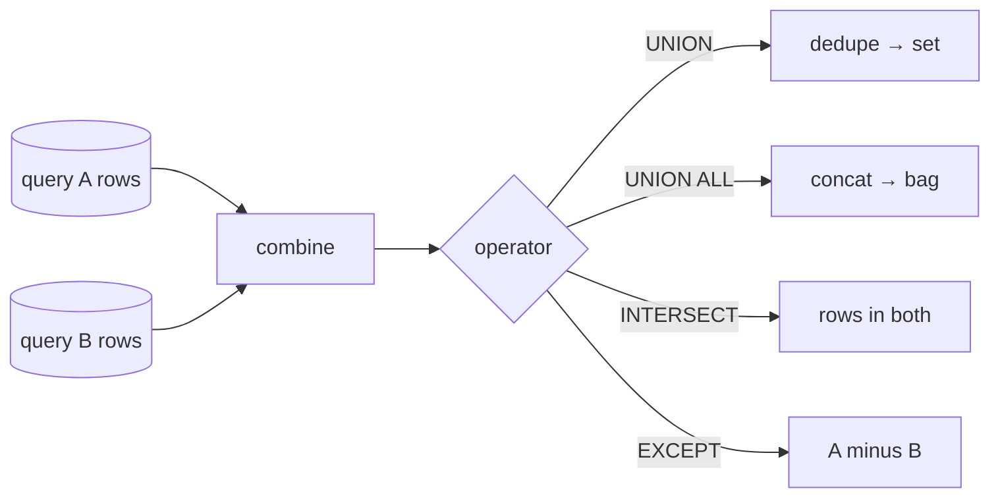

{/* status: authored */}

export const schema = `CREATE TABLE web_signups   (email text NOT NULL);
CREATE TABLE mobile_signups(email text NOT NULL);
INSERT INTO web_signups    VALUES ('ana@x.com'), ('ben@x.com'), ('ben@x.com'), ('chidi@x.com');
INSERT INTO mobile_signups VALUES ('ben@x.com'), ('dana@x.com'), ('ana@x.com');`;

# Set operations: `UNION`, `INTERSECT`, `EXCEPT`

## First principles

Set operators combine **two result sets that have the same column list** (same
count, compatible types) by treating whole rows as elements:

| Operator | Keeps | Dupes |
|---|---|---|
| `UNION` | rows in **either** side | removed (result is a set) |
| `UNION ALL` | rows in **either** side | kept (concatenation) |
| `INTERSECT` | rows in **both** sides | removed |
| `EXCEPT` | rows in the **first** not in the second | removed |
| `INTERSECT ALL` / `EXCEPT ALL` | multiset versions | multiplicity-aware |

Key facts:

- **`UNION` deduplicates** — which means it sorts or hashes the combined result.
  On large inputs that's expensive. If you *know* the sides are disjoint, or you
  don't care about dupes, use **`UNION ALL`** — it's just concatenation.
- Column **names** come from the **first** `SELECT`. Types must be compatible
  column-by-column.
- `NULL`s are treated as **equal** here (unlike `=`), so `UNION` collapses
  duplicate `NULL` rows and `INTERSECT` matches them.
- One `ORDER BY` applies to the **whole** result and goes at the very end.

## The mechanism



## Hand-trace on dummy data

`web_signups` and `mobile_signups`, `UNION` vs `UNION ALL` vs `INTERSECT` vs
`EXCEPT`:

<QueryTrace
  caption="web = {ana, ben, ben, chidi}; mobile = {ben, dana, ana}"
  steps={[
    {
      title: "1 · the two inputs",
      op: "email",
      table: {
        name: "web_signups",
        columns: ["email"],
        rows: [["ana@x.com"],["ben@x.com"],["ben@x.com"],["chidi@x.com"]],
      },
    },
    {
      title: "1b · mobile_signups",
      op: "email",
      table: {
        name: "mobile_signups",
        columns: ["email"],
        rows: [["ben@x.com"],["dana@x.com"],["ana@x.com"]],
      },
    },
    {
      title: "2 · UNION ALL — concatenate (7 rows, dupes kept)",
      table: {
        columns: ["email"],
        rows: [["ana@x.com"],["ben@x.com"],["ben@x.com"],["chidi@x.com"],["ben@x.com"],["dana@x.com"],["ana@x.com"]],
      },
    },
    {
      title: "3 · UNION — dedupe (4 distinct emails)",
      table: {
        name: "UNION result",
        result: true,
        columns: ["email"],
        rows: [["ana@x.com"],["ben@x.com"],["chidi@x.com"],["dana@x.com"]],
      },
    },
    {
      title: "4 · INTERSECT (in both) and EXCEPT (web not mobile)",
      table: {
        columns: ["INTERSECT", "EXCEPT (web - mobile)"],
        rows: [["ana@x.com","chidi@x.com"],["ben@x.com",""]],
      },
    },
  ]}
/>

## Run it

<SqlRunner title="UNION vs UNION ALL" setup={schema}>
{`SELECT email FROM web_signups
UNION
SELECT email FROM mobile_signups
ORDER BY email;
-- then change UNION -> UNION ALL and compare the row count`}
</SqlRunner>

<SqlRunner title="INTERSECT and EXCEPT" setup={schema}>
{`SELECT email FROM web_signups INTERSECT SELECT email FROM mobile_signups;   -- ana, ben
SELECT email FROM web_signups EXCEPT    SELECT email FROM mobile_signups;   -- chidi
SELECT email FROM mobile_signups EXCEPT SELECT email FROM web_signups;      -- dana`}
</SqlRunner>

<SqlRunner title="tag the source, then UNION ALL (the common pattern)" setup={schema}>
{`SELECT email, 'web'    AS source FROM web_signups
UNION ALL
SELECT email, 'mobile' AS source FROM mobile_signups
ORDER BY email, source;`}
</SqlRunner>

<SqlRunner title="EXCEPT ALL is multiplicity-aware" setup={schema}>
{`-- web has ben twice, mobile once -> EXCEPT ALL leaves one ben
SELECT email FROM web_signups
EXCEPT ALL
SELECT email FROM mobile_signups
ORDER BY email;`}
</SqlRunner>

<RunThis file="sql/foundations/20_set_operations/topic.sql" />

## Build → Break → Fix → Why

:::tip[🔨 Build]
Combine two logs for a report, keeping every row and its origin:

```sql
SELECT ts, msg, 'app' AS src FROM app_log
UNION ALL
SELECT ts, msg, 'job' AS src FROM job_log;
```
:::

:::danger[💥 Break]
Use `UNION` (no `ALL`) on two large partitioned tables you *know* are disjoint:

```sql
SELECT * FROM events_2023
UNION
SELECT * FROM events_2024;
```

Correct result, but Postgres now sorts/hashes tens of millions of rows to remove
duplicates that **cannot exist**. Query time and memory blow up; you may spill to
disk.
:::

:::note[🔧 Fix]
`UNION ALL` whenever the sides are disjoint or duplicates are acceptable. Reserve
`UNION` for when you genuinely need cross-source deduplication.
:::

:::info[🧠 Why it behaved that way]
`UNION` is defined to return a *set*, so the engine must eliminate duplicates,
which requires a sort or hash over the combined input — O(n log n) or a big hash
table. `UNION ALL` is defined as concatenation: stream one side, then the other.
The optimizer can't skip the dedup for `UNION` even when your data makes it
pointless, because it doesn't know the sides are disjoint.
:::

## Pitfalls & idioms

- **Default to `UNION ALL`.** Only pay for `UNION` when you need the dedup.
- All branches need the **same number of columns**, in the same order, with
  compatible types. Add explicit casts / literals to line them up.
- Column names & the result's apparent types come from the **first** branch.
- One trailing `ORDER BY` for the whole thing; to order *within* a branch, wrap
  it: `(SELECT ... ORDER BY ... LIMIT ...) UNION ALL (...)`.
- `INTERSECT`/`EXCEPT` bind looser than `UNION`? No — in Postgres `INTERSECT`
  binds **tighter** than `UNION`/`EXCEPT`. Parenthesize when mixing.
- `EXCEPT` is the set-difference anti-join for *whole rows* — handy for "what
  changed between two snapshots".
- These dedupe with `NULL` = `NULL`, unlike `WHERE`.

## See also

- [The relational model](/foundations/the-relational-model) — set vs bag
- [DISTINCT & DISTINCT ON](/foundations/distinct-and-distinct-on) — the dedup `UNION` does
- [GROUPING SETS, ROLLUP, CUBE](/foundations/grouping-sets-rollup-cube) — often replaces `UNION ALL` of `GROUP BY`s
- [Semi-joins & anti-joins](/foundations/semi-joins-and-anti-joins) — `EXCEPT` vs `NOT EXISTS`

## Check yourself

1. `UNION` vs `UNION ALL` — what's the difference and which is the safe default?
2. Two tables you know share no rows. Which operator, and why does the other one
   cost more?
3. Where does `ORDER BY` go in `A UNION ALL B`, and how do you sort just `A`?
4. `INTERSECT` treats two `NULL` rows as equal. Does `WHERE a = b`? Why the
   difference?
5. "Rows present in last night's snapshot but not tonight's" — one operator.
