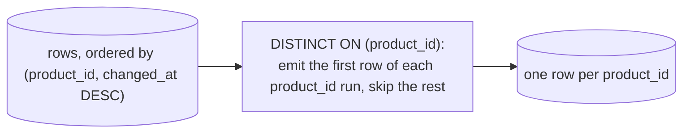

{/* status: authored */}

export const schema = `CREATE TABLE price_history (
  product_id  int   NOT NULL,
  changed_at  date  NOT NULL,
  price       numeric NOT NULL
);
INSERT INTO price_history (product_id, changed_at, price) VALUES
  (1, DATE '2024-01-01', 10),
  (1, DATE '2024-02-01', 12),
  (1, DATE '2024-03-01', 11),
  (2, DATE '2024-01-15', 50),
  (2, DATE '2024-02-20', 55),
  (3, DATE '2024-01-05',  8);`;

# `DISTINCT` & `DISTINCT ON`

## First principles

**`SELECT DISTINCT`** dedupes **entire output rows** — after `SELECT` computed
them (step 6). `SELECT DISTINCT a, b` keeps one row per unique `(a, b)` pair. It
sorts or hashes to do this.

- `DISTINCT` applies to *all* selected columns, not just the first. `SELECT
  DISTINCT city, name` does **not** give one row per city.
- `count(DISTINCT col)` is the aggregate version — distinct non-NULL values.
- It's a set operation on the projection; two `NULL`s count as equal here.

**`DISTINCT ON (expr, ...)`** (Postgres-specific) is different and very useful:
keep the **first row of each group** defined by `expr`, where "first" is decided
by `ORDER BY`. The `ORDER BY` **must start with the `DISTINCT ON` expressions**,
then your tiebreak/pick column:

```sql
SELECT DISTINCT ON (product_id) product_id, changed_at, price
FROM price_history
ORDER BY product_id, changed_at DESC;   -- → latest price per product
```

This is the cleanest "latest row per key" in SQL. The portable alternative is a
`row_number() OVER (PARTITION BY key ORDER BY ts DESC) = 1` subquery
([window functions](/foundations/window-functions-partitioning-and-ranking)).

## The mechanism



## Hand-trace on dummy data

`DISTINCT ON (product_id) ... ORDER BY product_id, changed_at DESC`:

<QueryTrace
  caption="order so the wanted row is first in each group, then keep the first of each group"
  steps={[
    {
      title: "1 · price_history",
      table: {
        name: "price_history",
        columns: ["product_id", "changed_at", "price"],
        rows: [
          [1,"2024-01-01",10],[1,"2024-02-01",12],[1,"2024-03-01",11],
          [2,"2024-01-15",50],[2,"2024-02-20",55],[3,"2024-01-05",8],
        ],
      },
    },
    {
      title: "2 · ORDER BY product_id, changed_at DESC — newest first within each product",
      op: "changed_at",
      table: {
        columns: ["product_id", "changed_at", "price"],
        rows: [
          [1,"2024-03-01",11],[1,"2024-02-01",12],[1,"2024-01-01",10],
          [2,"2024-02-20",55],[2,"2024-01-15",50],[3,"2024-01-05",8],
        ],
      },
      groups: [
        { label: "product 1", rows: [0, 1, 2] },
        { label: "product 2", rows: [3, 4] },
        { label: "product 3", rows: [5] },
      ],
    },
    {
      title: "3 · DISTINCT ON (product_id) — keep the first row of each run",
      op: "product_id",
      table: {
        columns: ["product_id", "changed_at", "price"],
        rows: [
          [1,"2024-03-01",11],[1,"2024-02-01",12],[1,"2024-01-01",10],
          [2,"2024-02-20",55],[2,"2024-01-15",50],[3,"2024-01-05",8],
        ],
      },
      rows: { drop: [1, 2, 4] },
    },
    {
      title: "4 · result — latest price per product",
      table: {
        name: "result",
        result: true,
        columns: ["product_id", "changed_at", "price"],
        rows: [[1,"2024-03-01",11],[2,"2024-02-20",55],[3,"2024-01-05",8]],
      },
    },
  ]}
/>

## Run it

<SqlRunner title="DISTINCT ON: latest price per product" setup={schema}>
{`SELECT DISTINCT ON (product_id) product_id, changed_at, price
FROM price_history
ORDER BY product_id, changed_at DESC;`}
</SqlRunner>

<SqlRunner title="plain DISTINCT dedupes the whole row" setup={schema}>
{`SELECT DISTINCT product_id FROM price_history ORDER BY product_id;   -- 1,2,3
SELECT DISTINCT product_id, price FROM price_history ORDER BY product_id, price; -- NOT one per product`}
</SqlRunner>

<SqlRunner title="count(DISTINCT ...)" setup={schema}>
{`SELECT count(*) AS rows,
       count(DISTINCT product_id) AS products,
       count(DISTINCT price)      AS distinct_prices
FROM price_history;`}
</SqlRunner>

<SqlRunner title="portable equivalent: row_number() = 1" setup={schema}>
{`SELECT product_id, changed_at, price FROM (
  SELECT *, row_number() OVER (PARTITION BY product_id ORDER BY changed_at DESC) AS rn
  FROM price_history
) s WHERE rn = 1
ORDER BY product_id;`}
</SqlRunner>

<RunThis file="sql/foundations/21_distinct_and_distinct_on/topic.sql" />

## Build → Break → Fix → Why

:::tip[🔨 Build]
Latest price per product with `DISTINCT ON`, `ORDER BY product_id, changed_at
DESC` (the `DISTINCT ON` column comes first in `ORDER BY`).
:::

:::danger[💥 Break]
Order by the timestamp only:

```sql
SELECT DISTINCT ON (product_id) product_id, changed_at, price
FROM price_history
ORDER BY changed_at DESC;
-- ERROR: SELECT DISTINCT ON expressions must match initial ORDER BY expressions
```

Or "fix" it by dropping `DISTINCT ON` and using `DISTINCT product_id, price`,
expecting one row per product — you get **one row per (product, price)** instead,
so product 1 shows three rows.
:::

:::note[🔧 Fix]
`ORDER BY` must **lead with the `DISTINCT ON` expressions**, then the column that
decides which row wins: `ORDER BY product_id, changed_at DESC`. For "one row per
product" you need `DISTINCT ON (product_id)` or a `GROUP BY` / window — plain
`DISTINCT` can't do per-key picking.
:::

:::info[🧠 Why it behaved that way]
`DISTINCT ON` walks the rows **in `ORDER BY` order** and emits the first row it
sees for each new value of the `DISTINCT ON` key. So the key must be the primary
sort (to group runs together) and your preference column the secondary sort (to
put the winner first). Plain `DISTINCT` has no concept of "per key" — it's just
"unique tuples of everything selected".
:::

## Pitfalls & idioms

- `DISTINCT` covers **every** selected column. To dedup on a subset, use
  `DISTINCT ON` or `GROUP BY`.
- `DISTINCT ON (k) ... ORDER BY k, tiebreak` — the `ORDER BY` prefix rule is
  mandatory. Add a final unique tiebreak for determinism when the pick column
  ties.
- `DISTINCT ON` is Postgres-only. Portable code: `row_number() ... = 1` or a
  `NOT EXISTS (a later row)` anti-join.
- `count(DISTINCT x)` can't use a plain index and is slower than `count(*)`; for
  approximate counts consider `hll` or sampling.
- `SELECT DISTINCT` + `ORDER BY` on an expression not in the select list is an
  error — the deduped set doesn't have that column.
- `DISTINCT` after a fanned-out join is a smell — you probably want a
  [semi-join](/foundations/semi-joins-and-anti-joins).

## See also

- [Window functions: PARTITION BY & ranking](/foundations/window-functions-partitioning-and-ranking) — the portable "latest per key"
- [Aggregation & GROUP BY](/foundations/group-by-and-aggregation) — the other per-key tool
- [Set operations](/foundations/set-operations) — `UNION`'s built-in dedup
- [Sorting & limiting](/foundations/sorting-and-limiting) — the `ORDER BY` that drives `DISTINCT ON`

## Check yourself

1. `SELECT DISTINCT city, name FROM customers` — one row per what?
2. What does `DISTINCT ON (product_id)` require of the `ORDER BY` clause, and
   why?
3. Rewrite "latest price per product" without `DISTINCT ON`.
4. Why is `count(DISTINCT col)` slower than `count(*)`?
5. You added `DISTINCT` to kill duplicate rows after a join. What probably went
   wrong upstream?
