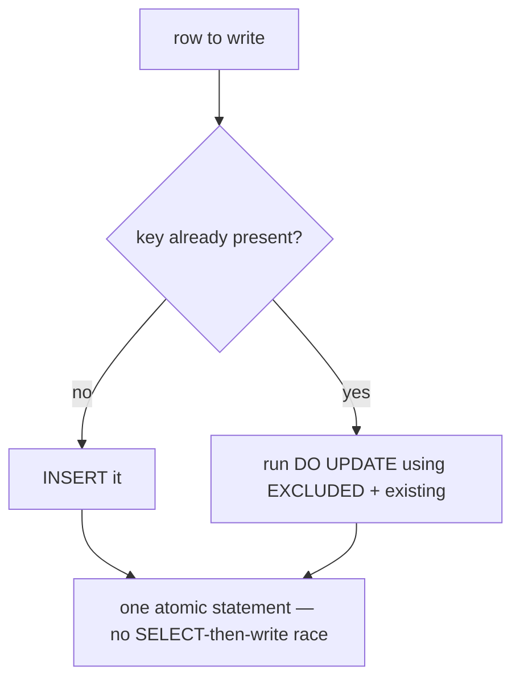

{/* status: authored */}

export const schema = `CREATE TABLE inventory (
  sku       text PRIMARY KEY,
  qty       int  NOT NULL,
  updated_at date NOT NULL DEFAULT DATE '2024-01-01'
);
INSERT INTO inventory (sku, qty) VALUES ('A1', 5), ('B2', 0);

CREATE TABLE shipment (sku text, qty int);
INSERT INTO shipment VALUES ('A1', 3), ('C3', 10);`;

# Upsert & `MERGE`: `INSERT ... ON CONFLICT`

## First principles

"Insert this row; if a row with that key already exists, update it instead" is
**upsert**. Doing it as `SELECT` → decide → `INSERT`/`UPDATE` is a **race**: two
sessions both see "not there", both `INSERT`, one gets a unique-violation (or you
get a duplicate). Upsert must be **one atomic statement**.

**Postgres `INSERT ... ON CONFLICT`:**

```sql
INSERT INTO inventory (sku, qty) VALUES ('A1', 3)
ON CONFLICT (sku) DO UPDATE
  SET qty = inventory.qty + EXCLUDED.qty,     -- EXCLUDED = the row we tried to insert
      updated_at = CURRENT_DATE;
```

- `ON CONFLICT (sku)` — names the unique index / constraint that defines
  "already exists".
- `EXCLUDED` — the would-be-inserted row, so you can combine old and new.
- `DO NOTHING` — skip silently on conflict (idempotent inserts).
- Optional `WHERE` on the `DO UPDATE` to update conditionally.

**Standard `MERGE`** (Postgres 15+) is more general — multiple `WHEN MATCHED` /
`WHEN NOT MATCHED` branches, and it can `DELETE`:

```sql
MERGE INTO inventory i
USING shipment s ON i.sku = s.sku
WHEN MATCHED THEN UPDATE SET qty = i.qty + s.qty
WHEN NOT MATCHED THEN INSERT (sku, qty) VALUES (s.sku, s.qty);
```

Rule of thumb: **`ON CONFLICT`** for simple insert-or-update keyed on a
constraint (and it's concurrency-safe by design). **`MERGE`** for
"reconcile this table against that source" with several actions — it's the
workhorse of [SCD loads](/data-engineering/slowly-changing-dimensions-type-2).

## The mechanism



## Hand-trace on dummy data

`MERGE INTO inventory USING shipment ON sku`:

<QueryTrace
  caption="each shipment row: matched → add qty; not matched → insert"
  steps={[
    {
      title: "1 · inventory and shipment",
      table: { name: "inventory", columns: ["sku", "qty"], rows: [["A1",5],["B2",0]] },
    },
    {
      title: "1b · shipment",
      op: "sku",
      table: { name: "shipment", columns: ["sku", "qty"], rows: [["A1",3],["C3",10]] },
    },
    {
      title: "2 · match on sku: A1 exists, C3 does not",
      op: "sku",
      table: {
        columns: ["shipment.sku", "shipment.qty", "action"],
        rows: [["A1",3,"WHEN MATCHED → UPDATE"],["C3",10,"WHEN NOT MATCHED → INSERT"]],
      },
    },
    {
      title: "3 · apply — A1: 5+3=8 (updated); C3: inserted; B2 untouched — result",
      op: "qty",
      table: {
        name: "inventory (after)",
        result: true,
        columns: ["sku", "qty"],
        rows: [["A1",8],["B2",0],["C3",10]],
      },
      rows: { add: [2] },
    },
  ]}
/>

## Run it

<SqlRunner title="ON CONFLICT DO UPDATE" setup={schema}>
{`INSERT INTO inventory (sku, qty) VALUES ('A1', 3), ('C3', 10)
ON CONFLICT (sku) DO UPDATE
  SET qty = inventory.qty + EXCLUDED.qty,
      updated_at = DATE '2024-06-01'
RETURNING sku, qty, updated_at;

SELECT * FROM inventory ORDER BY sku;`}
</SqlRunner>

<SqlRunner title="ON CONFLICT DO NOTHING (idempotent insert)" setup={schema}>
{`INSERT INTO inventory (sku, qty) VALUES ('A1', 999) ON CONFLICT (sku) DO NOTHING;
SELECT * FROM inventory WHERE sku = 'A1';   -- still qty 5, not 999`}
</SqlRunner>

<SqlRunner title="MERGE: reconcile inventory against a shipment" setup={schema}>
{`MERGE INTO inventory i
USING shipment s ON i.sku = s.sku
WHEN MATCHED THEN UPDATE SET qty = i.qty + s.qty
WHEN NOT MATCHED THEN INSERT (sku, qty) VALUES (s.sku, s.qty);

SELECT * FROM inventory ORDER BY sku;`}
</SqlRunner>

<SqlRunner title="MERGE with a delete branch" setup={schema}>
{`-- treat a shipment qty of 0 as "remove the sku"
DELETE FROM shipment; INSERT INTO shipment VALUES ('B2', 0), ('A1', 2);
MERGE INTO inventory i
USING shipment s ON i.sku = s.sku
WHEN MATCHED AND s.qty = 0 THEN DELETE
WHEN MATCHED             THEN UPDATE SET qty = i.qty + s.qty
WHEN NOT MATCHED         THEN INSERT (sku, qty) VALUES (s.sku, s.qty);
SELECT * FROM inventory ORDER BY sku;`}
</SqlRunner>

<RunThis file="sql/foundations/23_upsert_and_merge/topic.sql" />

## Build → Break → Fix → Why

:::tip[🔨 Build]
Idempotent counter increment:

```sql
INSERT INTO inventory (sku, qty) VALUES ('A1', 1)
ON CONFLICT (sku) DO UPDATE SET qty = inventory.qty + EXCLUDED.qty;
```
:::

:::danger[💥 Break]
Do it as read-then-write:

```sql
-- session logic:
SELECT qty FROM inventory WHERE sku = 'A1';        -- 5
-- ... nothing there? -> INSERT.  There? -> UPDATE to 6
UPDATE inventory SET qty = 6 WHERE sku = 'A1';
```

Two sessions run this at once: both read `5`, both write `6`. One increment is
**lost**. If the row didn't exist, both `INSERT` and one hits a unique violation.
:::

:::note[🔧 Fix]
One statement: `INSERT ... ON CONFLICT (sku) DO UPDATE SET qty = inventory.qty +
EXCLUDED.qty`. The database resolves the conflict atomically under the unique
index; concurrent callers serialize on that row.
:::

:::info[🧠 Why it behaved that way]
`SELECT`-then-write has a gap between reading and writing where another
transaction can change the row. `ON CONFLICT` performs the existence check and
the write as a single indivisible operation guarded by the unique index — the
second session either sees the first's committed row (and updates it) or blocks
until it can. No gap, no lost update. (This is the
[lost-update anomaly](/foundations/isolation-levels-and-mvcc).)
:::

## Pitfalls & idioms

- `ON CONFLICT (cols)` must match an actual unique constraint / index — including
  partial indexes: `ON CONFLICT (email) WHERE deleted_at IS NULL`.
- `EXCLUDED.col` is the proposed row; `tablename.col` is the existing row. You
  need both to "add" or "merge" values.
- `DO NOTHING` + `RETURNING` returns **only** the rows actually inserted — handy
  to detect "was this new?".
- `MERGE` does **not** support `RETURNING` in Postgres yet; `ON CONFLICT` does.
- `MERGE` isn't a magic concurrency fix — under `READ COMMITTED` a
  `WHEN NOT MATCHED THEN INSERT` can still race a concurrent insert; keep the
  unique constraint so it errors rather than duplicates, or use `ON CONFLICT`.
- Bulk upsert: `INSERT INTO t SELECT ... FROM staging ON CONFLICT ... DO UPDATE`.

## See also

- [Modifying data](/foundations/modifying-data) — the plain write statements
- [Constraints & keys](/foundations/constraints-and-keys) — the unique index `ON CONFLICT` needs
- [Isolation levels & MVCC](/foundations/isolation-levels-and-mvcc) — the lost update this prevents
- [Data Engineering → SCD Type 2](/data-engineering/slowly-changing-dimensions-type-2) — `MERGE` in anger

## Check yourself

1. Why is `SELECT` then `INSERT`/`UPDATE` unsafe for upsert under concurrency?
2. What is `EXCLUDED` in an `ON CONFLICT DO UPDATE`?
3. `DO NOTHING` vs `DO UPDATE` — when each?
4. Give one thing `MERGE` can do that `ON CONFLICT` can't, and one thing
   `ON CONFLICT` has that `MERGE` (in Postgres) lacks.
5. Write an idempotent "insert this event unless we've already recorded its id".
