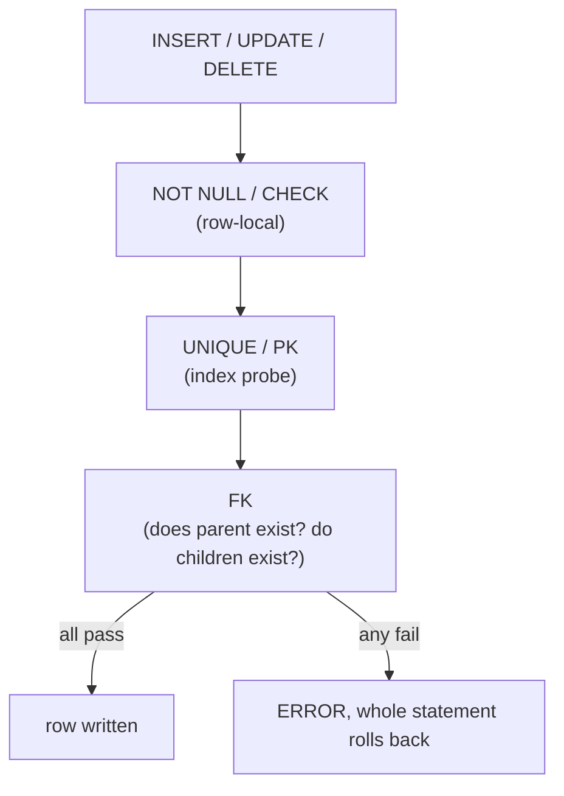

{/* status: authored */}

export const schema = `CREATE TABLE customers (
  customer_id int PRIMARY KEY,
  email       text NOT NULL UNIQUE,
  country     text NOT NULL
);
CREATE TABLE orders (
  order_id    int PRIMARY KEY,
  customer_id int NOT NULL REFERENCES customers(customer_id),
  status      text NOT NULL CHECK (status IN ('pending','paid','cancelled')),
  amount      numeric NOT NULL CHECK (amount >= 0)
);
INSERT INTO customers VALUES (1,'ana@x.com','DE'), (2,'ben@x.com','NG');
INSERT INTO orders VALUES (100, 1, 'paid', 40), (101, 2, 'pending', 10);`;

# Constraints & keys: PK, FK, `UNIQUE`, `CHECK`

## First principles

A constraint is an **invariant the database enforces on every write**, so no
code path — not a buggy service, not a manual `psql` session, not a migration —
can violate it. Push invariants down here whenever you can; application checks
race and get bypassed.

| Constraint | Guarantees | Notes |
|---|---|---|
| `NOT NULL` | column always has a value | the cheapest, most under-used constraint |
| `PRIMARY KEY` | unique **and** not null; the row's identity | one per table; auto-creates a unique index |
| `UNIQUE (cols)` | no two rows share these values | **allows multiple `NULL`s** (each "unknown") |
| `FOREIGN KEY ... REFERENCES` | every value points at an existing parent row | blocks orphans; controls delete/update behaviour |
| `CHECK (expr)` | `expr` is true (or NULL) for every row | row-local rules: ranges, enums, `end >= start` |
| `EXCLUDE` | generalised uniqueness (e.g. no overlapping ranges) | needs `btree_gist` for range types |

**Foreign key actions** on parent delete/update:

- `NO ACTION` / `RESTRICT` (default) — block it if children exist.
- `CASCADE` — delete/update the children too.
- `SET NULL` / `SET DEFAULT` — orphan the children deliberately.

**Deferral**: `DEFERRABLE INITIALLY DEFERRED` checks the constraint at
`COMMIT` instead of per-statement — needed for circular references or bulk
reordering within a transaction.

## The mechanism



## Hand-trace on dummy data

Four writes against the schema above:

<QueryTrace
  caption="each write is checked against every relevant constraint before it lands"
  steps={[
    {
      title: "1 · current data",
      table: {
        name: "customers",
        columns: ["customer_id", "email", "country"],
        rows: [[1,"ana@x.com","DE"],[2,"ben@x.com","NG"]],
      },
    },
    {
      title: "2 · INSERT orders (102, 3, 'paid', 5) — FK: customer 3?",
      op: "customer_id",
      table: {
        columns: ["write", "constraint checked", "result"],
        rows: [["order 102 → customer 3","FK orders.customer_id → customers","✗ customer 3 does not exist — REJECTED"]],
      },
      rows: { drop: [0] },
    },
    {
      title: "3 · INSERT customers (3, 'ana@x.com', 'FR') — UNIQUE email?",
      op: "email",
      table: {
        columns: ["write", "constraint checked", "result"],
        rows: [["customer 3 → ana@x.com","UNIQUE (email)","✗ ana@x.com already used — REJECTED"]],
      },
      rows: { drop: [0] },
    },
    {
      title: "4 · UPDATE orders SET status='refunded' WHERE order_id=100 — CHECK?",
      op: "status",
      table: {
        columns: ["write", "constraint checked", "result"],
        rows: [["order 100 → 'refunded'","CHECK status IN (pending,paid,cancelled)","✗ not an allowed value — REJECTED"]],
      },
      rows: { drop: [0] },
    },
    {
      title: "5 · INSERT customers (3, 'cid@x.com', 'FR') then order (102,3,'paid',5) — all pass",
      table: {
        name: "result: both rows written",
        result: true,
        columns: ["table", "new row"],
        rows: [["customers","(3, cid@x.com, FR)"],["orders","(102, 3, paid, 5)"]],
      },
      rows: { add: [0, 1] },
    },
  ]}
/>

## Run it

<SqlRunner title="constraints rejecting bad writes" setup={schema}>
{`-- each of these fails; run them one at a time
INSERT INTO orders VALUES (102, 3, 'paid', 5);              -- FK violation
-- INSERT INTO customers VALUES (3, 'ana@x.com', 'FR');     -- UNIQUE violation
-- UPDATE orders SET status = 'refunded' WHERE order_id = 100; -- CHECK violation
-- INSERT INTO orders VALUES (103, 1, 'paid', -1);          -- CHECK amount >= 0`}
</SqlRunner>

<SqlRunner title="FK ON DELETE behaviour" setup={schema}>
{`-- customer 1 has an order -> default RESTRICT blocks the delete
DELETE FROM customers WHERE customer_id = 1;   -- ERROR: still referenced`}
</SqlRunner>

<SqlRunner title="UNIQUE lets multiple NULLs through" setup={schema}>
{`CREATE TEMP TABLE t (id int, code text UNIQUE);
INSERT INTO t VALUES (1, NULL), (2, NULL), (3, 'x');   -- two NULLs: fine
-- INSERT INTO t VALUES (4, 'x');                       -- duplicate 'x': fails
SELECT * FROM t ORDER BY id;`}
</SqlRunner>

<SqlRunner title="add a constraint to existing data" setup={schema}>
{`-- NOT VALID = enforce for new rows now, check old rows later (no long lock)
ALTER TABLE orders ADD CONSTRAINT amount_cap CHECK (amount <= 100000) NOT VALID;
ALTER TABLE orders VALIDATE CONSTRAINT amount_cap;
SELECT conname, convalidated FROM pg_constraint WHERE conrelid = 'orders'::regclass;`}
</SqlRunner>

<RunThis file="sql/foundations/24_constraints_and_keys/topic.sql" />

## Build → Break → Fix → Why

:::tip 🔨 Build
"At most one primary address per customer":

```sql
CREATE UNIQUE INDEX one_primary_addr ON addresses (customer_id) WHERE is_primary;
```
:::

:::danger 💥 Break
Enforce it in the app instead — "before insert, check no other primary exists".
Two concurrent requests both check (none), both insert. Now the customer has two
primary addresses and every "get primary address" query is non-deterministic.
:::

:::note 🔧 Fix
The **partial unique index** above. The database serializes the two inserts on
the index; the second gets a unique violation and the app retries or reports it.
The invariant now holds no matter what the app does.
:::

:::info 🧠 Why it behaved that way
An application-level check has a gap between "check" and "write" where another
transaction slips in — the same [lost-update /
phantom](/foundations/isolation-levels-and-mvcc) shape as everywhere else. A
constraint is enforced *inside* the write, atomically, against the committed
state, so there's no gap. It also protects against writes the app doesn't even
know about (migrations, admin fixes, other services).
:::

## Pitfalls & idioms

- `UNIQUE` **allows many `NULL`s**. Want at most one? `UNIQUE NULLS NOT
  DISTINCT` (PG15+), or a partial index.
- Every FK column should be **indexed on the child side** — Postgres doesn't do
  it automatically, and un-indexed FKs make parent deletes and joins slow.
- `CHECK` can't reference other rows or tables (no subqueries). Use a trigger or
  `EXCLUDE` for cross-row rules.
- Add constraints to big tables with `NOT VALID` then `VALIDATE CONSTRAINT` — the
  first is a quick metadata change, the second scans without an exclusive lock.
- `ON DELETE CASCADE` is convenient and dangerous — one `DELETE` can wipe a
  subtree. Know your cascade graph.
- Name your constraints (`CONSTRAINT orders_status_chk CHECK ...`) so errors and
  migrations are legible.
- Prefer a `CHECK (status IN (...))` or a lookup table + FK over a bare `text`
  column for enums.

## See also

- [Data types, NULL & three-valued logic](/foundations/data-types-null-and-three-valued-logic) — `NULL` in `UNIQUE`
- [Upsert & MERGE](/foundations/upsert-and-merge) — `ON CONFLICT` needs a unique constraint
- [Transactions & ACID](/foundations/transactions-and-acid) — the "C", and deferred constraints
- [Indexes & the B-tree](/foundations/indexes-and-the-b-tree) — PK/UNIQUE are backed by indexes

## Check yourself

1. What's the difference between `PRIMARY KEY` and `UNIQUE NOT NULL`?
2. Why can a `UNIQUE (email)` column still hold two rows? How do you stop it?
3. Name the four `ON DELETE` behaviours for a foreign key.
4. Why index a foreign-key column on the child table?
5. You must add `CHECK (amount >= 0)` to a 500M-row table with minimal locking.
   What's the two-step approach?
